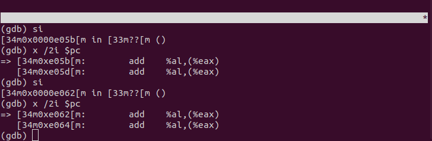
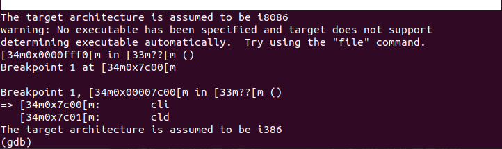
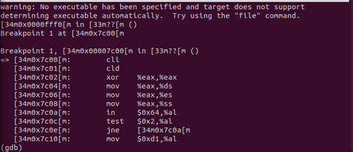
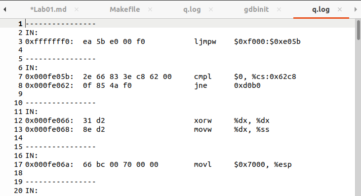
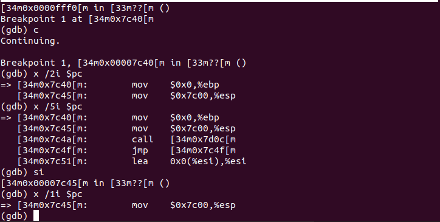
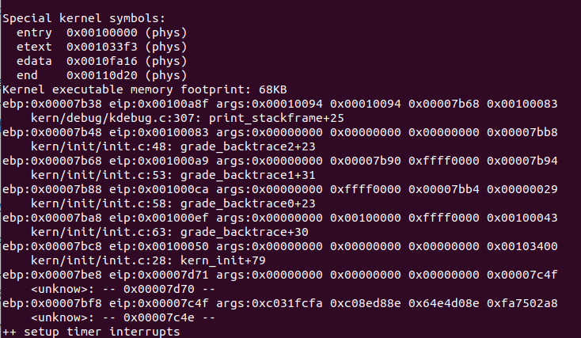
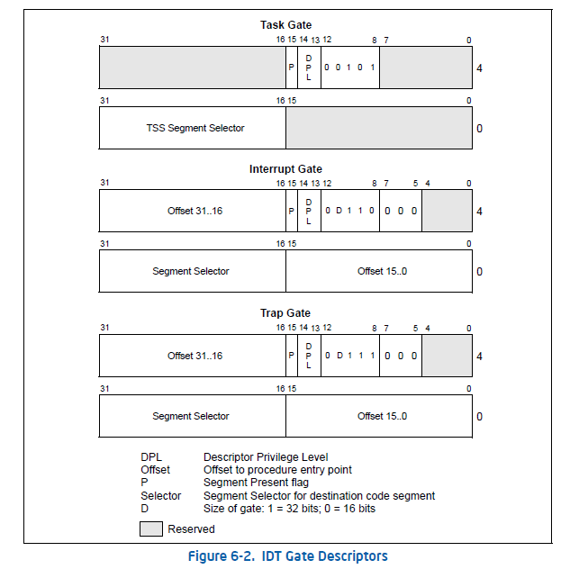
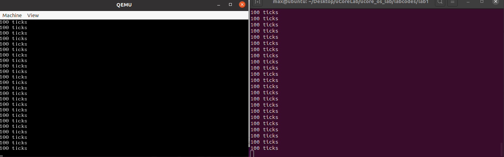
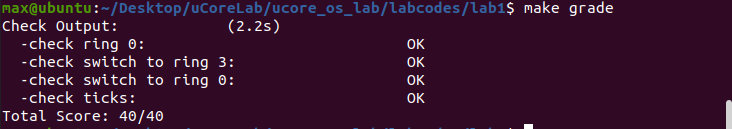
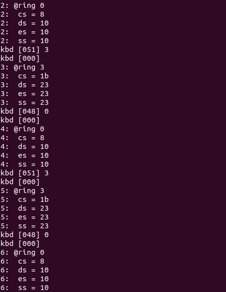

# uCore Lab01 实验报告

**学号：19335286 姓名：郑有为**

[toc]

## 练习 1： 理解通过 make 生成执行文件的过程

### 1-1. 操作系统镜像文件 ucore.img 是如何一步一步生成的？

* 镜像文件生产的主要部分：包括**内核部分**（Kernel）的目标创建、**引导程序块**（Bootblock）的目标创建和**ucore.img的生成**，以下是关键爱你部分的解析，对于makefile中其他细节的注释和语法的解释，我写在了源文件中，请参考[实验仓库](https://gitee.com/WondrousWisdomcard/oshomework/tree/master/uCoreLab/Lab01)。
				
	1. 内核程序部分：
	
		* 代码注释：
		
			```
			# create kernel target
			kernel = $(call totarget,kernel) 
			# 调用 function.mk 中的函数 totarget，其功能的是添加 bin/ 前缀，目的是把生成的文件放在bin文件夹中

			$(kernel): tools/kernel.ld 
			# JOS内核的简单链接器脚本

			$(kernel): $(KOBJS) #
				@echo + ld $@
				$(V)$(LD) $(LDFLAGS) -T tools/kernel.ld -o $@ $(KOBJS)
				@$(OBJDUMP) -S $@ > $(call asmfile,kernel)
				@$(OBJDUMP) -t $@ | $(SED) '1,/SYMBOL TABLE/d; s/ .* / /; /^$$/d' > $(call symfile,kernel)
			# 为了生成kernel，需要 kernel.ld init.o readline.o stdio.o kdebug.o kmonitor.o panic.o clock.o console.o intr.o picirq.o trap.o trapentry.o vectors.o pmm.o  printfmt.o string.o文件，它们位于obj/kern文件夹内。
			
			$(call create_target,kernel)
			# 创建目标kernel

			```

	2. 引导程序块部分：
	
		* 代码注释：
		
			```
			# create 'sign' tools 工具sign生成部分（后面会详细说明该文件）
			$(call add_files_host,tools/sign.c,sign,sign)
			$(call create_target_host,sign,sign)
			# 编译tools/sign.c为sign
			
			# create bootblock 引导程序块部分
			bootfiles = $(call listf_cc,boot)
			# 列出指定目录boot下所有指定后缀的文件
			
			$(foreach f,$(bootfiles),$(call cc_compile,$(f),$(CC),$(CFLAGS) -Os -nostdinc))
			# 对所有上一部列出的文件进行编译，生成bootasm.o、bootmain.o
			
			bootblock = $(call totarget,bootblock)
			# 为 bootblock 指定 bin/ 前缀，即在将生成的 bootblock 放入 bin 文件夹中。
			
			$(bootblock): $(call toobj,$(bootfiles)) | $(call totarget,sign)
				@echo + ld $@
				$(V)$(LD) $(LDFLAGS) -N -e start -Ttext 0x7C00 $^ -o $(call toobj,bootblock)
				@$(OBJDUMP) -S $(call objfile,bootblock) > $(call asmfile,bootblock)
				#生成bootblock.o
				
				@$(OBJCOPY) -S -O binary $(call objfile,bootblock) $(call outfile,bootblock)
				#拷贝二进制代码bootblock.o到bootblock.out
				
				@$(call totarget,sign) $(call outfile,bootblock) $(bootblock)
				# 使用生成的sign工具处理bootblock.out，生成bootblock
			
			$(call create_target,bootblock)
			# 创建目标 bootblock
			```
			
	3. ucore.img生成部分
	
		* 代码注释：
	 
			```
			# create ucore.img ucore.img的生成

			UCOREIMG	:= $(call totarget,ucore.img)

			$(UCOREIMG): $(kernel) $(bootblock)
			# 生产 ucore.img 需要 kernel 和 bootblock
				$(V)dd if=/dev/zero of=$@ count=10000
				# 生成一个有10000个块的文件，每个块默认512字节，用0填充
				$(V)dd if=$(bootblock) of=$@ conv=notrunc
				# 把bootblock中的内容写到第一个块
				$(V)dd if=$(kernel) of=$@ seek=1 conv=notrunc
				# 从第二个块开始写入kernel中的内容
				
			$(call create_target,ucore.img)
			# 创造目标 ucore.img
			```
	
	4. 编译过程使用到的的参数/选项集锦
				
		```
		-ggdb  //生成可供gdb使用的调试信息
		-m32  //生成适用于32位环境的代码
		-gstabs  //生成stabs格式的调试信息，以便显示函数调用栈信息
		-nostdinc  //不使用标准库
		-fno-stack-protector  //不生成用于检测缓冲区溢出的代码
		-Os  //为减小代码大小而进行优化
		-I<dir>  //添加搜索头文件的路径
		fno-builtin  //除非用__builtin_前缀，否则不进行builtin函数的优化
		-m <emulation>  //模拟为i386上的连接器
		-nostdlib  //不使用标准库
		-N  //设置代码段和数据段均可读写
		-e <entry>  //指定入口
		-Ttext  //制定代码段开始位置
		-S  //移除所有符号和重定位信息
		-O <bfdname>  //指定输出格式
		-T <scriptfile>  //让连接器使用指定的脚本
		```
	
### 1-2. 一个被系统认为是符合规范的硬盘主引导扇区的特征是什么？

根据sign.c代码：
一个磁盘主引导扇区有512字节，且第511个字节(buf[510])是0x55，第512个字节(buf[511])是0xAA。

## 练习 2：使用 qemu 执行并调试 lab1 中的软件

### 2-1. 从 CPU 加电后执行的第一条指令开始，单步跟踪 BIOS 的执行

1. 首先修改 lab1/tools/gdbinit 的内容，这个文件会当作用gdb来debug时默认的默认命令：设置当前调试的CPU为8086，设置通信的端口号是1234。

	```
	set architecture i8086
	target remote :1234
	```

2. 在 lab1/ 目录下执行 ``` make debug ```，若想清空之前生成的结果，可以先执行 ``` make clean ```。

3. 在执行```make debug```之后会弹出两个窗口，一个是cgdb的窗口（须提前安装），另一个是qemu的窗口，在cgdb窗口写入```si```即可单步跟踪BIOS。
	
	* 实验截图：
	
### 2-2. 在初始化位置0x7c00 设置实地址断点,测试断点正常。

1. 将 lab1/tools/gdbinit 修改成
	```
	    	set architecture i8086  //设置当前调试的CPU是8086
		b *0x7c00  //在0x7c00处设置断点。此地址是bootloader入口点地址，可看boot/bootasm.S的start地址处
		c          //continue简称，表示继续执行
		x /2i $pc  //显示当前eip处的两条汇编指令
	```

2. 运行```make debug```可看到断点的情况。

	* 实验截图：
	
### 2-3. 从 0x7c00 开始跟踪代码运行,将单步跟踪反汇编得到的代码与 bootasm.S 和 bootblock.asm 进行比较。

1. 修改makefile，以获得反汇编代码（存入 bin/q.log中)将下列makefile中代码
	```
	debug: $(UCOREIMG)
		$(V)$(QEMU) -S -s -parallel stdio -hda $< -serial null &
		$(V)sleep 2
		$(V)$(TERMINAL)  -e "cgdb -q -x tools/gdbinit"
	```
修改为
	```
	debug: $(UCOREIMG)
		$(V)$(TERMINAL) -e "$(QEMU) -S -s -d in_asm -D  $(BINDIR)/q.log -parallel stdio -hda $< -serial null"
		$(V)sleep 2
		$(V)$(TERMINAL) -e "gdb -q -tui -x tools/gdbinit"
	```
注意tab和8个空格的差别，在makefile中只允许前一种。

2. 在tools/gdbinit结尾加上
	```
		b *0x7c00
		c
		x /10i $pc
	```

3. 运行```make debug```观察输出：cgdb调试窗口显示前十条指令，并在q.log中生成反汇编代码。

	*  实验截图：

	*  实验截图：

4. 查看并对比 bin/q.log 文件、 boot/bootasm.S 文件和 obj/bootblock.asm 文件，尽管它们格式和注释不同，但指令都是相同的。

### 2-4. 自己找一个 bootloader 或内核中的代码位置，设置断点并进行测试。

1. 修改gdbinit文件。
	```
	set architecture i8086
	target remote :1234
	b *0x7c40
	c
	x/2i $pc
	```

2. 执行```make debug```，观察试验结果，可以看到0x7c4a处调用（call）了某个函数，经过查询是 boot/bootmain.c 入口，单步调试继续观察。

	*  实验截图：


## 练习 3：分析 bootloader 进入保护模式的过程。

#### 3-1. 请分析 bootloader 是如何完成从实模式进入保护模式的。

BIOS 将通过读取硬盘主引导扇区到内存，并转跳到对应内存中的位置执行 bootloader。请分析 bootloader 是如何完成从实模式进入保护模式的。

* bootloader从实模式进入保护模式的步骤：

	1. 首先，CPU启动并切换到32位保护模式，BIOS将 bootasm.S 从硬盘的第一个扇区加载到物理地址为0x7c00的内存中，并开始以**实模式执行**，此时``` %cs=0 %ip=7c00 ```。
	2. **初始化寄存器**：为标志寄存器和重要数据段寄存器(DS, ES, SS)设置初始值0。
	3. **激活A20**：将8042（单片微处理器：键盘控制器）上的A20线置于高电位，让全部32条地址线可用，使得系统可以访问4G的内存空间。
	4. **初始化GDT表**：GDT表和其描述符已经静态储存在引导区中，通过```lgdt gdtdesc```导入。
	5. **进入保护模式**：通过将 CR0寄存器 PE位（启用保护位）置1，开启保护模式。
	6. **更新基地址**：通过长跳转更新CS的基地址到保护模式的地址``` PROT_MODE_CSEG ```。
	7. **寄存器和堆栈设置**：设置受保护模式的数据段寄存器；建立堆栈并设置堆栈指针，堆栈区域从```0```到```start(0x7c00)```。
	8. **进入主方法**：转到保护模式完成后，进入boot主方法```call bootmain```。
	
* 细节问题：

	1. 为何开启 A20，以及如何开启 A20

		* 开启A20的原因：
		
			* 为了兼容最早的PC机，物理地址被固定在较低的位置，以至于高于1MB的地址默认为0，激活A20是为了撤销它。

			* A20为地址线，初始时为0，访问超过1MB的地址时，就会从0循环计数，将其置为1后，就可以访问4G内存。
			
			* A20地址位由键盘控制器8042控制，它有2个有两个I/O端口：0x60和0x64。

		* 开启A20的流程：

			* 循环等待8042输入缓冲区，直至为空；
				```
				inb $0x64, %al  
				testb $0x2, %al
				jnz seta20.1
				```
			* 发送write data to 8042's P2 port命令到 8042输入缓冲区；
				```
				movb $0xdf, %a1
				outb %al, $0x64
				```
			* 循环等待8042输入缓冲区，直至为空；
			* 设置 P2's A20 bit 为1，实现A20的开启；
				```
				movb $0xdf, %al
				outb %al, $0x60 
				```
			

	2. 如何初始化 GDT 表
	
		* GDT是一种数据结构，全称全局描述符表，用来描述段信息。从实模式切换到保护模式，使用引导GDT和段转换，使虚拟地址与物理地址相同，来让有效的内存映射在切换期间不会改变。在Intel里面有一个专门的寄存器GDTR用来存放GDT的入口地址，程序员将GDT设定在内存的某个位置之后，可以通过LGDT指令将GDT的入口地址加载到该寄存器里面，以后CPU就可以通过GDTR来访问GDT了。
		    
		* 在程序中，通过``` lgdt gdtdesc```来载入GDT表，完成GDT表的初始化，初始化内容如下：
			```
			# Bootstrap GDT
			.p2align 2                                #四位对齐
			gdt:
			    SEG_NULLASM                           #空段
			    SEG_ASM(STA_X|STA_R, 0x0, 0xffffffff) #载入程序和内核程序的代码段信息
			    SEG_ASM(STA_W, 0x0, 0xffffffff)       #载入程序和内核程序的数据段信息
			    
			gdtdesc:
			    .word 0x17                            #sizeof(gdt) - 1
			    .long gdt                             #address gdt
			```
			
	3. 如何使能和进入保护模式
		
		* 通过将 CR0寄存器 PE位（启用保护位）置为1来使能保护模式。
		
		* 随后进行基地址的跳转、GDT的初始化、设置堆栈和寄存器，真正进入保护模式。
		
## 练习 4：分析 bootloader 加载 ELF 格式的 OS 的过程。

通过阅读 bootmain.c，了解 bootloader 如何加载 ELF 文件。通过分析源代码和通过 qemu 来运行并调试 bootloader&OS，

### 4-1. bootloader 如何读取硬盘扇区的？
    
* 硬盘分成了许多扇区，其中每个扇区的大小为512字节，读取硬盘的大致步骤如下：
    
	1. 等待磁盘准备好；
	2. 发出读取扇区的命令；
	3. 等待磁盘准备好；
	4. 把磁盘扇区数据读到指定内存。 

* bootmain.c 关键函数分析：
	
	* ```waitdisk()```：用于等待磁盘准备好，如果0x1F7的最高2位是01，则跳出循环（磁盘准备完毕）。
	* ```readsect(void *dst, uint32_t secno)```：从设备的第secno个扇区读取数据到dst位置，体现了读取硬盘的完整过程。
		* 因为操作系统文件存在0号硬盘上，所以需了解0号硬盘的I/O端口：
		
			|I/O端口|解释|
			|---|---|
			|1F0H|数据寄存器|
			|1F1H|错误寄存器/特征寄存器|
			|1F2H|数据扇区计数器|
			|1F3H|硬盘扇区数|
			|1F4H|柱面低字节|
			|1F5H|柱面高字节|
			|1F6H|磁盘驱动器/磁头寄存器|
			|1F7H|状态寄存器/命令寄存器|
			
		* 代码分析：	
			```
			waitdisk();
			
			outb(0x1F2, 1);	//设置待读扇区数目为1
			outb(0x1F3, secno & 0xFF);	//待读取扇区编号为secno低八位
			outb(0x1F4, (secno >> 8) & 0xFF);
			outb(0x1F5, (secno >> 16) & 0xFF);	
			outb(0x1F6, ((secno >> 24) & 0xF) | 0xE0);	
			//[1F3-1F6]: 32位参数制定扇区号，0-27位组成扇区的偏移量，28位(=0)表示访问"Disk 0"，29-31位强制设为1
			outb(0x1F7, 0x20);	//[1F7]: 0x20命令，读取扇区
			
			waitdisk();
			
			insl(0x1F0, dst, SECTSIZE / 4);	//获取数据，读入dst位置
			```
	* ```readseg```包装了```readsect```，使得可以从读取任意长度的内容。
		* 函数原型：```void readseg(uintptr_t va, uint32_t count, uint32_t offset)```，```va```是想要读取的首地址、```count```指读取的容量、```offset```是偏移量，通过```/512+1```来获得扇区编号，函数会自动将地址进行分块，以便与通过readsect读取数据。
		* 代码分析：
			```
			va -= offset % SECTSIZE;
	
			uint32_t secno = (offset / SECTSIZE) + 1; 
			// 加1因为0扇区被引导占用
			// ELF文件从1扇区开始

			for (; va < end_va; va += SECTSIZE, secno ++) {
			readsect((void *)va, secno); // 调用readsect，并每次通过循环更新va的值
			}
			```

### 4-2. bootloader 是如何加载 ELF 格式的 OS？

* 加载 ELF 格式的 OS 大致步骤：

	1. 读取 ELF 的头部；
	2. 判断 ELF 文件是否是合法；
	3. 将描述表的头地址存在 ph；
	4. 按照描述表将 ELF 文件中数据载入内存；
	5. 根据 ELF 头部储存的入口信息，找到内核的入口。

* 关键数据结构分析：

	* elfhdr：elf header-ELF头部对应的数据结构
		* e_magic：校验信息
		* e_phoff：代码段表头相对elfhdr偏移位置
		* e_phnum： 段个数
		* e_entry： 程序入口地址
		
	* proghdr：program header-程序头部对应的数据结构
		* p_va：段的第一个字节将被放到内存中的虚拟地址
		* p_memsz：段在内存映像中占用的字节数
		* p_offset：段相对文件头的偏移值
		
* 对应主函数代码分析：
	
	```
	#define ELFHDR          ((struct elfhdr *)0x10000) 
	
	void
	bootmain(void) {
	    // 1. 读取ELF的头部：利用readseg函数从0号硬盘中读取ELFHDR的头部数据(8个扇区的数据)。
	    readseg((uintptr_t)ELFHDR, SECTSIZE * 8, 0);
	
	    // 2. 判断ELF文件是否合法，由ELF文件格式，```ELFHDR->e_magic``` 等于 ```ELF_MAGIC``` 表示合法。
	    if (ELFHDR->e_magic != ELF_MAGIC) {
		goto bad;
	    }
	
	    struct proghdr *ph, *eph;
	
	    // ELF头部有描述ELF文件应加载到内存什么位置的描述表
	    // 3. 将描述表的头地址存在ph
	    ph = (struct proghdr *)((uintptr_t)ELFHDR + ELFHDR->e_phoff);
	    eph = ph + ELFHDR->e_phnum;
	
	    // 4. 按照描述表将ELF文件中数据载入内存
	    for (; ph < eph; ph ++) {
		readseg(ph->p_va & 0xFFFFFF, ph->p_memsz, ph->p_offset);
	    }
	    // ELF文件0x1000位置后面的0xd1ec比特被载入内存0x00100000
	    // ELF文件0xf000位置后面的0x1d20比特被载入内存0x0010e000

	    // 5. 根据ELF头部的入口信息，找到内核入口
	    ((void (*)(void))(ELFHDR->e_entry & 0xFFFFFF))();
	
	bad:
	    outw(0x8A00, 0x8A00);
	    outw(0x8A00, 0x8E00);
	    while (1);
	}
	```

## 练习 5：实现函数调用堆栈跟踪函数，并解释最后一行各个数值的含义。

* 编程代码：

	```
	void
	print_stackframe(void) {
		uint32_t ebp, eip;
	    	ebp = read_ebp();
	    	eip = read_eip();
		int i, j;
		for (i = 0; ebp != 0 && i < STACKFRAME_DEPTH; i++) {
			cprintf("ebp:0x%08x eip:0x%08x args:", ebp, eip); 
			uint32_t *args = (uint32_t *)ebp + 2; //参数的首地址
			for (j = 0; j < 4; j ++) {
				cprintf("0x%08x ", args[j]); //打印4个参数
			}
			cprintf("\n");
			print_debuginfo(eip - 1);  //打印函数信息
			ebp = ((uint32_t *)ebp)[0]; //更新ebp
			eip = ((uint32_t *)ebp)[1]; //更新eip
		}
	}
	```

* 运行``` make qemu```,实验截图：

	

* 最后一行各数值含义：

	* 输出中，最后一行为:
	
		```
			ebp:0x00007bf8 eip:0x00007c4f args:0xc031fcfa 0xc08ed88e 0x64e4d08e 0xfa7502a8 
		   	<unknow>: -- 0x00007c4e --
		```

	* 其对应的是第一个使用堆栈的函数，bootmain.c中的bootmain，bootloader设置的堆栈从0x7c00开始，使用"call bootmain"转入bootmain函数，call指令压栈，所以bootmain中ebp为0x7bf8（由于堆栈的内存结构，压栈使地址变小）；
	* eip寄存器中存放着：当return语句执行后，下一条指令的执行地址；
	* args包含一些参数；
	* 最后eip为空时，返回```<unknown>```。
	
## 练习 6：完善中断初始化和处理 

### 6-1. 中断描述符表中一个表项占多少字节？其中哪几位代表中断处理代码的入口？

* 中断描述符表(Interrupt Descriptor Table，IDT)是一个最大为256项的表，每个表项为8字节，根据中断号对应的异常类型不同（Faults/Traps/Aborts）8个字节的意义也不同。

* 三种异常类型不同（Faults/Traps/Aborts）的IDT结构如图所示：

	
	
* 程序中对应的32比特结构```gatedesc```，每一行冒号后对应此部分的比特数，与上图对应：

	```
	struct gatedesc {
		unsigned gd_off_15_0 : 16;  // low 16 bits of offset in segment
		unsigned gd_ss : 16;        // segment selector
		unsigned gd_args : 5;       // # args, 0 for interrupt/trap gates
		unsigned gd_rsv1 : 3;       // reserved(should be zero I guess)
		unsigned gd_type : 4;       // type(STS_{TG,IG32,TG32})
		unsigned gd_s : 1;          // must be 0 (system)
		unsigned gd_dpl : 2;        // descriptor(meaning new) privilege level
		unsigned gd_p : 1;          // Present
		unsigned gd_off_31_16 : 16; // high bits of offset in segment
	};
	```	
	
* 综合上述图片和程序声明，得到其中 Segment Selector 所标示的2个字节（第2,3字节）是段选择字，Offset所标示的四个字节（第0,1字节和第6,7字节）是位移，两者拼合便得到中断处理程序的入口地址。

### 6-2. 请编程完善 kern/trap/trap.c 中对中断向量表进行初始化的函数 idt_init。

在 idt_init 函数中，依次对所有中断入口进行初始化。使用 mmu.h 中的 SETGATE 宏，填充 idt 数组内容。每个中断的入口由 tools/vectors.c 生成，使用 trap.c 中声明的 vectors 数组即可。

* 程序思路：
	1. 声明中断服务程序的入口地址数组 __vertors
	2. 填充中断描述符表
	3. 加载中断描述符表 

* 函数代码：
	```
	void
	idt_init(void) {
	      
	      	//Step 1:Declcare the addrs of ISR
		extern uintptr_t __vectors[];
		
		//Step 2: Initialize the IDT
		int i;
		for (i = 0; i < sizeof(idt) / sizeof(struct gatedesc); i ++) {
			SETGATE(idt[i], 0, GD_KTEXT, __vectors[i], DPL_KERNEL);
		}
		// Set for switch from user to kernel
		SETGATE(idt[T_SWITCH_TOK], 0, GD_KTEXT, __vectors[T_SWITCH_TOK], DPL_USER);
		
		//Step 3: Load the IDT
		lidt(&idt_pd);
	}
	```

* 代码解释：
	* SETGATE(gate, istrap, sel, off, dpl)函数：
		* 该函数在mmu.h中声明，负责初始化IDT。IDT的数据类型是gatedesc，也在mmu.h中声明。
		* 参数：
			* gate = idt[i] (终端描述符表IDT)
			* istrap = 0 (1 for a trap gate, 0 for an interrupt gate)
			* sel = GD_KTEXT (Segment selector：此处对应的是内核级的代码段)
			* off = __vectors[i] (offset中断服务程序的地址，all ISR's entry addrs are stored in __vectors)
			* dpl = DPL_KERNEL or DPL_USER (优先级描述符:内核级别和用户级别）
	* 用户态转成内核态的特殊考虑：
		* 对应代码：```SETGATE(idt[T_SWITCH_TOK], 0, GD_KTEXT, __vectors[T_SWITCH_TOK], DPL_USER);```
		* IDT的初始化需注意两个特殊的中断描述符：内核态转用户态和用户态转内核态，注意到前者已经默认在for循环中初始化了，而后者与前者不同，它是在用户态发生的，故其描述符优先级应为```DPL_USER```，而不是```DPL_KERNEL```；
		* 在 kern/trap/trap.h 文件中可以获得内核态转用户态和用户态转内核态对应中断描述符表的编号```T_SWITCH_TOU```和```T_SWITCH_TOK```。
		
	* LIDT(&idt_pd)函数：
		* LIDT（Load IDT Register）指令：使用一个包含线性地址基址和界限的内存操作数来加载IDT，操作系统创建IDT时需要执行它来设定IDT的起始地址，且这条指令只能在特权级0执行。
		* 参数```idt_pd```：它的数据类型是```pseudodesc```结构体（定义在kern/trap/trap.c中），包含了IDT的大小和首地址。

### 6-3 编程完善 trap.c 中的中断处理函数trap。

编程完善 trap.c 中的中断处理函数 trap，在对时钟中断进行处理的部分填写 trap 函数中处理时钟中断的部分，使操作系统每遇到 100 次时钟中断后，调用 print_ticks 子程序，向屏幕上打印一行文字”100 ticks”。

* 实现代码：

	```
	case IRQ_OFFSET + IRQ_TIMER:
	ticks++;
	if(ticks % TICK_NUM == 0){
		print_ticks();
	}

	break;
	```

* 运行截图：

	* 直接运行```make qemu```，运行结果如下：
	
		*  实验截图：
---

## 扩展练习部分

### Challenge 1

#### 题目与解释

* 题目说明：

	扩展 proj4,增加 syscall 功能，即增加一用户态函数（可执行一特定系统调用：获得时钟计数值），当内核初始完毕后，可从内核态返回到用户态的函数，而用户态的函数又通过系统调用得到内核态的服务。

* 编程内容：

	1. 完善 kern/init/init.c 中的 ```static void lab1_switch_to_user(void)``` 函数和 ```static void lab1_switch_to_kernel(void);```函数。

	2. 完善 kern/trap/trap.c 中的 ```static void trap_dispatch(struct trapframe *tf)```函数中的``` T_SWITCH_TOU ```模块和``` T_SWITCH_TOK ```模块。

#### 代码和注释

1. lab1_switch_to_user()

	```
	static void lab1_switch_to_user(void) {
	//LAB1 CHALLENGE 1 : TODO
		asm volatile (
			"sub $0x8, %%esp \n"
			"int %0 \n"
			"movl %%ebp, %%esp"
			: 
			: "i"(T_SWITCH_TOU)
		);
	}
	```
	
	* 解释：
		* asm volatile 为C语言内嵌汇编表达式，volatile向GCC 声明不答应对该内联汇编优化，其标准格式为：```__asm__　__volatile__("InSTructiON List" : Output : Input : Clobber/Modify);```, 其中，Output 用来指定内联汇编语句的输出;Input 域的内容用来指定当前内联汇编语句的输进Input中，格式为形如“constraint”(variable)的列表。
		* ```%esp```寄存器用于存放函数栈顶指针，从中断返回时，会Pop出栈两次来更新寄存器SS和寄存器SP，（SS:SP指向栈顶元素） 所以要先Push压栈两次，用```sub $0x8, %esp```来实现此操作。
		* ```int %0 ```，用于调用 T_SWITCH_TOU 中断,%0就是指"i"，也即 T_SWITCH_TOU（这是接下来要实现的中断）。
		* ```%ebp```寄存器存取者堆栈指针，使用```movl %ebp, %esp```，来重新获得调用```int```前的堆栈指针。
				
2. lab1_switch_to_kernel()

	```
	static void lab1_switch_to_user(void) {
	//LAB1 CHALLENGE 1 : TODO
		asm volatile (
			"sub $0x8, %%esp \n"
			"int %0 \n"
			"movl %%ebp, %%esp"
			: 
			: "i"(T_SWITCH_TOK)
		);
	}
	```
	
	* 解释：
		* 大体与 lab1_switch_to_user() 一致，只需将```T_SWITCH_TOU```换成```T_SWITCH_TOK```。
		
3. T_SWITCH_TOU 模块

	```
	case T_SWITCH_TOU:
	if (tf->tf_cs != USER_CS) {
		switchk2u = *tf;
		switchk2u.tf_cs = USER_CS;
		switchk2u.tf_ds = switchk2u.tf_es = switchk2u.tf_ss = USER_DS;
		switchk2u.tf_esp = (uint32_t)tf + sizeof(struct trapframe) - 8; 
		switchk2u.tf_eflags |= FL_IOPL_MASK;
		
		*((uint32_t *)tf - 1) = (uint32_t)&switchk2u;
	}
	break;
	```
	
	* 解释：
		1. ```struct trapframe switchk2u, *switchu2k;``` 全局声明trapframe变量，trapframe 声明于 trap.h 文件中；
		2. 将原trapframe tf 复制给 switchk2u，由于是从内核态转为用户态，需要将段寄存器CS、DS、ES、SS全部从```KERNEL_```态改为```USER_```态，即：
			```
			switchk2u.tf_cs = USER_CS;
				switchk2u.tf_ds = switchk2u.tf_es = switchk2u.tf_ss = USER_DS;
			```
		3. 再将esp寄存器的值改成```(uint32_t)tf + sizeof(struct trapframe) - 8```；
		4. 此外,还需要将eflags寄存器中对应的IOPL位置（I/O特权位），保证在用户态下能使用I/O设备；
		5. 最后，将tf下一个指向switchk2u，这样iret返回时，CPU会从switchk2u恢复数据，而不是从现有栈恢复数据。
		

4. T_SWITCH_TOK 模块

	```
	case T_SWITCH_TOK:
	if (tf->tf_cs != KERNEL_CS) {
		tf->tf_cs = KERNEL_CS;
		tf->tf_ds = tf->tf_es = KERNEL_DS;
		tf->tf_eflags &= ~FL_IOPL_MASK;
		
		switchu2k = (struct trapframe *)(tf->tf_esp - (sizeof(struct trapframe) - 8));
		memmove(switchu2k, tf, sizeof(struct trapframe) - 8);
		*((uint32_t *)tf - 1) = (uint32_t)switchu2k;
	}
	break;
	```
	
	* 解释：
		1. 将tf指向的trapframe的段寄存器CS、DS、ES、SS全部从```USER_```态恢复到```KERNEL_```态;
		2. 将eflags寄存器中对应的IOPL位置（I/O特权位）改回去，使用```&= ~FL_IOPL_MASK```;
		3. 再将switchu2k指向```tf->tf_esp - (sizeof(struct trapframe) - 8)```，在堆栈中腾出sizeof(tf-8)的空间;
		4. 此外，使用memmove函数将tf所指内存区域复制全部内容（共sizeof(struct trapframe) - 8个字节）到switchu2k所指内存区域（覆盖）。
		5. 最后，将tf下一个指向switchu2k地址，这样iret返回时，让CPU根据switchu2k地址的内容来回复数据。
			
#### 测试结果



### Challenge 2

#### 题目与解释

用键盘实现用户模式内核模式切换。具体目标是：“键盘输入 3 时切换到用户模式，键盘输入 0 时切换到内核模式”。 

#### 代码与注释

* kern/trap/trap.c 部分：对```trap_dispatch```函数进行修改，修改```case IRQ_OFFSET + IRQ_KBD```部分内容，其中```IRQ_KBD```对应键盘产生的中断，我们模式切换的触发逻辑就是建立在这个上面的，代码如下：

	```
	case IRQ_OFFSET + IRQ_KBD:
	c = cons_getc();
	cprintf("kbd [%03d] %c\n", c, c);
	if(c == '0'){
		if (tf->tf_cs != KERNEL_CS) {
		
		tf->tf_cs = KERNEL_CS;
		tf->tf_ds = tf->tf_es = KERNEL_DS;
		tf->tf_eflags &= ~FL_IOPL_MASK;
		switchu2k = (struct trapframe *)(tf->tf_esp - (sizeof(struct trapframe) - 8));
		memmove(switchu2k, tf, sizeof(struct trapframe) - 8);
		*((uint32_t *)tf - 1) = (uint32_t)switchu2k;
		}
	}
	else if(c == '3'){
		if (tf->tf_cs != USER_CS) {
		
		switchk2u = *tf;
		switchk2u.tf_cs = USER_CS;
		switchk2u.tf_ds = switchk2u.tf_es = switchk2u.tf_ss = USER_DS;
		switchk2u.tf_esp = (uint32_t)tf + sizeof(struct trapframe) - 8;            
		switchk2u.tf_eflags |= FL_IOPL_MASK;
		
		*((uint32_t *)tf - 1) = (uint32_t)&switchk2u;
		}
	}
		break;
	```
* 上述代码的解释：检查用户输入的字符，若为```0```，则将当前用户模式转为内核模式，若输入为```3```，则将当前内核模式转为用户模式。模式之间的切换代码和Challenge 1中```T_SWITCH_TOK```模块和```T_SWITCH_TOU```模块是一样的，每一行的具体解释参考Challenge 1 - 代码和注释的第三点和第四点。

* 除此之外，需要对```kern/init/init.c```的主函数进行修改，使其每隔一段时间调用```lab1_print_cur_status()```函数来检查用户模式和内核模式的切换有没有成功。具体修改将原程序的```while(1);```修改成：
	```
	int i = 0;
	while (1){
		i++;
		if(i == 10000000){
				i = 0;
				lab1_print_cur_status();
		}
	};
	```
	
#### 测试结果

* 输出截图：

	

* 可以看到系统每隔一定时间内会打印模式信息和段寄存器信息，若在内核模式下，返回：
	```
	@ring 0
	cs = 8
	ds = 10
	es = 10
	ss = 10
	```
* 若此时为用户模式，则输出：
	```
	@ring 3
	cs = 1b
	ds = 23
	es = 23
	ss = 23
	```
* ```kbd [051] 3```和```kbd [048] 0```是我们键盘输入的回显，表示请求一次模式的切换，从截图中可以看到每次切换都成功了，与实验要求结果相符合。

* 备注：为了得到实验截图般的输出，需要将实验6-3的实验代码注释掉，如下所示：
	```
	case IRQ_OFFSET + IRQ_TIMER:
	ticks ++;
	if (ticks % TICK_NUM == 0) {
		//print_ticks();jian
	}
	break;
	```
		
---
	
## 实验总结

### 参考答案对照

1. 实验 1 - 练习1.1参考了部分答案，练习1.2与答案相同。
2. 实验 2 - GDB调试结果与答案相同。
3. 实验 3 - 编程思路与答案相同。
4. 实验 4 - 与答案相同，主要分析了```bootmain.c```的三个函数。
5. 实验 5 - 运行结果与答案基本相同，输出的时候我的结果多输出了一行```<unknown>```，不影响实验分析。
6. 实验 6 - 编程思路、运行结果与答案相同。
7. Challenge 1 - 通过```make grade``测试，代码实现类似。
8. Challenge 2 - 缺乏参考答案，运行结果满足实验要求。

### 知识点归纳

本实验中重要的知识点，以及与对应的 OS 原理中的知识点，并简要说明你对二者的含义，关系，差异等方面的理解。

#### 实验重要知识点归纳

1. 基本工具的使用
	* Make
	* GDB调试
2. 保护模式和分段机制
	* 实模式与保护模式
	* 分段储存管理
	* 逻辑地址空间与物理地址空间
	* A20的概念和开启方法
	* GDT表的概念和初始化方法
3. 函数堆栈与对应寄存器、指令
4. 中断与异常
	* 中断描述符表的结构和内容
	* 中断处理和软中断
5.  其他
	* 磁盘访问机制
	* ELF文件格式
	
#### 操作系统原理知识点归纳
	
1. （本实验所涉及的）操作系统的基本组成
	* 系统初始化
	* 内存管理
	* 外设驱动 
	* 中断处理
2. 保护模式和分段机制
3. 函数堆栈
4. 中断与异常

#### 实验知识点与OS原理的联系 
	
本实验与OS的原理的知识相互联系，从Bootloader的启动到一个操作系统的载入是对操作系统初始化的细化，我们从实验中不仅学到的是这些大的知识点，还学到了这些知识点（如保护模式和分段机制）背后，在现实过程中需要考虑的细节，如A20的开启、GDT表的具体初始化、保护模式和分段机制的实际切换等等。

中断是LAB 1后半部分的主要内容，而我们在实现终端的过程中涉及不少对系统堆栈的处理，还需要考虑汇编指令的结果对堆栈的影响，总而言之，二者存在着宏观与细节的分别，又以核心知识点联系着。

#### 未遇到的知识点

1. 物理内存管理，基于段页式内存地址的转换机制，页表的建立和使用方法；
2. 虚拟内存管理的设计，页替换算法；
3. 内核线程管理：创建、执行、切换和基本调度；
4. 用户进程管理；
5. 操作系统的调度管理机制，调度器和调度算法；
6. 操作系统的同步互斥的设计实现；
7. 文件系统的设计和实现。

---
