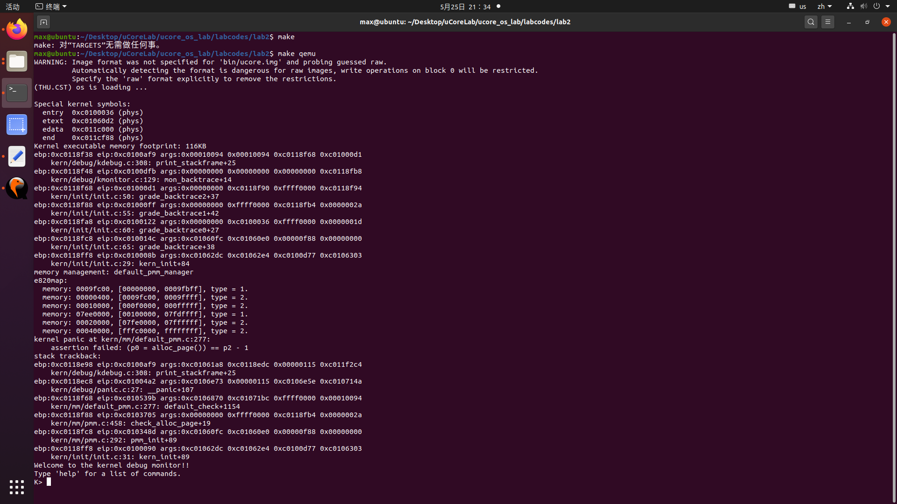
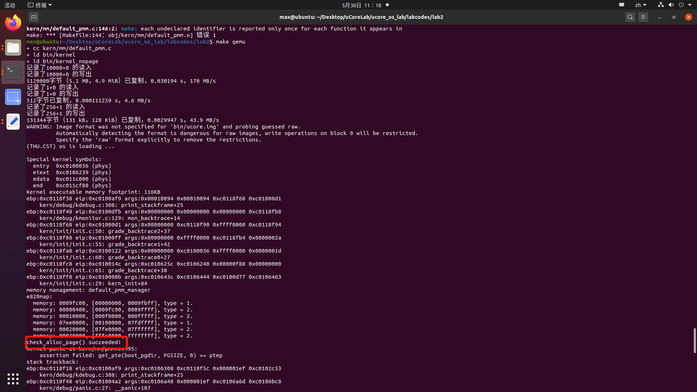
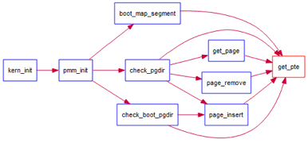
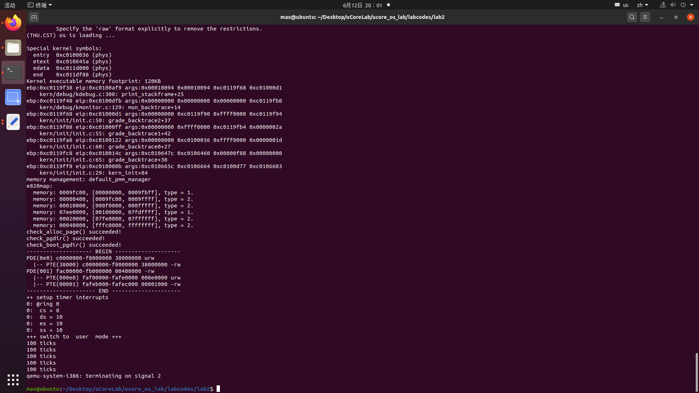

# uCore Lab02 实验报告

**学号：19335286 姓名：郑有为**

[toc]

* 实验目的：
	* 理解基于段页式内存地址的转换机制；
	* 理解页表的建立和使用方法；
	* 理解物理内存的管理方法。
* 实验内容：
	* 了解如何发现系统中的物理内存；
	* 了解如何建立对物理内存的初步管理，即了解连续物理内存管理；
	* 了解页表相关的操作，即如何建立页表来实现虚拟内存到物理内存之间的映射。

* 注意有“LAB2”的注释，代码中所有需要完成的地方（challenge 除外）都有“LAB2”和“YOUR CODE”的注释，请在提交时特别注意保持注释，并将“YOUR CODE”替换为自己的学号，并且将所有标有对应注释的部分填上正确的代码。

## 练习 0：填写已有实验

补充所有代码后运行`make qemu`，得到如下界面：



可以看到 ucore 在显示 uCore入口地址`entry`、代码段截止处地址`etext`、数据段截止处地址`edata`、 ucore截止处地址`end`的值，和计算机系统中的物理内存的布局（`e820map`下的显示内容），但是也看到了`kernel panic`，说明源代码还有未实现的内容 。

## 练习 1：实现 first-fit 连续物理内存分配算法

### 题目要求
* 在实现 first fit 内存分配算法的回收函数时，要考虑地址连续的空闲块之间的合并操作。提示:在建立空闲页块链表时，需要按照空闲页块起始地址来排序，形成一个有序的链表。可能会修改 default_pmm.c 中的 *default_init*，*default_init_memmap*，*default_alloc_pages*， *default_free_pages* 等相关函数。仔细查看和理解 default_pmm.c 中的注释。
* 简要说明你的设计实现过程。回答如下问题：
	* 你的 first fit 算法是否有进一步的改进空间

### 实现步骤

1. 准备
  
  * 为了实现First-Fit Memory Allocation (FFMA)，应该使用列表来管理空闲内存块。结构体'free_area_t'用于管理空闲内存块。

  * 已阅读关键源码：`memlayout.h`（定义内存管理），`pmm.h`（物理内存管理），`pmm.c`，`default_pmm.c`和几个工具函数库`libs\defs.h`,`libs\atomic.h`,`libs\list.h`,并在实验源码中给出了部分中文注释和自己的理解，没有搬到报告中来，详细请参考相应文件。
	
  * 熟悉list.h中的结构'list'。结构'list'是一个简单的双链表实现。了解list.h函数的使用：

    ```c
    void list_init(list_entry_t *elm) //初始化一个entry，（将它的前后指针指向自己）
    void list_add(list_entry_t *listelm, list_entry_t *elm) //在`listelm`的后面插入新元素`elm`，函数`void list_add_after(list_entry_t *listelm, list_entry_t *elm)`相同。
    void list_add_before(list_entry_t *listelm, list_entry_t *elm) //在`listelm`的前面插入新元素`elm`
    void list_del(list_entry_t *listelm) //从链表里删除元素`listelm`
    void list_del_init(list_entry_t *listelm) //从链表里删除元素`listelm`，并重新初始化它，创建一个只有它自己的一个新链表
    bool list_empty(list_entry_t *list) //判断链表是否为空
    list_entry_t* list_next(list_entry_t *listelm) //返回`listelm`的后一个元素
    list_entry_t* list_prev(list_entry_t *listelm) //返回`listelm`的前一个元素
    ```

  * 将一个通用的`list`结构体转换为一个特殊的结构体(如struct`page`)，使用以下宏:`le2page`(在memlayout.h)，使用方法：`le2page(le, member)`，返回地址。

2. **default_init函数**: 可以重用Demo的`default_init`函数来初始化`free_list`，并将`nr_free`设为0。`free_list`用于记录空闲内存块。`nr_free`是可用内存块的总数。**经检查，无需修改`default_init(void)`函数源码，重写源码：**

	``` c
	static void default_init(void){
		list_init(&free_list);
		nr_free = 0;
	}
	```
3. **default_init_memmap函数**: 这个函数用于初始化一个空闲块(带有参数`addr_base`， `page_number`)。为了初始化一个空闲块，首先，需要初始化这个空闲块中的每个页(在memlayout.h中定义)。这个过程包括:
	
	* 设置`p->flags`的`PG_property`位，表示此页有效。然而，在函数`pmm_init`(在pmm.c)中，`p->flags`的位`PG_reserved`已经设置。
	* 如果这个页是空闲的，并且不是空闲块的第一页，`p->property`应该设置为0；若这个页是空闲的，并且是空闲块的第一个页，`p->property`应该被设置为块中的总页数。
	* `p->ref`应该是0，因为现在`p`是空闲的，没有引用。然后，可以使用`p->page_link`将这个页链接到`free_list`中。例如: `list_add_before (free_list & (p - > page_link));`
	* 最后，更新空闲内存块的总和:`nr_free += n`。
	
	**经检查`default_init_memmap`源码，源码已经涵盖上述要求，重写源码，并加入注释：**
	
	``` c
	static void default_init_memmap(struct Page *base, size_t n){
		assert(n > 0);
		
		// 初始化空闲块首部的页base
		assert(PageReserved(base)); // 检查base标志位
		base->flags = 0;
		base->property = n; // 设置base指向的页为空闲块首部
		set_page_ref(base, 0); // 置为ref为0
		SetPageProperty(base); // 设置base指向的页为空闲块首部
		
		// 便历、初始化非空闲块首部的页
		struct Page *t = NULL; 
		for (t = base + 1; t < base + n; t ++) {
		    assert(PageReserved(t)); // 由于函数pmm_init已赋值保留位为0,这里仅需测试保留位是否被正确置0。
		    t->flags = t->property = 0; // 设置该页不是空闲块首部
		    set_page_ref(t, 0); // 置为ref为0
		}
		
		// 更新链表
		nr_free += n; // 更新空闲页的总数
		list_add(&free_list, &(base->page_link)); // 将该空闲块插入页表（空闲块）链表中。
	}
	```
	
4. **default_alloc_pages函数**: 在空闲列表中搜索第一个空闲块(块大小>= n)，重新计算找到的块，返回这个块的地址作为`malloc`所要求的地址。
	
	* 遍历空闲链表
		* 在循环中，每次获取结构体`page`，检查`p->property >= n`。
		* 如果找到了这个`p`，意味着找到了一个大小满足条件的空闲块，它的前`n`页可以被分配。修改页的标志位: `PG_reserved = 1`， `PG_property = 0`。然后，从`free_list`中删除这些页。
			* 如果`p-property > n`，重新计算这个空闲块的剩余页数，并将其加入到空闲链表中。
		* 更新`nr_free`(所有剩余空闲块的数量)。
		* 返回`p`。
	* 如果找不到一个大小为>=n的空闲块，则返回NULL。
	
	**经检查，函数`default_alloc_pages`也是符合要求的，下面重写源码，并加入注释：**
	
	``` c
	static struct Page* default_alloc_pages(size_t n){
		assert(n > 0);
		if(n > nr_free){ 
			return NULL; // 如果请求页数比当前空闲总页数还大，拒绝请求	，但没必要结束程序
		}
		
		struct Page *p = NULL, *p2 = NULL;
		
		list_entry_t *l = list_next(&free_list);
		while (l != &free_list){ // 从头遍历链表
			 p = le2page(l, page_link);
			 l = list_next(l); 
			 if(p->property >= n){ // 找到第一个页数>=n的空闲块
			 	p2 = p; // p2即满足条件的空闲块首部页
			 	break;
			 }
		}
		
		if(p2 != NULL){
			if(p2->property == n){ // p2空闲块大小刚好等于所需页数
				nr_free -= n;
				ClearPageProperty(p2);
				list_del(&(p2->page_link)); // 将p2从链表中删除
			}
			else if(p2->property > n){ // p2空闲块大小大于所需页数
				p = p2 + n; // 剩下的页组合在一起变成p，修改p的属性，重新加入链表
				p->property = p2->property - n;
				SetPageProperty(p);
				nr_free -= n;
				ClearPageProperty(p2);
				list_add_after(&(p2->page_link), &(p->page_link));
				list_del(&(p2->page_link)); // 将p2从链表中删除
			}
		}
		return p2;
	}
	```

5. **default_free_pages函数**: 将页重新链接到空闲列表中，并可能将小的空闲块合并到大的块中。
	
	* 根据已收回区块的基地地址，在`free list`中搜索其正确位置(地址由低到高)，插入页。(可以使用`list_next`，` le2page`，` list_add_before`)
	* 重置页的字段，如`p->ref`和`p->flags` (PageProperty)尝试合并较低或较高地址的块。注意:这将正确地更改一些页的`p->property`。
	
	* 源代码，会导致测试报错：`kernel panic at kern/mm/default_pmm.c:432:     assertion failed: (p0 = alloc_page()) == p2 - 1`，原因是：`list_add(&free_list, &(base->page_link)); `不能保证插入后地址由低到高。
	
	**此处需要遍历找出合适位置，重写源码，并加入注释：**
	
	``` c
	static void default_free_pages(struct Page *base, size_t n){ // base~base+n 是归还给空闲链表的页
		assert(n > 0);
		// 清空内容
		for(struct Page *i = base; i < base + n; i++){
			assert(!PageReserved(i)); 
			assert(!PageProperty(i));
			i->flags = 0;
			set_page_ref(i, 0);
		}
		
		// 四种情况：两个块合并（前后和后前）、三个块合并、单独成块
		struct Page *p = NULL;
		
		nr_free += n;
		SetPageProperty(base);
		base->property = n;
	
	    list_entry_t *l = list_next(&free_list);
	    while (l != &free_list) { // 遍历，合并
	        p = le2page(l, page_link); 
	        l = list_next(l);
	        if (base + base->property == p) { // base 合并 p
	            ClearPageProperty(p);
	            base->property += p->property;
	            list_del(&(p->page_link)); // 断开被合并的块在free_list的链接
	        }
	        else if (p + p->property == base) { // p 合并 base
	            ClearPageProperty(base);
	            p->property += base->property;
	            list_del(&(p->page_link)); // 断开被合并的块在free_list的链接
	            base = p; // 更新 base 为 p
	        }
	    }
	    
	    l = list_next(&free_list);
	    while (l != &free_list){ //遍历，找位置按序插入
			p = le2page(l, page_link);
			if (base + base->property < p){
				break;
			}
			l = list_next(l);   
	    }
	    list_add_before(l, &(base->page_link)); // 若free_list为空可直接插入base
	}
	```

### 问题回答

* 你的First Fit算法是否有进一步的改进空间？

	首先分析各函数的复杂度，default_init_memmap函数，default_alloc_pages函数，default_free_pages函数都要通过遍历空闲链表进行查找或有序维护，因而复杂度都为`O(n)`。受限与链表结构，查找和有序维护的复杂度无法降低(除非将整个链表结构改为树结构：如AVL数、红黑树)，但在一些特殊情况下，有序维护可以进行避免插入的处理。例如default_free_pages函数，需当出现p(前)合并base(后)的情况（考虑上一段代码），实际上是不用进行插入和删除的，只需要修改p和base的属性即可，这最开始我在实现上使用的思路，考虑代码冗余遂没有保留。
	参考博客，考虑default_free_pages函数的另一种思路：即将空闲块的信息除了保存在第一个页和最后一页，这样新的空闲块只需要检查邻接的两个页就能判断邻接空间块的状态，如果邻接空间都空闲，即可直接并入邻接空间，使得时间复杂度降为`O(1)`。

### 运行测试

* 修改后程序测试：通过测试

	

---

## 练习 2：实现寻找虚拟地址对应的页表项

### 题目要求

* 通过设置页表和对应的页表项，可建立虚拟内存地址和物理内存地址的对应关系。其中的 get_pte 函数是设置页表项环节中的一个重要步骤。此函数找到一个虚地址对应的二级页表项的内核虚地址，如果此二级页表项不存在，则分配一个包含此项的二级页表。本练习需要补全 get_pte 函数 in kern/mm/pmm.c，实现其功能。仔细查看和理解 get_pte 函数中的注释。get_pte 函数的调用关系图如下所示：

	

* 简要说明你的设计实现过程。回答如下问题：
	* 描述页目录项（Page Directory Entry）和页表项（Page Table Entry）中每个组成部分的含义以及对 ucore 而言的潜在用处。
	* 如果 ucore 执行过程中访问内存，出现了页访问异常，问硬件要做哪些事情？

### 代码实现

* 函数名：get_pte - get pte and return the kernel virtual address of this pte for la if the PT contians this pte didn't exist, alloc a page for PT
* 参数列表：
	* pgdir:  the kernel virtual base address of PDT
	* la:     the linear address need to map
	* create: a logical value to decide if alloc a page for PT
* 返回值: the kernel virtual address of this pte

``` c
pte_t *
get_pte(pde_t *pgdir, uintptr_t la, bool create) {
	pde_t pde_index = PDX(la); // find page directory entry
	pte_t* pte_addr = NULL;
	
	pde_t* pde_ptr = &pgdir[pde_index];
	if(*pde_ptr & PTE_P){ // check if entry is present
		pte_addr = (pte_t *)KADDR(PDE_ADDR(*pde_ptr));
		return &(pte_addr)[PTX(la)]; // return page table entry
	}
	else{
		if(create == 0){ // check if creating is needed
			return NULL;
		}
		struct Page* new_page = alloc_page(); // alloc page for page table
		if(new_page == NULL){
			return NULL;
		}
		set_page_ref(new_page, 1); // set page reference
		uintptr_t phy_addr = page2pa(new_page); // get linear address of page
		memset(KADDR(phy_addr), 0, PGSIZE); // clear page content using memset
		*pde_ptr = phy_addr | PTE_P | PTE_W | PTE_U; // set page directory entry's permission
		pte_addr = (pte_t *)KADDR(PDE_ADDR(*pde_ptr)); 
		return (&pte_addr)[PTX(la)]; // return page table entry
	}
	return NULL;
}

```

* 相关宏定义和函数

	* `PTE_P 0x001` Present
	* `PTE_W 0x002` Writeable
	* `PTE_U 0x004` User can access
	* `PDX(la)` 虚拟地址la的一级页表索引
	* `KADDR(pa)` 传入物理地址并返回虚拟地址
	* `set_page_ref(page,1)` 设置这个页被引用了一次
	* `page2pa(page)` 获得该页管理的物理地址
	* `struct Page * alloc_page()` 分配一个页
	* `memset(void *s, char c, size_t n)` 把s指向的n字节空间的内容都赋值成字符c

### 问题回答

* 描述页目录项（Page Directory Entry）和页表项（Page Table Entry）中每个组成部分的含义以及对 ucore 而言的潜在用处。

	* 以下是mmu.h文件对一个线性地址的划分，前10位对应页目录项，中间10位对应页表项，最后12位是页索引，索引区间为0-4096字节。在下述结构中，页目录中最多可有1024个页目录项，每个页目录项的内容是一个指向某个页表表头（最多可以有1024个页表）。页表中最多可有1024个页表项，每个页表项的内容是一个指向某个物理内存空间的地址，每个物理内存空间是4096字节，及4KB。

	```	
	A linear address 'la' has a three-part structure as follows:
	+--------10------+-------10-------+---------12----------+
	| Page Directory |   Page Table   | Offset within Page  |
	|      Index     |     Index      |                     |
	+----------------+----------------+---------------------+
	\--- PDX(la) --/ \--- PTX(la) --/ \---- PGOFF(la) ----/
	\----------- PPN(la) -----------/
	The PDX, PTX, PGOFF, and PPN macros decompose linear addresses as shown.
	To construct a linear address la from PDX(la), PTX(la), and PGOFF(la),
	use PGADDR(PDX(la), PTX(la), PGOFF(la)).
	```
	
	* **页目录项和页表项的组成部分可以通过以下两个公式得到，它们的含义如下所示：**

		* **页目录项内容 = (页表起始物理地址 & ~0x0FFF) | PTE_U | PTE_W | PTE_P**
		* **页表项内容 = (pa & ~0x0FFF) | PTE_P | PTE_W**

		其中：
		* PTE_U：位 3，表示用户态的软件可以读取对应地址的物理内存页内容
		* PTE_W：位 2，表示物理内存页内容可写
		* PTE_P：位 1，表示物理内存页存在

	* **页目录项和页表项的组成部分，对 ucore 有一下潜在用处：**

		* **页目录项结构**：
		
		|位数|名称|用处|
		|-----|-----|-----|
		|31:12|Aligned Address| 页表的起始物理地址，用于定位页表位置|
		|11-9|Avail|PTE_AVAIL 保留给操作系统|
		|7|Page Size|PTE_PS 确认页的大小|
		|5|Accessed|PTE_A 是否使用对应页表|
		|4|Cache Disabled|PTE_PCD 使用禁用缓存|
		|3|Write Through|PTE_PWT 缓存使用写直达模式|
		|2|User/Supervisor|PTE_U 用户态的软件是否可以读取对应地址的物理内存页内容|
		|1|Read/Write|PTE_W 物理内存页内容是否可写|
		|0|Present|PTE_P，物理内存页是否存在|

		* **页表项结构**：
		
		|位数|名称|用处|
		|-----|-----|-----|
		|31-12|Physical Page Address|对应物理页的起始物理地址，用于定位物理页的位置|
		|11-9|Avail|PTE_AVAIL 保留给操作系统|
		|8|Global|是否具有全局属性|
		|6|Dirty|PTE_D 脏位，确认数据是有效|
		|5|Accessed|PTE_A 是否使用对应页表|
		|4|Cache Disabled|PTE_PCD 使用禁用缓存|
		|3|Write Through|PTE_PWT 缓存使用写直达模式|
		|2|User/Supervisor|PTE_U 用户态的软件是否可以读取对应地址的物理内存页内容|
		|1|Read/Write|PTE_W 物理内存页内容是否可写|
		|0|Present|PTE_P，物理内存页是否存在|
		
		* PTE_U: 只有当一级二级页表的项都设置了用户写权限后，用户才能对对应的物理地址进行读写。所以我们可以在一级页表先给用户写权限，再在二级页表上面根据需要限制用户的权限，对物理页进行保护，之后也可以调整用户权限来实现其他扩展。
		* PTE_W: 物理内存在创建后还是空的，往往后续需要往里面存放内容，通过这个控制位可以实现对物理内存的写入，有时候，指定的物理内存，如一些内核内容是不可以写入的，就可以通过这个控制位来避免系统对这块内存的修改，提高了安全性。
		* PTE_P: 在当前阶段，用于声明该物理页是否存在，在以后的设计中，内存往往需要与下一层的如硬盘等交换数据，即页的换入换出，通过这个控制位能够有效地控制切换的过程。

	* 理解页目录项和页表项也可以借助下面一张图来理解：

		

	* **如果 ucore 执行过程中访问内存，出现了页访问异常，问硬件要做哪些事情？**
	
    	* 首先引发页访问异常的地址将被保存在CR2寄存器中，并设置相应的错误代码引以触发缺页中断，保存上下文，将数据保存，再上下文切换回去，最后退出中断，返回到中断前的状态。

### 运行测试

成功通过测试：



## 练习 3：释放某虚地址所在的页并取消对应二级页表项的映射

### 题目要求
* 当释放一个包含某虚地址的物理内存页时，需要让对应此物理内存页的管理数据结构 Page 做相关的清除处理，使得此物理内存页成为空闲；另外还需把表示虚地址与物理地址对应关系的二级页表项清除。仔细查看和理解 page_remove_pte 函数中的注释。为此，需要补全在 kern/mm/pmm.c 中的 page_remove_pte 函数。page_remove_pte 函数的调用关系图如下所示：

	

* 简要说明你的设计实现过程。回答如下问题：
    	* 数据结构 Page 的全局变量（其实是一个数组）的每一项与页表中的页目录项和页表项有无对应关系？如果有，其对应关系是啥？
    	* 如果希望虚拟地址 与物理地址相等，则需要如何修改 lab2，完成此事？鼓励通过编程来具体完成这个问题。

### 代码实现

* 函数名：page_remove_pte - free an Page sturct which is related linear address la and clean(invalidate) pte which is related linear address la
* 参数列表：
	* pgdir:  the kernel virtual base address of PDT
	* la:     the linear address need to clean
	* ptep:   the page table entry 

* 代码：
	``` c
	static inline void
	page_remove_pte(pde_t *pgdir, uintptr_t la, pte_t *ptep) {
		if(*ptep & PTE_P){ 							// check if this page table entry is present
			struct Page *page = pte2page(*ptep); 	// find corresponding page to pte
			if(page_ref_dec(page) == 0){ 			// decrease page reference
				free_page(page); 					// and free this page when page reference reachs 0
			}
			*ptep = 0; 								// clear second page table entry
			tlb_invalidate(pgdir, la); 				// flush tlb
		}
	}
	```

* 相关宏定义和函数
	* `PTE_P 0x001` 用于与运算（最后一比特位）判断页目录项/页表项是否存在
	* `struct Page *page pte2page(*ptep)` 通过一个PTE的地址获得页
	* `free_page` 释放一个页的内存
	* `page_ref_dec(page)` 让页的引用减一，并返回引用数
	* `tlb_invalidate(pde_t *pgdir, uintptr_t la)` 让一个TLB项失效（Invalidate）
     
### 问题回答

* **数据结构 Page 的全局变量（其实是一个数组）的每一项与页表中的页目录项和页表项有无对应关系？如果有，其对应关系是啥？**

	Page的全局变量（其实是一个数组）的每一项与页表中的页目录项和页表项有对应关系，当然是在页目录项和页表项有效时。
	Pages数组每一个元素实际上记录着一个物理页的信息，而一个物理页的信息可以通过页目录和页表项来找到。
	因此，页目录项和页表项保存的地址与Pages数组的元素集合有一一对应关系。

* **如果希望虚拟地址与物理地址相等，则需要如何修改 lab2，完成此事？鼓励编程实现**
    * Lab2在Lab1的基础上通过三个阶段多个步骤建立了虚拟地址到物理地址的映射，取消这些映射即可完成目标使得虚拟地址与物理地址相等。
    
    * 修改方法：将tools/kernel.ld文件的代码中`ENTRY(kern_init)`中`.`的地址改为`0X100000`，并修改在memlayout.h文件中的宏定义：`KERNBASE`改为`0x0`，最后关闭开启页表。
    	
### 运行测试

成功通过测试：


## 扩展练习 Challenge：buddy system（伙伴系统）分配算法

### 题目要求
* Buddy System 算法把系统中的可用存储空间划分为存储块(Block)来进行管理, 每个存储块的大小必须是 2 的 n 次幂(Pow(2, n)), 即 1, 2, 4, 8, 16, 32, 64, 128...
* 参考[伙伴分配器的一个极简实现](https://coolshell.cn/articles/10427.html)， 在 ucore 中实现 buddy system 分配算法，要求有比较充分的测试用例说明实现的正确性，需要有设计文档。

### 思考实现

有两种实现思路，可以选择通过一个二叉树实现，也可以直接通过链表来实现。

首先获取一个连续的内存段，页面的大小是变长但有规律的，即长度必须满足2的幂字节，对此，需要特定的拆分和合并操作，之后分配和释放通过刷新完全二叉树（遍历）即可。

拆分：假设要申请一个128个页框的块，先从128个页框的链表中查找空闲块，如果没有，就去256个页框的链表中找，找到了则将页框块分为2个128个页框的块，一个分配给应用，另外一个移到128个页框的链表中。如果256个页框的链表中仍没有空闲块，继续向512个页框的链表查找，（不断向上查找）如果仍然没有，则返回错误。

合并：页框块在释放时，会主动将两个连续（满足伙伴关系）的页框块合并为一个较大的页框块。

除此之外考虑特殊情况，比如总内存m中恰好大于2的n次幂剩余的部分，我们可以将空间设为2的n+1次幂，然后设定2^(n+1)-m的那一部分不可用，以充分利用现有的内存空间。

## 扩展练习 Challenge：任意大小的内存单元 slub 分配算法

### 题目要求
* slub 算法，实现两层架构的高效内存单元分配，第一层是基于页大小的内存分配，第二层是在第一层基础上实现基于任意大小的内存分配。可简化实现，能够体现其主体思想即可。
* 参考linux 的 slub 分配算法，在 ucore 中实现 slub 分配算法。要求有比较充分的测试用例说明实现的正确性，需要有设计文档。

---

## 总结

### 参考答案对照

本次实验的主体就是三处代码：分别是`first_fit`内存分配相关函数、寻找虚拟地址对应的页表项函数`get_pte`、释放某虚地址所在的页并取消对应二级页表项的映射函数`page_remove_pte`。

通过比对答案的实现，对于`first fit`的代码，虽然实现稍有不同，但都考虑了边界情况的检测和错误返回；对于`get_pte`函数，在分支判断的时候和处理有些差异，但总体思路都是围绕注释的；对于最后一个函数`page_remove_pte`，其实现比较简单，与答案代码几乎一致。

### 原理知/实验知识点归纳

通过本次实验，理解了基于段页式内存地址的转换机制和页表的建立和使用方法、物理内存的管理方法。除此之外，还了解了如何发现系统中的物理内存、如何建立对物理内存的初步管理，即了解连续物理内存管理、以及页表相关的操作，即如何建立页表来实现虚拟内存到物理内存之间的映射，进一步加深了对操作系统，uCore的理解，主要知识点如下：

1. 系统物理内存的布局和探测
2. 以页为单位管理物理内存
3. 物理内存分配算法 first fit 的实现
4. 段页式管理的基本含义
5. 段页式管理的地址映射（虚拟页与物理页）

### 未遇到的知识点

1. 内存与外存的数据交换
2. CPU调度与相关调度策略
3. 内核线程管理：创建、执行、切换和基本调度
4. 用户进程管理
5. 操作系统的调度管理机制，调度器和调度算法
6. 操作系统的同步互斥的设计实现
7. 文件系统的设计和实现

---


