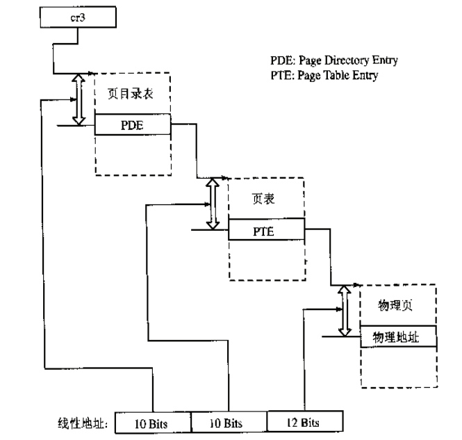

### 草稿区

* VPT Virtual page table 指向虚拟页表表头的指针
* PTE Page Table Entry 页表项，每个页表项就代表一个页的地址

* 目前阅读了：
	* `memlayout.h`: 定义内存管理 ok
	* `pmm.h`: 物理内存管理 ok
	* `pmm.c`: 没看完 
	* `default_pmm.c`: LAB2 EXERCISE1 ok
	
* first-fit 实现需注意的问题：

	* firstfit 需要从空闲链表头开始查找最小的地址，通过 list_next 找到下一个空闲块元素，通过 le2page 宏可以由链表元素获得对应的 Page 指针 p。通过 p->property 可以了解此空闲块的大小。如果>=n，这就找到了！如果<n，则 list_next，继续查找。直到 list_next== &free_list，这表示找完了一遍了。找到后，就要从新组织空闲块，然后把找到的 page 返回。

	* default_free_pages 函数的实现其实是 default_alloc_pages 的逆过程，不过需要考虑空闲块的合并问题。

* extern关键字的含义：
	
	extern可以置于变量或者函数前，以标示变量或者函数的定义在别的文件中，提示编译器遇到此变量和函数时在其他模块中寻找其定义。它的作用就是声明函数或全局变量的作用范围的关键字，其声明的函数和变量可以在本模块活其他模块中使用，记住它是一个声明不是定义!也就是说B模块(编译单元)要是引用模块(编译单元)A中定义的全局变量或函数时，它只要包含A模块的头文件即可,在编译阶段，模块B虽然找不到该函数或变量，但它不会报错，它会在连接时从模块A生成的目标代码中找到此函数。

* PTE和PDE的关系：
	
	

* 两级页表结构：
	* 一个是页目录表PDE，也叫一级目录，另一个是二级页表PTE
	* 进程的虚拟地址需要首先通过其局部段描述符变换为 CPU 整个线性地址空间中的地址， 然后再使用页目录表 PDE（一级页表）和页表 PTE（二级页表）映射到实际物理地址页上。