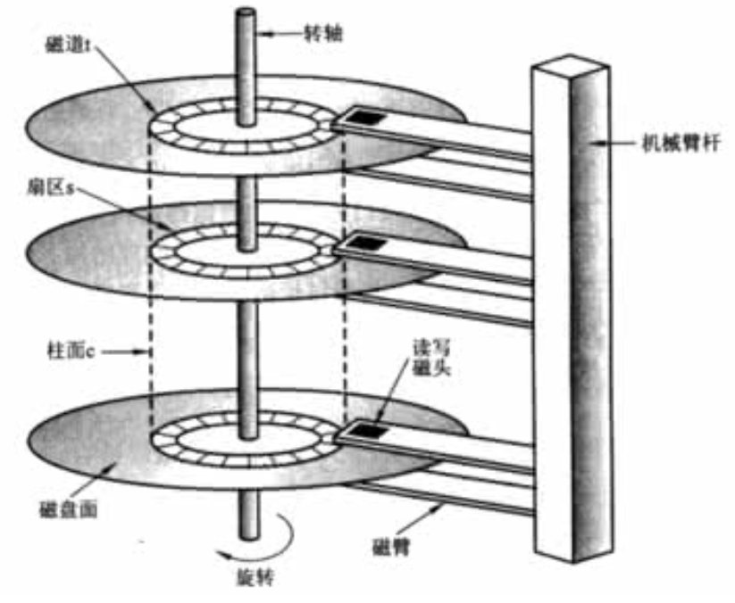
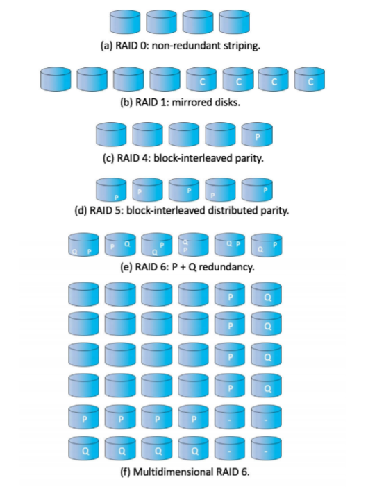

# 储存管理

[toc]

## Chap10 文件系统

1. 文件系统：由文件集合和目录结构组成

2. 文件：逻辑存储单位，由操作系统映射到物理设备上。从用户角度，文件是逻辑外存的最下分配单元

3. 文件属性：名称、标识符、类型、位置、尺寸、保护、时间日期、用户标识

4. 文件操作的最小集合：创建文件、写文件、读文件、重定位文件、删除文件、截断文件（例如仅保留文件属性）

5. 打开文件的关联信息：文件指针、文件打开计数、文件磁盘位置、访问权限

6. 共享锁、独占锁、强制锁定和建议锁定机制

7. 文件类型：

   * 文件名：名称 + ‘.’ + 扩展
   * 扩展名：指示文件类型和可用于该文件的操作

8. 文件访问方法：顺序访问（文件信息按需加以处理）、直接访问（文件由固定长度的逻辑记录组成，以允许按任意顺序进行快速读取和写入）、索引访问

9. **磁盘结构**：一个存储设备可以按整体用于文件系统，也可以划分为多个分区，而每个分区有单独的文件系统，存储设备可以组成RAID集合，避免单个磁盘故障。

   硬盘的每个分区都可以创建文件系统，包含文件系统的分区称为卷。卷可以作为虚拟磁盘、还可以存储多个操作系统

10. **目录Directory**：包含文件系统的卷应该包含文件系统内的文件信息，信息保存在设备目录或卷目录表
11. 目录执行操作：搜索文件、创建文件、删除文件、遍历目录、重命名文件、遍历文件系统
12. 目录结构：
    * 单级目录
    * 两级目录
      * 为每个用户创建一个目录UFD，主文件目录MFD指向所有的UFD
    * 树形目录
      * 当前目录、绝对路径、相对路径
    * 无环图目录
      * 一个共享目录可同时位于文件系统的多个地方（树形目录所禁止）
      * 链接：一个指向别的文件、目录的指针
    * 通用图目录
      * 允许有环，但需要避免死循环
      * 删除文件前检查引用数、垃圾收集方案
13. 文件系统安装：挂载
    * 安装点
14. 文件共享：多用户 - 文件所有者、一致性、远程文件系统
15. 文件保护：访问控制列表、密码

## Chap11 文件系统实现

1. 多层实现：文件系统本身由多种不同的层组成：
   1. I/O控制层：最底层，包括设备驱动程序和中断处理程序，已在主存和磁盘系统之间传输信息
   2. 基本文件系统：向设备驱动程序发送通用命令，以读取和写入磁盘的物理块，也管理内存缓冲区和各类数据缓存。
   3. 文件组织模块：知道文件及其逻辑块和物理块，相互转化已提供基本的文件系统传输
   4. 逻辑文件系统：管理元数据信息，管理目录结构，保护文件控制块
2. **磁盘上**，文件系统结构可能包含的内容：
   1. 引导控制块：包含从该卷引导操作系统所需的信息，通常为卷的第一块
   2. 卷控制块：包含每个卷的详细信息，包括分区块数量、块大小等
   3. 目录结构、每个文件的FCB
3. **内存中**，文件系统结构可能包含的内容：
   * 安装表、目录结构的缓存、系统打开文件表、每个进程的打开文件表
4. 目录实现：线性列表、哈希表
5. 磁盘空间分配方法：
   * 连续分配：停机期间**合并**解决外部碎片
   * 连接分配：解决了连续分配的所有问题，每一块都有下一块的指针、不能有效地支持文件的直接访问
   * 索引分配：索引块将分配的所有块指针放在一起
6. 空闲空间管理：维护空闲空间列表
   * 位向量（位图）：每个块用一个位表示
   * 链表、组
   * 计数：记录第一块的地址和紧跟第一块的连续空间块的数量
   * 空间图
7. 双缓存：内存映射I/O - 页面缓存和缓冲区缓存 - 文件系统，浪费内存和CPU，I/O时间
8. 同步写和异步写（利用缓存）、随后释放和预先读取
9. 恢复：从故障中恢复
   1. 一致性检查
   2. 日志记录
   3. 备份与恢复
10. 网络文件系统：懒得管你

## Chap12 大容量存储结构

1. 磁盘结构

   1. 物理结构
      * 盘片：每个盘片两侧覆盖磁质材料，可以保存信息
      * 磁臂、磁头：磁头附着在磁臂上，磁臂将所有磁头作为一个整体移动
      * 磁道、扇区：盘片的表面一环一环地分成圆型磁道，再细分为扇区
      * 
   2. 磁盘参数：
      * 每分钟转数RPM：5400、7200、10000、15000PRM
      * 传输速率：在驱动器和计算机之间数据流速率
      * 随机访问时间：寻道时间（移动磁臂到所需柱面的时间）+旋转延迟（旋转臂旋转到指定扇区的时间）（毫秒级别）
   3. 磁头碰撞：磁头与磁盘表面接触损坏磁盘表面
   4. 固态磁盘SSD：没有移动部件、更可靠、更快、省电、容量大但寿命有限
   5. 磁带：容量大、永久、慢
   6. 逻辑结构:
      * 逻辑块（通常为512字节）
      * 扇区0是最外面柱面的第一个磁道的第一个扇区
      * 映射规则：按刺刀内扇区排序，再按柱面内磁道排序，再按从外到内的柱面顺序来进行编号

2. 磁盘调度

   * 寻道时间（移动到柱面）、旋转延迟（移动到扇区）、磁盘带宽（传输字节总数/服务总时间）

   * 调度算法：FCFS、SSTF（最短寻道时间优先）、SCAN（电梯算法，需考虑当前磁头移动方向）、C-SCAN（到达一段后冲到另一端）、LOOK（磁臂只需移动到最远请求）、C-LOOK。

3. 磁盘管理

   * 磁盘格式化
     * 低级格式化：每个扇区使用特殊的数据结构填充磁盘
     * 使用磁盘之前：
       * 磁盘分区
       * 逻辑格式化：将初始文件系统数据结构储存到磁盘上 

4. 磁盘冗余阵列 RAID

   * 磁盘的平均故障时间、平均维修时间和

   * RAID级别

     

## Chap13 I/O系统

1. 设备驱动程序：为I/O子系统提供统一的设备访问接口
2. I/O设备：存储设备、传输设备、人机交互设备和其它专用设备
3. 端口和总线：总线是一组线路和通过线路传输信息严格定义的一个协议
4. PCI总线和扩展总线：前者将处理器内存子系统连接到快速设备，而扩展总线连接相对较慢的设备，如键盘、USB
   1. 控制器：操作端口、总线或设备的一组器件，具有若干个寄存器，用于控制信号和数据。处理器通过特殊指令读取这些寄存器与控制器通信。除I/O之外也可以使用内存映射I/O来控制I/O设备。
5. I/O端口的四个寄存器：数据输入寄存器（主机读）、数据输出寄存器(主机写入）、状态寄存器、控制寄存器（主机写入以执行命令）
6. 轮询：重复循环握手操作
   * 主机与控制器之间的握手协调：（例：主机需通过端口来输出数据）
     1. 主机回复读取忙位，直到该位清零（忙等待）
     2. 主机设置命令寄存器的写位，并写一个字节到数据输出寄存器
     3. 主机设置命令位就绪
     4. 当控制器注意到命令位已经设置为就绪，则设置忙位
     5. 控制器读取命令寄存器，并看到写命令，从输出寄存器中读取一个字节，并向设备执行I/O操作
     6. 控制器清楚命令就绪位和故障位以表示设备I/O成果，清楚忙位表示完成。
7. 中断：CPU在执行完每条指令后，都会检查中断请求线IRL，若检测到信号，则执行状态保护并跳到指定内存固定位置执行中断处理程序以确定中断原因，执行必要处理，状态恢复并返回
   * 非屏蔽中断请求线、可屏蔽中断请求线
   * 中断向量：包含了专门的中断处理程序的地址。
     * 中断链技术：中断向量每个元素指向一个中断处理程序链表
     * 中断优先级技术：是CPU延迟处理低优先级中断，并允许高优先级中断抢占执行低优先级中断
8. 直接内存访问DMA：在启动DMA传输时，主机将DMA命令块写到内存，CPU将命令块地址写道DMA控制器，DMA控制器随后接管总线直接操作内存执行传输。
   * DMA请求、DMA确认
9. 应用程序I/O接口：块设备与字符设备、网络设备、时钟与定时器、非阻塞与异步I/O、向量I/O
10. 内核I/O子系统
    * 内核提供与I/O相关的许多服务：调度、缓冲、缓存、假脱机、设备预留和错误处理
      * I/O调度：设备状态表管理设备的类型地址状态。
      * **缓冲Buffer**：用于保护在两个设备之间或在设备和应用程序之间传输数据。
        * 用途：
          * 处理生产者消费者处理数据流速度不匹配（双缓存）
          * 协调传输大小不一数据的设备，用于消息的分段和重组
          * 支持应用程序I/O的复制语义
      * **缓存Cache**：保存数据副本的高速内存区域。
        * 缓冲可以保存数据项的唯一现有副本，而缓存只是提供了一个位于其他地方的数据项的更快存储副本
      * **假脱机SPOOL**：保存设备输出的缓冲区，这些设备不能接收交叉的数据流（如打印机），假脱机系统拦截输出到设备的内容，假脱机到单独的磁盘文件，随后一个一个地复制排队假脱机文件到设备。

11. 后面的我不想管了

