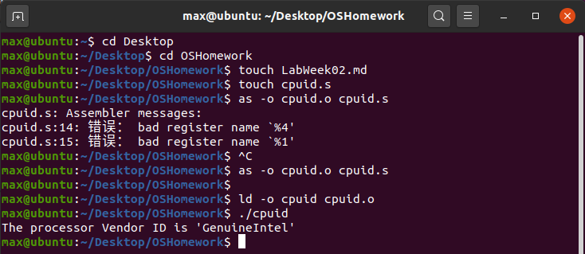
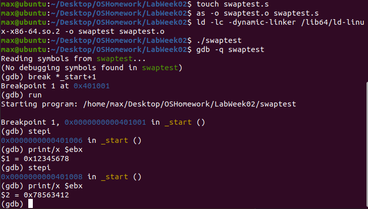
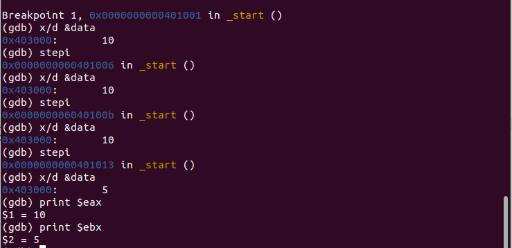
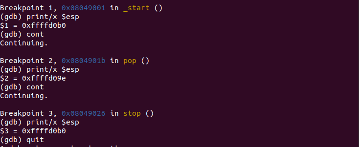
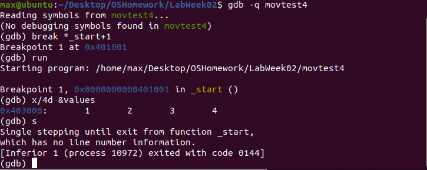

# 实验验证

## 实验验证内容索引

[实验1：简单的厂商ID字符串 squid.s ](#ex1)

[实验2：使用gdb调试程序 squid.s ](#ex2)

[实验3：在汇编中使用C库函数 squid2.s ](#ex3)

[实验4：比较不同段申请内存的程序大小 sizetest1.s, sizetest2.s, sizetest3.s](#ex4)

[实验5：mov测试-内存到寄存器传递 movtest1.s](#ex5)

[实验6：mov测试-寄存器到内存传递 movtest2.s](#ex6)

[实验7：mov测试-变址数据传输 movtest3.s](#ex7)

[实验8：mov测试-间接寻址模式 movtest4.s](#ex8)

[实验9：cmov测试-查找values数组中的最大值 cmovtest.s](#ex9)

[实验10：bswap测试-交换字节 swaptest.s](#ex10)

[实验11：cmpxchg测试-条件交换字节 cmpxchgtest.s](#ex11)

[实验12：cmpxchg8b测试-条件交换字节 cmpxchgtest8b.s](#ex12)

[实验13：冒泡排序 bubble.s](#ex13)

[实验14：push，pop测试 pushpop.s](#ex14)

# 技术日志

[toc]

## 第四章

本章学习的是GNU汇编器的基本汇编语言程序模板。

### 4.1 程序的组成

目标：学习汇编语言程序中的通用项目，以及如何使用它们定义的通用模板。

1. 汇编语言程序由定义好的段构成，常用的段有**数据段**，**BSS段**，和**文本段**，其中文本段是可执行程序声明指令码的地方，数据段声明数据，BSS段声明使用null值初始化的数据元素，常做缓冲区。

2. 定义段的方法：GNU汇编器使用**\.section**命令语句声明段，如下：

		.section.data
		.section.bss
		.section.text
	
3. 起始点的定义：为了让连接器知道指令代码的开始位置，**_start**标签用于表明程序应该从这条指令开始运行。除了起始标签，还需要通过**\.globl**(不是golbal)为外部应用程序提供入口点，这个命令声明了外部程序可以访问的程序标签，如果编写的是为外部程序使用的一组工具，应使用此命令声明每一个函数锻标签。例子如下：

		.section.text
		.globl _start
		_start:
		#代码
	
	
### 4.2 简单程序 cpuid.s

4. CPUID指令：请求处理器的特定信息并且把信息返回到特定寄存器中，它使用单一寄存器值作为输入。EAX寄存器用于决定CPUID指令生成什么信息，根据此在EBX，ECX，EDX上生成关于处理器的信息。
	
程序目的：使用0选项从处理器获得简单的厂商ID字符串，字符串返回在EBX（包含最低4个字节），EDX（中间四个），ECX（最高四个）中。注意，字符串的第一部分放在寄存器的低位中。

汇编，连接和运行：

	as -o cpuid.o cpuid.s
	ld -o cpuid cpuid.o
	./cpuid

实验截图： 

使用编译器进行汇编：**需要把_start改成main**

	gcc -o cpuid cpuid.s
	./cpuid

### 4.3 调试程序

5. 使用GNU调试器检查程序，监视处理过程中寄存器和内存位置的改变。

 **使用gdb**：其中gstabs在可执行文件中添加了附加调试信息。

	as -gstabs -o cpuid.o cpuid.s
	ld -o cpuid cpuid.o

 **单步运行程序**
	
	gdb cpuid
	run (使用run命令从gdb中运行程序)
	
 **设置断点**：某个标签/行号/数据到达特定值/函数执行指定次数。
 
 break命令格式：break * label + offset
 
	break * _start
	run (程序暂停在第一条指令处，使用next或者step进行单步调试，或者使用cont命令使程序按照正常方式继续运行。

 **查看数据**
 
 |数据命令|描述|
 |---|---|
 |info registers|显示所有寄存器的值|
 |print|显示特定寄存器或来自程序的变量的值|
 |x|显示特定内存位置的内容|
 
 其中，print可以加上修饰符制定输出格式： /d显示十进制 /t二进制 /x十六进制
 
	print/x $ebx
 
 x的格式： x/nyz ，其中n是显示的字段数，y是输出格式(c字符,d十进制,x十六进制)，z是显示的字段长度(b 字节, h 16位半字节, w 32位字)
 
	x/42cb &output
	
	
### 4.4 在汇编中使用C库函数 cpuid2.s

6. 在程序中，我们在bss申请了12个字节的缓冲区buffer，(.lcomm buffer 12)我们使用call指令调用C函数，通过pushl以此押入$buffer和$output，最后还原栈。 

使用动态连接的方法：在程序运行时由操作系统调用动态连接库。

  使用ld：(需将main改为_start)

	as -gstabs+ -o cpuid2.o cpuid2.s
	ld -lc -dynamic-linker /lib64/ld-linux-x86-64.so.2 -o cpuid2 cpuid2.o
	./cpuid2

  使用gcc：(需将_start改为main)

	gcc -o cpuid2 cpuid2.s
	./cpuid2

编译报错（未解决）： 

## 第五章

*本章学习如何使用汇编语言处理数据。学习过程：先遵循Blum的书（32位汇编语言）学完，在根据* [64位汇编电子书（英文）](www.egr.unlv.edu/~ed/assembly64.pdf) , [32与64位寄存器与汇编比较](https://blog.csdn.net/qq_29343201/article/details/51278798) *来修正学习内容*。

### 5.1 定义数据元素

7. 在数据段（.data）中定义：

 定义数据需要**标签和命令**，标签是汇编器试图访问内存位置時用作引用指针的一个位置，命令说明为数据保留多少字节（数据类型和数据项目的数量），声明定义后，**必须定义初始值**。
 
 常见的命令有： 
 
 	.ascii 文本字符串
 	.asciz 以空字符结尾的文本字符串
 	.byte 字节值
 	.int 32位整数
 	.double 双精度浮点数
 	.float 单精度浮点数
 	
 几个例子：
 
 	output:
 	.ascii "Hello World\n" 
 	#这个代码片段留出12字节内存，把定义的字符串顺序存放在内存字节中，标签output赋为第一个字节
 	
 	pi:
 	.float 3.14159
 	
 	sizes:
 	.long 100, 150, 200
 	#类似数组，把三个四字节的长整数放在从sizes引用开始的内存位置中。我们可以通过访问内存位置size+8来访问值150。（32位，**待测试**在64位是否成立）
 	
内存地址**从低到高**存放元素。

8. 定义**静态符号**：

.equ命令用于将常量值设置为可以在文本段中使用的符号

	.equ factor, 3
	.equ LINUX_SYS_CALL, 0x80
	
通过加**$**引用静态元素数据，如

	movl $LINUX_SYS_CALL, %eax
	#把0x80赋值给eax寄存器

	
9. 在**.bss段**中定义：声明无需指定数据类型，只需声明所需的原始内存。 .comm 和 .lcomm 都用于声明未初始化的数据的通用内存区域，区别在于后者声明的是本地内存区域（是不会从本地汇编代码之外进行访问的数据保留的）

	.lcomm buffer, 1000
	#把1000字节的内存区域赋值给buffer标签，在本地通用内存区域的程序之外不能访问它（不能在.globl命令中使用它）
	
**测试**：sizetest1.s , sizetest2.s 和 sizetest3.s 测试.bss段申请的空间不包含在可执行程序中

测试结果：

我们可以看到sizetest1.s（没有申请bss段的程序）和sizetest2.s（申请了bss段的程序）大小差别不大（分别是4860和4800字节），试验结果得到**.bss段申请的空间不包含在可执行程序中**，而sizetest3.s（在数据区申请了10000字节的程序）的大小是18800字节，显然包含了数据区所申请的10000字节。

### 5.2 传送数据元素

10. mov指令格式

		movx source, destination

source和destination可以是**内存地址**，**储存在内存中的数据值**，**指令语句定义的数据值**，**寄存器**，mov必需声明要传送的数据的长度，通过附加字符助记： movl（用于32位） movw（16位） movb（8位）。

	movl %eax, %ebx
	movw %ax, %bx
	movb %al, %bl
	
mov指令源和目标操作数组合：

* 立即数->通用寄存器,内存
	
	movl $0, %eax
	movl $0x80, %ebx
	movl $100, height
	#height为内存位置，每个值前加上$表明其为立即数，0x表示16进制。
	
* 寄存器->寄存器 （通用寄存器、段寄存器、控制寄存器、调试寄存器）

8个通用寄存器 (eax,ebx,ecx,edx,edi,esi,ebp,esp)，可以传送给可用的所有类型的寄存器。
	

专用寄存器只能与通用寄存器传输内容,小心处理长度不同的寄存器之间的传输
	
	movl %eax, %ecx

* 内存<->寄存器

#### 把数值从内存送到寄存器:

	#内存地址的表示： 标签
	movl value, %eax #将value内存位置的数据值传给了eax
	

**测试**：movtest1.s 测试值从内存传递给寄存器

测试结果：
	
#### 把数据从寄存器传送给内存位置中：

	movl %ecx, value
	

**测试**：movtest2.s 测试值从寄存器传递给内存

测试结果：

#### 使用变址的内存位置：

变址内存模式：内存位置由**基址base_address**,**偏移地址offset_address**,**数据元素的长度size**,**确定选择那个元素的变址index**确定。

表达式的格式：**base_address(offset_address, index, size)**
获取的数据值位于：**base_address + offset_address + index * size**

	values: .int 10, 15, 20, 25
	
	movl $2, %edi
	movl values(, %edi, 4), %eax
	# %eax 取得 20
	

**测试**：movtest3.s 变址输出数组

测试结果：

#### 使用寄存器间接寻址：

寄存器也可以保存内存地址，保存了地址的寄存器又被称为指针，使用指针访问存储位置的数据又称为间接寻址。

	movl $values, %edi 
	#注意$,这个获得的是地址，将values的地址赋值给了edi寄存器
	
	movl %ebx, (%edi) 
	movl %ebx, 4(%edi)
	movl %ebx, -4(%edi)
	#注意括号
	
如果没有括号，那么指令只是把ebx寄存器中的值复制给edi寄存器，如果有括号，那么指令就是**把寄存器ebx中的值传送给EDI寄存器中包含的内存位置**。

**测试**：movtest4.s 间接寻址模式寻址

测试结果：

从上到下，可以看到的分别是输出values数组前四个元素，把values[0]移动到eax，把values地址赋值给edi寄存器，把values[1]改为100。

测试结果：

程序的退出码是被存放到ebx寄存器中新创建的第二个数组元素（100）。

### 5.3 条件传送指令

11. 条件传送指令的本质是mov，可以避免处理器执行JMP指令，有助于处理器的预取缓存状态，通常能够提高应用的速度。

	comvx source, destination
	#其中x是一个或者两个字母的代码，表示将触发传送操作的条件(还区分有符号数和无符号数)。条件取决与EFLAGS寄存器的当前值。
	
|FLAGS位|名称|
|---|---|
|CF|进位Carry|
|OF|溢出Overflow|
|PF|奇偶校验Parity|
|SF|符号标志Sign|
|ZF|零标志Zero|

举例：

	cmova/cmovnbe 无符号，大于/不小于或等于 (CF或ZF) = 0	
	cmovge/cmovnl 有符号，大于或等于/不小于 (SF异或OF) = 0
	
举例：

	movl value, %ecx
	cmp %ebx, %ecx
	cmova %ecx, %ebx
	
在这个例子中，value的值被赋值给ecx，cmp将这个值与ebx比较。**cmp指令从第二个操作数中减去第一个操作数并设置eflags寄存器**，**如果ecx寄存器中的值大于ebx，就使用cmova指令把ebx的值替换为ecx中的值。**	

**测试**：cmovtest.s 使用cmov指令赋值，查找values数组中的最大值

测试结果：

测试结果能够成功输出最大值315。	

### 5.4 交换数据

12. 数据交换指令

**xchg**:在两个寄存器之间或者寄存器和内存之间交换值（两个操作数不可以都是内存位置，两个操作数长度必须相同）

	xchg oprand1, oprand2
	
**bswap**:反转寄存器中字节的顺序。第0～7位和第23～31位进行交换，第8～15位和第16～23位进行交换。这样实现了小尾数的值<->大尾数的值。
	

**测试**：swaptest.s 使用bswap指令交换字节

测试结果：

**xadd**：交换两个寄存器或者内存位置和寄存器的值，把两个值相加，然后把结果储存在目标位置（可以是寄存器或者内存位置）

	xadd source, destination
	#source必须是寄存器
	
**cmpxchg**：比较目标操作数与EAX或AX或AL寄存器中的值，如果相等，就把**源操作数的值**赋值给**目标操作数**；如果不相等，就把**目标操作数的值**赋值给EAX或AX或AL寄存器中

	cmpxchg source, destination

**测试**：cmpxchgtest.s 

测试结果：

可以看到，源操作数ebx = 10，不等于eax = 5，于是目标操作数data的值被改为5。

**cmpxchg8b**： 与cmpxchg相似，他处理**8个字节**，单一操作数destination引用一个内存位置，其中8字节值会与edx和eax中的值比较（**edx高位，eax低位**）。**若相等，就把ecx:ebx寄存器中的64位值传给内存目标，如果不匹配，把目标内存位置值加载到edx:eax中**。

**测试**：cmpxchg8btest.s 

测试结果：

我们可以看到gdb单步调试应该使用x/8x而不是x/8b, 最后经过cmpxchg8b，我们可以观察到data变成了ecx:ebx。这里要注意数据的排列顺序，我们可以看到 edx：eax 与 data 正好相反。

**测试**：bubble.s 实现冒泡排序 

测试结果：

从试验结果我们可以看到，我们将内存中的values的10个元素从小到大进行了排序。

### 5.5 堆栈

13. 堆栈被保留在内存区域的末尾位置，当数据存放在堆栈中时，它向下增长。在32位汇编中，有push和pop指令,后接后缀l(32bit)，w(16bit)。除此之外，我们可以使用**pusha和popa一次性操作16位所有寄存器**，压入顺序是： di,si,bp,bx,dx,cx...,ax。最后，我们还可以**手动使用esp，bsp寄存器**，通常我们将bsp的值复制给edp，使用ebp寄存器指向函数的工作堆栈空间的基址。

**我们使用如下命令来在64位Linux中编译并链接32位程序**。

	as pushpop.s -o pushpop.o --32
	ld -m elf_i386 pushpop.o -o pushpop
	./pushpop

**测试**：pushpop.s 测试pop和push（32位） 

在源程序代码的基础上，我增加了断点pop和stop来监视push结束后和pop结束后栈顶指针的值。我们可以看到在所有push结束后esp的值减少了18,在pop结束后esp又恢复为原值，与教材结果相同。

测试结果：

测试结果：

### 5.6 优化内存访问

14. 对于使用数据缓存的处理器中，在内存中按照连续的方式访问能够提高命中率。

---

# 问题和解决

## 问题1：PUSHL指令在64位x86中不适用

**解决方案1**：

	pushq $buffer
	pushq $output
	
	改为：
	
	lea output(%rip), %rdi 
	lea buffer(%rip), %rsi
	
其中 rdi，rsi都是起传参数作用的寄存器，有先后顺序。

**解决方案2**： 不修改源代码，强制32位编译连接

	as cpuid.s -o cpuid.o --32
	ld -m elf_i386 cpuid.o -o cpuid
	
## 问题2：C库函数的动态链接

我怀疑是因为动态连接库的名称或相对地址不对。

编译报错： 

**解决方案**：对程序部分进行了修改(即采用了问题1的解决方案1)，并找到动态库 /lib64/ld-linux-x86-64.so.2

正确运行：
   
参考：https://blog.csdn.net/FreeeLinux/article/details/85147455

**未解决**：不清楚报错原因。

编译报错： 

## 问题3：程序 movtest3 异常

异常运行：

**解决方案**：不修改源程序，使用如下命令，**安装g++-multilib,gcc-multilib**

	as --32 -o movtest3.o movtest3.s
	ld -m elf_i386 -dynamic-linker /lib/ld-linux.so.2 -o movtest3 -lc movtest3.o
	./movtest3
	
正确结果：

## 问题4： 程序 movtest4 单步调试异常

异常运行：

**解决方案**： 在单步调试不使用step，而是使用stepi。

参考 [linux下gdb调试 | next, nexti, step, stepi单步调试详解](https://blog.csdn.net/weixin_43092232/article/details/106243657)

正常运行：

## 问题5： 程序 cmovtest 段错误

修改源程序后，出现段错误结果，下面是修改代码：

	mov $output, %rdi 
	movl %ebx, %esi 
	call printf
	
异常结果：

**解决方案**：不修改源程序，使用如下代码，安装g++-multilib,gcc-multilib

	as --32 -o cmovtest.o cmovtest.s
	ld -m elf_i386 -dynamic-linker /lib/ld-linux.so.2 -o cmovtest -lc cmovtest.o
	./cmovtest
	
正确结果：

---

