# Lab Week03 - 验证实验 Blum’s Book: Sample programs in Chapter 06, 07 

**郑有为 19335286**

如果图片或链接显示异常，请访问 [OSHomework-LabWeek03.md](https://github.com/WondrousWisdomcard/OSHomework/blob/main/LabWeek03/LabWeek03.md) 。我把代码和截图都放在了仓库 [OSHomework](https://github.com/WondrousWisdomcard/OSHomework)。

[toc]

# 实验验证

## 实验验证内容索引

[实验1. 测试jmp - jumptest.s](#ex1)

[实验2. 测试call - calltest.s](#ex2)

[实验3. 测试cmp - cmptest.s](#ex3)

[实验4. 测试奇偶校验 - paritytest.s](#ex4)

[实验5. 测试符号位 - signtest.s](#ex5)

[实验6. 测试loop - loop.s](#ex6)

[实验7. 优化循环指令 - betterloop.s](#ex7)

[实验8. 带符号整数测试 - inttest.s](#ex8)

[实验9. 扩展无符号整数测试 - movzxtest.s](#ex9)

[实验10. 扩展带符号整数测试 - movsxtest.s, movsxtest2.s](#ex10)

[实验11. .quad命令测试 - quadtest.s](#ex11)

[实验12. mmx命令测试 - mmxtest.s](#ex12)

[实验13. sse命令测试 - ssetest.s](#ex13)

[实验14. fbld命令测试 - bcdtest.s](#ex14)

[实验15. 浮点数使用测试 - floattest.s](#ex15)

[实验16. 浮点数预置值使用测试 - fpuvals.s](#ex16)

[实验17. SSE打包单精度浮点数测试 - ssefloat.s](#ex17)

[实验18. SSE2浮点数测试 - sse2float.s实验测试](#ex18)

[实验19. 数据类型转换测试 - convtest.s实验测试](#ex19)

# 技术日志

## 第六章 控制执行流程

本章学习的是用于进行跳转和循环的不同汇编语言指令。

### 6.1 指令指针EIP

1. 分支指令，分支指令包括有条件和无条件改动，可以改动寄存器EIP的值，其中EIP是指令指针寄存器，EIP不可以被mov指令更改。

### 6.2 无条件分支

2. 可以使用无条件分支的有：**跳转、调用、中断**。

* 跳转：其中location是要跳转到的内存地址。

	jmp location
	

测试jmp指令 - jumptest.s实验测试：

实验截图： 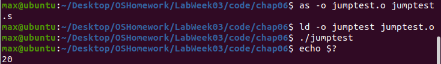

使用jumptest反汇编，反汇编器显示每条指令将使用的内存位置：

实验截图： 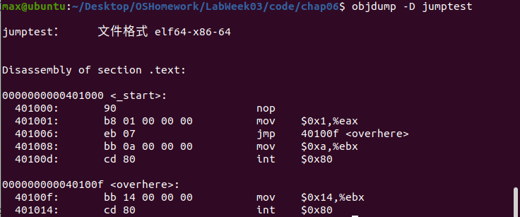

我们使用gdb调试观察指令指针的变化，比较特殊的是在64位操作系统上我们应该使用寄存器rip来获取指令指针，可以看到jmp指令使指令指针跳转到了mov $0x14,%ebx那行：

实验截图： 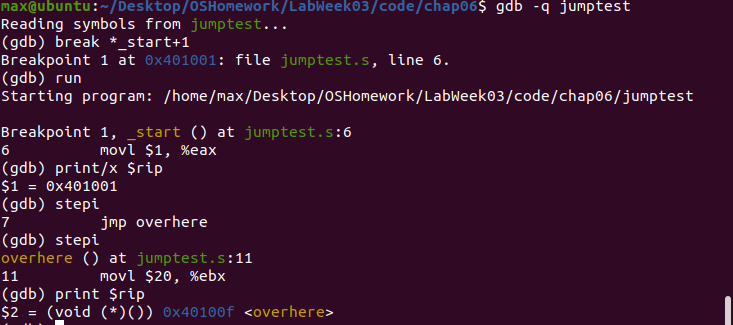

* 调用：调用保存发生跳转的位置，并且他具有在需要的时候返回这个位置的能力。

用函数可以编写划分区域的代码，把不同的功能划分为不同的段落，调用指令分为两部分：

	call address
	#address是引用程序的标签。
	
	ret
	#返回指令
	
当call执行时，它把eip寄存器的值放到了**堆栈**中，然后修改eip寄存器指向被调用的函数地址。当函数开始时，通常把esp寄存器复制到ebp寄存器中，然后使用ebp寄存器值获得call指令之前传递给堆栈的信息，并且为本地数据存储把变量存在堆栈中。

测试call指令 - calltest.s实验测试： 

	as --32 -o calltest.o calltest.s
	ld -m elf_i386 -dynamic-linker /lib/ld-linux.so.2 -o calltest -lc calltest.o
	./calltest

实验截图： 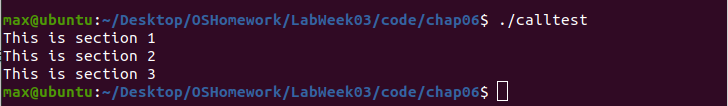

* 中断：中断是处理器停止当前指令路径并切换到不同路径的方式，分为软件中断和硬件中断。

带有0x80的int指令就是把控制转移给Linux系统调用程序。

### 6.3 条件分支：条件分支是否跳转取决与eflags寄存器的状态（进位，溢出，符号，奇偶校验，零）

* 条件跳转指令： 

	#用于无符号数
	ja address #above
	jae address #above or equal
	jb address #below
	jbe address #below or equal
	
	jc address #carry
	jecxz address #ecx is zero
	
	#用于有符号数
	je address #equal
	jg address #greater
	jge address #greater or equal
	jl address#less
	jle address #less or equal
	#...
	
* 比较指令：对操作数进行减法操作，op2-op1，根据结构修改寄存器，与条件跳转指令组合使用。

	cmp operand1, operand2
	

测试cmp指令 - cmptest.s实验测试： 

实验截图： 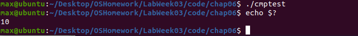

可以看到，由于eax的值大于ebx的，也即ebx-eax小于0,没有跳转到greater去，最终eax寄存器的值还是10。

* 使用标志位：

**零标志位**：如果零标志位被值为1,即两个操作数相等，je和jz指令就会跳转到分支。零标志位可以由cmp设置，也可以通过结果为零的数学指令设置：

	movl $20, %eax
	subl $20, %eax
	jz overthere
	#会跳转
	
**溢出标志位**：当带符号值溢出时，溢出标志位被置为1.

	movb $0x7f, %bl
	add $10, %bl
	jo overthere
	#会跳转	
	
**奇偶校验位**：若结果中1的位数是偶数，则校验位被置为1。

测试奇偶校验位指令 - paritytest.s实验测试：

实验截图： 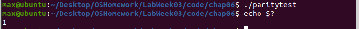

随后改变sub一行：subl $1, %ebx,对应应导致jp跳转到overhere标签，结果为100.

实验截图： 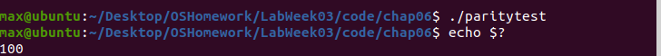

**符号标志**：在带符号数中，最高位用作符号位，负数置1.

测试带符号数 - signtest.s实验测试：

执行源程序的过程报错：

实验截图： 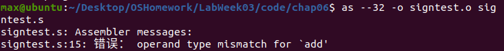

考虑删除add $8, $esp一行，得到正确输出：

实验截图： 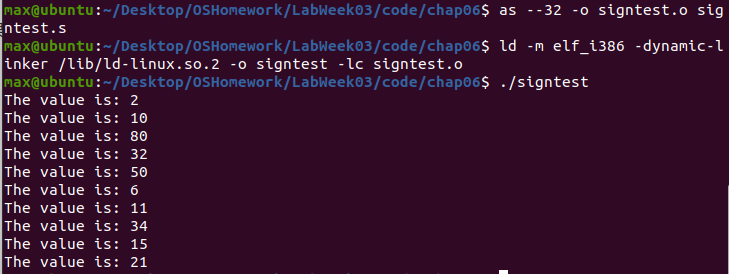

**进位标志**：表示无符号数溢出，inc，dec指令不影响进位标志，而addl会。

	clc #清空进位标志
	cmc #进位标志取反
	stc #置进位标志为1
		
### 6.4 循环

* loop指令：循环直到ecx寄存器为0，loop会自动递减ecx的值。除此之外，LOOPE，LOOPZ LOOPNE LOOPNZ提供了监视零标志位的附加功能。

	loop address
	#loop指令只支持address的8位偏移量，即短跳转。
	

测试循环指令loop - loop.s实验测试：

实验截图： 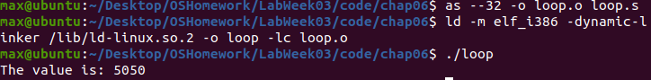
     
求得 1+2+3+...+100 = 5050

* 注意： 当执行loop指令时，它是先将ecx递减1,再判断是否等于0。若ecx = 0,则会出现疯狂地循环。但是我们可以通过jcxz指令规避错误，即如果ecx的值为0,就使用jcxz指令执行条件分支。

优化循环指令测试 - betterloop.s实验测试：

实验截图： 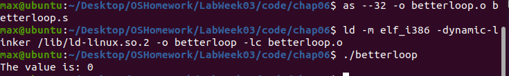
	
### 6.5 模仿高级条件分支：if和for

使用gcc对ifthen.c程序进行汇编，并分析代码：

实验截图： 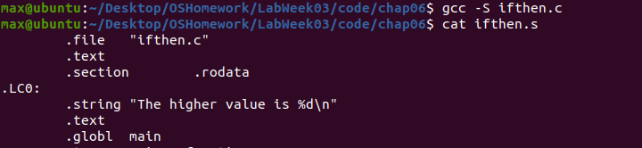

	#if
	if:
		<condition to evaluate>
		jxx else
	<code to implement then startment>
	jmp end
	else:
	<code to implement else startment>
	end:
	
使用gcc对for.c程序进行汇编：

实验截图： 
	
	#for
	for:
		<condition to evaluate for loop counter value>
		jxx forcode
		jmp end
	forcode:
		<for loop code to excute>
		<increment for loop counter>
		jmp for
	end:
	
### 6.6 优化分支指令

分支预测，消除分支（配合cmov/cmpl/...和jxx)，首先编写可预测分支的代码（把最可能采用的代码安排在向前跳转的顺序执行指令中），展开循环。

## 第七章 使用数字

本章学习的是不同的数字格式和使用方法。

### 7.1 数字数据类型

核心的数据类型如下：无符号整数，有符号整数，二进制编码的十进制，打包的二进制编码的十进制，单精度浮点数，双精度浮点数，双精度扩展浮点数。

### 7.2 整数

* 标准整数的长度

字节 8位、字 16位、双字 32位、四字 64位。要记住：**储存在内存中的超过一个字节的整数被储存为小尾数格式，即低字节储存在最低的内存位置，其余字节顺序地存储在它之后。但是，把整数传给寄存器时，需要按照大尾数的格式村出。**而这一转换在处理器中自动处理，我们无需关心转换，但是在调试过程中要留心。

* 带符号整数： IA-32平台使用补码的方式表示带符号整数。

带符号整数测试 - inttest.s实验测试：

实验截图： 

我们可以看到edx的显示结果与我们存入的数值不同，这是由于edx是32位而我们dx寄存器是edx后16位而已，数据在实际存储中是没有问题的。

* 扩展无符号整数

把无符号数整数值转化为位数更大的值时，必须确保所有的高位部分都被设置为零，例如把ax赋值给ebx寄存器：

	movl $0, %ebx
	movw %ax, %ebx
	
Intel提供了**movzx**指令，可以把长度小的无符号整数传给长度大的无符号整数值（寄存器中）。

	movzx source, destination
	

扩展无符号整数测试 - movzxtest.s实验测试：

实验截图： 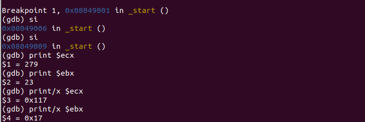

我们可以看到我们使用movzx之将ecx的低字节传给了ebx，所以ebx的值是23而不是279。

* 扩展带符号整数

使用指令**movsx**，高位正数补零，负数补一。

扩展带符号整数测试 - movsxtest.s, movsxtest2.s实验测试：

实验截图： 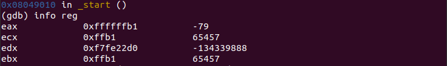

显然通过扩展无符号数的方法扩展带符号负数行不通，如程序运行的ecx的值为65447而不是-79,而使用movsx指令便可得到正确结果，参见eax的值为-79。

对于测试movsxtest2.s，实验表明movsx，movzx都可以实现正数的符号扩展，理由显然，。

实验截图： 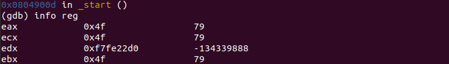

* 在GNU汇编器中定义参数

我们可以在数据段中使用命令定义带符号整数值。命令包括 .int .short .long .quad，.quad为每个值分配八个字节（四字）。

.quad命令测试 - quadtest.s实验测试：

实验截图： 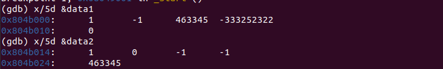

实验截图： 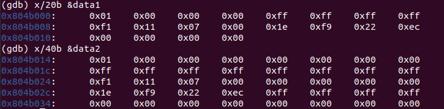

如同截图上显示的，上面两行数据分别是.int data1 .quad data2数组的分别实际存的值，下面两行是数组的实际存储。data1存的值和我们在代码中设定的一样，data2显示不同的缘故是因为我们gdb假设这些数据是双字带符号整数。

实验截图： 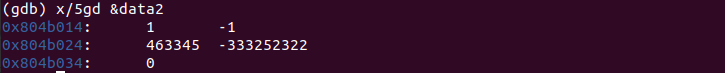

使用如上格式，我们可以正确看到data2里存储的4字整数。

### 7.3 SIMD整数

SIMD指单指令多数据技术，提供了定义整数的其他方式，这些新的整数类型可以同时对一组多个整数执行数学运算操作，可对其执行数学操作，并行地处理各个整数值。

* MMX整数

MMX整数指多媒体整数，提供：64位打包字节整数，64位打包字整数，64位打包双字整数。这里的64位，我们可以将基本数据类型填充到64位寄存器里面，比如8个8位的字节整数，4个16位字节整数等等，打包道MMX寄存器中。

* 传送MMX整数

使用movq指令： source destination可以是64位内存位置，SSE寄存器，MMX寄存器。（不可以同时是内存位置）

	movq source, destination
	

mmx命令测试 - mmxtest.s实验测试：将双字和字节整数加载到mmx寄存器中。

实验截图： 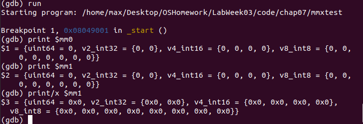

如上图，gdb不知道寄存器的数据v如何解释，所以它会列举出所有的可能。

* SSE整数 

SSE指流化SIMD扩展，提供128位的打包技术。传送指令有：movdqa和movdqu，用于传到XMM寄存器中。对于对准16个字节边界的数据，就是用第一个选项，否则使用第二个。

sse命令测试 - ssetest.s实验测试：将双字和四字整数加载到sse寄存器中。

实验截图： 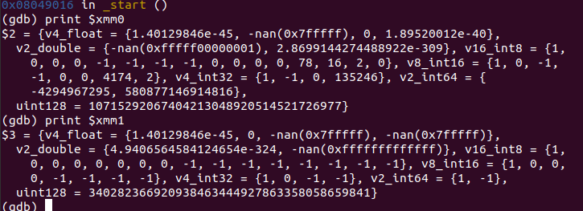

### 7.4 二进制编码的十进制 BCD

* FPU BCD值

FPU寄存器可以用于在PFU内进行BCD数学运算操作，FPU包含8个80位寄存器（ST0～ST7），也可以使用他们保存80位的BCD值，一般情况下最高位表示符号位。值被传入后自动地被转换为扩展双精度浮点数格式。

* 传送BCD值：把80位BCD值传送到FPU堆栈中。

	fbld source
	

fbld命令测试 - bcdtest.s实验测试：把BCD值加载到FPU寄存器以及从FPU寄存器中获取BCD值的基本操作。

实验截图： 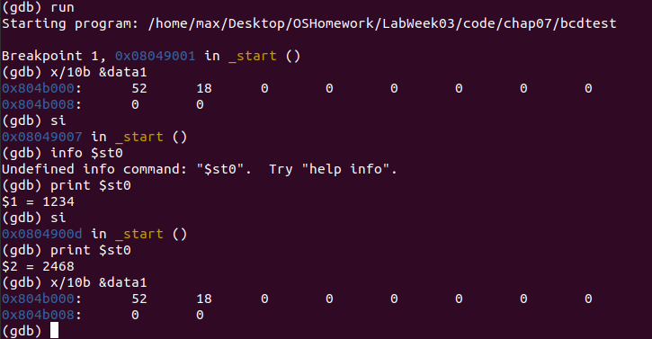

如图，data1定义了一个BCD值1234,fbld指令把这个值加载到FPU寄存器堆栈的顶部（ST0），使用flmul指令把data2（数值2）与ST0相乘，fbstp把结果传送回data1所在的内存位置。

### 7.5 浮点数

* 三种类型的浮点格式： .float 单精度 32位、.double 双精度 64位、扩展双精度 80位

* GNU汇编器提供了单精度和双精度浮点值的命令。

* 传送浮点值 - fld指令：用于把浮点值传入和传送出FPU寄存器。

	fld resource
	#source 可以是 32、64、80位内存位置
	

浮点数使用测试 - floattest.s实验测试：定义和使用浮点数据。

实验截图： 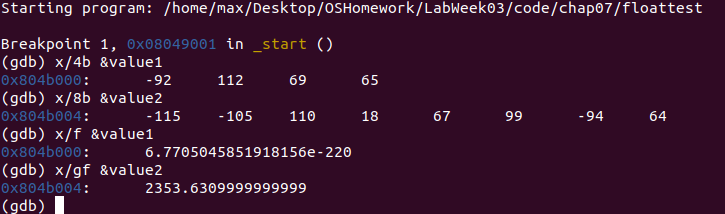

**flds和fldl分别将单精度浮点数和多精度浮点数加载到寄存器堆栈中，fsts fstl指令用于获取fpu寄存器堆栈中顶部的值，并把这个值放到内存里**。

实验截图： 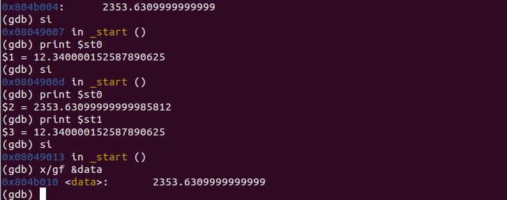

* 使用预置的浮点值：log以2为底，指令的行为是**将值压入寄存器堆栈**。

|instruction|description|
|---|---|
|fld1|1.0|
|fldl2t|log 10|
|fldl2e|log e|
|fldpi|pi|
|fldlg2|lg2|
|fldln2|ln2|
|fldz|+0.0|

浮点数预置值使用测试 - fpuvals.s实验测试：使用浮点数预置值。

实验截图： 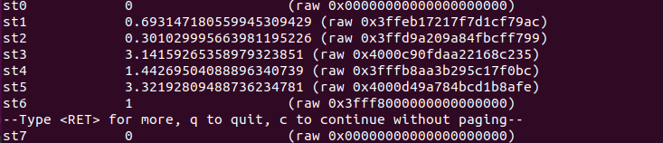

此处需要注意压入堆栈的顺序。

* SSE浮点数据类型：SSE可以打包浮点数

但是这些类型只能在XMM寄存器中使用，并且得在支持SSE或SSE2的处理器上使用，并且有一系列专门的指令。

SSE打包单精度浮点数测试 - ssefloat.s实验测试：使用movuos指令

实验截图： 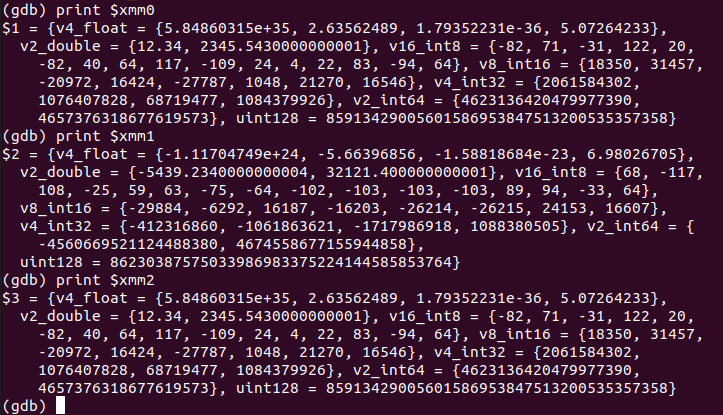

实验截图： 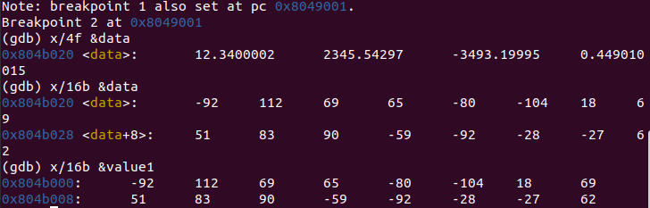

SSE2浮点数测试 - sse2float.s实验测试：使用movupd指令。

实验截图： 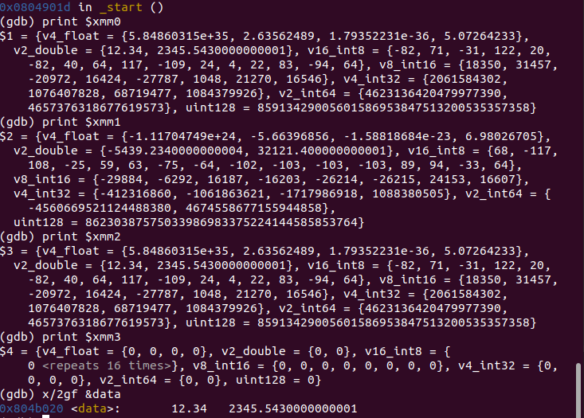

结果与seetest测试类似。

### 7.6 转换

	转换指将一种数据类型转换成另一种类型，有特定指令（转换指令在书的154页，这里一一罗列了）。

数据类型转换测试 - convtest.s实验测试：单精度浮点值，双字整数值的转换。

实验截图： 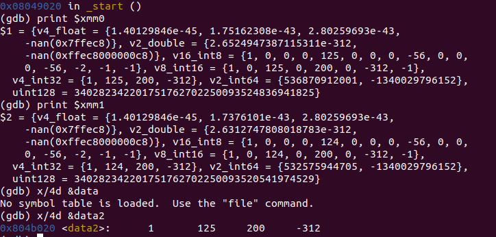

与教材结果一致，浮点数转换成整数并做了舍入处理（124.79->125）。
	
---

# 问题和解决

## 问题1：实验15- floattest.s 输出结果与教材不同

我们通过x命令的f选项查看单精度十进制值，gf查看双精度十进制这里我们发现我们的value1输出与教材上的输出不同。

在gdb调试过程中，我们输入 x/f &value1，输出是6.7705045851918156e-220，而教材输出是12.3400002，但我们的x/gf &value2与教材结果相同。

我们持续观察与value1有关的寄存器，我们可以发现他们的值就是12.340002,也就是说其在内存/寄存器中的内容是正确的，只是由于某种原因导致gdb显示的数据不正常，即x/f的问题。

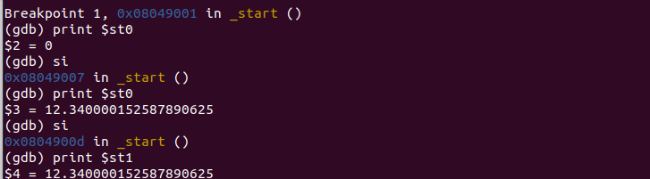
	
## 问题2：实验19源文件编译报错

**解决方案**：参考LabWeek02实验4,删去源文件的第八行：

	data:
	#这行是非法的代码。

修改代码后，编译成功，得到对应实验结果。

**编译成功**： 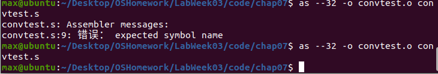

--- 
