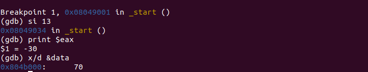

# Lab Week04 - 验证实验 Blum’s Book: Sample programs in Chapter 08, 10 

**郑有为 19335286**

如果图片或链接显示异常，请访问 [OSHomework-LabWeek04.md](https://github.com/WondrousWisdomcard/OSHomework/blob/main/LabWeek04/LabWeek04.md) 。我把代码和截图都放在了仓库 [OSHomework](https://github.com/WondrousWisdomcard/OSHomework)。

[toc]

# 实验验证

## 实验验证内容索引

[实验1. add测试 - addtest1.s](#ex1)

[实验2. 带符号数加法测试 - addtest2.s](#ex2)

[实验3. 测试进位加法 - addtest3.s](#ex3)

[实验4. 测试溢出加法 - addtest4.s](#ex4)

[实验5. 四字加法 - adctest.s](#ex5)

[实验6. 减法测试 - subtest1.s](#ex6)

[实验7. 减法进位 - sybtest2.s](#ex7)

[实验8. 减法溢出 - subtest3.s](#ex8)

[实验9. 四字减法 - sbbtest.s](#ex9)

[实验10. 乘法测试 - multest.s](#ex10)

[实验11. 乘法溢出检查 - imultest.s](#ex11)

[实验12. 乘法溢出检查 - imultest2.s](#ex12)

[实验13. 除法测试 - divtest.s](#ex13)

[实验14. 左移测试 - saltest.s](#ex14)

[实验15. 不打包BCD计算测试 - aaatest.s](#ex15)

[实验16. 打包BCD计算测试 - dastest.s](#ex16)

[实验17. TEST指令测试 - cpuidtest.s](#ex17)

[实验18. 字符串传送测试 - movstest1.s](#ex18)

[实验19. 字符串传送测试 - movstest2.s](#ex19)

[实验20. 循环字符串传送测试 - movstest3.s](#ex20)

[实验21. REP循环传送测试 - reptest1.s](#ex21)

[实验22. REP块传送 - reptest2.s](#ex22)

[实验23. 灵活REP块传送测试 - reptest3.s](#ex23)

[实验24. 反向块传送测试 - reptest4.s](#ex24)

[实验25. 字符串拷贝测试 - stotest1.s](#ex25)

[实验26. 字符串小写转大写 - convert.s](#ex26)

[实验27. 比较字符串（相等）测试 - cmpstest.s](#ex27)

[实验28. 比较字符串测试 - cmpstest2.s](#ex28)

[实验29. 比较字符串（大小）测试 - cmpstest3.s](#ex29)

[实验30. 搜索指定字符测试 - scastest1.s](#ex30)

[实验31. 搜索指定字符串（误导向）测试 - scastest2.s](#ex31)

[实验32. 计算字符串长度测试 - strtest.s](#ex32)

# 技术日志

## 第八章 基本数学功能

### 8.1 整数运算

#### 加法

1. ADD指令：其中source可以是立即数、内存位置、寄存器，destination可以是寄存器或者内存位置中储存的值，但二者不能同时是内存位置，结果存放在第二个操作数destination中。**必须通过助记符来指定操作数长度（b,w,l)**。

	add source, destination
	

add测试 - addtest1.s实验测试：测试指令addb,addw,addl

实验截图： 

考虑程序本身，程序的结果是 %al = 20 + 10 = 30, %bx = 0 + 30, %edx = 100 + 100 = 200, %eax = 40 + 30 = 70, data = 40 + 70 = 110，通过gdb调试查看其结果，与理论上一致。
	

add测试 - addtest2.s实验测试：测试带符号数加法

实验截图： 

考虑程序本身，程序的结果是 %eax = -10 + -40 + 80 + -200 = -170, data = -40 + -170 + 210 = 0，通过gdb调试查看其结果，与理论上一致。

2. 检测进位与溢出：通过eflags寄存器的进位标志和溢出标志。

add测试 - addtest3.s实验测试：测试进位加法

实验截图： 

考虑程序本身，%bl发生了进位，进位标志被设置为1,通过jc指令跳转到了over，最后程序返回0，表示正确检测到进位。

改动寄存器%al的值，可以看到不再发生进位,最后程序返回200。

实验截图： 

**对于无符号整数，如果不能确定输入值的长度，在执行加法时，总应该检查进位标志（jc）。**（对于带符号数应该检查溢出标志）

add测试 - addtest4.s实验测试：测试溢出加法

实验截图： 

在上面这种情况下，计算结果发生了溢出，于是结果输出0，考虑修改数据的值，可以看到不再发生溢出，并输出了正确结果。

实验截图： 

3. ADC指令

使用adc指令，实现两个无符号整数或者带符号整数值的加法，并且把前一个add指令产生的进位标志值包含在其中，实现了多组字节的加法操作。

adc测试 - adctest.s实验测试：四字加法

实验截图： 

其中，printf使用了%qd参数来显示64位整数值，并pushl两次将四字入栈，还要注意入栈顺序是先高位后低位，因为小端存储的缘故。

#### 减法 

1. SUB指令：与ADD类似，从destination的值中减去source的值并存在destination中。

sub测试 - subtest1.s实验测试：减法

实验截图： 

考虑程序本身，data = 40 - -30 = 70，得到正确结果。

2. 减法操作中的进位和溢出：对于无符号整数，例如 2 - 5 会发出进位;对于有符号整数，负值减去一个很大的正值会发生溢出。

sub测试 - subtest2.s实验测试：减法进位

实验截图： 

sub测试 - subtest3.s实验测试：减法溢出

实验截图： 

我们可以看到，负数减去很大的正数会发生溢出，而负数减去负数则不会。

3. SBB指令：原理与ADD相同，借位操作。

sbb测试 - sbbtest.s实验测试：四字减法

实验截图： 

可以看到得到了正确结果。

#### 递增和递减

使用dec（递减）和inc（递增）指令，其结果不会影响任何标志位。

#### 乘法

1. 使用mul进行无符号乘法：目标操作数是隐藏的，目标位置总是使用eax寄存器的某种形式，如al, ax, eax;于此同时，mul指令的目标位置必须是操作数长度的两倍，结果存放形式： ax（16位），dx:ax （32位），edx:eax（64位）。

	mul source

mul测试 - multest.s实验测试：乘法

实验截图： 

可以看到得到了正确结果52245741648，并且保存在了result中。

2. 使用IMUL进行带符号整数乘法，需要小心结果不使用目标寄存器的最高有效位作为符号位，有三种指令格式：

	imul source
	imul source, destination #destination必须是寄存器
	imul multiplier, source, destination #multipler是一个立即数，destination = multipler * source

imul测试 - imultest.s实验测试：乘法

实验截图： 

可以看到ecx = 10 * -35 = -350, eax = 2 * 400 = 800，实验输出与理论结果相符。

3. 检查溢出：总是需要检查结果中的溢出，可以通过jo指令检查溢出。 

imul测试 - imultest2.s实验测试：溢出检查乘法

实验截图： 

可以看由于结果发生了溢出，jo指令跳转到了over，最终带有结果代码1。

#### 除法：成生商和余数两部分。

1. 无符号除法：DIV，其中divisor是隐含的被除数要除以的值。在计算之前，被除数必须先被保存到AX、DX:AX、EDX:EAX、寄存器对中。

	div divisor

下表是商和余数被储存的地方：****在除法操作完成时，会丢失被除数，如果需要需提前保存到别的地方。

|被除数|被除数长度|商|余数|
|AX|16|AL|AH|
|DX:AX|32|AX|DX|
|EDX:EAX|64|EAX|EDX|

div测试 - divtest.s实验测试：除法

实验截图： 

由程序可以看到，程序先将64字的四字整数加载到edx:eax中，计算结果分别存到内存位置中。

2. 带符号除法：IDIV，格式与div相同，需要记住的是被除数必须是除数长达的两倍，计算是需要适当第扩展数据长度。

3. 检查除法错误：例如除数为零，系统会产生中断。

### 8.2 移位指令

1. 移位乘法：SAL，SHL，前者是算数左移，后者是逻辑左移（实际上对于左移他们的操作是一样的）。同样需要助记符声明操作数长度。**会影响进位标志**。

	sal destination
	sal %cl destination #左移指定cl位
	sal shifter, destination #左移指定立即数位。

sal测试 - saltest.s实验测试：左移

实验截图： 

可以看到第三行sall是的ebx从10变成了20，第五行使ebx左移两位，从20变成了80,第六行又左移两位，ebx的值变成了320。

2. 移位除法：SHR，SAR，右移，前者是逻辑右移后者是算术右移。对于算术右移，负数补1,正数补0，**进位标志被设置成移出的位**。

3. 循环移位：ROL-向左循环移位，ROR-向右循环移位，RCL-向左循环移位，包含进位标志，RCR-向右循环移位，包含进位标志。

### 8.3 BCD码运算

**不打包一个数字1个字节，打包一个数字半个字节**

1. 不打包BCD的运算

	AAA, AAS, AAM, AAD #分别调整加减乘除法操作的结果，一般与无符号整数计算指令组合使用。**这些指令有隐藏的操作数，AL寄存器，AAA等指令都会假设操作结果放在AL里。**

aaa测试 - aaatest.s实验测试：不打包BCD运算

实验截图： 

可以看到程序实现了将多为BCD码相加得到结果81058 = 28125 + 52933。

2. 打包BCD的运算

	DAA，DAS #调整ADD，ADC/SUB，SBB指令的结果。
	
例子：打包BCD值52933按照小尾数格式0x332905加载到内存中，并减去BCD值28125（0x258102)。打包格式的结果是0x084802。

das测试 - dastest.s实验测试：打包BCD运算

实验截图： 

可以看到程序在第一个减法操作后，eax的值为14,执行DAS调整后，eax的值变成了8，他表示结果的第一个十进制位。

### 8.4 逻辑操作

1. 布尔运算：and, or, not, xor，计算结果保留在第二个操作数（destination）里。

2. 位测试：检查某确定值内的一位是否为1,常用与检查eflags寄存器。

**test指令**,执行按位与操作，并且相应地设置符号，零，奇偶校验标志，并且不修改目标值。

test测试 - cpuidtest.s实验测试：使用test指令

实验截图： 

为测试是否成功设置了ID标志，首先拷贝eflags寄存器到edx中，然后设置edx的id位为1（借助立即数movl），最后使用test指令查看ID标志位是否改变了。

## 第十章 处理字符串

### 10.1 传送字符串

1. MOVS指令 - 为了向程序员提供把字符串从一个位置传送到另一个位置的简单途径。

	movsb,movsw,movsl #传送单个字节/字/双字
	
MOVS指令使用隐含的源和目的操作数：**源操作数是ESI寄存器**，指向源字符串的内存位置，**目标操作数是EDI寄存器**，指向字符串要被复制到的内存地址。

加载ESI，EDI的值的方式：**间接寻址-movl $output, %edi;使用LEA指令-leal output, %edi。**

movs测试 - movstest1.s实验测试：字符串传送

实验截图： 

可以看到在movs助记符不同的情况下，movs进来的字符串长度是不一样的。

在每次执行MOVS指令时，数据传送后，ESI和EDI寄存器的内容会自动改变，而递增还是递减取决于EFLAGS寄存器中的DF标志：DF为零递增，否则递减。

我们可以使用CLD和STD指令来改变DF标志的值，其中前者清零后者置1。

movs测试 - movstest2.s实验测试：字符串传送

实验截图： 

ESI和EDI寄存器都指向了相应内存位置的尾部，使用STD命令让寄存器递减。即字符串从后往前读入。

movs测试 - movstest3.s实验测试：循环字符串传送

实验截图： 

在整个动态过程是一个循环中，字符串是从后面开始一个一个字节传输的。

2. REP**前缀**：用于按照特定次数重复执行字符串指令，由ECX寄存器内部控制（循环直至ecx寄存器为0）。

	* 逐字节传送字符串：MOVB与REP一起使用

		rep movsb

	

	rep测试 - reptest1.s实验测试：rep循环传送

	实验截图： 

	可以看到rep行自动执行了23次，每次传送一字节数据。

	* 逐块地传送字符串：通过使用movsw，movsl，一次传送多字节，其中ecx应包含循环次数（随movs助记符的不同而不同）
	
	

	rep测试 - reptest2.s实验测试：rep块传送

	实验截图： 

	我们需要先把循环次数传入ecx寄存器，在程序中我们每次传送四个字节，传送共六次，但需要注意可能会传入错误数据（在数据不能被四字节整除的情况下。）
	
	* 传送大型字符串：尽可能多地使用movsl，显然效率更高

	

	rep测试 - reptest3.s实验测试：灵活的rep块传送

	实验截图： 
	
	可以看到在传输最后两个字符时用的不是movsl而是movsb，来将整个字符串传输到了目的内存，避免了出现如同reptest2.s实验的错误结果。
	
	* 按照相反的方向传送字符串：设置df标志即可。

	
	
	rep测试 - reptest4.s实验测试：反向块传送

	实验截图： 
	
	我们通过实验验证也发现反向传送字符串时，在执行完所有循环之前无法通过gdb看到output的数据，虽然在内存中是实际一步步完成传送的。

	* 其他rep指令：repe 等于时重复，repne 不等时重复，repnz 等于时0重复， repz 为0时重复。
	
### 10.2 储存和加载字符串

1. LODS指令：**用于把内存中的字符串传送到EAX寄存器中，以ESI寄存器作为隐藏参数，包含字符串所在地址，数据加载完成后，LODS按照DF寄存器递增或者递减，**三种格式：

	lodsb # 把一个字节加载到AL寄存器
	lodsw # 把两个字节加载到AX寄存器
	lodsl # 把四个字节加载到EAX寄存器
	
2. STOS指令：把存在EAX寄存器中的字符串值存放到另一个内存位置，格式和LODS类似，有STOSB，STOSW，STOSL，STOS可以与REP指令一同使用。

stos测试 - stotest1.s实验测试：把0x20拷贝到256字节的缓冲区

实验截图： 

字符串函数 - convert.s实验测试：字符串小写转大写

实验截图： 

### 10.3 比较字符串

1. CMPS指令：用于比较字符串，有CMPSB，CMPSW，CMPSL。隐含的源和目标操作数在ESI，EDI，寄存器增减方式取决与DF寄存器。**CMPS指令从源字符串中减去目标字符串，并是当地设置EFLAGS寄存器的进位、符号等**，对于不同结果我们再利用一般的条件分支来实现。

stos测试 - stotest1.s实验测试：把0x20拷贝到256字节的缓冲区

实验截图： 

字符串函数 - convert.s实验测试：字符串小写转大写

实验截图： 

### 10.3 比较字符串

1. CMPS指令：用于比较字符串，有CMPSB，CMPSW，CMPSL。隐含的源和目标操作数在ESI，EDI，寄存器增减方式取决与DF寄存器。**CMPS指令从源字符串中减去目标字符串，并是当地设置EFLAGS寄存器的进位、符号等**，对于不同结果我们再利用一般的条件分支来实现。

cmps测试 - cmpstest.s实验测试：比较字符串

实验截图： 

由于字符串二者内容相等，由程序结果返回0。

2.CMPS与REP一起使用：多次比较，但REP不在两个重复的过程之间检查标志的状态，而我们可以使用repe等来满足需求，满足条件后REP就会停止重复。

cmps测试 - cmpstest2.s实验测试：比较字符串

实验截图： 

由于两行字符串的内容是不一致的（instruction和Instruction），导致repe会提前终止并不进入equal分支，最终输出11，当前ecx的值。

3. 字符串不等：根据字典序进行比较。

cmps测试 - strcomp.s实验测试：比较字符串大小

实验截图： 

在程序中，现将长度值的较小值传入ECX寄存器，如果两个字符串在一直相同，还需要比较二者的长度，由结果可以看到string1("test")小于string2("test1")。

### 10.4 扫描字符串

1. SCAS指令：用于扫描字符串搜索一个或者多个字符，SCASB、SCASW、SCASL。使用EDI为隐含的目标操作数，包含带扫描的字符串地址。比较时EDI改动标志寄存器。**配合REPE、REPNE使用，前者查找不匹配搜索的字符，后者查找匹配的字符**

对于使用REPNE指令，当找到字符时停止扫描，此时EDI寄存器包含紧跟在定位到字符后面的内存地址。ECX包含搜索字符距离字符串末尾的距离，为了得到字符串开头的位置，要从这个值减去字符串长度并反转符号。

scas测试 - scastest1.s实验测试：搜索指定字符

实验截图： 

程序思路：**把要搜索的字符串存在AL寄存器中，然后把其长度存放到ECX寄存器中,使用REPNE SCASB扫描字符串。**根据试验结果，我们在字符串的第16个位置找到了'-'。

2. 搜索多个字符

scas测试 - scastest2.s实验测试：搜索指定字符串（误导向）

实验截图： 

实验程序尝试在字符串中寻找字符序列'test'。先将'test'整个字符串存入到EAX寄存器中，然后使用SCASL一次检查是四个字节。ECX寄存器没有设置字符串的长度，而是设置为REPNE遍历整个字符串所需迭代次数。但此种方法是有错误的，因为每次检查的都是固定4字节区间，无法鉴定跨字节的情况。

3. 计算字符串的长度：SCAS指令可以确定零结尾的字符串的长度。

scas测试 - strtest.s实验测试：计算字符串长度

实验截图： 

程序的本质就是一直查找ascii的0,找到后即可通过当前ecx寄存器的值得到字符串长度。

# 问题和解决

无
