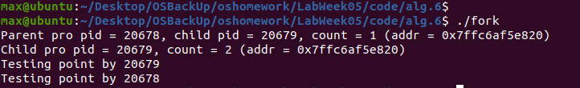
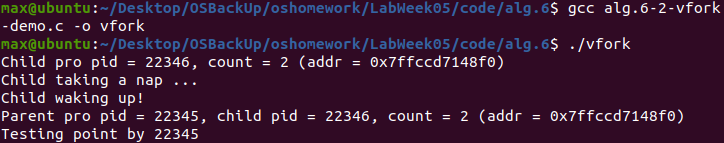
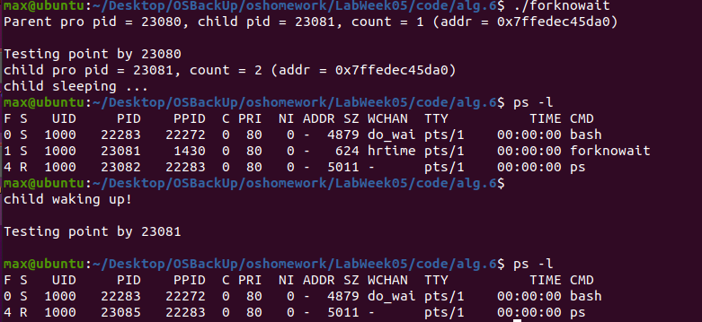
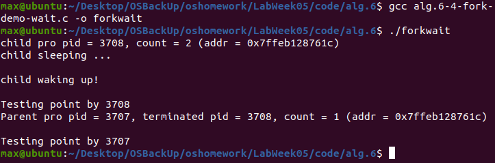
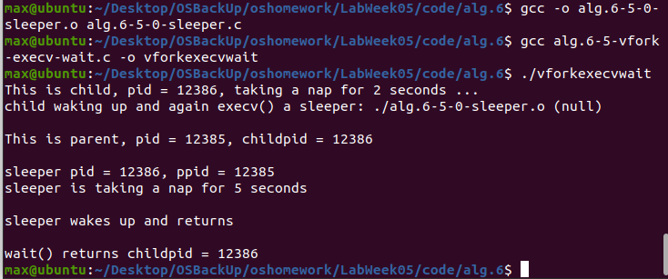
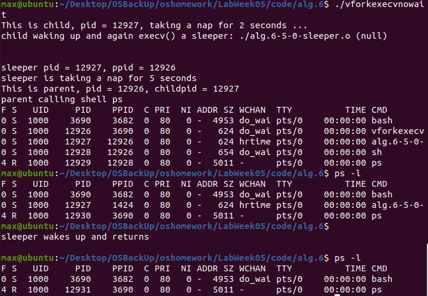
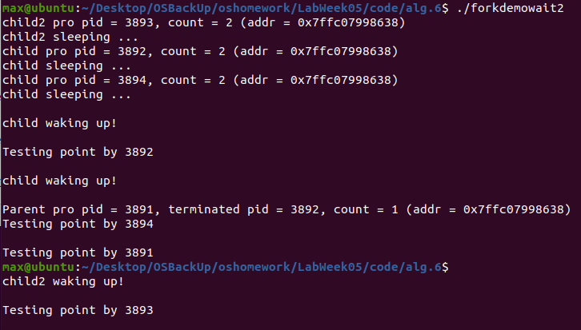
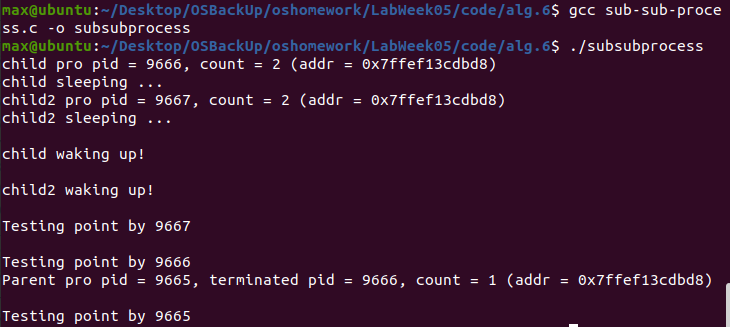

# Lab Week05 - Lecture06-07 进程的创建和终止 

**郑有为 19335286**

如果图片或链接显示异常，请访问 [OSHomework-LabWeek05.md(Gitee)](https://gitee.com/WondrousWisdomcard/oshomework/blob/master/LabWeek05/LabWeek05.md)。我把代码和截图都放在了仓库 [OSHomework(Gitee)](https://gitee.com/WondrousWisdomcard/oshomework)。

# 目录

1、实验验证
2、程序修改和测试

[toc]

# 实验验证

## 实验1 - fork-demo.c

### 实验原理

该实验测试了fork()函数，下面是关于fork()函数的理解：

1. 进程可以看做程序的一次执行过程。在linux下，每个进程有**唯一的PID标识进程**。PID是一个从1到32768的正整数，其中1一般是特殊进程init，其它进程从2开始依次编号。当用完32768后，从2重新开始。
    
2. 进程在linux中呈树状结构，init为根节点，其它进程均有父进程，某进程的父进程就是启动这个进程的进程，这个进程叫做父进程的子进程。
    
3. fork的作用是**复制一个与当前进程一样的进程**。新进程的所有数据（变量、环境变量、程序计数器等）数值都和原进程一致，但是是一个全新的进程，并作为原进程的子进程。

4. fork()的返回值：fork仅仅被调用一次，却能够返回两次（父进程和子进程），它可能有三种不同的返回值：

    1）在父进程中，fork返回新创建子进程的进程ID；
    2）在子进程中，fork返回0；
    3）如果出现错误，fork返回一个负值；

### 细节解释

进程的PID的数据类型为**pid_t**,包含在sys/types.h中。在程序中，我们在父进程中调用fork()生成子进程，在父进程中返回生成的子进程的PID给childpid，而在子进程中返回0给childpid以次来区分这两个进程。接下来两个进程分别执行下面代码段：

	if (childpid == 0) { /* This is child pro */
		count++;
		printf("Child pro pid = %d, count = %d (addr = %p)\n", getpid(), count, &count); 
	}
	else { /* This is parent pro */
		printf("Parent pro pid = %d, child pid = %d, count = %d (addr = %p)\n", getpid(), childpid, count, &count);
		sleep(5);
		wait(0); /* waiting for all children terminated */
	}

对于子进程，由于其childpid为0,执行if紧接的代码块，而父进程执行else紧接的代码块。子进程中count加一，而父进程休眠5秒，由于两个进程没有在**数据上不会相互影响**，父进程的count没有加一，最后由于父亲进程休眠5秒，他会晚于子进程结束。

* 对于wait()函数，函数的参数可以是PID或者0，意思是该进程等待所有子进程（参数为0）结束后才结束，或等待特定子进程（参数为PID）结束后才结束。

### 系统调用过程与结果

从实验截图中可以看到，父亲进程的PID为20678，子进程的PID为20679，并且父进程的count为1,而子进程的count为2.最后父进程于子进程后结束（显示Testing point by xx），与原理分析结果想符合。

## 实验2 - vfork-demo.c

### 实验原理

vfork()函数和fork()函数的返回值相同，并且一样都是在已有的进程中创建一个新的进程，但它们创建的子进程是有区别的。

二者的差异如下：

1. fork()： 父子进程的执行次序不确定。
   vfork()：**保证子进程先运行**,在子进程结束前父进程挂起，在它调用exec（进程替换）或exit（退出进程）之后父进程才可能被调度运行。

2. fork()： **子进程拷贝父进程的地址空间**，子进程是父进程的一个复制品。
   vfork()：**子进程共享父进程的地址空间，此时子进程和父进程的PID是一样的**（在调用 exec（进程替换） 或 exit（退出进程） 之前与父进程数据是共享的）

### 细节解释

* 整个程序的运行流程如下：在父进程调用vfork后，子进程生成并与父进程共享数据和地址空间，此时父进程被挂起，子进程执行count加一操作，返回进程信息，并调用sleep()函数休眠10秒，此时父进程依旧被挂起。直至10秒后，子进程休眠结束，调用\_exit()函数结束进程。子进程结束后，父进程开始返回父进程信息，最后返回Testing Point信息（子进程不会输出此信息，因为这条printf代码在\_exit()之后，子进程早已结束），结束程序。

* 结束子进程是使用函数exit或者_exit，而不是return。原因如下：return对应的是函数的返回，在本程序中若是return则代表main函数的结束，此操作会清理栈，造成Stack Smashing;而exit仅代表终止该进程，不会影响到其父进程的执行。

### 系统调用过程与结果

从实验截图中可以看到，父亲进程的PID为22345，子进程的PID为22346，并且父进程的count和子进程的count都为2，并且二者count的地址(0x7ffccd7148f0)都是相同的（这是由于两个进程共享内存的原因）。

父进程等待子进程运行结束后才开始输出进程信息，且最后只有父进程显示Testing point by xx（因为子进程在执行该行代码时进程已经终止，与原理分析结果想符合。

## 实验3 - fork-demo-nowait.c

### 实验原理

* 实验3程序与实验1程序唯一的差别就是父进程有无wait(0)。在实验1中，父进程会执行wait(0)，等待子进程结束后再结束父进程，而实验3中父进程不会执行wait(0)等待子进程而提前结束，导致孤儿进程的产生。

* 孤儿进程：父进程运行结束，但子进程还在运行（未运行结束）的子进程就称为孤儿进程（Orphan Process）。孤儿进程最终会被 init 进程所收养，并由 init 进程对它们完成状态收集工作。

* 僵尸进程：进程已运行结束，但进程的占用的资源未被回收，这样的进程称为僵尸进程。在每个进程退出的时候，内核释放该进程所有的资源、包括打开的文件、占用的内存等；但是仍然为其保留一定的信息，这些信息主要主要指进程控制块的信息（包括进程号、退出状态、运行时间等），这部分信息即僵尸进程未被回收的资源。

* 守护进程：守护进程（Daemon Process），也就是通常说的 Daemon 进程（精灵进程），是 Linux 中的后台服务进程。它是一个生存期较长的进程，通常独立于控制终端并且周期性地执行某种任务或等待处理某些发生的事件。

### 系统调用过程与结果

* 根据实验截图可以看到：父进程与子进程并行运行，父进程输出进程信息，后便结束进程；与此同时子进程输出进程信息，并开始休眠10秒，在此期间父进程终止，使得子进程成为孤儿进程。

* 我们通过ps -l指令查看当前进程信息，进程信息共有三条：第一条是终端进程（PID为22283），第二条是子进程（孤儿进程），此时它已经被PID为1430的守护进程捕捉，并成为1430进程的子进程，第三条是ps命令的进程，它的父进程是终端进程（PID为22283）。

* 最后，即便原来的父进程结束，子进程也在后台继续运行，直到子进程结束休眠后，返回子进程信息在终端上。此时终端的光标会显示异常，但输入任意符号即可恢复正常。

## 实验4 - fork-demo-wait.c

### 实验原理

* 实验4在实验3的基础上加入了wait(0)函数（父进程）并测试该函数的返回值。

* wait(0)函数会使父进程等待所有的子进程结束后才结束父进程，并返回等待结束的子进程的PID，wait也可以加入PID参数以指定父进程所等待的特定子进程。

### 系统调用过程与结果

* 首先是子进程输出进程信息并开始休眠5秒，父进程由于有wait(0)函数，必须等待子进程结束后才能结束，故5秒后，在子进程休眠结束后，并且返回“Testing Point by xx”后（子进程彻底结束后），父进程才执行wait(0)以下的部分：显示进程信息并且返回“Testing Point by xx”。

## 实验5 - alg.6-5-vfork-execv-wait.c

根据程序，首先需要将sleeper.c编译成是了sleeper.o,再编译vfork-execv-wait.c，否则会出现stack smashing的错误。

	gcc -o alg.6-5-0-sleeper.o alg.6-5-0-sleeper.c
	gcc alg.6-5-vfork-execv-wait.c -o vforkexecvwait

### 实验原理

1. sleeper程序:执行一个休眠若干秒的进程。

2. vfork-execv-wait程序：使用vfork创建一个子进程，在休眠两秒后，然后将子进程转移给sleeper程序。
 
3. execv()函数：装入并运行其它程序的函数

exec函数族共有6种不同形式的函数。这6个函数可以划分为两组：

(1)execl系列: execl、execle和execlp

(2)execv系列: execv、execve和execvp

这里的l是list(列表)的意思，表示execl系列函数需要将每个命令行参数作为函数的参数进行传递；而v是vector(矢量)的意思，表示execv系列函数将所有函数包装到一个矢量数组中传递即可。

	int execv(const char * path，char * const argv[]);
	//path：要执行的程序路径。可以是绝对路径或者是相对路径。在execv、execve、execl和execle这4个函数中，使用带路径名的文件名作为参数。
	//argv：命令行参数的矢量数组。
	//返回值：-1表明调用exec失败，无返回表明调用成功

**当进程调用execv时，该进程的用户空间代码和数据完全被新程序替换，从新程序的启动例程开始执行。调用execv并不创建新进程，所以调用execv前后该进程的PID并未改变。**

将当前进程的.text、.data替换为所要加载的程序的.text、.data，然后让进程从新的.text第一条指令开始执行，不改变PID，**换核不换壳**。

### 细节解释

1. 解释下面一段代码：前两行令带操作文件的文件名为"./alg.6-5-0-sleeper.o"；第三行stat数据类型表示文件类型，并通过stat函数获取文件类型：stat(filename, &buf)，创建失败返回-1。

		char filename[80];
		strcpy(filename, "./alg.6-5-0-sleeper.o");
		struct stat buf;
		if(stat(filename, &buf) == -1) {
		perror("\nsleeper stat()");
		_exit(0);
		}
		char *argv1[] = {filename, argv[1], NULL};
		//指定程序参数列表：文件名和休眠时长，在命令行运行文件时，可指定休眠市场
		//方法如下：./vforkexecvwait 8 （休眠8秒）
		printf("child waking up and again execv() a sleeper: %s %s\n\n", argv1[0], argv1[1]); 
	
### 系统调用过程与结果

父进程首先通过vfork创建一个子进程，这个子进程没有申请新的空间并拷贝数据，所以生成速度比使用fork来的快。子进程首先休眠2s，随后调用execv，启动新进程sleeper，并把PID让给它。sleeper进程执行若干秒休眠操作后结束进程，并打印sleeper程序信息。

父进程一直wait这个PID与原子进程相同的sleeper进程，直至sleeper结束，父进程返回信息并结束。

从程序结果可以看到，原子进程和sleeper子进程都有相同的PID：12386,他们的父进程PID也一致，都是12385。

## 实验6 - alg.6-6-vfork-execv-nowait.c

### 实验原理

这个程序和实验5的程序的差别在与父进程最后没有wait，而只是休眠了一秒，并且在子进程中调用了系统函数，执行ps -l显示当前进程状态。

### 细节解释

父进程中调用了system("ps -l")，这是一个系统调用，在这里可理解成有开了一个进程，进程内容为输出当前的进程状态表。

进程状态表解释了当前的子进程及他们父进程的PID等其他信息。

部分STAT状态位常见的状态字符：

	D 无法中断的休眠状态（通常 IO 的进程）
	R 正在运行可中在队列中可过行的；
	S 处于休眠状态；
	T 停止或被追踪；
	Z 僵尸进程；

### 系统调用过程与结果

在父进程不wait的情况下，sleeper还没有结束，父进程就结束了。sleeper经历了一个从正常进程变成孤儿进程，变成僵尸进程到最后被守护程序收回的过程，我们通过截图中三个阶段的进程状态表可以看出来。

* 第一个进程状态表信息：

	我们可以看到bash进程的PID为3690,创建的程序vforkexecvnowait的PID为12926,其父进程为bash终端进程。程序vforkexecvnowait创建了子进程sleeper，sleeper进程号为12927，与此同时父进程还创建了sh子进程（PID = 12928），sh应该之系统调用，即system函数，system函数调用ps -l命令，创造了这个在终端上显示进程状态的子进程（PID = 12929）。

* 在程序父进程终止但sleeper还在休眠的之个时间，我们在终端请求显示第二个程序状态表，其信息包括：

	sleeper进程，他的父进程变成了PID为1424的进程（守护进程），该守护进程负责将回收此sleeper僵尸进程。
	ps进程即执行ps -l产生的进程，其PPID为终端bash（PID = 3690）。
	
* 我们注意到在试验结果中守护进程（PID = 1424）和CMD进程（PID = 3690）的PID与老师课件的不同（PID = 1422 ， 1890），这可能是由于Linux版本不同的原因。

# 程序修改和测试

## 一、 创建两个子进程，并且一个休眠5秒，一个休眠10秒，检查代码正确性并观察输出。

我们先后调用了在主函数内调用了两次fork()，试图创建父进程的两个子进程child和child2，观察结果。

* 程序参考：two-sub-process.c

		childpid = fork(); /* child duplicates parent’s address space */
		if (childpid < 0) {
			perror("fork()");
			return EXIT_FAILURE;
		}

		childpid2 = fork(); /* child duplicates parent’s address space */
		if (childpid2 < 0) {
			perror("fork()");
			return EXIT_FAILURE;
		}
		else if (childpid == 0) { /* This is child pro */
			count++;
			printf("child pro pid = %d, count = %d (addr = %p)\n", getpid(), count, &count); 
			printf("child sleeping ...\n");
			sleep(5); /* parent wait() during this period */
			printf("\nchild waking up!\n");
		}
		else if (childpid2 == 0) { /* This is child pro */
			count++;
			printf("child2 pro pid = %d, count = %d (addr = %p)\n", getpid(), count, &count); 
			printf("child2 sleeping ...\n");
			sleep(10); /* parent wait() during this period */
			printf("\nchild2 waking up!\n");
		}
		else { /* This is parent pro */
			terminatedid = wait(0);
			printf("Parent pro pid = %d, terminated pid = %d, count = %d (addr = %p)\n", getpid(), terminatedid, count, &count);
		}
        
* 以为输出：最开始，我以为输出是父进程生成两个子进程，然后两个子进程依次结束后，父进程结束，程序正常结束。

* 实际输出：但实际上程序运行结果不是那样的，程序实际上生成了共四个进程，并且还出现了一个孤儿进程，导致终端显示异常。

* 分析原因：

	1、 生成四个进程的原因是，程序运行到childpid = fork();后产生了两个进程（父进程和子进程1），随后这两个进程都分别执行了childpid2 = fork()，分别产生了两个子进程，因此共产生了四个进程。

	2、 四个进程有如下关系：程序最开始的父进程有两个子进程，分别是child和child2，随后child生成了一个子进程child2.

	3、 但从试验结果我们却发现，孙子进程声称自己为child而不是child2，这需要考虑程序里if ... else if ... else结构，孙子进程产生后确实把childpid2赋值为0，**但是由于孙子进程复制了他的父进程的所有数据v，其中包括childpid = 0,因此孙子进程会进入if程序块而不是else if程序块**，导致了孙子进程声称自己为child而不是child2。

	4、 最后考虑**孤儿进程的问题**，在else语句块，父进程提供了wait(0)等待所有子进程结束才结束，但是child并没有设置wait(0)，所以他不会等待创建的子进程结束才结束，而那个孙子进程（他创建的子进程有是child2类型的，需要sleep(10)，而他本身之休眠5秒，5秒后就终止了，故导致了孙子进程成为了孤儿进程。

* 实验推论：

	1、**如果在一个程序中连续（串行）地调用fork函数n次，产生的子进程不是n个，而是2^n个。**

	2、**即便是看起来不产生子进程的进程，也最好是有wait(0)，避免也其他原因而导致孤儿进程的产生。**

## 二、 在子进程内再创建一个子进程，检查代码正确性并观察输出。

我们在子进程语句块内产生子进程，避免了第一问出现的错误，程序一共产生三个进程。

* 程序部分代码：

		if (childpid == 0) { /* This is child pro */
			childpid2 = fork(); /* child duplicates parent’s address space */
			if (childpid2 < 0) {
				perror("fork()");
				return EXIT_FAILURE;
			}
			
			if (childpid2 == 0) { /* This is child pro */
				count++;
				printf("child2 pro pid = %d, count = %d (addr = %p)\n", getpid(), count, &count); 
				printf("child2 sleeping ...\n");
				sleep(10); /* parent wait() during this period */
				printf("\nchild2 waking up!\n");
			    }
		    	else{
				count++;
				printf("child pro pid = %d, count = %d (addr = %p)\n", getpid(), count, &count); 
				printf("child sleeping ...\n");
				sleep(5); /* parent wait() during this period */
				printf("\nchild waking up!\n");
				wait(0);
			}
		}
		else { /* This is parent pro */
			terminatedid = wait(0);
			printf("Parent pro pid = %d, terminated pid = %d, count = %d (addr = %p)\n", getpid(), terminatedid, count, &count);
		}
  

* 程序输出：子进程内创建子进程，结果正确。

	

* 实验推论：

1、 **可以在一层一层if嵌套中调用fork（n层），实现n个子进程的产生，其结构是单链状的。**

