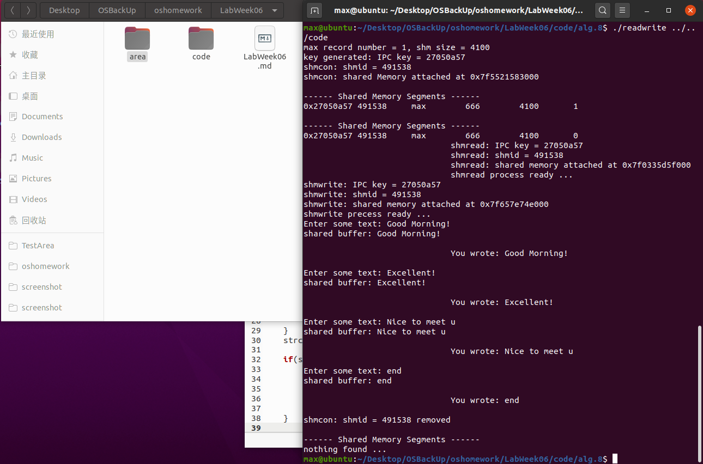
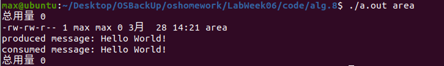
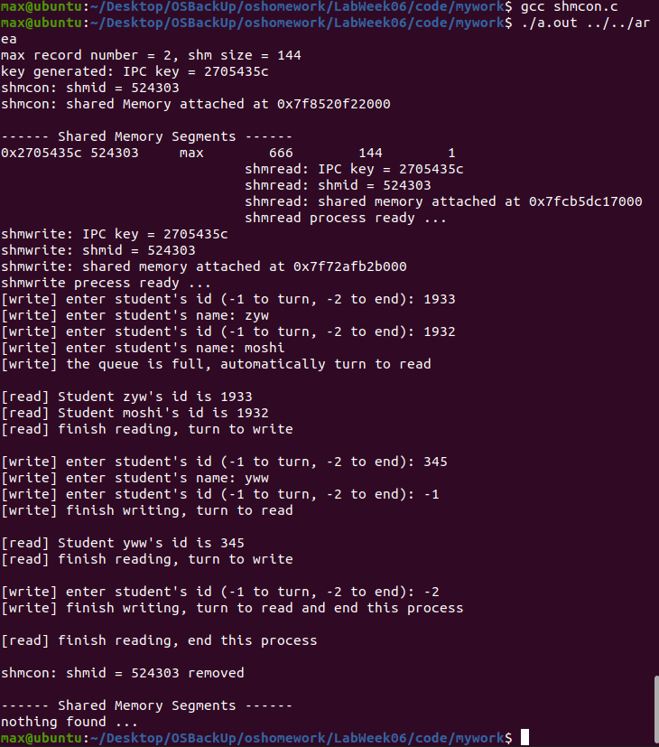
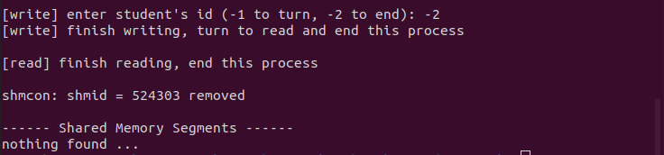

# Lab Week06 - 进程间通信（IPC）-共享内存

**郑有为 19335286**

如果图片或链接显示异常，请访问 [OSHomework-LabWeek06.md(Gitee)](https://gitee.com/WondrousWisdomcard/oshomework/blob/master/LabWeek05/LabWeek06.md)。我把代码和截图都放在了仓库 [OSHomework(Gitee)](https://gitee.com/WondrousWisdomcard/oshomework)。

# 目录

1. 实验验证 Lecture 08 例程代码 8-1 ~ 8-3 和 8-4 ~ 8-5。

2. 设计：修改 8-1 ~ 8-3 程序将共享空间组织成一个循环队列来进行FIFO操作，采用共享内存队列控制队列数据的同步。

[toc]

# 实验验证

## 实验1 - 8-1~8-3 Reader-writer

### 实验原理 

#### alg.8-0-shmdata.h

该文件定义了共享内存块的大小（4096kb）和共享内存块的数量（1），并定义个了共享内存的数据结构，由整形written和字符数组mtext组成，前者规定该共享内存快是否可写（writable = 0），后者是共享内存快存储共享信息的数据区。

此外，还定义了错误退出块和PERM参数（用在shmget里）。

#### alg.8-1-shmcon.c

该文件负责申请共享内存和创建父子进程（一个对共享内存进行写入，另一个进程对共享内存进行读取）。

* 共享内存的申请步骤：

	1. 调用ftok()函数生成键值

		* 给定一个可访问的，有操作权限的文件夹的地址，同项目ID（这里设为0x27）一起通过ftok()函数来生成共享内存的键值（key）。

		* 项目ID：8位二进制数，即在整形输入下，只有低八位被使用了。
		
		* fok()：系统IPC键值的格式转换函数，把一个已存在的路径名和一个整数标识符转换成一个key_t值，称为IPC键值
		
	2. 调用shmget()函数获得共享内存的ID

		* shmget()的参数包括 上一步骤生成的键值、申请空间的大小（最大不可以超过1.9G）、和一些参数 
		
		* 可选参数及含义： 在例程中使用了 (0666 | PERM)，其中 0666 每一位表示一种类型的权限，比如，第一个0是UID,第一个表示拥有者的权限，第二个6表示同组权限，第3个6表示他人的权限（ 6 表示可读可写（4+2）），PERM值 **S_IRUSR|S_IWUSR|IPC_CREAT**
		
			* IPC_CREAT: 如果共享内存不存在，则创建一个共享内存，否则打开操作。
			* IPC_EXCL: 不管有没有该共享内存，shmget()都返回-1
			* S_IRUSR：用户读权限
			* S_IWUSR：用户写权限
			* S_IRGRP：用户组读权限
			* S_IWGRP：用户组写权限
			* S_IROTH：其他组都权限
			* S_IWOTH：其他组写权限

	3. 通过shmat()函数获取共享内存的虚拟地址

		* void *shmat(int shmid, const void *shmaddr, int shmflg);	
		* 第一个参数 上一步骤生成的shmid
		* 第二个参数 一般应指定shmaddr为0，以便由内核选择地址
		* 第三个参数 如果指定了SHM_RDONLY位, 则以只读方式连接此段，否则以读写的方式连接此段	
		* shmat返回值是该段所连接的实际地址 如果出错返回-1
		

	4. 将指针类类型转换为共享内存的数据结构类型，并设置为可写（written = 0）


	5. 调用 shmctl(shmid, IPC_RMID, 0) 删除共享内存。
	
		* 第一个参数为共享内存的shmid
		* IPC_RMID指示该命令功能为删除共享内存
		* 第二个参数还可以是：
			* IPC_STAT：得到共享内存的状态，把共享内存的shmid_ds结构复制到buf中
			* IPC_SET：改变共享内存的状态，把buf所指的shmid_ds结构中的uid、gid、mode复制到共享内存的shmid_ds结构内 
		* 最后一个参数表示：共享内存管理结构体，0表示NULL
		
	6. 其他：共享内存块的信息打印,显示所有与shmid有关的的共享内存
	
		sprintf(cmd_str, "ipcs -m | grep '%d'\n", shmid); 
		system(cmd_str);

* 创建读写两进程的步骤：

	使用在程序进程中调用vfork创建子进程childpid1, 子进程执行execv调用./alg.8-2-shmread.o（并传参数-键值key，以获取共享内存地址），父进程在else语句块再创建子进程childpid2,执行execv调用./alg.8-3-shmwrite.o（并传参数，以获取共享内存地址），随后依次等待两个子进程结束再终止进程。
	
	
#### alg.8-2-shmread.c

和alg.8-1-shmcon.c一样，通过shmget获得shmid，再使用shmat获得内存空间地址。最后将指针转换成shared_struct格式。

* 通过循环不断检测共享内存更新，具体机制如下：

	1. 若此时共享空间为可写的，读进程休眠一秒，避免和写进程竞争资源导致错误。
	
	2. 若此时共享空间为仅可读的，获取共享内存mtext并输出。
	
	3. 在输出后马上将共享内存设为可写，以便让写进程写入新信息。
	
	4. 终止检测：若信息为"end",则结束进程

#### alg.8-3-shmwrite.c

和alg.8-1-shmcon.c一样，通过shmget获得shmid，再使用shmat获得内存空间地址。最后将指针转换成shared_struct格式，输出shmwrite进程的信息。

* 通过循环不断检测共享内存更新，具体机制如下：

	1. 若此时共享空间为仅可读的，写进程休眠一秒，避免和读进程竞争资源导致错误。
	
	2. 若此时共享空间为可写的，则等待键盘输入（fgets），把输入内容写进共享内存。
	
	3. 在输出后马上将共享内存设为可读，以便让读进程读取新信息。
	
	4. 终止检测：若信息为"end",则结束进程

### 系统调用过程与结果



1. 调用程序需要制定一个可访问的文件路径，我使用相对路径，和code同一级的area文件夹。

	* 可以看到生成的IPC键值为0x27050a57
	* 通过shmget生成的shmid为 491538
	* 通过shmat申请的共享内存空间地址为 0x7f552183000
	
2. 两次调用系统指令 ipcs -m | grep 491528,可以查看新生成的共享内存的详细信息：包括首地址、shmid、用户名、权限编号和共享内存的大小,和当前链接到该共享内存的进程数目。
	* 第一次，主进程连接着共享内存，故显示数目为1
	* 第二次，调用shmdt()函数断开与共享内存的连接，显示数目为0
		* shmdt()参数为共享内存的地址 

3. 在 share memory segments信息后面是两个子进程的信息，可以看到他们的算出的shmid和地址与主进程的一致，读进程先与写进程下创建。

4. 写进程发出请求键盘输入，在输入 Good Morning! 后，读进程返回"You wrote: Good Morning!" 表示写入和读取成功，程序可实现多次读写，每次都会重写共享内存的mtext数据段。

5. 最后输入"end"，进程以此结束， 主进程调用shmcon()删除共享内存，再次使用ipcs指令可以发现原先的共享内存不复存在。

## 实验2 - 8-4~8-6 Producer-consumer

### 实验原理

该实验是基于POSIX标准（可移植操作系统接口标准）的共享内存创建和使用实验，对应于与上一套（System V共享内存实验）不同的操作函数。

本实验同样用到了 alg.8-0-shmdata.h 文件，该文件定义了共享内存的是属性和结构，不再赘述。

下面一次解读各个程序要点和关键函数：

#### alg.8-4-shmpthreadcon.c

该程序负责申请共享内存并执行producer和consumer两个进程。

* 共享内存申请过程：

	1. 调用shm_open()函数打开或创建共享内存区

		* shm_open的作用是打开或创建一个共享内存区。
		
		* 函数原型及参数： int shm_open(const char *name,int oflag,mode_t mode);
		
			* name 共享内存区的名字，创建在这个文件夹/dev/shm/
			* cflag 标志位，参数必须含有O_WRONLY（只写），O_RDONLY（只读）或O_RDWR（可读可写）标志，还可以指定如下标志：O_CREAT（不存在则创建）,O_EXCL或O_TRUNC（若文件存在则长度被截为0）.
			* mode 权限位，和实验1的权限位含义是一样的
			* shm_open的返回值是一个整数描述字，它随后用作mmap的第五个参数。

		
	2. 调用ftruncate()函数指定申请内存区的大小

		* ftruncate(fd, shmsize); 
		* fd为上一步骤的返回值，shmsize的大小不得超过1.8GB
		* 执行成功则返回0，失败返回-1
		
* 子进程创建过程：

	1. 使用在程序进程中调用vfork创建子进程childpid1, 子进程执行execv调用/alg.8-5-shmproducer.o（并传参数数组，以获取共享内存地址），父进程在else语句块再创建子进程childpid2,执行execv调用./alg.8-6-shmconsumer.o（并传参数数组，以获取共享内存地址），随后依次等待两个子进程结束。
	
	2. 两子进程结束后调用 shm_unlink() 函数，移除共享内存。由于其开放性，任何知道该位置的进程都可以溢出该共享内存。
	
	3. 最后终止本进程。


#### alg.8-5-shmproducer.c

producer程序调用mmap()函数将字符串对象映射进内存。

* 具体过程：

	* 程序调用shm_open打开这个被父进程创建的共享内存，调用mmap()函数完成内存空间的格式化，并获得指向该内存的指针。
	
	* 随后调用sprintf()函数将字符串"Hello World"写入共享内存。
	
	* 最后打印写入信息并结束进程。
	
* mmap函数详解:

		void* mmap(void* start,size_t length,int prot,int flags,int fd,off_t offset) 
		
	* start：映射区的开始地址，设置为0时表示由系统决定映射区的起始地址。
	* length：映射区的长度
	* prot：期望的内存保护标志，不能与文件的打开模式冲突，有：
			
		* PROT_EXEC //页内容可以被执行
		* PROT_READ //页内容可以被读取
		* PROT_WRITE //页可以被写入
		* PROT_NONE //页不可访问
		
	* flags：指定映射对象的类型，映射选项和映射页是否可以共享，有：
	
		* MAP_FIXED //使用指定的映射起始地址
		* MAP_SHARED //与其它所有映射这个对象的进程共享映射空间
		* MAP_PRIVATE //建立一个写入时拷贝的私有映射

	* fd：有效的文件描述词，一般由shm_open()函数返回
	* offset：被映射对象内容的起点
	
#### alg.8-6-shmconsumer.c

consumer程序调用mmap()函数获得共享内存地址并读出。

* 具体过程：

	* 程序调用shm_open打开这个被父进程创建的共享内存，调用mmap()函数完成内存空间的格式化，并获得指向该内存的指针。
	
	* 随后调用打印共享内存中的字符串，结束进程。
	
### 系统调用过程与结果



该程序没有实验一的循环写入和读取操作，只是实现共次内存的基本读写。

* 总用量 0 是执行ls指令时返回的结果
	* 在共享内存创建后，ls指令返回了一行"-rw-rw-r--"的信息，这是共享关于内存的信息;
	* 在共享内存被撤销后, "-rw-rw-r--"的信息就不再出现了。
	
	* "-rw-rw-r--"的含义：
		* 第一个字符代表文件（-）、目录（d），链接（l）
		* 其余字符每3个一组（rwx），读（r）、写（w）、执行（x）
		* 第一组rw-：文件所有者的权限是读、写但不能执行
		* 第二组rw-：与文件所有者同一组的用户的权限是读、写但不能执行
		* 第三组r--：不与文件所有者同组的其他用户的权限是读不能写和执行 

# 程序设计

## 设计：基于循环队列的共享空间

修改程序将共享内存组织成一个学号姓名的数据结构的循环队列进行FIFO操作，采用共享内存变量控制队列数据的同步。

### 使用机制

整个应用的使用机制如下：

1. 主程序开启共享内存，和读进程和写进程两个子进程

2. 主进程和两个子进程以此打印共享内存信息（键值、ID、地址）

3. 写进程开始工作，等待用户输入学号和姓名
	* 若用户输入 -1, 则写进程挂起，读进程工作，将队列里所有的学号姓名信息输出，直至队列为空，读进程再挂起，写进程重新工作
	
	* 若用户输入-2，则写进程结束退出，读进程工作，将队列里所有的学号姓名信息输出，直至队列为空，读进程退出，整个程序结束运行
	
	* 若此时队列已满，写进程自动挂起，读进程工作。
	
4. 主进程删除共享内存，检查并输出关系内存的信息。
	
### 数据结构说明

* 在shmdata文件中，我们定义了共享内存的三个状态：

	```
	# define WRITE 0
	# define READ 1
	# define READEND -1
	```
	分别表示：只写、只读、只读-读完后结束。

* 队列的单元：学号-姓名

	```
	struct shared_cell{
		int id;
		char name[TEXT_SIZE];
	};
	```
	
* 共享内存结构：状态模式、队列头索引、队列尾索引、数据数组

	```
	struct shared_struct {
	    int mode; // 1 is read and 0 is write
	    int head; // shared_cell[head] is empty while shared_cell[(head-1)/TEXT_NUM] is the lastest node
	    int tail; // shared_cell[tail] is the earliest node
	    struct shared_cell cell[TEXT_NUM + 1]; // buffer for message reading and writing
	};
	```
	
### 程序细节说明

* 编译运行命令：

	```
	gcc -o shmread.o shmread.c
	gcc -o shmwrite.o shmwrite.c
	gcc shmcon.c
	./a.out ../../area
	```

#### shmcon.c

* 和实验一一样申请内存空间并或的其地址，随后对其进行初始化：

```
shared = (struct shared_struct *)shmptr;
shared->mode = WRITE; // initially set write mode
shared->head = 0;
shared->tail = 0;
```

#### shmwrite.c

* 和实验一一样打印共享内存信息，随后执行如下循环（参考注释），需要检测队列是否已满、检测输入以判断是否改变读写模式。

```
    while (1) {
    
    	if((shared->head + 1) % (TEXT_NUM + 1) == shared->tail % (TEXT_NUM + 1)){
    	    printf("[write] the queue is full, automatically turn to read\n\n");
	    shared->mode = READ;
    	} // detect if queue is full then turn to read mode
    
        while (shared->mode == READ) {
            sleep(1); // read mode
        }
        
        printf("[write] enter student's id (-1 to turn, -2 to end): ");
        int sign;
        
        scanf("%d",&sign); 
        // -1 change mode
        // -2 to end process
        
        if(sign == -1){ //read mode transition
	    printf("[write] finish writing, turn to read\n\n");
	    shared->mode = READ;
        }
        else if(sign == -2){ // read-end mode transtion 
            printf("[write] finish writing, turn to read and end this process\n\n");
	    shared->mode = READEND;
	    break;
        }
        else{ // write information into shared memory queue
	    shared->cell[shared->head].id = sign;
	    printf("[write] enter student's name: ");
	    scanf("%s",(shared->cell[shared->head].name));

	    (shared->head) += 1; 
	    (shared->head) %= (TEXT_NUM + 1); //update the head index of queue
        }
        
    }
```

#### shmread.c

* 和实验一一样打印共享内存信息，随后执行如下循环（参考注释），需要检测当前的模式决定是否结束进程。

```

    while (1) {
    	
        while (shared->mode == WRITE) {
            sleep(1); 
        } // write mode the sleep
        
        if(shared->head == shared->tail) { // detected the queue is empty then turn to write mode or end this process
            if(shared->mode == READ){ // turn to write mode         
                printf("[read] finish reading, turn to write\n\n");
                shared->mode = WRITE;
            }
            else if(shared->mode == READEND){ // end the process
            	printf("[read] finish reading, end this process\n\n");
            	break;
            }
        }
        else{ //normally print the student's information
            printf("[read] Student %s's id is %d\n", shared->cell[shared->tail].name, shared->cell[shared->tail].id);
            (shared->tail) += 1;
            (shared->tail) %= (TEXT_NUM + 1);
        }
        
    }      
```

### 程序运行

* 程序运行全貌：

	首先输出关系内存大小（144kb）和队列容量（为方便后边测试，我将容量改为了2），IPC键值、ShmID和关系内存地址。

	在ipcs指令结果中可以看到我们创建的关系内存信息。

	

* 写进程写入和满队列

	由于我们设置队列容量为2，在输入两个学生信息（1933,1932）后关系内存对列就满了，自动转入READ模式，读进程读出所有信息再转回WRITE模式，写进程等待输入。
	
	
	
* 写进程手动切换模式

	输入-1后跳转为READ模式，读进程输出当前队列的信息（345）。 
	
	
	
* 结束进程
	
	输入-2后跳转为READ-END模式，写进程结束进程，读进程输出当前队列的信息（345），读进程结束进程，父进程删除共享内存并调用ipcs检查共享内存，可以看到共享内存被正确删除。 

	
	
	
---

# 实验心得

在做设计部分的实验时，我重点考虑的是读写进程的触发的逻辑，最开始没有设置模式位，而是读进程和写进程同时竞争资源，但是由于而这一个是写队列头，一个是读对列尾，一般情况不会发生冲突。但是这样有一个大的问题就是在写进程等待用户输入时，读进程直接输出，干扰用户输入，让整个界面很难看。


此外，如果使用这种模式需要考虑一些特殊的情况，需要保证写进程先与读进程执行，读进程读速度等于写进程，不能过快，也不能过慢（后者会发生拥堵），此外，进程的终止也需要做特殊处理。

于是，我使用了基于三种读写模式（WRITE、READ、READEND）的进程响应逻辑，输出比较美观，空队列和满队列的情况也容易处理，并且不会产生死锁和拥堵。
	
	


	
	
	
	
	
	
	
	
