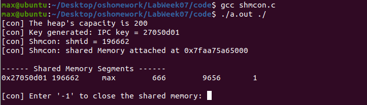
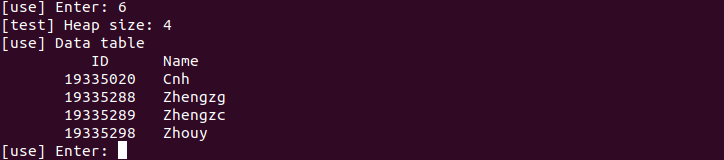

# Lab Week07 - 进程间通信（IPC）-共享内存

**郑有为 19335286**

如果图片或链接显示异常，请访问 [OSHomework-LabWeek07.md(Gitee)](https://gitee.com/WondrousWisdomcard/oshomework/blob/master/LabWeek07/LabWeek07.md)。我把代码和截图都放在了仓库 [OSHomework(Gitee)](https://gitee.com/WondrousWisdomcard/oshomework)。

* 实验内容: 实现一个带有 n 个单元的线性表的并发维护。

	1. 建立一个足够大的共享内存空间 (lock, M),逻辑值 lock 用来保证同一时间只有一个进程进入 M;测试你的系统上 M 的上限。
	2. 设计一个程序在 M 上建立一个结点信息结构为 (flag, 学号, 姓名) 的静态链表 L,逻辑值 flag 用作结点的删除标识;在 L 上建立一个以学号为关键字的二元小顶堆,自行设计控制结构 (如静态指针数据域)。
	3. 设计一个程序对上述堆结构的结点实现插入、删除、修改、查找、重
	排等操作。该程序的进程可以在多个终端并发执行。
	4. 思考:使用逻辑值 lock 实现的并发机制不能解决条件冲突问题。
	
## 目录

1. 共享内存申请容量测试

2. 实现基于小顶堆的共享内存结构和操作程序

3. 思考： 使用lock(flag)不能解决条件冲突问题

[toc]

## 测试与实验

### 1. 共享内存申请容量测试

* 程序设计思路：

	* 第一步：申请共享内存，设置初始容量为10000字节，每次增量为1000000字节，循环进行申请、删除操作，直至系统返回错误：不能申请这么多内存。通过执行该程序，粗略得到共享内存申请容量的一个上界。
	* 第二步：由第一步的到一个上界为3022010000，设置初始容量为3021010000字节（3022010000减去1000000），每次增量为1字节，循环进行申请、删除操作，直至系统返回错误：不能申请这么多内存。通过执行该程序，粗略得到共享内存申请容量的一个上确界。
	
* 程序运行截图：

	
	
	* 可以看到在这台机器上，共享内存的申请上限为3021623296字节（3021623297-1）。
	
* 程序源码：

	* 第一步程序：[shmmtest1.c](https://gitee.com/WondrousWisdomcard/oshomework/tree/master/LabWeek07/code/shmmtest1.c)
	* 第二步程序：[shmmtest2.c](https://gitee.com/WondrousWisdomcard/oshomework/tree/master/LabWeek07/code/shmmtest2.c)
	
### 2. 实现基于小顶堆的共享内存结构

#### 数据结构与程序布局

* 共享内存结构：

	```
	struct shared_cell{ // 共享内存中共享单元的结构-(flag,学号,姓名)
		int flag; // ALIVED or DELETED，用于标记该单元在堆中是否已经被删除
		int id; // 具有唯一性，不同单元不能有同一个学号
		char name[SIZE]; // SIZE = 40， 不具有唯一性
	};

	struct shared_struct { // 共享内存结构
		int mode; // ACCESSIBLE or BLOCKED 控制锁，确保每次只有一个客户进程进入
		struct shared_cell heap[NUM + 1];  // 完全小顶堆结构
		int size; // 当前堆结构的大小
		
	};
	```
	
* 程序布局：

	* 共享内存的结构储存在 [shmdata.h](https://gitee.com/WondrousWisdomcard/oshomework/tree/master/LabWeek07/code/shmdata.h) 文件中。
	
	* [shmcon.c](https://gitee.com/WondrousWisdomcard/oshomework/tree/master/LabWeek07/code/shmcon.c) 文件负责生成共享内存空间并返回 IPC key值，此值提供给用户程序。
	
	* [shmuse.c](https://gitee.com/WondrousWisdomcard/oshomework/tree/master/LabWeek07/code/shmuse.c) 文件实现了基于堆的操作，提供共享内存的访问、编辑功能：包括学生信息的增删查改等（优化版：[shmuse2.c](https://gitee.com/WondrousWisdomcard/oshomework/tree/master/LabWeek07/code/shmuse2.c)）。


#### 程序使用案例

1. 首先在一台终端上编译 shmcon.c 程序，并执行 ```./a.out ./```，得到一下界面：
	
	
	如图，程序显示了当前堆的大小、IPC Key、Shm ID、共享内存地址等信息，并等待输入'-1'来关闭共享内存。
	
2. 然后，在另一台终端上编译执行 shmuse.c 程序，并执行```./a.out 27050d01```，后面的数字参考第一步得到的IPC Key，若共享内存没有被其他进程占用，则得到一下界面：
	
	如图，程序显示了当前堆的IPC Key、Shm ID等信息，并弹出功能列表，等待输入，其中：
	* 数据操作功能：
		* 输入```1```以添加用户信息（提供查重功能）
		
			
			
			解释：两次调用添加成员功能，第二次添加与前一次相同的ID号，导致第二次添加失败。
		* 输入```2```以删除用户信息：
		
			
			
			解释：删除学号为19335286的信息，调用功能6显示当前数据表，可以看到19335286已经被删除。
		* 输入```3```以修改用户信息（修改学生名称）
		
			
			
			解释：修改学号为19335289的信息，调用功能6显示当前数据表，可以看到19335289的姓名从Zhengcz改成了Zhengzc。
		* 输入```4```以查找用户信息：
		
			
			
			解释：查询学号为19335298的信息和学号为19335286的信息，后者不存在。
		* 输入```5```以进行重排，重排负责把仍保留在堆中，但已经标记为```DELETED```(已删除）的数据从堆中彻底移除。
		* 输入```6```以进行输出学生信息表，信息表按照学号从小到大有序排列。
		
			
	* 其他功能：
		* 输入```0```以挂起进程，进程在这段时间内不访问共享内存，把权限让给其他进程。如果2秒后没有其他进程占用关系内存，该进程被激活。
		
			
		* 输入```-1```以断开共享内存连接，结束进程。
		
			

#### 程序逻辑与实现细节

1. 共享内存的实现

	* shmcon.c 创建共享内存
		1. 调用ftok()函数生成键值
			* 给定一个可访问的，有操作权限的文件夹的地址，同项目ID（这里设为0x27）一起通过ftok()函数来生成共享内存的键值（key）。
		2. 调用shmget()函数获得共享内存的ID。
		3. 通过shmat()函数获取共享内存的虚拟地址，并将指针类类型转换为共享内存的数据结构类型。
		4. 初始化共享内存，包括将模式置为```ACCESSIBLE```、设置当前堆中元素数为0、将堆数组中每一个元素的标签标为```DELETED```。
			```
			shared->mode = ACCESSIBLE;
			shared->size = 0;
			for(int i = 0; i < NUM + 1; i++){
				shared->heap[i].flag = DELETED;
			}
			```
		5. 调用 shmdt(shmptr) 断开与共享内存的连接、或shmctl(shmid, IPC_RMID, 0) 删除共享内存。
	
	* shmuse.c 使用共享内存
		1. 根据参数Key ID，调用shmget()函数获得共享内存的ID。
		2. 再通过shmat()函数获取共享内存的虚拟地址，并将指针类类型转换为共享内存的数据结构类型。
		3. 通过循环结构，等待或使用共享内存。
			```
			while(1){
				while (shared->mode == BLOCKED) { // 共享内存被别的进程使用着，等待
					printf("[use] the memory is blocked, waiting...\n");
					sleep(1); 
				}
				shared->mode = BLOCKED; // 防止在使用期间共享内存被别的进程使用
				request_show(); // 展示操作功能列表
				if(request_call(shared) == 0){ //调用操作功能 
					break; // 对应功能调用'-1'，结束进程
				}
				else{
					sleep(2); // 对应功能调用'0'，将进程挂起，休眠2秒
				}
			}
			```
		4. 调用 shmdt(shmptr) 断开与共享内存的连接。
		
2. 堆的维护函数

	```
	void top_to_down(int i, struct shared_struct * shared);
	//将第i个元素从上而下调整来维护堆结构，复杂度：O(log(n))。
	
	void down_to_top(int i, struct shared_struct * shared);
	//将第i个元素从下而上调整来维护堆结构，复杂度：O(log(n))。
	
	struct shared_cell pop(struct shared_struct * shared);
	//将堆顶的数据单元弹出，并调用top_to_down(1,shared)来调整堆结构，复杂度：O(log(n))。
	
	void push(struct shared_cell cell, struct shared_struct * shared);
	//将数据单元加入堆，先放在堆尾，再调用down_to_top(shared->size, shared)来调整堆结构，复杂度：O(log(n))。
	```
	
3. 进程等待逻辑
	
	* 多个终端可以一同运行shmuse.c程序，但是一次只能有一个终端操作共享内存，在一个终端操作时，其他进程会等待，每隔一秒发出```the memory is blocked, waiting...```直到操作共享内存的进程挂起或结束。
	
	* **挂起**和**结束**的区别：挂起时不结束进程，进入等待状态，并至少等待两秒，两秒过后，若此时共享内存是```ACCESSIBLE```的，则开始操作共享内存；结束：先将共享内存的标记置为```ACCESSIBLE```，与共享内存直接断开链接，结束进程。
	
	* 例子：
		
		
		
		解释：左终端先调用shmuse程序，右终端随后调用shmuse程序，由于左终端正在占用共享内存，右终端显示```waiting...```；6秒后，左终端输入'0'挂起，右终端接手共享内存，此时左终端显示```waiting...```；又过6秒，右终端输入'-1'结束，左终端接手共享内存。
	
4. 用户信息的增删查改
	1. 增加学号姓名信息
		首先遍历堆数组检查该学号是否已经存在(复杂度：O(n))，若存在则返回错误信息，否则调用push函数将数据单元加入堆中(复杂度：O(log(n)))。
	2. 删除学生信息
		以学号为关键字，查找该学号对应的数据单元，找到后将其标志置为```DELETED```(复杂度：O(n))。
	3. 修改学生信息
		以学号为关键字，查找该学号对应的数据单元，找到后修改他的名字，若找不到则返回错误信息(复杂度：O(n))。
	4. 查找学生信息
		遍历堆数组进行查找，找到后输出到屏幕，若找不到则返回错误信息(复杂度：O(n))。
5. 堆的重排
	* 倒序遍历堆数组，若该单元被标记为```DELETED```，则调用```top_to_down(j,shared)```函数向上调整，并将堆元素个数减一，复杂度为O(n)，证明略。
	* 代码：
		```
		for(int j = shared->size; j >= 1; j--){
			if(shared->heap[j].flag == DELETED){
				shared->heap[j] = shared->heap[shared->size];
				top_to_down(j,shared);
				shared->size--;
			} 
		}
		```
		
6. 强制维护函数

	* shmuse.c 程序中有两个隐含参数 97 和 98,分别对应 强制查看内存单元功能 和 强制清空所有内容功能，可以通过这两个参数进行程序的检查和调试，代码如下：
	
		```
		// i 为用户的输入参数
		else if(i == 97){ // 强制查看内存单元
			printf("[test] Heap size: %d\n", shared->size);
			printf("[use] Data table\n");
			for(int i = 0; i < 11; i++){
				printf("%d,%d,%s\n",shared->heap[i].flag,shared->heap[i].id,shared->heap[i].name);
			}
		}
		else if(i == 98){ // 强制清空所有内容
			shared->size = 0;
			for(int i = 0; i < NUM+1; i++){
				shared->heap[i].flag = DELETED;
				shared->heap[i].id = 0;
				shared->heap[i].name[0] = '\0';
			}
		}
		```
		
	* 使用截图：
		
		
		
#### 程序多终端使用实例：


也可以点击 [Use Case](https://gitee.com/WondrousWisdomcard/oshomework/tree/master/LabWeek07/use_case.mp4) 下载案例视频。

#### 后续界面优化
 
* 由于输出界面的意义不明，对输出进行了优化：参考程序 [shmuse2.c](https://gitee.com/WondrousWisdomcard/oshomework/tree/master/LabWeek07/code/shmuse2.c)。

* 使用截图：

	
	
 
### 3. 思考： 使用lock(flag)不能解决条件冲突问题

使用lock时，当程序不是特别多的情况下，“看起来”不会产生问题，但是当程序特别多的情况下，或者两个进程恰好（几乎）同时争夺共享内存的使用资源时，可能会发生同时进入共享内存的情况，导致冲突发生。

原因如下：程序**识别到共享内存的标记变成**```ACCESSIBLE```到 **将共享内存的标记设置成**```BLOCKED```之间**存在时间间隔**。别的进程可以在这个时间内获得共享内存的使用权，导致一下子有多个进程操控着共享内存，发生冲突。
