# Lab Week08 - 进程间通信-消息机制

**郑有为 19335286**

如果图片或链接显示异常，请访问 [OSHomework-LabWeek08.md(Gitee)](https://gitee.com/WondrousWisdomcard/oshomework/blob/master/LabWeek08/LabWeek08.md)。我把代码和截图都放在了仓库 [OSHomework(Gitee)](https://gitee.com/WondrousWisdomcard/oshomework)。

* 实验内容1: 进程间通信—消息机制。
	* 编译运行课件 Lecture 09 例程代码:
		* Algorithms 9-1 ~ 9-2.
		* 修改代码,观察在 msgsnd 和 msgrcv 并发执行情况下消息队列的变化情况。
* 实验内容2:
	* 仿照 alg.8-4~8-6,编制基于 POSIX API 的进程间消息发送和消息接收例程。

## 目录

[toc]

---

## 1. 实验1 - 9-1~9-2 msgsnd-msgrcv

### 1.1. 实验原理 

* 程序9-1~9-2搭建了一个简单的消息传递系统(Message-passing Systems)，不同与Lab06的共享内存系统(Shared-momory Systems)，消息传递系统能够在不依赖共享变量(Lock)的情况下进行数据的同步。它有着一下特点：

	1. 进程中的通信是通过信息交换进行的，这一点和共享内存相同。
	2. 因为消息队列位于内核内，空间有限，一般用于交换少量的数据。
	3. 通常通过系统调用来实现，需要内核干预（消息传递的信息队列在内核中，由内核管理），相比与共享内存而言更加耗时。
	4. 相较于共享内存，消息传递系统基于内核实现，更加安全。
	5. 消息队列与管道不同的是，消息队列是基于消息的，而管道是基于字节流的，且消息队列的读取不一定是先入先出。
	
* 一个消息传递系统提供两种基本的操作：发送(Send)和读取(Receive)，分别对应例程中的```alg.9-1-msgsnd.c```和```alg.9-2-msgrcv.c```。

#### 1.1.1. alg.9-0-magdata.h 

* 消息传递系统对消息的数据结构有规范（有点像计网的协议）：包括Header和Body，如下图所示：

	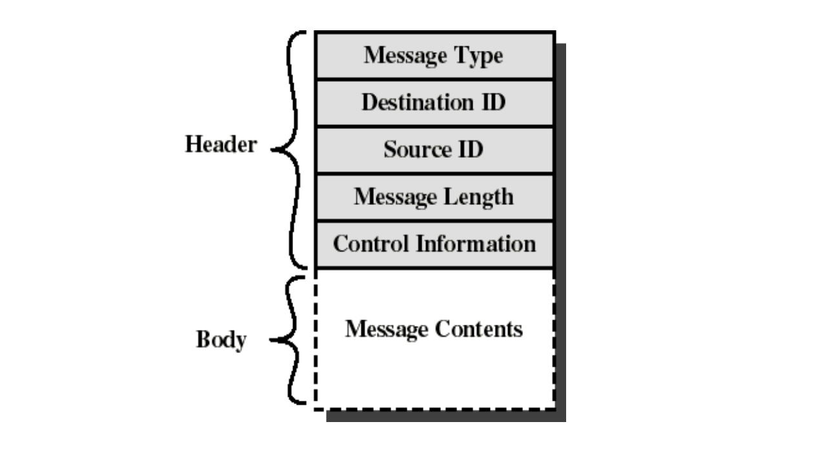

* 本实验简化消息队列的数据结构，其内容之包括消息类型```msg_type```和消息内容```mtext```，并规定每个消息内容的大小是512。

* 通过```ipcs -l```指令，我们可以获得消息传递内存的大小限制：默认的队列的最大储存只有16384字节，~~而我们的消息是每个516字节（不是512个字节，因为消息类型本身是```long int```，四个字节，可以看到消息队列最多只能存下31个```msg_struct```数据单元~~，接下来我们会通过实验测试这个上限。

* 从后续的实验验证中我发现，消息是512字节每条，而不是516，这可能使因为特殊的储存形式（以类型组织的多链表），使得```msg_type```是不再一条消息数据的存储中占空间的。

* 根据课件内容，数据的插入形式是根据数据类型连起来的的链表结构：
	
	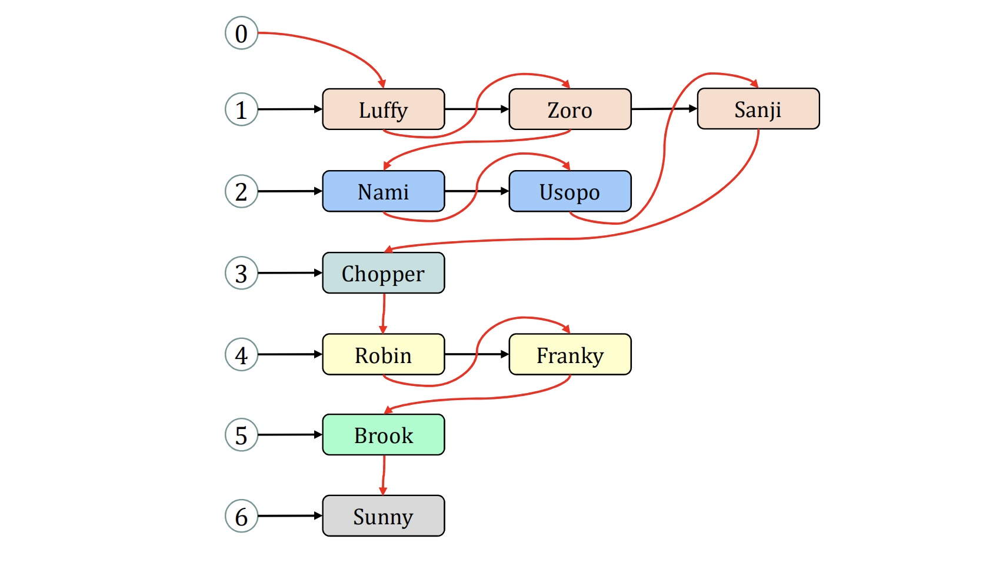
		
#### 1.1.2. alg.9-0-magsnd.txt

存储了10个```msg_struct```数据单元信息，在实验中，由```alg.9-1-msgsnd.c```送入消息队列，再由```alg.9-1-msgrcv.c```进行读取。

#### 1.1.3. alg.9-1-msgsnd.c

程序步骤说明：

1. 先调用```stat```函数检查文件位置是否存在，若不存在则调用```creat```函数创建文件夹。

2. 通过调用```ftok```函数生成消息队列的指定ID值，和共享内存一样，通过消息队列建立IPC通讯也必须要制定ID值，该函数用法及参数说明已经在LabWeek06的实验报告中记录，此处不再赘述。

3. **重点函数-msgget**：使用```msgget```函数创建一个新的或者打开一个已经存在的消息队列，此消息队列通过```key```值唯一指定，在程序中：

	```
	msqid = msgget((key_t)key, 0666 | IPC_CREAT);
	```
	* 以通过```ftok```函数从文件地址和```0x27```得到的key来生成消息队列，```0666```说明了文件、目录，链接都可读可写可执行，```IPC_CREAT```则指定了要通过新生成来得到消息队列。

4. 通过```fopen```函数打开```alg.9-0-magsnd.txt```文件以读取其中信息，读写标识```"rb"```指明以二进制的形式进行读操作。

5. **重点函数-msgtcl**
	* 首先创建```msqid_ds```对象：msqid_ds声明消息队列的状态，每一个消息队列都有一个```msqid_ds```于之关联，在这个结构内包含很多很重要的信息，例如：
		* ```ipc_perm```结构体对象```msg_perm```：用于说明IPC对象的权限和所有者。
		* ```msg_qnum```：整形，用于记录当前消息队列中的消息数目。
		* ```msg_qbytes```：用于记录消息队列最大允许的字节书。
		* ```msg_lspid```和```msg_lrpid```：分别记录上次一调用msgcnd的进程的PID和上一次调用msgrcv的进程的PID，利用这两个参数可以跟踪上一次收/发操作的进程。
	
	* ```ret = msgctl(msqid, IPC_STAT, &msqattr);```，详细分析该函数及参数：
		* 该函数的作用：通过它我们能直接控制消息队列的行为。
		* 函数原型： ```int msgsnd(int msqid, struct msbuf *msgp, int msgsz, int msgflg)```
		* 参数解释：
			* 第一个参数 msqid : 消息队列对象的标识符。 
			* 第二个参数 msgp : 函数要对消息队列进行的操作。
				* IPC_STAT : 取出系统保存的消息队列的数据，并将其存入参数buf 指向的 msqid_ds 结构中。
				* IPC_SET : 设定消息队列的 msqid_ds 数据中的 msg_perm 成员。设定的值由 buf 指向的 msqid_ds 结构给出。
				* IPC_EMID : 将队列从系统内核中删除。 
		* 返回值：成功获得消息队列的控制权，返回0,否则返回-1，在调用该函数后，我们可以直接通过msgattr获得消息队列的各个属性。
		
5. **重点函数-msgsnd**：堵塞状态发送
	* 在消息传递系统中，有堵塞/非堵塞发送、堵塞/非堵塞接收，堵塞被认为是同步的，非堵塞是被认为是异步的。
		* 堵塞发送：在发送消息时堵塞进程，直到接收进程收到消息。
		* 堵塞接收：接受方堵塞，直至消息队列可用。
		* 非堵塞发送：发送进程发送消息并恢复。
		* 非堵塞接收：接受方检索并判断有效信息。
	* 本程序使用 非堵塞发送 和 堵塞接收。
	* 使用while循环依次读取并发送```alg.9-0-msgsnd.txt```中的数据到消息队列中。
	
		```
		while (!feof(fp)) {
			//从文件读取每一行（以长整形和字符串的格式）
			ret = fscanf(fp, "%ld %s", &msg_type, buffer);
			if(ret == EOF) {
				break;
			}
			printf("%ld %s\n", msg_type, buffer);
				        
			data.msg_type = msg_type;
			strcpy(data.mtext, buffer);
			//将数据发送到消息队列（一次一条）
			ret = msgsnd(msqid, (void *)&data, TEXT_SIZE, 0); /* 0: blocking send, waiting when msg queue is full */
			if(ret == -1) {
				ERR_EXIT("msgsnd()");
			}
			//统计消息发送总数
			count++;
		    }
		```
	* ```ret = msgsnd(msqid, (void *)&data, TEXT_SIZE, 0)```，详细分析该函数及参数：
		* 该函数的作用：追加一条新消息到消息队列。
		* 函数原型：```int msgsnd(int msqid, const void *ptr, size_t length, int flag)```
		* 参数解释：
			* msqid: 由消息队列的标识符
			* ptr: 消息缓冲区指针
			* legth: 消息数据的长度
			* flag: 为０表示阻塞方式，设置IPC_NOWAIT 表示非阻塞方式
		* 返回值：调用成功返回0，不成功返回-1。
	
6. 调用```fclose(fp)```关闭文件，```system("ipcs -q")```调用系统观察中进程间通信状态，最后调用```exit(EXIT_SUCCESS)```退出程序。

#### 1.1.4. alg.9-2-msgrcv.c

程序步骤说明：

1. 运行该文件需要两个额外参数，一是文件夹位置，二是一个整形，用于读取消息队列时选取固定类型，将其储存到```msgtype```中，且为```0```时表示指定所有类型。	

2. 调用```ftok```函数获得消息队列的```key```值，再调用```msgget```获得消息队列的标识```msqid```，需要注意的是，调用该函数不需要参数```IPC_CREAT```，因为该程序负取消息，消息队列已创建。

3. **重点函数-msgrcv**：非堵塞状态接收

	* 循环调用```msgrcv```输出消息队列指定内容，直至为空：
		```
		while (1) {
			ret = msgrcv(msqid, (void *)&data, TEXT_SIZE, msgtype, IPC_NOWAIT); /* Non_blocking receive */
			if(ret == -1) { /* end of this msgtype */
			    	printf("number of received messages = %d\n", count);
			    	break;
			}
			printf("%ld %s\n", data.msg_type, data.mtext);
			count++;
		    }
		```
	* ```ret = msgrcv(msqid, (void *)&data, TEXT_SIZE, msgtype, IPC_NOWAIT)```，详细分析该函数及参数：
		* 该函数的作用：追加一条新消息到消息队列。
		* 函数原型：```int msgsnd(int msqid, const void *ptr, size_t length, int flag)```
		* 参数解释：
			* msqid: 由消息队列的标识符
			* ptr: 消息缓冲区指针
			* legth: 消息数据的长度
			* flag: 为```IPC_NOWAIT```表示非阻塞方式
		* 返回值：调用成功返回0，不成功返回-1。
	
4. 通过调用```msgctl(msqid, IPC_STAT, &msqattr)```获得对消息队列的控制信息，取出```msqattr.msg_qnum```以获得当前消息队列中的消息数目（```msgctl``在程序```alg.9-1-msgsnd.c```中已经解释，不再赘述）。

5. 通过调用```msgctl(msqid, IPC_RMID, 0)```删除消息队列：
	* 当当前消息队列消息数目为0,时，询问是否删除该消息队列。
	* 调用```msgctl(msqid, IPC_RMID, 0)```删除消息队列，参数```IPC_RMID```表示删除消息队列（Remove ID）。
	
6. 最后调用```system("ipcs -q")```观察进程间通信状态，最后调用```exit(EXIT_SUCCESS)```退出程序。
	
### 1.2. 程序运行调试（包含程序修改）

#### 1.2.1. 普通运行测试

* 根据课件内容运行程序：

	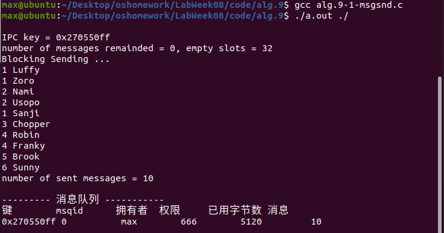
	
	> 指定文件为当前文件夹，运行程序```a.out```，可以得到的IPC Key为0x270550ff，并获得消息队列的消息数限制（30），随后一次将10条消息从文件中写到消息队列中。
	> 用```ipcs -q```可以看到：该消息队列存在，以用字节数为5120字节，消息总数为10。

	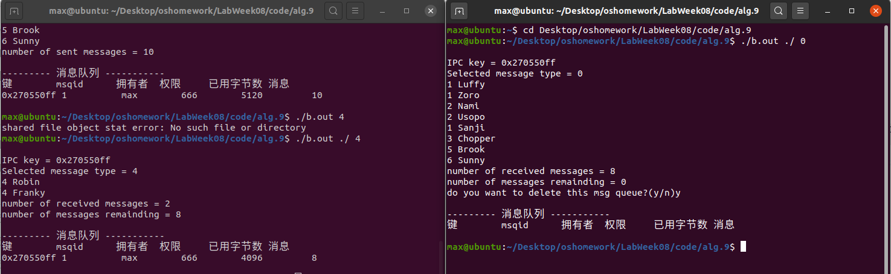
	
	> 左右两个终端，先后运行```b.out```，左边程序带入参数4，表示发送类型为4的消息，可以看到消息队列中共有两条类型为4的消息，分别是```Robin```和```Franky```，将这两条消息取出后，剩余的消息总数为8。
	
	> 右边程序带入参数0,输出所有类型，可以看到输出后消息队列的消息数为0,此时程序询问是否删除消息队列。输入```y```后系统正常结束，调用```ipcs -q```，此时再也查不到原来的消息队列了。
	
#### 1.2.2. 消息队列消息上限测试

1. 修改```alg.9-0-msgsnd.txt```至32个消息，运行程序观察是否发生异常

	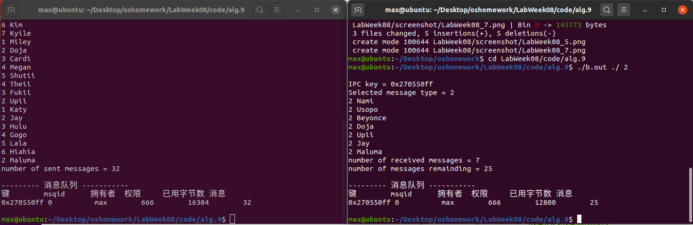
	> 两个程序能够正常运行

2. 修改```alg.9-0-msgsnd.txt```至33个消息，运行程序观察是否发生异常

	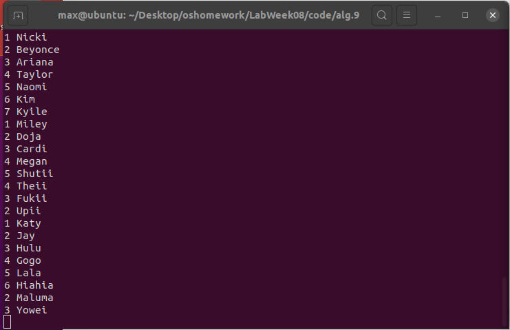
	> a.out卡住了（其实是进入了等待状态）
	
	此时再运行b.out试试，神奇的事情发生了
	
	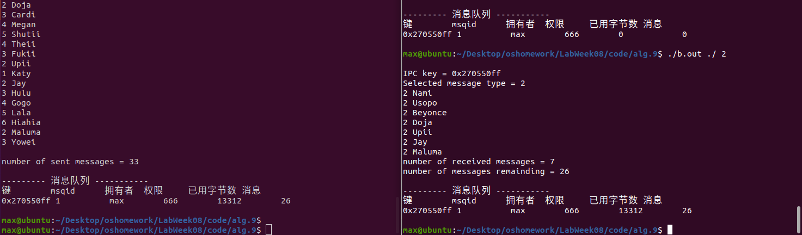
	
	> 由于b.out取出了7个消息，a.out正常结束了程序，消息队列也正常产生并还存储着26条消息。
	
	原理解释： 这是因为```b.out```消息队列写入是用的是堵塞模式的原因，在消息队列满了之后，会进入等待状态，知道消息队列不再满，继续写入消息队列，对此我们再进行实验验证其情况。
	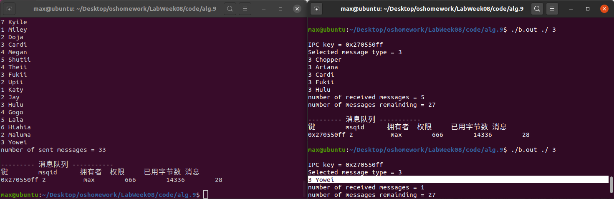
	
	> 由于b.out读取类型为3的数据，而写入中第33个消息的类型为3,由于消息队列已满，这个消息还在等待的缘故，它不再消息队列中，```b.out```无法读取到它，只有再次运行该程序才能读到。
	
#### 1.2.3. 堵塞状态修改测试

1. 将```alg.9-1-msgsnd.c```中```ret = msgsnd(msqid, (void *)&data, TEXT_SIZE, 0); ```改为```ret = msgsnd(msqid, (void *)&data, TEXT_SIZE, IPC_NOWAIT); ```，编译运行程序，此时```alg.9-0-msgsnd.txt```包含33个消息。

	* 程序运行结果，在非堵塞状态下且消息队列已满的情况下，```a.out```不会等待而是直接报错，输出```msgsnd(): Resource temporarily unavailable```（左图），消息队列只能读取前32条消息（右图）。

		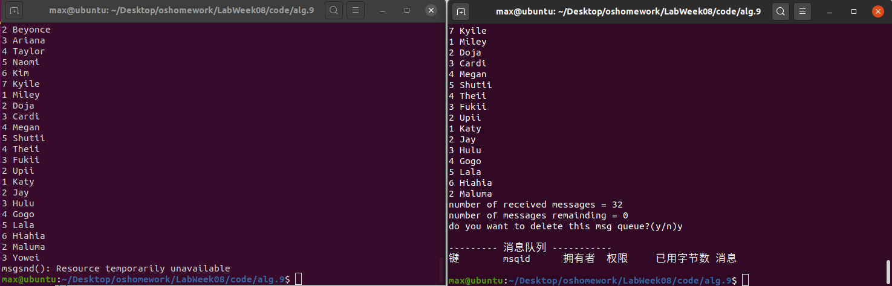
	
2. 将```alg.9-2-msgrcv.c```中```ret = msgrcv(msqid, (void *)&data, TEXT_SIZE, msgtype, PIC_NOWAIT); ```改为```ret = msgrcv(msqid, (void *)&data, TEXT_SIZE, msgtype, 0); ```，编译运行程序，此时```alg.9-0-msgsnd.txt```包含33个消息。

	* 程序运行结果，在非堵塞状态的情况下，```b.out```会等待，等待消息队列的更新（右图）。
	
		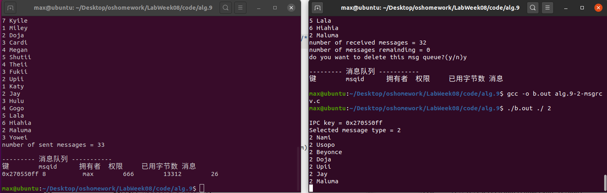
	
	* 继续再次运行```a.out```写东西如消息队列，```b.out```会读取出新写入的消息队列的消息。
	* 然而**由于两个程序都是堵塞状态，此时发生了死锁**：由于此时消息队列的消息的数据类型都不是2，而```./b.out ./ 2```运行中，没有数据再读出，也由于消息队列已满，```a.out```无法写入。
	
	* 现在考虑这个死锁是否能通过别的进程解除，于是我在一个新的终端上跑了```./b.out ./ 3```，死锁没有解决，反而三个进程都发生了死锁。
	
		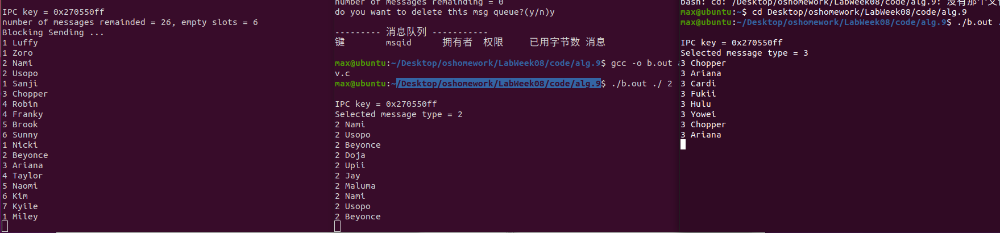
	
	* 最后，我在一个新的终端上跑了```./b.out ./ 0```，解决死锁，但是后续还是会出现问题，因为有三个进程等待消息队列的新消息，而他们有些等待的消息数据类型是重合的，会发生资源的竞争。
	
		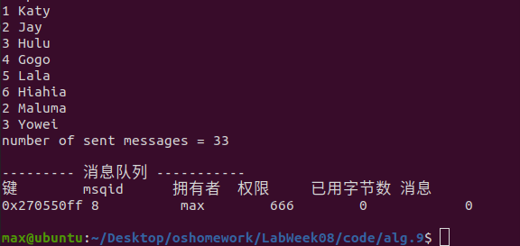
	
		> 最下面的终端执行的程序会读取所有类型的消息，与上面两个终端的程序争夺资源，从上图就可以看到。
	
	* 结论：对于读取进程```b.out```，还是使用非堵塞```PIC_NOWAIT```更为合理。
	
#### 1.2.4. 程序运行漏洞修改

* 多次运行```alg.9-1-msgsnd.c```的时候，由于在第一次已经创建好消息队列，新的消息会直接写入消息队列（如果消息队列还没满的话）。

* 然而我发现了一个程序实现的问题：如果此时还有消息在```a.out```的缓存区等待，此时运行```b.out```来读取此时消息队列的所有消息，使消息队列会为空，然后```a.out```的缓存区会将新的数消息写入。此时，消息队列不再空，但```b.out```会弹出“此时消息队列为空，是否删除
消息队列”的请求，这显然是不合理的。

	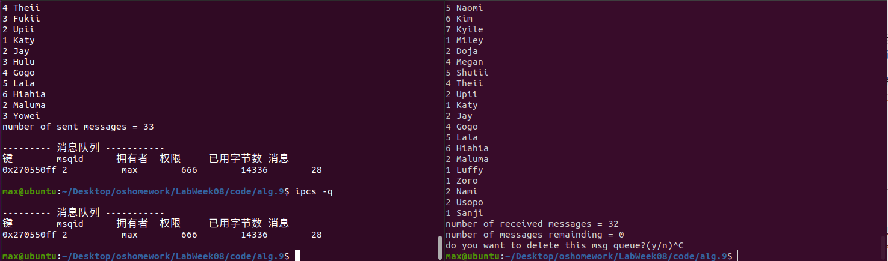
	
* 就上述出现的问题，我觉得可以在程序中，在while语句块和打印```number of messages remainding```之间可以调用```sleep()```函数休眠一会儿，来解决问题。

	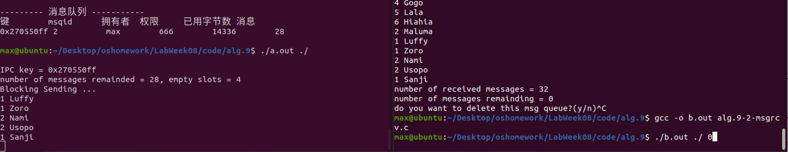
	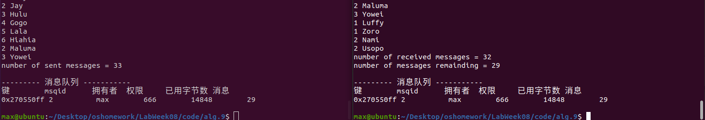
	
	> 实验结果表明这样处理能解决上述显示不同步问题。

---

## 2. 实验2 - 使用POSIX API完成消息队列都读写程序

仿照 alg.8-4~8-6,编制基于 POSIX API 的进程间消息发送和消息接收例程。

### 2.1. POSIX：类型与函数

* POSIX消息队列的名字所创建的真正路径名和具体的系统实现有关，创建的POSIX消息队列不会在文件系统中创建真正的路径名，且POSIX的名字只能以一个’/’开头，名字中不能包含其他的’/’。

#### 2.1.1. 消息队列的属性 struct mq_attr 


* ```mq_attr```结构体定义:
	```
	struct mq_attr{
	  long int mq_flags;    // Message queue flags: 0 or O_NONBLOCK
	  long int mq_maxmsg;   // Maximum number of messages. 
	  long int mq_msgsize;  // Maximum message size. 
	  long int mq_curmsgs;  // Number of messages currently queued. 
	  long int __pad[4];
	};
	```
* 我们可以直接通过里面的内容来查看当前消息队列的消息数、容量等，mq_msgsize是指定的消息队列一个单元的大小，每一个参数是可以手动修改的，根据我的测试，前三个变量的默认值依次是：0、10、8192。

* 我们可以通过```mq_getattr()```来获取某个消息队列的```mq_attr```结构体数据，该函数的参数是消息队列的ID和```mq_attr```的指针，消息队列的```ID```由```mq_open()```函数生成。

#### 2.1.2. Open、Close and Unlink

* ```mqd_t mq_open(const char *name, int oflag, mode_t mode, struct mq_attr *attr)```，用于打开/创建一个消息队列：

	* 函数参数：
		1. name：表示消息队列的名字，它符合POSIX IPC的名字规则。
		2. oflag：表示打开的方式，有必须的选项：O_RDONLY，O_WRONLY，O_RDWR，还有可选的选项：O_NONBLOCK，O_CREAT，O_EXCL，这些参数的含义已经在LabWeek06的实验报告中阐述。
		3. mode：可选参数，在oflag中含有O_CREAT标志且消息队列不存在时，才需要提供该参数。
		4. attr：可选参数，在oflag中含有O_CREAT标志且消息队列不存在时才需要。该参数用于给新队列设定某些属性，如果是空指针，那么就采用默认属性。
	* 返回值：若失败返回-1,否则返回消息队列ID。
	
* ```mqd_t mq_close(mqd_t mqdes)```： 参数为消息队列ID，用于关闭一个消息队列，**关闭后消息队列并不从系统中删除**。一个进程结束，会自动调用关闭打开着的消息队列。若失败返回-1,否则返回0。

* ```mqd_t mq_unlink(const char *name)```： 参数为消息队列名字（文件夹名），用于删除一个消息队列。消息队列创建后只有通过调用该函数或者是内核自己才能进行删除。每个消息队列都有一个保存当前打开着描述符数的引用计数器，当计数器为0时自动删除消息队列。若失败返回-1,否则返回接收到的字符串数。

#### 2.1.3. Send and Receive

* ```mqd_t mq_send(mqd_t mqdes, const char* msg_ptr, size_t msg_len, unsigned msg_prio)```，往消息队列中写入一条消息。
	* 函数参数：
		* mqdes：消息队列描述符ID；
		* msg_ptr：指向缓冲区的指针；
		* msg_len：消息的长度，其中mq_receive的该参数不能小于能写入队列中消息的最大大小，即一定要大于等于该队列的mq_attr结构中mq_msgsize的大小；如果mq_receive中的msg_len小于该值，就会返回EMSGSIZE错误；POXIS消息队列发送的消息长度可以为0。
		* msg_prio：消息的优先级；它是一个小于MQ_PRIO_MAX的数，数值越大，优先级越高；POSIX消息队列在调用mq_receive时总是返回队列中最高优先级的最早消息。如果消息不需要设定优先级，那么可以在mq_send是置msg_prio为0，mq_receive的msg_prio置为NULL。

* ```mqd_t mq_receive(mqd_t mqdes, char* msg_ptr, size_t msg_len, unsigned msg_prio)```，从消息队列中读取一条消息。
	* 函数参数与```mq_send```函数一致，需要注意```size_t msg_len```必须大于等于```mq_attr```中的```mq_msgsize```。
		
### 2.2. 程序说明 

#### 2.2.1. 程序布局

* 实验有五个文件组成：```pmsgsnd.txt```存放着准备由写入进程写进消息队列的消息；```pmsgdata.h```声明了消息队列基本单元的大小和组成；```pmsgcon.c```是控制程序，负责创建消息队列，并产生两个子进程，分别读写该消息队列；其中```pmsgsnd.c```负责堵塞状态写入，```pmsgrcv.c```负责读取消息内存信息（可指定读取个数）。

* 根据下面的指令生成三个可执行文件:

	```
	gcc -o pmsgrcv.o pmsgrcv.c -lrt
	gcc -o pmsgsnd.o pmsgsnd.c -lrt
	gcc pmsgcon.c -lrt

	gcc -o r.out pmsgrcv.c -lrt
	gcc -o s.out pmsgsnd.c -lrt
	```
	> a.out执行pmsgcon.c文件，同时读写。
	> r.out只执行消息队列的读取（每次读取6个，该参数可修改）。
	> s.out只执行消息队列的写入。
	
#### 2.2.2. 关键代码

1. ```pmsgcon.c``` 控制程序，生成消息队列和两个子进程。

	```
	mqID = mq_open(pathname, O_RDWR | O_CREAT , 0666, NULL); 
	```
	> 生产消息队列：参数选用可读可写```O_RDWR```和新建```O_CREAT```。
	
2. ```pmsgsnd.c``` 写入程序，打开消息队列写入数据。

	```
	mqID = mq_open(pathname, O_WRONLY);
	```
	> 参数选用只读```O_WRONLY```后面两个参数可以缺省。
	```
	struct mq_attr mqAttr;
	ret = mq_getattr(mqID, &mqAttr);
	if(ret == -1) {
		ERR_EXIT("pmsgsnd: mq_getattr()");
	}
	printf("\npmsgsnd: mq_maxmsg:%ld mq_msgsize:%ld mq_curmsgs: %ld\n\n", mqAttr.mq_maxmsg, mqAttr.mq_msgsize, mqAttr.mq_curmsgs);
	```
	> 获得消息队列的属性，并打印核心信息：最大消息数、消息队列消息大小、当前消息数。
	
	```
        ret = mq_send(mqID, (void *)&data, TEXT_SIZE, 0);
	```
	> 通过mq_send循环读入，最后一个参数设为0,表示使用默认的优先级。
	
3. ```pmsgrcv.c``` 读取程序，打开消息队列读取数据。

	```
	#define NUM 6
	```
	> 定义一次最多读取6条消息，以便观察消息队列变化情况。
	
	与```pmsgsnd.c```相同，调用```mq_open```(参数oflags为O_RDONLY|O_NONBLOCK，表示只读且非堵塞)，之后调用```mqAttr```获得消息队列属性，并打印。
	
	```
	int i = NUM;
    while (i--) {
        ret = mq_receive(mqID, (char *)&data, mqAttr.mq_msgsize, NULL); /* Non_blocking receive */
        if(ret == -1) { /* end of this msgtype */
            printf("pmsgrcv: Number of received messages = %d\n", count);
            break;
        }
        
        printf("pmsgrcv: receive %s\n", data.mtext);
        count++;
    }
	```
	> 循环NUM次，调用```mq_receive```。
	
	```
	if(mqAttr.mq_curmsgs == 0) {
        printf("pmsgrcv: Do you want to delete this msg queue?(y/n)");
        if(getchar() == 'y') {
            if(mq_unlink(pathname) == -1)
                perror("pmsgrcv: mq_pathname()");
        }
    }
    else{
		ret = mq_close(mqID); // message-passing quene can be removed by any process knew the filename
        if(ret == -1) {
            ERR_EXIT("pmsgrcv: mq_close()");
        }  
	}
	```
	> 结束判定：如果此时消息队列为空且用户输入`y`，调用```mq_unlink```**删除**消息队列；如果此时消息队列为空且用户输入非`y`，调用```mq_close```**关闭**消息队列，最后退出程序。
	
### 2.3. 实验分析

* 运行截图：

	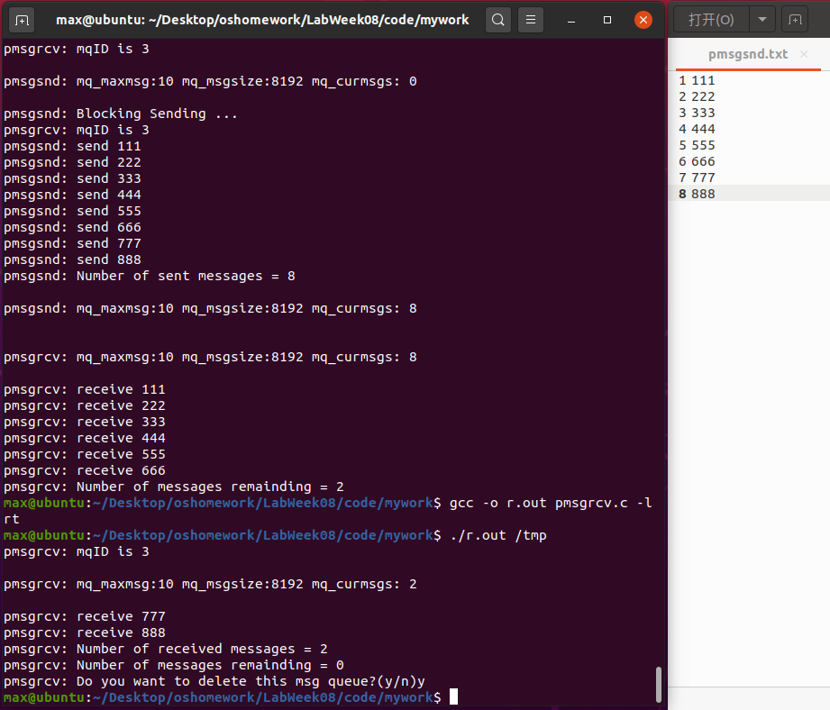
	> 可以看到，首先执行a.out，生成两个子进程，读进程先将```111~888```八条消息写入消息队列，程序显示写入后消息队列消息数```mq_curmsgs = 8```。
	> 写进程读取6条消息后结束，读取了```111~666```，读取结束后显示消息队列消息数只剩下```mq_curmsgs = 2```。
	> 由于消息队列不为空，程序不将其删除，此时运行```r.out```只执行消息队列的读取，将最后的两条消息也读了出来，此时消息队列为空，程序询问是否删除消息队列，最后结束程序。
	
---

## 3. 总结与心得

通过本次实验：

* 我们进一步熟悉了消息队列的原理，包括:
	* 消息队列的容量上限；
	* 堵塞/非堵塞的理解；
* 掌握了使用Linux内置C函数创建、管理、读写消息队列及各个函数的参数含义；
* 掌握了使用 POSIX API 创建、管理、读写消息队列及各个函数的参数含义。

---


