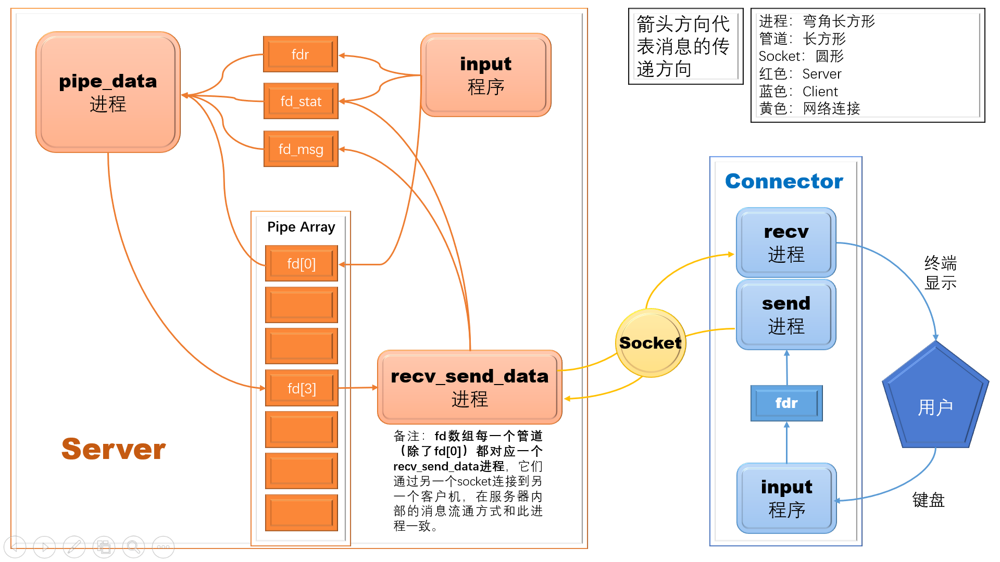
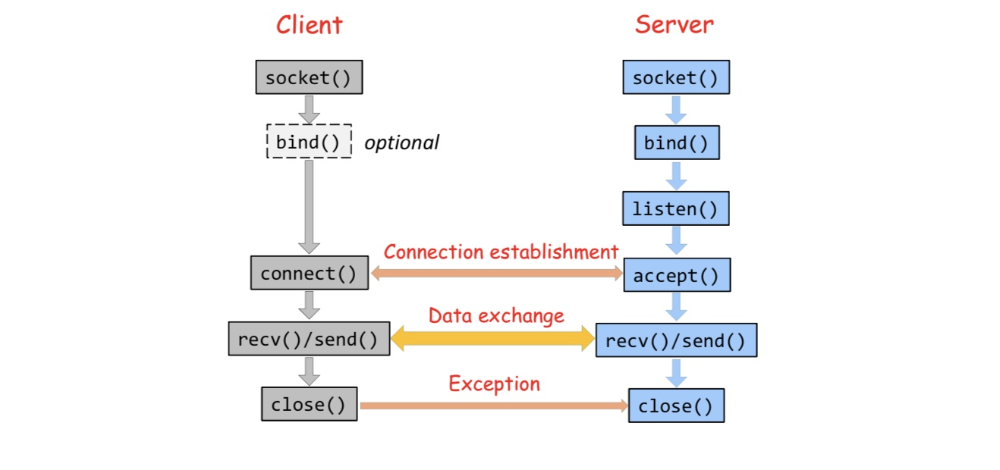
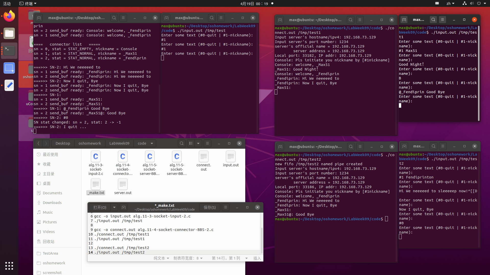
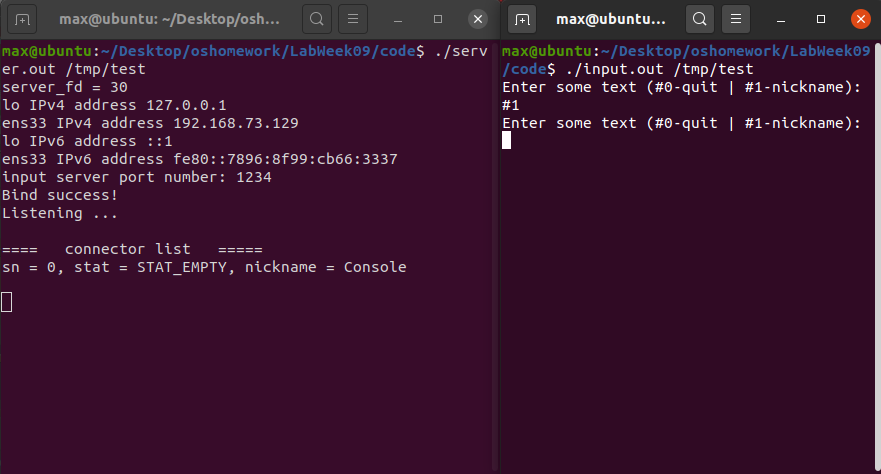
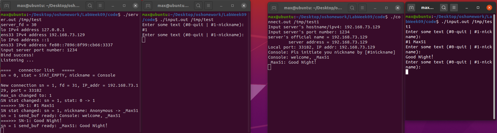
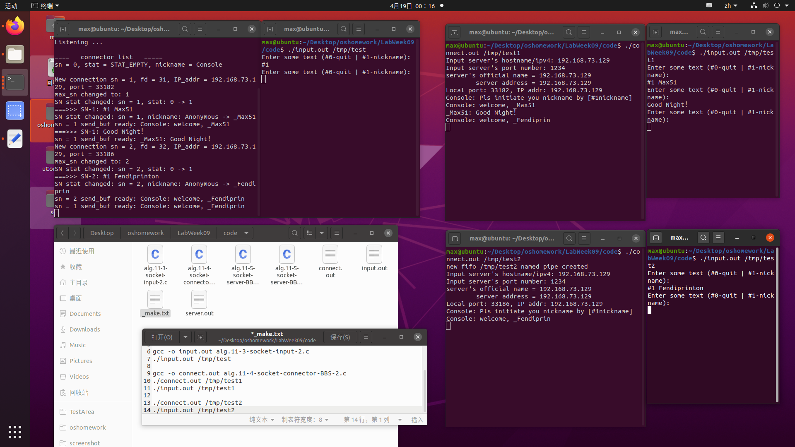
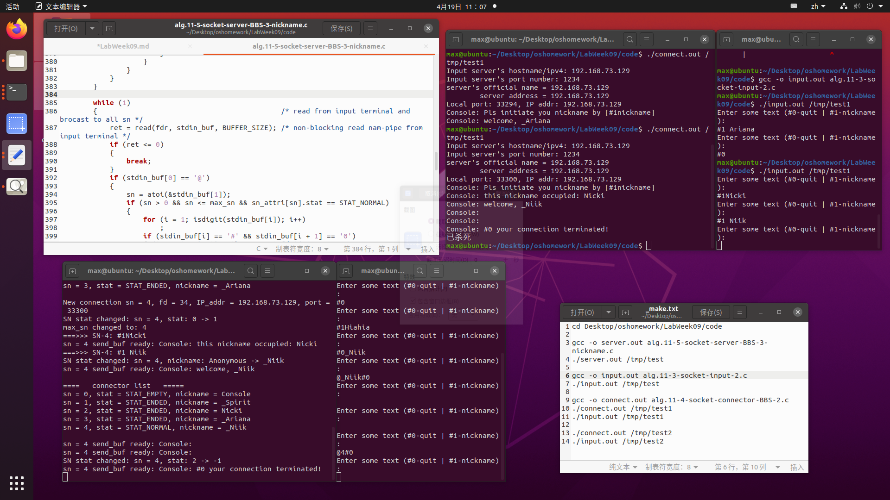
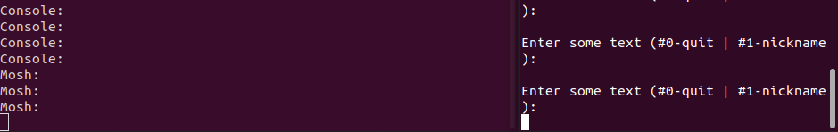
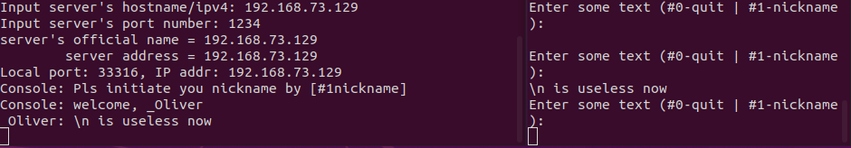

# Lab Week09 - 进程间通信-管道和socket通信

**郑有为 19335286**

如果图片或链接显示异常，请访问 [OSHomework-LabWeek09.md(Gitee)](https://gitee.com/WondrousWisdomcard/oshomework/blob/master/LabWeek09/LabWeek09.md)。我把代码和截图都放在了仓库 [OSHomework(Gitee)](https://gitee.com/WondrousWisdomcard/oshomework)。

# 目录

* 实验内容:进程间通信—管道和 socket 通信。
	* 编译运行课件 Lecture11 例程代码:
		* alg.11-3-socket-input-2.c
		* alg.11-4-socket-connector-BBS-2.c
		* alg.11-5-socket-server-BBS-3.c

[toc]

---

## 自制BBS框架图



---

# 实验内容

## 实验 - 11-3~11-5 BBS

### 实验原理和BBS构架

#### 管道原理

* 管道是一个FIFO队列，一次只能有一个进程访问管道。
* 对于管道，数据只能由一个进程流向另一个进程，如果要进行双向通信，需要建立一对管道。
* 只有有父子的进程（存在亲缘关系）才可以共享匿名管道，不相关的进程只能共享命名管道。
* 管道容量上限:在终端输入```ulimit -a```查询得到结果为```pipe size (512 bytes, -p) 8```，表示系统最多提供8个大小为512字节的管道，总共4KiB。

##### 命名管道

1. mkfifo(): 用于创建**命名管道**。
	* 函数原型： ```int mkfifo(const char *filename,mode_t mode);```
	* ````mode```是一个四位数，后三位表示拥有者、同组、他人权限级别，4+2表示可读可写。
2. open(): 用于打开**命名管道**，打开成功时返回文件描述符```fd```。
	* 函数原型：```int open(const char *pathname, int oflag, ... /* mode_t mode */);```
	
##### 匿名管道

1. pipe(): 用于创建**匿名管道**
	* 函数原型：```int pipe(int fd[2]);```
	* fd[0]是管道的出口（读出端）、fd[1]是管道的入口（写入端）。 

##### 通用操作函数

一般文件的I/O函数都可以用于管道。

1. **read(), write()**: 从打开文件中读取/写入数据.
	* 函数原型：
		* ```ssize_t read(int fd,void *buff,size_t bytes);```
		* ```ssize_t write(int fd,void *buff,size_t bytes);```
	* 参数解释：
		* fd 文件描述符
		* buff 目标缓冲区地址
		* bytes 缓冲区大小
		
2. **close(), unlink()**: 关闭文件描述符/删除一个指向文件的链接
	* 函数原型：
		* ```int close(int fd);```
		* ```int unlink(const char* pathname);```
	* 二者区别：```close```用于关闭一个文件描述符；```unlink```从文件系统中中删除一个名字，若这个名字是指向这个文件的最后一个链接，并且没有进程处于打开这个文件的状态，则删除这个文件，释放这个文件占用的空间。
	* ```unlink()``` 用于进程断开管道文件的链接\删除参数```mkfifo()```创建的管道文件。

3. **fcntl()**: 针对(文件)描述符提供控制
	* 函数原型：```int fcntl(int fd, int cmd);```等
	* 对于其参数和说明会根据程序来分析。
	
#### Socket通信

* **C/S通信模型**
	C指的是client(客户端软件),S指的是Server(服务端软件),在C/S架构中，用户之间的通信通过服务器来转发，服务器是用户消息发送和接受的中转站：用户发送给另一个用户的消息实际上是先发给服务器，服务器处理后在转发给特定的用户。
	

* **Socket数据结构**
	* 定义与头文件```#include<netinet/in.h>```中。
	* 与sockaddr不同，sockaddr_in将端口号和IP地址分别存储在两个变量中。
	* 数据结构定义：
		```
		struct sockaddr_in {
			sa_family_t sin_family; //地址族
			uint16_t sin_port; //16位端口号
			struct in_addr sin_addr; //32位IP地址
			char sin_zero[8]; //占位，不使用
		};
		struct in_addr{
			In_addr_t s_addr; //32位IPv4地址
		};
		```
		
* **SOCKET API常用操作函数**
	1. **socket()** ：获得文件描述符
		* 函数原型：```int socket(int af,int type,int protocol);```
		* 参数: 
			* af: 地址族,常用```AF_INET```，表示使用IPv4进行通信。
			* type: 指定socket类型，如TCP（SOCK_STREAM）和UDP（SOCK_DGRAM）
			* protocol: 指定协议，常用的协议有，IPPROTO_TCP、IPPROTO_UDP等，分别对应TCP传输协议、UDP传输协议。
		* 返回值：成功时返回整形描述符，否则返回-1。
	2. **bind()** ：将套接字文件描述符、端口号和IP绑定到一起
		* 函数原型：int bind(int sockfd, const struct sockaddr *addr, socklen_t addrlen);
		* 参数: 
			* sockfd: 表示socket函数创建的通信文件描述符，由socket()函数得到
			* addr: 表示struct sockaddr的地址，用于设定要绑定的ip和端口
			* addrlen: 表示所指定的结构体变量的大小
		* 返回值：成功时返回0，否则返回-1。
	3. **listen()** ：用于TCP传输，该函数不阻塞，在将该套接字和套接字对应的连接队列长度告诉内核后结束，当有一个客户端主动连接时，内核就自动完成TCP三次握手，将建立好的链接自动存储到队列中，如此重复。
		* 函数原型：```int listen(int fd, int backlog);```
		* 参数: 
			* fd 一个已绑定未被连接的套接字描述符
			* backlog 连接请求队列的长度
		* 返回值：成功时返回0，否则返回-1。
	4. **connect()** ：用于创建与指定外部端口的连接
		* 对于TCP，此函数建立客户端到服务器的连接，完成三次握手，在连接成功或失败后返回。
		* 对于UDP，没有三次握手，内核记录对方的IP和端口号，它们包含在套接口地址结构中。
		* 函数原型：```int connect(int sockfd, conststruct sockaddr *addr,  socklen_t addrlen)```
		* 参数：sockfd: 文件描述符，addr: 服务器地址，addrlen: socket地址长度。
		* 返回值：成功时返回非负描述符，否则返回-1。
	5. **accept()** ：由服务器调用，**阻塞**等待直到有客户端请求到达。
		* 函数原型：```int accept(int sockfd, struct sockaddr *addr, socklen_t *addrlen);```
		* 参数：sockfd: 文件描述符，addr: 服务器地址，addrlen: socket地址长度；addr参数为一个返回参数，其中填写的是为通讯层所知的连接实体地址；addrlen参数也是一个返回参数，在调用时初始化为addr所指的地址空间；在调用结束时它包含了实际返回的地址的长度。
		* 返回值：新的套接字描述符，它代表的是和客户端的新的连接，可以把它理解成是一个客户端的socket,这个socket包含的是客户端的ip和port信息，于是之后的send和recv函数中的fd都是指这个新创建的文件描述符。
		* 客户机通过一个服务器正在侦听的端口连接到服务器。客户机的连接将加入到服务器的等待队列中，通过调用accept()告诉客户机你有空闲的连接。它将返回一个新的套接字文   件描述符，需要区分这两个套接字-**监听套接口与已链接套接口**。
	6. **send()** ：基于TCP发送数据至目的地址端口，将需要发送的数据拷贝至发送缓冲区，否则进入阻塞或者进入超时等待，UDP常用```sendto()```函数。
		* 函数原型：```ssize_t send(int sockfd, const void *buf, socklen_t len, int flags);```
		* 参数：
			* sockfd: 指定发送端套接字描述符
			* buf: 存放要发送数据的缓冲区
			* len: 发送数据的字节数
			* flags：   一般设置为0
		* 返回值：
			* 成功执行时，返回接收到的字节数。
			* 若另一端已关闭连接则返回0，这种关闭是对方主动且正常的关闭	
			* 失败返回-1
	7. **recv()** ：基于TCP从目的地址端口接收数据，将接收缓冲区中的数据拷贝至应用层的缓冲区中，当应用缓冲区满或者接受缓冲区数据接收完，就会返回，UDP常用```recv_from()```函数。
		* 函数原型：```ssize_t send(int sockfd, const void *buff, size_t nbytes, int flags); ```
		* 参数： 与send()函数一致
		* 返回值：成功时，返回拷贝的字节数，否则返回-1。
	8. 其他常用函数：
		* **getsockname()**：```int getsockname(int sockfd, struct sockaddr *localaddr,socklen_t *addrlen); ``` 用于获取一个套接字的名字，参数localaddr为存放所获取套接字名称的缓冲区。 可以获得一个与socket相关的地址，服务器端可以通过它得到相关客户端地址，而客户端也可以得到当前已连接成功的socket的ip和端口。 
		* **setsockopt()**：用于任意类型、任意状态套接口的设置选项值，在程序分析中会详细介绍。
		* **getifaddrs()**：```int getifaddrs(struct ifaddrs **ifap);```，用于获取本机接口信息，用一个静态链表结构储存，*ifap为链表元素首地址。
		* **freeifaddrs()**：```int freeifaddrs(struct ifaddrs **ifap);```，删除getifaddrs()得到的结构体信息。
		* **inet_pton()和inet_ntop()**：2个IP地址转换函数，p和n分别代表表达（presentation)和数值（numeric)，可以在将IP地址在“点分十进制”和“二进制整数”之间转换。
		* **inet_ntoa()**：给出一个代表该地址数值的整数作，返回一个为字符串的网络地址的"点地址"(如127.0.0.1)表示，返回字符串。
		* **inet_aton()**：给出一个作为字符串的网络地址的"点地址"(如127.0.0.1)表示，返回一个代表该地址数值的整数，返回整形变量。
		* **htons()**：```uint16_t htons(uint16_t hostshort)```，用于将端口从"主机端序" 转为 “网络端序”，进行端口的大小端序的转换。
		* **ntohs()**：```uint16_t ntohs(uint16_t hostshort)```，用于将端口从"网络端序" 转为 “主机端序”，进行端口的大小端序的转换。
		
* **TCP通信框架**
	

#### BBS构架

这是一个单服务器管理，允许多个客户机进行聊天的BBS，提供私聊和群聊功能。

* **INPUT**程序```alg.11-3-socket-input-2.c```，作为**BBS的使用者输入窗口**，它检测用户输入，将信息写入一个**命名管道**，并且是非堵塞的写入。

* **CONNECTOR**程序```alg.11-4-socket-connector-BBS-2.c```，它通过管道技术读取INPUT程序发送到管道的信息，再将信息通过Socket发送给SERVER程序，它进行的存取操作都是堵塞的。

* **SERVER**程序```alg.11-5-socket-server-BBS-3-nickname.c```，结合管道和Socket技术多进程实现对客户端消息的接收和转发。

* BBS架构图：
	
	
### 实现细节解释

#### alg.11-3-socket-input-2.c

1. **设置缓冲区**：设定了大小为1字节的缓冲区```write_buf```；

2. **文件检查**：打开作为参数传入的文件夹名，其中，通过```access(fifoname, F_OK)```来检查该文件夹是否存在（ 参数```F_OK```用于测试文件是否存在）；

3. **创建命名管道**：若文件还不存在，则通过```mkfifo(fifoname, 0666)```来创建一个命名管道，否则在终端输出该命名管道已创建的提示。

4. **打开命名管道**（仅提供写入）：通过```fdw = open(fifoname, O_RDWR);```来打开一个命名管道，若成功则将文件描述符赋值给```fdw```。

5. **设置管道非堵塞**：调用```flags = fcntl(fdw, F_GETFL, 0);```来取得fd的文件状态标志，F_GETFL为此功能对应选项；再调用```fcntl(fdw, F_SETFL, flags | O_NONBLOCK);```更新文件描述符的状态，使用或运算来将flags与O_NONBLOCK(非堵塞)或在一起，来设置它的非堵塞属性。

6. **处理用户输入**：循环等待输入，过滤掉用户输入的空行符，使用Write()函数写入命名管道，若管道堵塞，则提示用户等待片刻后重新输入。

7. **关闭文件**：调用```close(fdw);```关闭文件并结束程序。

#### alg.11-4-socket-connector-BBS-2.c

1. **打开命名管道**：进行文件权限检查```access(fifoname, F_OK)```，查看命名管道状态，若不存在，则调用```mkfifo```开启命名管道，再打开命名管道```fdr = open(fifoname, O_RDWR)```。

2. **设置域名/IP和端口号**：用户输入域名/IP地址和端口号，在程序中，每次键盘输入完成后，会执行```while((clr = getchar()) != '\n' && clr != EOF);```来清空输入流缓冲器。

3. **获取服务器信息**：通过域名/IP地址来获取主机信息，根据输入的域名/IP和端口号，若输入的是域名，则通过调用```gethostbyname(stdin_buf);```来从域名获取IP地址等信息，存放在```hostent```结构体```host```中，该结构体记录了主机的信息,包括主机名、别名、地址类型、地址长度和地址列表等，再对主机的IP地址列表中的每一个元素调用```inet_ntop```，将IP地址在二进制整数转换成点分十进制。
	* hostent结构体如下：
		```
		struct hostent  
		{  
		    char *h_name;         //正式主机名 
		    char **h_aliases;     //主机别名 
		    int h_addrtype;       //主机IP地址类型：IPV4-AF_INET 
		    int h_length;         //主机IP地址字节长度，对于IPv4是四字节，即32位 
		    char **h_addr_list;   //主机的IP地址列表 
		}; 
		```

4. **调用```socket()```函数**：创建连接套接字（connection socket）描述符```connect_fd```，函数参数选择：```AF_INET,SOCK_STREAM,0```表示使用IPv4进行TCP通信。

5. **调用```connect()```函数**：设置```sockaddr_in```结构体，并为各变量赋值：指定协议族为```AF_INET```，端口号，服务器IP地址；调用```connect()```函数向服务器发起连接；成功后调用```getsockname()```函数，得到当前已连接成功的```sock_addr```结构```connect_addr```，输出本地端口号和本机IP地址。

6. **双进程收发信息**：使用```fork()```创建一个子进程；
	* 父进程执行循环，负责从命名管道中读取数据（堵塞接收），然后再通过send()函数通过connect_fd发送给服务器（堵塞发送）；
	* 若发送的信息为"#0"，表示客户机请求退出聊天，关闭管道和Socket，在父进程结束前，调用```kill(childpid, SIGKILL);```杀死子进程。
	* 子进程负责从```connect_fd```中接收消息，并输出到该Connector的终端上；
	* 若接收的信息为"Console: #0"，表示该客户端被踢出聊天，关闭Socket，在子进程结束前，调用```kill(getppid(), SIGKILL);```杀死父进程。

#### alg.11-5-socket-server-BBS-3.c

1. **定义全局变量**：包括客户端状态数组，专用管道数组。
	1. 定义结构体数组，管理每一个客户端：
		```
		struct {
		    int stat; // 管理客户状态：STAT_EMPTY STAT_NORMAL STAT_ENDED
		    char nickname[NICKNAME_L]; // 存储客户端的名称，长度限制为10个字节
		} sn_attri[MAX_CONN_NUM+1]; // 规定服务器最多同时管理10个客户端
		int connect_sn, max_sn; // 记录当前套接口编号和当前的最大套接口编号 
		```
	2. 定义二位数组，为每一个客户端提供一个管道：
		```
		int server_fd, connect_fd[MAX_CONN_NUM+1];
		int fd[MAX_CONN_NUM+1][2]; // 管道数组，提供数据的传收。
		// fd[0][0] 用于pipe_data()函数中获得 max_sn （当前的最大套接口编号）
		// 其余管道用于在recv_send_data(sn)函数中给每一个客户端提供
		int fd_stat[2]; 
		// ordinary pipe: pipe_data() gets stat of connect_sn from main()
		// 管道：用于pipe_data()函数从main()函数获得客户机的状态。
		int fd_msg[2];  
		// ordinary pipe: pipe_data() gets message of connect_sn from recv_send_data() 
		// 管道：用于pipe_data()函数从recv_send_data()函数获得客户机发送的消息。
		int fdr;   
		// 一个单向命名管道，用于pipe_data()函数接收终端的标准输入流。
		// named pipe: pipe_data() gets stdin_buf from input terminal
		```
	3. 定义两个```sockaddr_in```结构```server_addr```和```connect_addr```。
	
2. **```int getipv4addr(char *ip_addr);```函数：**
	1. 创建```ifaddrs```指针```ifaddrsptr```，通过```getifaddrs(&ifaddrsptr);```获得本地的网络接口信息的链表。
	2. 遍历链表，得到所有IPv4/IPv6地址并输出到终端，找出**本地IPv4地址 （```ifa->ifa_name == "lo"```）并返回给传入的参数```ip_addr```中**。
	
3. **```void pipe_data(void);```函数：负责处理客户端的诸多管道**
	这个函数的主要功能是：获取客户端/服务端INPUT程序的输入，更新```max_sn,sn_stat,sn_nickname```，选择指定的客户端转发（如果接受的信息有要求的话）。
	1. 调用```fcntl```函数（参数为F_GETFD）获得四个管道```fd[0][0],fd_stat[0],fd_msg[0],fdr```的文件描述符标记，并根据标记再次调用``fcntl```函数（参数为F_SETFL）对每一个管道进行设置，设置为**非堵塞状态**。
	2. **while循环**： 
		1. while循环里的第一个while循环，负责获取管道```fd[0][0]```的当前的最大套接口编号```max_sn```，当前SOCKET的总数量，每当该数据更新就输出以显示客户机数量的变化。
		2. while循环里的第二个while循环，负责获取管道```fd_stat[0]```中的信息 - SOCKET的名字和状态，如果某个客户机状态改变了，该管道的信息就会更新，随即输出以显示对应客户机的状态变化信息。
		3. while循环里的第三个while循环，负责**向客户端管道发送服务端从某个客户端收到的消息**：包括服务端发送的关闭请求、改名请求和群发/私发普通消息。
			1. 首先通过read()函数获取管道```fd_msg[0]```中的字符串信息，并对该信息进行识别。
			2. 若信息包含"#0"，则表明客户端请求断开连接，此时将状态置为```STAT_ENDED```，并打印退出信息。
			3. 若信息包含"#1"，则表明客户端请求重命名，（注意要将空格改为"_"，将"\n"删除），打印改名信息，并通过```write```函数向所有客户端（包括自己）发送该用户已经改名的提示。
			4. 若信息包含"@",则表明是发送给**指定客户端**的普通信息，修改所指定的服务器管道为非堵塞后，调用```write()```发送，消息格式满足```"%s@: %s"```，前者是发送者的名字，后面是发送的消息。
			5. 若发送的信息没有上述的特定标识，则为默认群发的普通信息，修改所有的服务器管道为非堵塞后，调用```write()```发送，消息格式满足```"%s@: %s"```，前者是发送者的名字，后面是发送的消息。
		4. while循环里的第四个while循环，负责**向客户端们发送服务端发送的消息（Console）**：包括强制关闭某个客户端、群发/私发消息。
			1. 首先通过read()函数获取管道```fdr```中的字符串信息，并对该信息进行识别。
			2. 若信息包含"@"，先判断@的是那一个客户端
				1. 判断信息若包含```#0```，表明要求对应的客户端请求断开连接，更新```sn_attri[sn]```后，将"#0 your connection terminated!"写入到```fd[sn][1]```的管道。
				2. 若不含```#0```则为普通信息，将对应管道```fd[sn][1]```置为非堵塞后直接写入即可。
			3. 若信息不包含"@"，即群发信息，使用for循环将信息写给每一个管道```fd[sn][1]```即可。
			
		* **第三个while和第四个while的不同之处在于消息的来源：前者是某个客户端；后者是服务器**。
		
4. **```void recv_send_data(int sn);```函数：负责客户端序号为sn的Socket收发**
	1. 在while循环中非堵塞调用```recv()```，若从```connect_fd[sn]```中收到消息，则在服务机终端输出消息内容，并调用```write()```，**堵塞**写入到服务器消息处理管道```fd_msg[1]```中。
	2. 另一边，在while循环中非堵塞调用```read()```,从对应客户端管道```fd[sn][0]```中读取新的消息，然后再调用```send()```函数**堵塞**发送给```connect_fd[sn]```。
	3. 每次完成上述一个循环，休眠一秒（心跳），避免资源竞争。
	
5. **主函数：**
	1. **管道创建**：
		1. 创建服务器命名管道```fdr```，收发堵塞。
		2. 创建```MAX_CONN_NUM```个匿名管道，存放在二位数组```fd```中，用于连接和管理客户端。
		3. 创建匿名管道：```fd_stat```，```fd_msg```用于存储管道状态和临时信息。
	2. **Socket创建和初始化**：
		1. 初始化```sn_attri```结构体，将状态都置为```STAT_EMPTY```，对0号结构体命名为```Console```，其余为```Anonymous```。
		2. 调用```socket```函数获得服务器的一个套接口的描述字```server_fd```，然后调用```getipv4addr```函数获取本机网络接口IP的字符串。
		3. 等待管理员输入端口号，为```sockaddr_in```结构体```server_addr```的个成员（协议族，端口号，IP地址）赋值。
		4. 调用```setsockopt()```函数设置套接口属性：```setsockopt(server_fd, SOL_SOCKET, SO_REUSEADDR, &opt_val, sizeof(opt_val));```，参数解释如下：
			* server_fd 是将要被设置或者获取选项的套接字描述字
			* 选项所在的协议层 - SOL_SOCKET: 通用套接字选项
			* 需要访问的选项名 - SO_REUSERADDR: 允许重用本地地址和端口
			* 返回选项值的缓冲 - optval
		5. 调用```bind()```函数将```server_fd```与```server_addr```绑定。
		6. 调用```listen()```函数开始监听，最多可以与客户端建立MAX_QUE_CONN_NM个连接。
	3. **创建多进程调用函数**：创建多个子进程，一个```pipe_pid```和多个```recv_pid```。
		1. 创建```pipe_pid```子进程，负责调用```pipe_data()```函数。
		2. 在创建一个```recv_pid```子进程之前，父进程调用```accept()```函数获得已链接套接口，存储在```connect_fd```数组中，并输出新连接的套接口Socket编号、文件描述符、IP和端口。之后，调用```write()```函数堵塞将套接字编号和状态写到临时状态管道```fd_stat[1]```中（这样```pipe_pid```进程就可以读取里面的内容并做相应操作）。
		3. 创建```recv_pid```子进程，负责调用```recv_send_data(connect_sn);```函数。
		4. 父进程往Console管道```fd[0]```写入当前的最大套接口编号，接着进入下一次循环，创建下一个```recv_pid```子进程。
	4. **程序终止前的处理**：对每一个套接口（包括```connect_fd```数组和```server_fd```）调用```close()```函数，退出程序。
		
#### alg.11-5-socket-server-BBS-3-nickname.c

该程序是对上一个程序```alg.11-5-socket-server-BBS-3.c```的改进，下面是不同点的整理。

1. 在客户机状态管理上，添加了新的状态```STAT_ACCEPTED```和```STAT_UNKNOWN```。

2. 新增了函数```void sleep_ms(long int timegap_ms);```，实现微秒级别的休眠，以获得更小的心跳（上一个程序是1秒），现在是1微妙。

3. 提供了昵称初始化的功能，昵称初始化后才能将状态从```STAT_ACCEPTED```升级到```STAT_NORMAL```（不支持匿名聊天）。关于昵称，是全局唯一的，创建时会进行查重，也不允许命名为"Anonymous"。

4. 提供新的指令```#2```，客户端可以输入以返回当前已连接的客户机的信息表，包括名称编号、状态和名称，服务器段只需要返回```#```就可以查看客户机的信息表。

### 系统调用测试结果

对程序进行了测试，测试流程如下：

1. 首先我创建了六个终端，如图：左上角为**服务器**的程序和服务器对应的INPUT程序，他们通过管道进行通信；右上角为**客户机_1**的程序和服务器对应的INPUT程序；右下角为**客户机_2**的程序和服务器对应的INPUT程序；服务器程序运行的是```alg.11-5-socket-server-BBS-3-nickname.c```文件，客户机运行的是```alg.11-4-socket-connector-BBS-2.c```，运行参数在下面会介绍。

	
	
2. **服务器启动**：
	* 左侧显示框：输入```gcc -o server.out alg.11-5-socket-server-BBS-3-nickname.c```编译程序，运行程序时选择参数```/tmp/test```，即```./server.out /tmp/test```，端口号输入```1234```。
	* 右侧输入框：输入```gcc -o input.out alg.11-3-socket-input-2.c```编译程序，运行程序时选择参数```/tmp/test```，即```./input.out /tmp/test```，得到下图效果：
	
	
3. **客户机_1启动**：
	* 左侧显示框：输入```gcc -o connect.out alg.11-4-socket-connector-BBS-2.c```编译程序，运行程序时选择参数```/tmp/test1```，因为在一台机器上测试，不能与服务器的管道文件位置相同，即```./connect.out /tmp/test1```，IP地址为```192.168.73.129```（不知道为什么填localhost会连接失败），端口号输入```1234```。
	* 右侧输入框：输入```gcc -o input.out alg.11-3-socket-input-2.c```编译程序，运行程序时选择参数```/tmp/test1```，即```./input.out /tmp/test1```
	* 其他客户机的启动同理，需要注意管道文件位置不能相同。
	
4. 如图，客户机_1修改名称为_Max51，并发送了一条普通消息。我们可以在服务器的终端上看到```New connection...```,表示链接成功，```#1 _Max51```也显示在服务器终端上，显示用户将名称从匿名改为```_Max51```，还发送了一条``Good Night```，客户机_1的显示终端上也可以看到消息的更新。
	

5. 如图，客户机_2加入，并修改名称为_Fendiprinton，但由于名字限制10个字节，故名字改成了_Fendiprin，可以在服务器的终端上看到```New connection...```和```Welcome```的信息,表示链接成功，在```_Max51```上也显示了新用户加入的信息。
	

6. 如图，客户机_2与客户机_1互相发送消息,最后客户机_2准备离开，输入```#0```后结束程序（只结束了CONNECT程序，INPUT程序需要Crtl+C来关闭，关闭后在```Console```和```_Max51```上也显示了用户退出的信息，并更新客户状态数组的状态。
	

7. 如图，服务端输入```@4#0```强制断开编号为4的客户端的连接，客户端那边返回进程被杀死（服务器也可以通过```@4```给编号为4的客户端单独发消息）。
	

### 代码改进

1. 在运行实验过程中发现一个问题，就是Input程序不会在用户退出聊天室后自动关闭，对此我们修改程序，让Input程序在输入```#0```后也能自动结束。
	* 修改只需要在while循环的最后，做一次字符串判定就好了：
		```
		if(strcmp(write_buf,"#0") == 0){
			break;
		}
		```
	* 试验结果：输入```#0```后Input能正常退出了。
		!(6)[./screenshot/LabWeek09_6.png)
		
2. 新增功能：防止发送空消息
	* 如图，输入```\n```，会发送空消息。
		
	* 同样修改Input程序，在发送前做是否为空的判定即可。
		```
		//while
		//...
		if(strlen(write_buf) == 0){
            	continue;
            }
        ret = write(fdw, write_buf, BUFFER_SIZE);
		```
	* 试验结果：空消息不会被发送了。
		
		
---

# 实验心得

通过本实验进一步了解了实现进程间通信的两种方式：管道和套接字，通过理解BBS程序，不仅深入了解了管道和套接字的基本原理，还了解了在套接字编程中众多的操作函数和进行套接字编程时需要注意的细节，比如IP地址的字符串和数字的转化，读写接收的堵塞/非堵塞的布局安排。

对本次实验感悟颇深，第一次意识到短短一千行代码就可以实现一个基本的群聊聊天程序。

---
