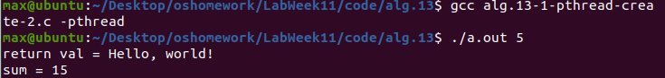

# Lab Week11 - 线程(1)

**郑有为 19335286**

如果图片或链接显示异常，请访问 [OSHomework-LabWeek11.md(Gitee)](https://gitee.com/WondrousWisdomcard/oshomework/blob/master/LabWeek11/LabWeek11.md)。我把代码和截图都放在了仓库 [OSHomework(Gitee)](https://gitee.com/WondrousWisdomcard/oshomework)。

## 目录

* 实验内容：线程（1）。
    * 编译运行课件 Lecture13 例程代码：
        Algorithms 13-1 ~ 13-8.
* 实验报告
    * 实验内容的原理性和实现细节解释，包括每个系统调用的作用过程和结果。
  
[toc]

## 多线程API常用库函数

### Pthread
0. 库函数说明：

	```
	#include <stdio.h>
	#include <stdlib.h>
	#include <pthread.h>
	/*编译器选项： gcc -lpthread | -pthread */
	```

1. ```pthread_create```：用于创建一个线程

	* 它的功能是创建线程，在线程创建以后，就开始运行相关的线程函数。 
	* 函数原型：
		```
		int pthread_create(
             pthread_t *restrict tidp,   //新创建的线程ID
             const pthread_attr_t *restrict attr,  //线程属性，默认为NULL
             void *(*start_rtn)(void *), //线程函数地址
             void *restrict arg //参数地址传入
        );
		```
	* 需要注意的问题：
		1. 传递参数：
			* 避免直接在传递的参数中传递发生改变的量，否则会导致结果不可测。 
			* 通常申请一块内存，存入需要传递的参数，再将这个地址作为arg传入。
		2. 防止内存泄漏：
			* 在默认情况下通过```pthread_create```函数创建的线程是非分离属性的，由pthread_create函数的第二个参数决定，在非分离的情况下，当一个线程结束的时候，它所占用的系统资源并没有完全真正的释放，也没有真正终止。
			* 只有在pthread_join函数返回时，该线程才会释放自己的资源。
			* 或者是设置在分离属性的情况下，一个线程结束会立即释放它所占用的资源。


2. ```pthread_exit```：终止线程
	* 函数原型：```void pthread_exit __P ((void *__retval)) __attribute__ ((__noreturn__));```
	
3. ```pthread_join```：让该线程进入等待状态，等待另一个线程

	* 函数原型“```int pthread_join __P ((pthread_t __th, void **__thread_return));```
	* 第二个参数为一个用户定义的指针，存储被等待线程的返回值，可以在线程中```malloc```再返回。
	* 该函数会一直阻塞调用线程，直到指定的线程终止。当```pthread_join()```返回之后，应用程序可回收与已终止线程关联的任何数据存储空间。 
	* 一个线程不能被多个线程等待，否则第一个接收到信号的线程成功返回，其余调用pthread_join的线程则返回错误代码ESRCH。
	
### OpenMP

* 函数库：```omp.h```

下面是一部分常用的语法，每个声明后接一个花括号的代码块。

1. ```#pragma omp parallel``` 
   用在一个代码段之前，表示这段代码将被多个线程并行执行

2. ```#pragma omp parallel num_threads(n)```
	指定下面的代码块由n个并行线程实现，而任务的分配取决与OpenMP的内部实现。

3. ```#pragma omp for ```
   表示for循环的代码将被多个线程并行执行

4. ```#pragma omp single```
   表示后面的代码段将被单线程执行

5. ```#pragma omp for reduction(+ : rms) ```
    reduction子句为变量指定一个操作符，每个线程都会创建reduction变量的私有拷贝，在OpenMP区域结束处，将使用各个线程的私有拷贝的值通过制定的操作符进行迭代运算，并赋值给原来的变量。

### Linux clone()

* Linux只用任务，部分线程和进程，如需创建线程，使用```clone()```函数，带入参数```CLONE_FS,CLONE_VM,CLONE_SIGHAND,CLONE_FILES```（分别表示：**共享文件系统信息、共享相同的内存空间、共享信号处理程序、共享一组打开的文件**），即可创建一个和线程有同样逻辑功能的结构。

* ```clone()```参数：

  ```c
  CLONE_PARENT  创建的子进程的父进程是调用者的父进程，新进程与创建它的进程成了“兄弟”而不是“父子”
  
  CLONE_FS          子进程与父进程共享相同的文件系统，包括root、当前目录、umask
  
  CLONE_FILES     子进程与父进程共享相同的文件描述符（file descriptor）表
  
  CLONE_NEWNS  在新的namespace启动子进程，namespace描述了进程的文件hierarchy
  
  CLONE_SIGHAND  子进程与父进程共享相同的信号处理（signal handler）表
  
  CLONE_PTRACE  若父进程被trace，子进程也被trace
  
  CLONE_VFORK    父进程被挂起，直至子进程释放虚拟内存资源
  
  CLONE_VM          子进程与父进程运行于相同的内存空间
  
  CLONE_PID         子进程在创建时PID与父进程一致
  
  CLONE_THREAD   Linux 2.4中增加以支持POSIX线程标准，子进程与父进程共享相同的线程群
  ```
### 信号处理

* 信号用来向通知一个进程发生了某个特定的事件，进程接受后需要作出相应处理，信号有内核提供的默认信号，包括kill(9),用户也可以重写信号处理程序。对于线程而言，信号接受方有几种情况：进程的所有线程接收，单个线程接收，特定线程接收并处理。

* 可以使用```kill()```来发送信号，或者使用POSIX的```pthread_kill```来发送信号给特定任务。

* 可以执行```kill -l```来获取信号列表，包括常规信号（每次产生一次记录），和实时信号（支持阻塞队列）。

* 操作结构体和函数在程序代码理解中说明，包括```sigaction```结构体，```sigaction()```函数等。

## 代码理解与运行结果

### Pthread API

#### 单个线程创建

这组程序（13-1）的基本结构相同：先是显示申请一个创建变量```pthread_t```和```pthread_attr_t```，后者通过调用```pthread_attr_init```函数来进行初始化，调用```pthread_create()```函数创建线程，并将线程的ID返回给创建的```pthread_t```变量，此后主程序调用```pthread_join()```函数堵塞等待线程返回，创建的线程则调用```runner()```函数，计算表达式：sum = 1 + 2 + ... + upper，线程结束调用```pthread_exit()```返回，主函数输出线程的计算结果。

它们的不同点在于参数的类型和传进线程函数的方式，下面一一分析，给出运行结果。

* ```alg.13-1-pthread-create.c```

	* 在该程序中，变量```sum```是全局变量，线程函数可以直接访问对其进行查改，变量```upper```是主函数申请的局部变量，以指针的形式通过```pthread_create()```传入线程函数```runner```中。

* ```alg.13-1-pthread-create-1-1.c```

	* 程序细节：在该程序中，变量```sum```和变量```upper```的属性与```alg.13-1-pthread-create.c```中的相同，不同之处在于该程序在调用```pthread_join(ptid, (void **)&retptr)```函数时传入了一个主函数局部变量的指针，线程函数```runner```通过```malloc```动态申请了一个4字节空间，并赋值为16，最后通过调用```pthread_exit((void *)retptr)```将指向所申请的内存空间的指针```retptr```返回给主函数的```retptr```，主函数可以读取指针指向的内容，最后需要在主函数释放```free```线程函数所申请的内存空间。
	* 理论分析：在这里，如果retptr返回的是线程函数申请的局部变量，程序则会出错。因为malloc所申请的内容保存在一个进程的堆空间中，由一个进程的所有线程共享，都可以通过指针访问该位置，而县城函数内的临时变量位于线程的栈空间，函数结束后即销毁。

* ```alg.13-1-pthread-create-1-2.c```

	* 程序细节：在该程序中，变量```sum```和变量```upper```的属性与```alg.13-1-pthread-create.c```中的相同，不同之处在于该程序在调用```pthread_join(ptid, (void **)&retptr)```函数时传入了一个主函数局部变量的指针，与上一个程序不同，线程函数```runner```最后通过调用```pthread_exit((void *)&sum)```将指向全局变量```sum```的指针`返回给主函数的```retptr```，主函数可以读取指针指向的内容。
	* 理论分析：全局变量位于程序的静态数据域，所有线程可访问，返回全局变量的地址自然不会出错。

* ```alg.13-1-pthread-create-1-3.c```

	* 程序细节：在该程序中，变量```sum```为就主函数局部变量，```upper = 10```，调用```pthread_create()```函数时传入```sum```的指针，线程函数```runner```获取该指针，并对其指向的位置进行赋值，最后通过调用```pthread_exit((void *)sum)```返回给主函数的```retptr```，主函数可以读取指针指向的内容或者直接访问```sum```获取结果。
	* 理论分析：主函数变量以指针的形式传入一个函数，该函数显然可以对其进行访问和修改，但若直接将```sum```传入，则会被线程函数视为局部变量，主函数的```sum```不会被```runner```修改。

	* 上述四个程序的调用结果：
	
		

* ```alg.13-1-pthread-create-2.c```

	* 程序细节：在线程函数内部使用```malloc()```申请一个字符数组的空间通过```pthread_exit()```返回给主程序，主程序可以取得其中内容，需要调用```free```并置空指针。

	* 程序调用结果：
	
		

#### 多个线程创建

* ```alg.13-1-pthread-create-3.c```

	* 该程序创建了多个线程，每个线程执行```ftn```函数，该函数负责将传入的参数和线程ID返回给主线程。
	* 在传入参数时，各线程传入的都是同一个参数，住不过参数随循环次数而递增，因为是同一个参数的缘故，多个线程的指令发生交错，发生资源竞争（临界区问题），导致传入的参数的值是不确定的。
	* 程序调用结果：
	
		

* ```alg.13-1-pthread-create-3-1.c```

	* 该程序对程序```alg.13-1-pthread-create-3.c```进行修改，每隔1秒创建一个线程，避免了资源竞争且固定了进程创建的顺序，但也延长了程序执行时间。
	* 程序调用结果：
	
		
	
* ```alg.13-1-pthread-create-4.c```

	* 该程序对程序```alg.13-1-pthread-create-3.c```进行修改，用一个数组分离每个线程待传入的参数，避免了资源竞争的问题，程序能够正确地输出。
	* 程序调用结果：
	
		
	
#### 多线程与共享内存

* ```alg.13-2-pthread-shm.c```

	* 该程序模拟多线程访问共享内存的情况，对于一个结构体中不同的变量，不同线程可以同时访问而不受影响。
	* 程序调用结果：
	
		

#### 线程堆栈申请上限测试

* ```alg.13-3-pthread-stack.c```

	* 该程序调用```pthread_attr_setstack(&tattr, stackptr, STACK_SIZE)```指定线程所使用的近2G的堆栈，在线程函数内部，递归使用1KB的堆栈，直至栈满报错。
	* 程序调用结果：
	
		

### OpenMP API

编译时需要加入参数```-fopenmp```。

* ```alg.13-4-openmp-demo.c```
	* 该程序一次并行1、2、4、6个线程，打印输出，观察试验结果。
	* 程序调用结果：可以看到，系统调用```syscall(186)```的结果（线程ID）都是不同的，并且出现了复用的情况。
	
		
		
* ```alg.13-5-openmp-matrixadd.c```
	* 该程序实现多线程矩阵加法，计算两个矩阵的和，分别使用单个、2个、4个进程完成计算，并比较其耗时。
	* 微秒级计时器框架：
		``` c
		#include <sys/time.h>
		#include <ctype.h>

		long start_us, end_us;
		struct timeval t;
		gettimeofday(&t, 0);
		start_us = (long)(t.tv_sec * 1000 * 1000) + t.tv_usec;
		// computing
		gettimeofday(&t, 0);
		end_us = (long)(t.tv_sec * 1000 * 1000) + t.tv_usec;
		printf("Overhead time usec = %ld, with no omp\n", end_us-start_us);	
		```
	* 程序调用结果：可以初步看到，使用omp，当矩阵规模为10时，多线程更耗时，由于本地电脑的限制，虚拟机只用两个核，所以两核的耗时小于四核。
	
		

### 多线程下使用fork()

* ```alg.13-6-fork-pthread-demo1.c```
	* 该程序一次在创建一个线程后调用```fork()```，子进程将```i```置为1，线程函数循环输出```i```，观察输出可以看到即使子进程复制了线程空间，但没有在执行线程函数```thread_worker()```，因此输出全为0。
	* 程序调用结果：可以看到，程序调用系统调用```ps -l```程序循环输出0。
	
		
		* in child: 第二行为主进程，第三行为主进程创建的线程，第四行为子进程。
		* 子进程结束后，in parent: 第二行为主进程，第三行为主进程创建的线程。
		
		
		* 输出为0,表示都是主进程创建的线程的输出。
		
* ```alg.13-7-fork-pthread-demo2.c```
	* 该程序一次在创建一个线程后，在线程函数```thread_worker()```内调用```fork()```，线程创建子进程，线程函数输出0或者1,分别表示主进程和子进程。
	* 程序调用结果：线程fork的子进程没有结束，在程序结束后仍然在运行，输入```pkill -f a.out```杀死进程。	
		* 观察0/1输出，只在最前面输出过一次0,后全为1，只输出一次0，，是因为没有join，主线程先结束了，导致线程也结束，但是线程创建的子进程没有结束，于是就一直输出1。
		* 观察```ps -l```结果：第一行为主进程，第二行为线程，第三行为线程创建的子进程
		
		
		
	* 现尝试注释掉第41行代码```return 1```，观察试验结果，可以看到0,1交替出现，调用control+C可以直接结束程序。
		
		
		
### 信号处理

* ```alg.13-8-sigaction-demo.c```
	* 代码分析：
		* 该程序用于捕获Ctrl+C信号，并做相应输出。
		
		* 该程序首先创建一个```struct sigaction```结构体变量```newact```，并将其结构体中的变量```sa_handler```置为我们定义的处理函数，实现用户处理信号，然后，调用```sigemptyset(&newact.sa_mask)```将原先的信号集清空（其中sa_mask制定在调用过程中那些信号要被堵塞），调用```sigaddset(&newact.sa_mask, SIGQUIT)```将SIGQUIT（Ctrl+\）加入到信号集中，调用```sigaction(SIGINT, &newact, NULL)```函数安装信号：将```SIGINT:Ctrl+C```信号与newact绑定。
		
		* ```sigaction()```函数原型：```int sigaction(int signo, const struct sigaction *act, struct sigaction *restrict oact); ```，第三个参数一般为空。
		
		* ```my_handler()```函数相应信号，输出后休眠十秒。
		
	* 程序调用结果：检测```Ctrl+C```并调用```my_handler()```函数，休眠十秒，在次期间的```Ctrl+C```都会被捕获并在该次处理结束后处理，```Ctrl+\```可以结束程序，会等```my_handker()```函数执行完毕在结束程序，并返回核心已转储。
	
		
	
# 实验心得

在本次实验中，学习了利用POSIX的Pthread API进行线程创建和管理的方法，和需注意的细节，如变量和参数的设计，线程下调用```fork()```可能带来的问题等，了解了OpenMP的基本方法，和用户信号处理的实现方法。


