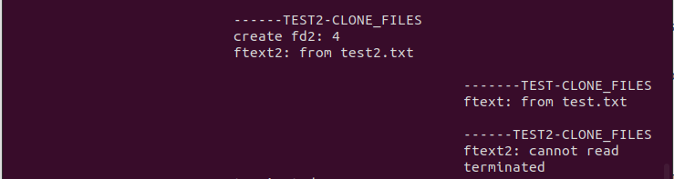

# Lab Week12 - 线程(2)

**郑有为 19335286**

如果图片或链接显示异常，请访问 [OSHomework-LabWeek12.md(Gitee)](https:gitee.com/WondrousWisdomcard/oshomework/blob/master/LabWeek12/LabWeek12.md)。我把代码和截图都放在了仓库 [OSHomework(Gitee)](https:gitee.com/WondrousWisdomcard/oshomework)。

## 目录

* 实验内容:线程(2)。
	* 编译运行课件 Lecture14 例程代码:
		* Algorithms 14-1 ~ 14-7.
	* 比较 pthread 和 clone() 线程实现机制的异同
	* 对 clone() 的 flags 采用不同的配置,设计测试程序讨论其结果
		* 配置包括 COLNE_PARENT, CLONE_VM, CLONE_VFORK, CLONE_FILES, CLONE_SIGHAND, CLONE_NEWIPC, CLONE_THREAD
		
[toc]
 
## 理论内容
 
### 线程局部变量

* 创建TLS的方法：
	1. 全局声明：`__thread int tlsvar = 0;`就好了。
	2. 全局声明：`static pthread_key_t key;`，（each thread associates global log_key with one local variable of the thread，the associated local variable behaves like a global variable by use of log_key）然后：
		* `pthread_key_create(&key, &close_log_file);`，第二个参数是函数指针，用来调用析构函数。
		* 让每一个线程用同一个key绑定别的数据而不发生冲突。
		* 让你一个线程调用一个普通函数，函数也可以根据key和`pthread_getspecific(key);`函数来获取对应的变量的指针。
		* 所用函数：在主函数create和delete，在线程里set，（是可以set不同绑定数据的）在线程即将调用的函数里get。
			`
			/* gcc -pthread
			1. int pthread_key_create(pthread_key_t *key, void (*destructor)(void*));
			2. int pthread_setspecific(pthread_key_t key, const void *value);
			3. void *pthread_getspecific(pthread_key_t key);
			4. int pthread_key_delete(pthread_key_t key);
			*/
			`
		* 如果你想要在调用的函数内set的话，请注意用malloc申请堆里的空间而不是直接写个局部变量，后者是有问题的。
	
### clone()函数说明

* 库函数：
	`
	#define _GNU_SOURCE
	#include <sched.h>
	`
* 函数原型：`int clone(int (*fn)(void *), void *stack, int flags, void *arg, .../* pid_t *parent_tid, void *tls, pid_t *child_tid */ );`，用于创建一个子进程。

* Linux使用任务的概念来实现线程和进程，如需创建线程，使用`clone()`函数，带入参数`CLONE_VM | CLONE_FS | CLONE_THREAD | CLONE_FILES | CLONE_SIGHAND | SIGCHLD`，即可创建一个和线程有同样逻辑功能的结构。

* `flags`常用参数：

	* CLONE_PARENT **创建的子进程的父进程是调用者的父进程**，新进程与创建它的进程成了“兄弟”而不是“父子”
	
	* CLONE_VM 子进程与父进程运行于**相同的内存空间**
	
	* CLONE_VFORK **父进程被挂起**，直至子进程释放虚拟内存资源
  
	* CLONE_FILES 子进程与父进程**共享相同的文件描述符表**

	* CLONE_SIGHAND 子进程与父进程**共享相同的信号处理表**

	* CLONE_NEWIPC 在一个**新的IPC命名空间**创建该子进程

	* CLONE_THREAD 将子进程置于父进程的线程组中。
	
	* CLONE_FILES 子进程与父进程**共享相同的文件系统**
	
	> IPC命名空间：隔离某些IPC资源，即System V IPC对象POSIX消息队列。这些IPC机制的共同特征是IPC对象由文件系统路径名以外的机制标识。每个IPC名称空间都有自己的System V IPC标识符集和自己的POSIX消息队列文件系统。在IPC名称空间中创建的对象对作为该名称空间成员的所有其他进程可见，但对其他IPC名称空间中的进程不可见。
	
	> 线程组：POSIX标准规定，进程的所有线程共享同一进程ID，LINUX从2.4版本开始引入了线程组以满足这一需求。一个线程组内的所有线程拥有同一父进程ID，既线程组与首线程ID相同。仅当线程组中所有线程都终止后，其父进程才会收到SIGCHILD信号(或其它终止信号)，这些行为符合POSIX线程规范的要求。如果设置了CLONE_THREAD,同时也必须设置CLONE_SIGHAND，与POSIX线程标准的深入要求相契合。
	
	> SIGCHLD：在一个进程终止或者停止时，将SIGCHLD信号发送给其父进程，按系统默认将忽略此信号，如果父进程希望被告知其子系统的这种状态，则应捕捉此信号。 
	
## 代码理解与运行结果

### tls部分

1. **alg.14-1-tls-thread.c**

	* 程序说明：通过`__thread int tlsvar = 0; `的形式创建了一个线程局部变量，TLS的设定使得主线程和两个子线程的局部变量tlsvar互不影响，尽管变量名相同。
	
	* 运行截图：主线程、两个子线程的线程ID互不相同，并且各自的变量tlsvar不受其他线程影响，每次递增1。
	
		
		
	
2. **alg.14-2-tls-pthread-key-1.c**

	* 程序说明：
		* 在主函数外申请静态的`pthread_key_t`变量`log_key`,并定义析构函数`void close_log_file(void* log_file);`，该函数的内容是关闭文件句柄。
		* 随后创建多个线程，每个线程执行`void *thread_worker(void *args)`函数,该函数负责在log文件夹创建一个文件，文件名随一个在函数内部申请的静态变量`thcnt`决定（`static int thcnt = 0;`），每创建调用一次`thread_worker`，`thcnt`加一。
		* 线程函数最后调用`pthread_setspecific(log_key, fp_log);`将文件指针与线程局部变量绑定，调用`write_log(msg);`将信息写入新建的日志文件当中。
		* 对于`void write_log(const char *msg)`函数，该函数调用`fp_log = (FILE *)pthread_getspecific(log_key);`以获得调用他的线程对应的与`log_key`绑定的文件指针，将字符串参数写入文件中，并输出到终端上。
		* 观察程序输出：看文件指针的位置，一般来说是各不相同的，可能由于重用的缘故，导致部分文件指针相同，相同主函数最后系统调用cat查看文件。
	* 运行截图：
	
		
	
3. **alg.14-3-tls-pthread-key-2.c**

	* 程序说明：
		* 同样地，在主函数外申请静态的`pthread_key_t`变量`tls_key`
		* 主函数创建两个线程，分别执行`thread_func1`和`thread_func2`函数,该函数负责申请一个不同的结构体变量（可以是局部变量，也可以是使用malloc申请的变量，并调用`pthread_setspecific();`与线程局部变量绑定，分别调用`print_msg1()`和`print_msg2()`,这两函数通过`thread_getspecific(log_key);`解析结构体并输出到终端。
		* 观察程序输出：两个进程分别输出两种结构体包含的信息。
	
	* 运行截图：
	
		

4. **alg.14-4-tls-pthread-key-3.c**
	
	* 程序说明：该程序与**alg.14-3-tls-pthread-key-2.c**类似，创建双线程分别执行两个不同的线程函数，使用`pthread_setspecific(tls_key, ptr);`绑定TLS与结构体指针，两个线程并发调用一个函数`print_msg()`，可以看到输出互不干扰。
	
	* 运行截图：
	
		

5. **alg.14-5-tls-pthread-key-4.c**

	* 程序说明：创建了一个线程分别执行线程函数`thread_func`，在线程函数只，首先调用函数`thread_data1()`，该函数将TLS与一个函数内的临时变量绑定，并为该变量赋值，线程函数然后调用`pthread_getspecific()`，输出了异常的字符串，原因是TLS绑定了函数内部局部变量，该变量在函数结束后就撤销了，另一种情况：调用函数`thread_data2()`，该函数将TLS与一个函数内通过`malloc`申请的变量绑定，并为该变量赋值，线程函数然后调用`pthread_getspecific()`，输出了正确的字符串，原因是TLS可以绑定了保存在堆中的变量，最后调用`free(ptr);`释放函数申请的变量内存。
	
	* 运行截图：
	
		
	
### clone部分

6. **alg.14-6-clone-demo.c**

	* 程序说明：
		* 在主函数中，在堆中申请了两大小为`STACK_SIZE*sizeof(char)`字节的内存，然后调用clone函数创建两个子线程，申请的内存作为线程的栈空间，两个子线程分别调用`child_func1`和`child_func2`函数，随后主函数调用`waitpid(-1, &status, 0)`等待其创建的子线程。此外，主进程创建里一个100字节的空间`buf`，作为参数传入两个子线程，子线程对其进行修改，子线程、主线程再依次输出，最后系统调用`ps`查看进程表。
		* 在程序中，`clone()`函数默认使用的`flag`为SIGCHLD，即在一个进程终止或者停止时，将SIGCHLD信号发送给其父进程。此外，可以通过运行时参数添加`flag`的参数，包括`CLONE_VM`和`CLONE_VFORK`，分别对应子进程与父进程运行于相同的内存空间和父进程被挂起，直至子进程释放虚拟内存资源。
		* 下面程序测试并分析在不同参数下的输出结果。
		
	* 运行截图：
		* 不带入参数，`flag = SIGCHLD`，结果类似与函数`fork()`。
			0. 观察`parents waiting...`的位置，推断主进程与子进程异步执行
			1. 传入两个子进程的`buf`都是`I am parent, my pid = ...`
			2. 每个子进程的PID和TID相同，但是不同子进程各不相同
			3. 子进程对`buf`修改并不会影响其他进程的`buf`，即每个进程的`buf`是独立的，结果类似与函数`fork()`。
			
			4. 观察ps结果：显示了与主进程和其中一个子进程的PID号。
			
			
			
		* 带入参数`vm`，`flag = CLONE_VM | SIGCHLD`
			0. 观察`parents waiting...`的位置，推断主进程与子进程异步执行
			1. 传入两个子进程的`buf`都是`I am parent, my pid = ...`
			2. 每个子进程的PID和TID相同，但是不同子进程各不相同。
			3. 子进程对`buf`修改会影响主进程的`buf`，即每个进程的`buf`不是独立的，因为他们共享相同的内存空间，最后主进程输出的`buf`的结果是两个进程中最后一个进程修改的结果，有时是`child_func1`，有时是`child_func`。
			
			4. 观察ps结果：显示了与主进程PID和其中另一个PID，该PID是其中一个子进程的PID。
			
			
			
			5. 多次运行程序，也发现了一些奇怪的输出结果，其中`child_dunc1 set buf: ...`输出了两次,`child_dunc2 set buf: ...`可能会漏输。
			
			
			
		* 带入参数`vm vfork`，`flag = CLONE_VFORK | CLONE_VM | SIGCHLD`
			0. 观察`parents waiting...`的位置，两个子进程结束后才输出，推断主进程在clone()后就自动堵塞开始了等待，两个子进程也由于`CLONE_VFORK`而子进程2堵塞等待子进程1,导致两个子进程的运行有存在时序关系。
			1. 首先由于`CLONE_VM`共享内存空间，其次传入两个子进程的`buf`中，子进程1先运行，故是`I am parent, my pid = ...`，子进程2后于子进程1,故`buf`被进程1改为`I am child_func1, my tid...`，最后主进程输出`I am child_func2, my tid =...`，是进程2修改后的。
			2. 每个子进程的PID和TID相同，但是不同子进程各不相同。
			3. 观察ps结果：显示了与主进程PID和其中另一个PID，该PID是其中一个子进程的PID。
						
			

7. **alg.14-7-clone-stack.c**

	* 程序说明：
		* 主函数在堆中申请进2G内存，作为`clone()`函数申请的进程的栈空间。
		* 线程函数在栈空间递归，每次消耗1KB，对递归次数进行计数。

	* 运行截图：递归次数在120万次左右。
	
		
	
## pthread 和 clone() 线程实现机制异同

### 不同点

1. 在Linux中，Pthread是基于用户级线程来实现，对与线程的创建、消息的传递都由线程库来完成的，内核感知不到多线程的存在；而clone函数是基于轻量级进程（LWP）来实现的，它是内核支持的用户线程，他负责将用户线程与内核线程进行关联，每个LWP都是独立的线程调度单元，即使有一个LWP在系统中阻塞，也不会影响整个进程的执行。

2. 所以对于`pthread_create()`，是通过用户线程的线程库`pthread`来创建用户线程，由线程库调度。此时内核是感知不到用户线程的存在的。同时，根据用户线程的特点，`pthread_create()`创建出来的线程是可以跨操作系统运行的，并且不需要内核模式就可以实现线程的切换，极大节省了切换的开销和内核的资源。但是对于操作系统调度的进程，每个进程只有一个`pthread_create()`创建出来的线程可以执行。自然，该线程阻塞，整个进程也随之阻塞。可以让进程选择不同的调度算法实现该线程，不过不能由内核调度，而是只能自己实现调度算法。

3. 对于`clone()`，创建的是一个轻量级进程，因此内核是可感知到的，并且由内核所调度。如果实行的是一对一的线程模型，那么此时的LWP就类似于用户线程，但由于它与一个特定的内核线程关联，因此具有部分内核线程的特点：通过`clone()`创建出来的LWP消耗内核栈空间，并且系统调度时需要在内核线程和用户线程之间切换，从而造成开销。但是如果创建出来的LWP在系统调用中出现了阻塞，是不会影响整个进程的执行的。

### 相同点

1. 在Linux系统中，对于`clone()`，调用函数时如果带入参数`CLONE_VM | CLONE_FS | CLONE_THREAD | CLONE_FILES | CLONE_SIGHAND | SIGCHLD`，可创建一个和线程有同样逻辑功能的结构，效果类似于`pthread_create()`创建的线程。

> 参考博客[多线程创建:pthread()和clone()实现机制的异同](https://blog.csdn.net/weixin_44847746/article/details/106870321)

## clone() 不同配置的程序测试

### 程序说明

* 程序负责使用clone生成两个子进程，并对传入的参数做相应的测试。

#### 运行时参数

* 包括`parent, vm, vfork, files, sighand, newipc, thread`分别对应`COLNE_PARENT, CLONE_VM, CLONE_VFORK, CLONE_FILES, CLONE_SIGHAND, CLONE_NEWIPC, CLONE_THREAD`。传入的参数代表在创建两个子进程时，`clone()`的`flags`会或上对应值。
* 还包括单独的`single`，表示只生成一个子进程，用于与双子进程进行对比测试，例如`SIGHAND`的信号测试。

#### 程序组成

* 定义了一系列全局变量：包括两个文件描述符、两个路径名、sigaction变量、一些列标识变量`sig, par, single, val，具体含义参考代码注释。

* 函数`void my_handler(int signo)`，模仿LabWeek11的最后一个程序写的用户级别信号处理函数，函数只输出一句捕获说明`signal cathed: igno = ...`。

* 线程函数`child_func1()`和`child_func2()`，职能不同，分别是两个子线程线程函数，内部包含了诸多测试内容，包括打印 PID PPID TID、测试 CLONE_VM 、测试 CLONE_FILES、测试 CLONE_SIGHAND等，具体参考代码注释，在下面的程序测试中会一一说明。

* 主函数：负责处理运行时参数、创建输出模块、申请堆栈、创建文件描述符、clone()创建子线程、释放/关闭内容等功能。

### 测试实例 

* 代码 [clonetest.c](./code/mywork/clonetest.c)，受限于特权设置，测试内容不包括：`CLONE_NEWIPC`。

#### CLONE_VM / CLONE_VFORK 测试

* 测试原理：CLONE_VM 子进程与父进程运行于相同的内存空间。

* 测试方案：对比以下三种测试：不带入任何参数、仅带入`CLONE_VM`、带入`CLONE_VM`和`CLONE_VFORK`，主要观察每一列的`mbuf`的内容,其他输出暂不考虑。

1. 不带入任何参数：在这种情况下，各线程直接竞争资源，首先主线程对`mbuf`初始化为`init by parent`，由于他们不共享内存，实际上每个通过clone()创建的线程的`mbuf`都是单独复制而来的，他们没有关联，故传入两个线程的`mbuf`都是`init by parent`，并且子线程不影响主线程的`mbuf`，故倒数第二行第一列主线程输出`init by parent`。

	

2. 仅带入`CLONE_VM`：在这种情况下，各线程竞争资源，并共享内存空间，也就是说他们读写的`mbuf`位于内存空间的同一个位置，截图中，child2首先将其改为`changed by child2`，然后child1将其改为`changed by child1`，使得最后在倒数第二行第一列主线程输出`changed by child1`。

	

3. 带入`CLONE_VM`和`CLONE_VFORK`：在VFORK下，两个线程存在固定时序，第二个线程堵塞等待地一个完成才开始运行，固有`mbuf`先从`init by parent`改为`changed by child1`，再有从`changed by child1`改为`changed by child2`。

	

#### CLONE_PARENT 测试

* 测试原理：CLONE_PARENT 创建的子进程的父进程是调用者的父进程，新进程与创建它的进程成了“兄弟”而不是“父子”

1. 不带入任何参数，或带入`vm`、`vfork`：观察PID和PPID，PPID表示父进程的PID，在不加入参数`parent`的情况下两个子进程的PPID是13738,即主进程的PID。

	

2. 带入参数`parent`：观察PID和PPID，在加入参数`parent`的情况下两个子进程和主进程的PPID都是13727,即新建的子进程是主进程的兄弟进程，这与`CLONE_PARENT`的功能一致。
	
	

#### CLONE_FILES 测试

* 测试原理：CLONE_FILES 子进程与父进程共享相同的文件描述符表

#### CLONE_FILES 测试-1

* 测试方案：在主进程打开一个文件，存入文件描述符中，看子进程能否根据该文件描述符读取文件（在实现中，每次读文件前都要对文件指针进行重定位：`lseek(fd, 0, SEEK_SET)`），测试截图对应内容位于`-------TEST-CLONE_FILES`下。

1. 不带入任何参数，或带入非`files`参数（不影响结果）：观察主进程输出和两个子进程`-------TEST-CLONE_FILES`下输出，文件描述符为3，两个子进程发现都可以读取文件内容`from test.txt`。

	

2. 带入参数`files`：观察主进程输出和两个子进程`-------TEST-CLONE_FILES`下输出，发现都可以读取文件内容。
	
	
	
* 试验结果是，不论我们是否加入参数`CLONE_FILES`，文件都能打开，对于加入参数`CLONE_FILES`的的情况，由于共享文件描述表，显然可以打开，而在不加入参数`CLONE_FILES`的的情况，子进程在创建时会对文件描述符表进行一份拷贝，因此也可以通过原来的文件描述符打开文件。

##### CLONE_FILES 测试-2

* 测试方案：由于文件描述符表会在进程创建时进行赋值，我们进行进一步测试以验证`CLONE_FILES`功能，我们在子进程1下调用`open`创建文件描述符，再于子进程2使用`read`读取文件描述符内容，若没有共享文件描述符表，显然子进程2无法读取文件，测试截图对应内容位于`------TEST2-CLONE_FILES`下。

1. 不带入任何参数，或带入非`files`参数（不影响结果）：观察子进程1`------TEST2-CLONE_FILES`下输出，进程创建你的文件描述符为4，文件内容为`from test2.txt`，而在子进程2`------TEST2-CLONE_FILES`下，显示无法读取文件`ftext2: cannot read`

	

2. 带入参数`parent`和`vm`：子进程2`------TEST2-CLONE_FILES`下，可以读取文件`ftext2: from test2.txt`
	
	> 由于程序设计文件描述符变量`fd2`为全局变量，若想在子进程1修改，而对子进程2可见，需要加入参数`vm`,共享内存空间。
	
	
	
#### CLONE_SIGHAND 测试

* 测试原理：CLONE_SIGHAND 子进程与父进程共享相同的信号处理表

* 测试方案：子进程1创建一个信号量和用户信号调用函数，然后结束进程，而子进程2不终止，等待信号看是否能响应，响应一次后推出程序，截图对应内容位于`-----TEST-CLONE_SIGHAND`下。

1. 不带入参数`sighand`，看到子进程1结束后，信号`Ctrl+C`不会触发用户信号处理，即便此时子进程2还没有结束。

	
	> 需手动将sig初始值置为1才可以得到此步骤试验结果

2. 带入参数`sighand`，或带入非`single`参数（不影响结果）：子进程1输出：`-----TEST-CLONE_SIGHAND`和`now catching ctrl+C`并结束进程，此时子进程2循环等待信号，输入Ctrl+C后，子进程2输出`signal catched: signo = 2`并结束进程。

	

3. 带入任何参数`sighand`和`single`：此时子进程2不被创建，子进程1结束后，程序就以此结束了，没有等待信号`Ctrl+C`，该信号也不会触发用户信号处理。
	
	
	
#### CLONE_THREAD 测试

* 测试原理：CLONE_THREAD 将子进程置于父进程的线程组中。

* 测试方案：观察在加入`CLONE_THREAD`下，TID，PID的变化。我们在程序中进行了简化，输入`thread`会默认加入`CLONE_VM CLONE_SIGHAND`，这是使用`CLONE_THREAD`时必须加入的，否则会无法正确使用。 

1. 不带入参数`thread`，各个子进程的PID互不相同，而每个进程的PID和TID是相同的。

	
	
2. 带入参数`thread`和`vfork`，可以看到，各个子进程的PID是相同的，即它们被划入了一个线程组里，而每个进程的PID和TID是不相同的，不同进程之间的TID也不相同，这一点与理论上的线程一致。

	

#### CLONE_NEWIPC 测试

* 测试原理：系统调用 ls /proc/$pid/ns/ 查看 ipc数据，比较ipc号。

* 需要将权限设置为CAP_SYS_ADMIN才可以成功使用`CLONE_NEWIPC。

* 若不设置进程权限，输出如下：程序报错
	
	
	
* 在不使用`CLONE_NEWIPC`的情况下，可以看到主进程和子进程的ipc号都是一样的，在截图中为`ipc:[4026531839]`。

	
	
* 在使用`CLONE_NEWIPC`的情况下，主进程和子进程的ipc号都是不同的。
	
## 实验心得

在本次实验中，深入理解了线程临时变量TLS的创建和使用，clone()的使用方法，并深入了解了clone()不同flags下所创建的线程的异同，并通过编程检验。在编程上，参考了老师之前的几个pthread、signaction的程序。

