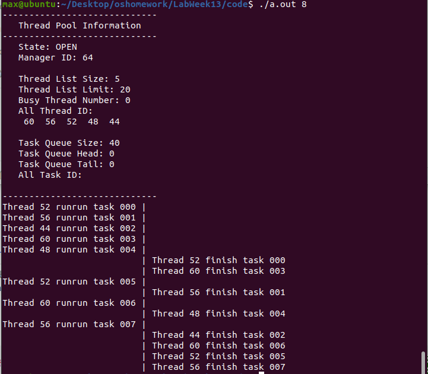
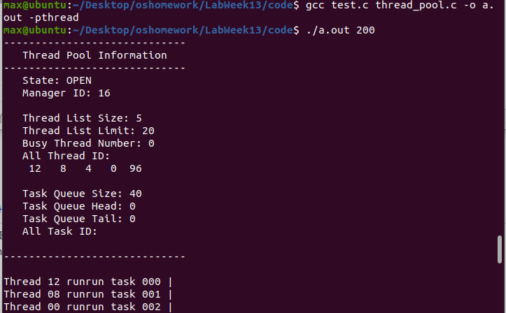
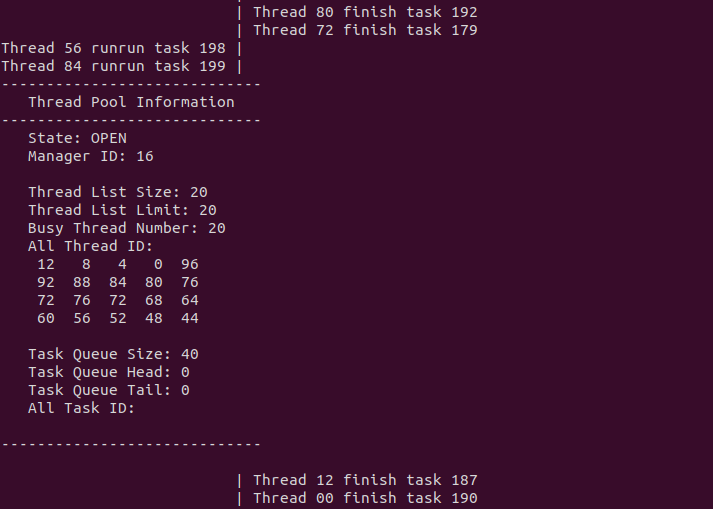
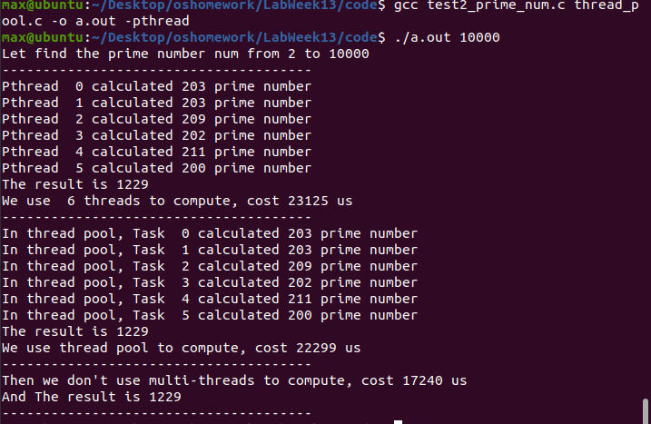
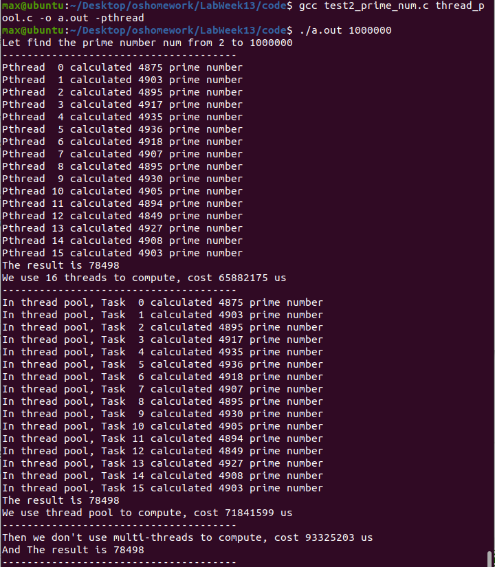

# Lab Week13 - 线程池

**郑有为 19335286**

如果图片或链接显示异常，请访问 [OSHomework-LabWeek13.md(Gitee)](https:gitee.com/WondrousWisdomcard/oshomework/blob/master/LabWeek13/LabWeek13.md)。我把代码和截图都放在了仓库 [OSHomework(Gitee)](https:gitee.com/WondrousWisdomcard/oshomework)。

## 目录

* 实验内容:设计实现一个线程池 (Thread Pool)
	* 使用 Pthread API
	* FIFO
	* 先不考虑互斥问题
	* 编译、运行、测试用例
* 实验报告
	* 实验内容的原理性和实现细节解释,包括每个系统调用的作用过程和结果。(尝试写一个设计报告)

[toc]
 
## 设计报告

### 1. 实现说明

#### 1.1 线程池基本原理

线程池是一种线程的使用模式，线程池负责维护着多个线程，等待着监督管理者分配可并发执行的任务，避免了在处理短时间任务时创建与销毁线程的代价。

所实现的线程池基本功能：在处理过程中将任务添加到队列，然后在利用已经创建的线程后自动启动这些任务；线程池线程都是后台线程，处理任务的顺序遵循FIFO原则。

在实现过程中加入了管理者线程调整线程池总线程数，并引入了简单的互斥锁机制，解决临界区问题。

#### 1.2 数据结构与函数

下面是`thread_pool.h`所定义的数据结构，包括：任务和线程池。

1. 任务`task`：

	``` c
	typedef struct task{
		int task_id; //任务ID
		void* (*func)(void*); //任务函数
		void* arg; //函数参数
	}task;
	```

2. 线程池`thread_pool`：

	``` c
	typedef struct thread_pool{	
		pthread_mutex_t lock; // 访问该线程池所用的互斥锁
		
		int state; // 线程池的状态：OPEN表示工作着，CLOSE表示已关闭
		pthread_t* manager; // 线程池的管理进程：负责根据等待队列的情况调整线程池中线程总数
		
		pthread_t* thread_list; // 线程列表
		int thread_list_size; // 当前线程总数
		int thread_list_max_size; // 允许创建的线程总数上限
		int busy_thread_num; // 当前正在执行任务的忙碌线程
		
		struct task* task_queue; // 循环队列，作为任务等待的等待队列
		int task_queue_size; // 任务队列的大小
		int task_queue_head; // 队列的头部
		int task_queue_tail; // 队列的尾巴，指向第一个空任务
	}thread_pool;
	```
	
下面是线程池支持的6个函数（创建，删除，释放，可视化，等待，添加任务）和Runner、Manager函数。

1. **线程池创建与初始化**: `thread_pool_create`

	* 函数原型：`struct thread_pool* thread_pool_create(int tp_num_init, int tp_num_max, int tq_num);`
	* 参数列表：
		* `tp_num_init`: 初始化时创建的线程数
		* `tp_num_max`: 允许创建的最大县城数，在实际过程当中，线程池会根据等待队列的情况适度扩展线程池线程数，但创建总数不超过该变量
		* `tq_num`: 等待队列的大小，在运行过程中不作调整
	* 返回值：创建成功返回线程池指针，否则返回`NULL`
	
2. **线程池空间释放**: `thread_pool_free`
	* 函数原型：`int thread_pool_free(struct thread_pool* tp);`
	* 函数参数：线程池指针
	* 返回值：执行成功返回0,否则返回-1

3. **线程池关闭与删除**: `thread_pool_destory`，等待所有任务结束，并删除线程池
	* 函数原型：`int thread_pool_destory(struct thread_pool* tp);`
	* 函数参数：线程池指针
	* 返回值：执行成功返回0,否则返回-1
	
4. **可视线程池数据**: `thread_pool_show`
	* 函数原型：`thread_pool_show(struct thread_pool* tp); `
	* 函数参数：线程池指针
	* 返回值：执行成功返回0,否则返回-1*
	* 效果：将线程池的每一项数据输出，为便于观察，所有的线程ID取模100处理：
		``` c
		-----------------------------
		   Thread Pool Information
		-----------------------------
		   State: OPEN
		   Manager ID: 16

		   Thread List Size: 20
		   Thread List Limit: 20
		   Busy Thread Number: 20
		   All Thread ID:
		    12   8   4   0  96 
		    92  88  84  80  76 
		    72  76  72  68  64 
		    60  56  52  48  44 
		   
		   Task Queue Size: 40
		   Task Queue Head: 0
		   Task Queue Tail: 0
		   All Task ID:
		   
		-----------------------------
		```
5. **线程池空间等待**: `thread_pool_wait`，等待所有线程结束（不包括Manager）
	* 函数原型：`int thread_pool_wait(struct thread_pool* tp); `
	* 函数参数：线程池指针
	* 返回值：执行成功返回0,否则返回-1
	
6. **创建并执行任务**:`int task_create(struct thread_pool* tp, int task_id, void* (*func)(void *), void* arg);`,当线程池不够用时任务会被加入等待队列。
	* 函数原型：`int thread_pool_wait(struct thread_pool* tp); `
	* 函数参数：
		* `tp`: 线程池指针
		* `task_id`: 任务ID
		* `func`: 函数指针
		* `arg`: 函数参数（指针）
	* 返回值：执行成功返回0,否则返回-1
	
7. **Runner**: 监视等待队列，当有任务到来时取出任务执行，执行结束后重归空闲状态。
	* 函数原型：`static void* thread_runner(void* arg);`
	* 函数参数：线程池指针
	
8. **Manager**: 负责监视等待队列的状况，在等待的任务累积时增加线程池线程数。
	* 函数原型：`static void* thread_manager(void* arg);`
	* 函数参数：线程池指针

#### 1.3 部分细节与策略

1. **线程池创建与初始化**
	1. 创建线程池时首先会检查参数的合理性：例如`tp_num_init`需小于等于`tp_num_max`，参数需为正数；
	2. 使用`malloc`为线程池申请空间，调用`pthread_mutex_init(&(tp->lock)`来初始化互斥锁，并置线程池的状态为`OPEN`；
	3. 为线程列表和任务堆栈申请内存空间，初始化相关变量，并使用`pthread_create()`创建线程，执行`thread_runner`函数；
		* 为简化实现，线程列表初始化了`tp_num_max`块线程空间，但只创建了`tp_num_init`个进程，剩余空间由管理者线程为其扩展；
	4. 在上出执行过程，即使检测错误，一有一场返回错误并调用释放`thread_pool_free`释放堆内存空间。
	
2. **线程池空间释放**
	* 释放内存空间的同时，调用`pthread_mutex_destroy(&(tp->lock))`注销互斥锁。
	
3. **线程池关闭与删除**
	1. 首先将线程池的状态置为`CLOSE`，告知所有线程即将停止工作;
	2. 然后依次调用`pthread_join()`,最后执行`thread_pool_free`释放内存空间。
	
4. **可视线程池数据**
	* 为避免数据冲突和与其他线程指令交叉，需要加互斥锁。
	
5. **线程池空间等待**
	* 思路与`pthread_join()`作用不同，该函数循环争取互斥锁，进入临界区后检查任务堆栈，若此时任务堆栈为空，则视为等待结束。
	
6. **创建并执行任务**
	1. 先加锁，获得当前任务队列的大小，只要线程池状态为`OPEN`且任务队列没满，则将任务加入到任务队列等待线程对其进行调用，最后解锁；
	2. 若此时等待队列已经满了，则解锁并等待下一次取锁检测。
	
7. **Runner**
	1. 先加锁获得线程池数据访问权限，并检查线程池状态，等待新任务，若任务队列为空，则释放锁，重新争取锁；
	2. 若任务队列不为空，则取出任务队列头部任务执行，并更新队列的头部索引和忙碌线程数（+1），执行用户任务`(*t.func)(t.arg)`；
	3. 程序执行完毕后重新取锁，更新忙碌线程数（-1）。
	
8. **Manager**
	1. 循环检查线程数（无需互斥锁），若此时线程池线程数已经等于最大线程数限制，则可结束线程（但出于扩展考虑，没有立即结束）。
	2. 若上述条件不满足，则加锁获得线程池数据访问权限，检查任务队列的任务数，并进行增加线程池线程的决策：**若此时任务队列的任务数大于队列总数，则将当前的线程数扩大一倍，直至达到线程申请上限**。
	3. 创建新线程后更新线程数`thread_list_size`，然后解锁。
	* 考虑实际应用，Manager线程不具有减少总线程数的功能，Manager的功能较为单一简略。

### 2. 使用说明
	
实现的线程池被封装在一个`pthread_pool.h`文件中，并在`pthread_pool.c`文件中实现。程序调用只需要在文件头`#include "pthread_pool.h"`即可，编译是需要链接`pthread_pool.c`，并加入参数`-pthread`。例如：`gcc test.c thread_pool.c -o a.out -pthread`

### 3. 测试程序

因为我写成了一个库函数，可以通过`#include<pthread_pool.h>`应用到需要线程池的程序，除了基本调用测试外，我改编了自己之前写的多线程质数计算程序，用于测试使用线程池和仅使用Pthread、单线程的用时比较。

#### 3.1 基本调用测试：`test.c`

* 程序说明：在该程序中，程序一次向线程池申请n(默认：100)个任务，在每个任务执行耗时1-3秒（通过task_id % 3 + 1得到）,线程起初只有5个线程，线程上限是20,等待队列的长度为40，在函数执行过程中，会调用`thread_pool_show(tp);`查看当前线程池内部参数。

* 测试结果：
	* 执行`./a.out 8`生成8个任务，从截图中可以看到任务的执行和结束情况和线程池初始时的状态。其中：线程52、60、56分别完成了两个任务。
	
	

	* 执行`./a.out 200`生成200个任务，下面两张图片为函数调用的始末，第一张图显示最开始线程数为5，由于待执行的任务很多，到最后（第二张图），线程数已经被Manager扩展到了20个。

	

	

#### 3.2 使用线程池计算质数个数：`test2_prime_num.c`

* 程序说明：该程序负责计算2-n（默认：10000）的之间的质数个数，复杂度：`O(n^3)`，并进行计时，测量使用不同方法（pthread、thread_pool、single thread）计算的耗时。

* 测试结果：

	* 当规模为10000时，使用`6`线程pthread和线程池(参数为：6、30、10)的耗时差接近(23125us和22299us)，此时不使用多线程反而更快一些(17240us)；
	
	
	
	* 当规模为1000000时，使用`16`线程pthread和线程池(参数为：6、30、10)与不使用多线程的耗时分别是65882175、71841599、93325203，可见还是使用静态pthread线程效率最高。

	

### 4. 总结

本次实验完成了一个基于POSIX pthread的基本线程池的实现，在设计过程中考虑了线程池动态调整、临界区互斥锁等问题，并编写程序进行了使用测试。
