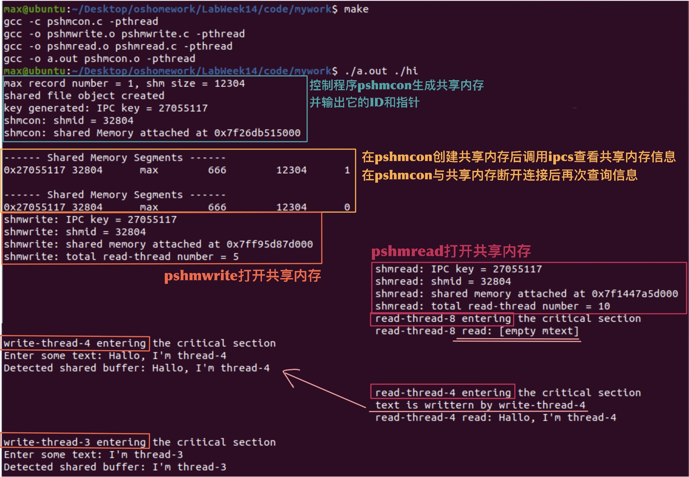

# Lab Week14 - Peterson算法

**郑有为 19335286**

如果图片或链接显示异常，请访问 [OSHomework-LabWeek14.md(Gitee)](https:gitee.com/WondrousWisdomcard/oshomework/blob/master/LabWeek14/LabWeek14.md)。我把代码和截图都放在了仓库 [OSHomework(Gitee)](https:gitee.com/WondrousWisdomcard/oshomework)。

## 目录

* 实验内容: Peterson 算法
  * 把 Lecture08 示例 alg.8-1~8-3 拓展到多个读线程和多个写线程，应用 Peterson 算法原理设计实现共享内存互斥。
* 实验报告
  * 实验内容的原理性和实现细节解释,包括每个系统调用的作用过程和结果。

[toc]

## 程序说明

### 程序框架

类似于示例alg.8-0~8-3，该程序由`pshmdata.h`、`pshmcon.c`、`pshmread.c`、`pshmwrite.c`和makefile组成，其中`pshmdata.h`声明了共享内存的结构，`pshmcon.c`是控制程序，负责申请共享内存，并创建两个进程：读进程和写进程，两个进程分别调用`pshmread.o`和`pshmwrite.o`。`pshmread.c`负责使用pthread生成若干个读线程，`pshmwrite.c`负责使用pthread生成若干个写线程。所有读进程和写进程同时竞争临界区资源，通过Peterson算法对线程进行限制，保证一次只有一个线程进入临界区（因而读写线程的进入顺序是随机的）。

下图是程序的框架：


使用`make`命令即可编译并连接程序，在执行`./a.out`加文件路径就可以运行程序。

`makefile`如下：
``` makefile
a.out: pshmcon.o pshmwrite.o pshmread.o
	gcc -o a.out pshmcon.o -pthread
pshmcon.o: pshmcon.c pshmdata.h
	gcc -c pshmcon.c -pthread
pshmwrite.o: pshmwrite.c pshmdata.h
	gcc -o pshmwrite.o pshmwrite.c -pthread
pshmread.o: pshmread.c pshmdata.h
	gcc -o pshmread.o pshmread.c -pthread
clean:
	rm *.o
```

### Peterson算法原理

* Peterson算法满足以下两点规则：
  * 当线程Pi的级别等于pnum-1时，它会跳出循环等待并进入临界区；
  * 当一个线程Pj任意试图提升自己的级别时，它需要存在其他线程Pk的等级到达了Pj的等级或者所有的线程的等级都小于Pj的等级。

* **竞争CS的Peterson算法代码段**：
   ``` c
   for (lev = 0; lev < pnum-1; ++lev) { // pnum-1 waiting rooms
        shared->level[thread_num + base] = lev;
        shared->waiting[lev] = thread_num + base;
        while (shared->waiting[lev] == thread_num + base) { // busy waiting
            for (k = 0; k < pnum; k++) {
                if(shared->level[k] >= lev && k != thread_num + base) {
                    break;
                }
                if(shared->waiting[lev] != thread_num + base) { // check again
                    break;
                }
            } 
            if(k == pnum) {
                break;
            } 
        }
    }  
   ```
* **退出CS的Peterson算法代码段**：
   ``` c
   shared->level[thread_num + base] = -1; 
   ```

### 实现细节说明

1. **`pshmdata.h`中共享内存的结构**
   
   * 代码如下：

      ``` c
         struct shared_struct {
         int pnum_r; // number of read process
         int pnum_w; // number of write process
         int pnum_cs; // number of process in critical section

         int level[MAX_N]; // level of processes 0 ... pnum
         int waiting[MAX_N-1]; // waiting process of each level 0 ... pnum-1
         
         int last_read; // last read thread id
         int last_write; // last write thread id
         char mtext[TEXT_SIZE]; // shm text
      };
      ```

   * 共享内存会记录、更新每次创建读线程和写进程的数量，分别用`pnum_r`和`pnum_w`表示，并且用`pnum_cs`表示进入CS区域的线程数量，在正常情况下，该变量等于0或1。

   * 中间两行为Peterson算法需使用的两个数组`waiting`和`level`，长度分别为`MAX_N-1`和`MAX_N`，`MAX_N`等于1024。

   * 最后三行分别是`last_read`，记录最近一次读取`mtext`的读线程序号；`last_write`，记录最近一次写入`mtext`的写线程序号；`mtext`为储存消息的字符串数组。

2. `pshmcon.c`实现，实现与示例程序`alg.8-1`差别不大。
   
   * 回顾**共享内存的操作步骤**：
      * 创建过程：文件检查`stat`(`creat`) -> `ftok`获取键值 -> `shmget`获取共享内存ID -> `shmat`获取共享内存指针 -> 指针类型转换；
      * 删除和断开连接过程：分别为`shmctl`(IPC_RMID)和`shmdt`。

   * **初始化共享内存**的代码段如下：
      ``` c
      shared->pnum_r = PNUM_R; 
      shared->pnum_w = PNUM_W;
      shared->pnum_cs = 0;
      shared->last_read = -1;
      shared->last_write = -1;
      memset(shared->level, (-1), sizeof(shared->level));
      memset(shared->waiting, (-1), sizeof(shared->waiting));
      ```
      其中，PNUM_R和PNUM_W为默认的读线程数和写线程数，`pnum_cs`初始置位0，`last_read`和`last_write`置为-1表示还没有线程对其读写，使用`memset`将`level`数组和`waiting`各个元素置为-1。

   * **进程创建**：`vfork`函数和`execv`函数的使用。
  
3. `pshmwrite.c`实现
   
   * 首先打开共享内存，然后用pthread创建`pnum_w`个写线程，线程执行函数为`write_ftn`。

   * `write_ftn`实现细节
    
     1. 为了能让读线程和写线程一同竞争临界区资源，设置两个变量`pnum`和`base`，前者为读写线程的总和`shared->pnum_r + shared->pnum_w` ，后者的设置是为了避免读写线程的序号重合，设置为`shared->pnum_r`，（而在读进程的线程函数中设置`base`为0）。
    
     2. 随后进入使用Peterson竞争临界区的代码段，在读写线程函数中改代码段是相同的，并已经在前面的报告中叙述。
    
     3. 读线程进入CS区后，会输出提示`write-thread-i entering the critical section`，随后进行临界区线程数检查，代码如下：
    
         ``` c
         shared->pnum_cs++;
         if (shared->pnum_cs > 1) {
            printf("ERROR! more than one processes in critical sections\n");
            kill(getpid(), SIGKILL);
         }
         shared->pnum_cs--;
         ```
      4. 随后是写线程对`mtext`的处理逻辑：
         * 若前一个写线程写入的内容没有被任何读线程读取，则输出提示`No read-thread read mtext writtern by last write-thread-i`
         * 随后提示用户输入新的信息，输入结束后将字符串存进`mtext`中，并更新`shared->last_read = -1`和`shared->last_write = thread_num;`，`thread_num`为本次写线程的编号。
      5. 退出CS区后，更新level数组：`shared->level[thread_num + base] = -1`，线程结束退出。

4. `pshmread.c`实现 
   * 除了对`mtext`的处理逻辑不同之外，与`pshmwrite.c`的实现类似，不再赘述。
   * 读线程对`mtext`的处理逻辑：
      * 若还没有写线程写入字符串，则直接输出`empty mtext`。
      * 若已有写线程写入字符串，且已经被其他读线程读取过了，则输出`text has already read by read-thread-i`。 
      * 随后读取`mtext`的内容并输出，输出结束后修改last_read为当前线程序号。

## 程序验证

下面是一个程序使用示例，执行`make`，和`./a.out ./hi`即可运行，执行过程中，左侧为写进程`pshmwrite`输出，右侧为写进程`pshmread`输出。

1. 首先，两个使用`execv`调用的读程序和写程序分别生成10个读线程和5个写线程，所有读写线程使用Peterson算法争取进入CS区。

2. 可以看到读线程-8首先进入了CS区，而在之前还没有写线程对共享内存中的`mtext`进行写入，故输出`empty mtext`。

3. 随后，写线程-4进入临界区，并等待用户输入，将用户输入写入共享内存的`mtext`中，退出临界区，随后读线程-4进入临界区（读进程的编号和写进程的编号是相互独立的），读取`mtext`信息，同时还可以直到写入的线程的编号，如下图淡粉色标注所示。

   

4. 下面，读线程-3对`mtext`进行写入，接着读线程-2再次对`mtext`进行读写，两个写线程之间没有读线程读取内容，所以在读线程-2写入前，输出`No read-thread read mtext...`的信息。

5. 在读线程-2写入后，有连续5个读线程对其进行了读取（这种操作是允许的），每次读取不仅会显示写入`mtext`的写线程编号，还会显示最近读取的读线程编号，并对其进行更新，如下图右侧粉色标注。

   

6. 以下程序继续执行，直至5个写线程和10个读线程执行完毕，程序退出，结果如下图。

   

## 总结

本次实验结合了共享内存和Peterson算法，在示例程序alg.8-1的基础上，使用软件机制（Peterson算法）实现了共享内存的互斥。