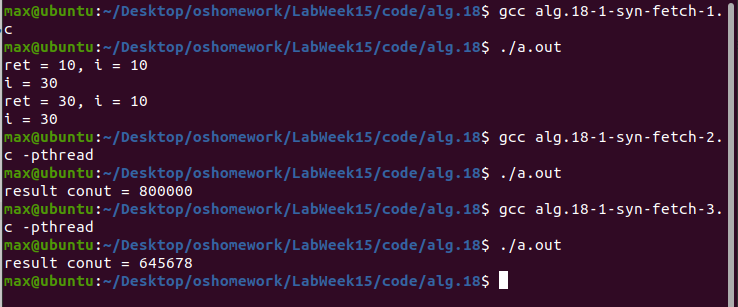

# Lab Week15 - 进程同步

**郑有为 19335286**

如果图片或链接显示异常，请访问 [OSHomework-LabWeek15.md(Gitee)](https:gitee.com/WondrousWisdomcard/oshomework/blob/master/LabWeek15/LabWeek15.md)。我把代码和截图都放在了仓库 [OSHomework(Gitee)](https:gitee.com/WondrousWisdomcard/oshomework)。

## 目录

* 实验内容: 进程同步。
	* 内容1: 编译运行课件 Lecture18 例程代码
		* Algorithms 18-1 ~ 18-9
	* 内容2: 在 LabWeek13 的基础上用**信号量**解决线程池分配的互斥问题
		* 编译、运行、测试用例
		* 提交新的设计报告
		
[toc]

## 实验内容

### 实验原理

#### Linux原子函数

* Linux原子操作函数如下，函数意义如函数名所示，原子指令能保证线程安全，适用于内核级别多线程编程：

	``` c
	type __sync_fetch_and_add (type *ptr, type value);
	type __sync_fetch_and_sub (type *ptr, type value);
	type __sync_fetch_and_or (type *ptr, type value);
	type __sync_fetch_and_and (type *ptr, type value);
	type __sync_fetch_and_xor (type *ptr, type value);
	type __sync_fetch_and_nand (type *ptr, type value);
	type __sync_add_and_fetch (type *ptr, type value);
	type __sync_sub_and_fetch (type *ptr, type value);
	type __sync_or_and_fetch (type *ptr, type value);
	type __sync_and_and_fetch (type *ptr, type value);
	type __sync_xor_and_fetch (type *ptr, type value);
	type __sync_nand_and_fetch (type *ptr, type value);
	
	bool __sync_bool_compare_and_swap(type *ptr, type oldval, type newval, ...); 
	type __sync_val_compare_and_swap(type *ptr, type oldval, type newval, ...);
	__sync_synchronize(...);
	type __sync_lock_test_and_set(type *ptr, type value, ...);
	void __sync_lock_release (type *ptr, ...);
	```
	
#### POSIX互斥锁

* 常用操作：
	``` c
	#include <pthread.h>
	pthread_mutex_t mutex; // 定义互斥锁变量
	pthread_mutex_init(&mutex, NULL); // 互斥锁的初始化
	
	pthread_mutex_lock(&mutex); // 获取锁
	// 临界区
	pthread_mutex_unlock(&mutex); // 释放锁
	// 剩余区
	```
	
* 其他函数：
	``` c
	int pthread_mutex_trylock(pthread_mutex_t *mutex);
	int pthread_mutex_timedlock(pthread_mutex_t *restrict mutex, const struct timespec *restrict abs_timeout);
	int pthread_mutex_destroy(pthread_mutex_t *mutex);
	```
	
#### POSIX信号量
* 信号量两种基本操作：
	* `sem_wait`：等待一个信号量，该操作会测试这个信号量的值，如果小于等于0，就阻塞,否则进行减一操作。
	* `sem_post`：挂出一个信号量，该操作将信号量的值加1。
	
* **命名信号量**：多个不关的进程可以使用一个公共命名的信号量作为同步机制，只需引用信号量的名称即可，基本操作：
	``` c
	#include <fcntl.h>
	#include <sys/stat.h>
	#include <semaphore.h>
	
	sem_t *sem = sem_open("MYSEM", O_CREAT, 0666, 1); //创建一个命名信号量，赋初值为1。
	sem_wait(sem); // 等待、获得信号量
	// 临界区
	sem_post(sem); // 释放信号量
	// 剩余区
	
	sem_close(sem); // 关闭信号量	
	```
	
* **匿名信号量**，基本操作：
	``` c
	#include <semaphore.h>
	sem_t sem;
	sem_init(&sem, 0, 1); // 创建并初始化信号量，赋值为1。
	
	sem_wait(sem); // 等待、获得信号量
	// 临界区
	sem_post(sem); // 释放信号量
	// 剩余区
	
	sem_close(sem); // 关闭信号量	
	```
	
#### POSIX条件变量

* 条件变量用来自动阻塞一个线程，直到某特殊情况发生为止。通常条件变量和互斥锁同时使用。条件变量使我们可以睡眠等待某种条件出现。条件变量是利用线程间共享的全局变量进行同步的一种机制，主要包括两个动作：一个线程等待"条件变量的条件成立"而挂起；另一个线程使"条件成立"（给出条件成立信号）。

* 条件的检测是在互斥锁的保护下进行的。如果一个条件为假，一个线程自动阻塞，并释放等待状态改变的互斥锁。如果另一个线程改变了条件，它发信号给关联的条件变量，唤醒一个或多个等待它的线程，重新获得互斥锁，重新评价条件。

* 基本操作：
	``` c
	// 通常与互斥锁一同使用
	pthread_mutex_t mutex;
	pthread_cond_t cond_var;
	pthread_mutex_init(&mutex, NULL);
	pthread_cond_init(&cond_var, NULL); // 条件变量初始化
	
	pthread_mutex_lock(&mutex); // 获得锁
	while (a != b)
		pthread_cond_wait(&cond_var, &mutex); // 条件变量，等待a == b成立，不负责释放锁
	//critical section
	pthread_mutex_unlock(&mutex); // 释放锁
	```
	
### 例程代码运行与分析

1. Linux原子函数测试-1：`alg.18-1-syn-fetch-1~3`

	* 程序运行截图：
		
		
	* 程序`alg.18-1-syn-fetch-1.c`：
		* 可以看到在调用`__sync_fetch_and_add`先取后加时，ret是“取”的结果故为10,第一行`i = 10`是加前的结果，第二行显示`i = 30`是加后的结果。
		* 可以看到在调用`__sync_add_and_fetch`先加后取时，ret输出的直接是加后的结果30，与`__sync_fetch_and_add`相同，第一行`i = 10`是加前的结果，第二行显示`i = 30`是加后的结果。
	* 程序`alg.18-1-syn-fetch-2.c`：原子指令在多线程下是线程安全的，能保证每次只有一个线程对变量进行操作，所以输出结果正确。
	* 程序`alg.18-1-syn-fetch-3.c`：普通取变量和变量加法不是一条原子指令，不能保证每次只有一个线程对操作变量，使得输出结果小于800000。

2. Linux原子函数测试-2：`alg.18-2-syn-compare-test.c`：
	
	* 函数功能说明：
		* 函数`__sync_bool_compare_and_swap(&value, oldval, newval)`，如果`value`与`oldval`相等，则将`*ptr`赋值成`newval`并返回`1`，否则返回`0`。
		* 函数`__sync_val_compare_and_swap(&value, oldval, newval)`，如果`value`与`oldval`相等，则将`*ptr`赋值成`newval`并返回`oldval`，否则返回`value`。
		* 函数`type __sync_lock_test_and_set(type *ptr, type value);`，将`*ptr`赋值为`value`并返回原来的`value`。
		* 函数`void __sync_lock_release (type *ptr, ...);`，将`value`的值置为0。	
	* 程序运行截图：
		
				
	* 实验结果分析：
		* 第一部分：`value = 200000`与`oldval = 123456`，不相等，因此三个变量值不改变，返回值`ret = 0`。
		* 第二部分：`value = 200000`与`oldval = 200000`，相等，因此`value`被赋值成`newval`，即654321，返回值`ret = 1`。
		* 第三部分：`value = 200000`与`oldval = 123456`，不相等，因此三个变量值不改变，返回值`ret = 200000`。
		* 第四部分：`value = 200000`与`oldval = 200000`，相等，因此`value`被赋值成`newval`，即654321，返回值`ret = 200000`。
		* 第五部分：将`value`赋值成`newval`，即654321，并返回原先`value`的值200000。
		* 第六部分：将`value`的值置为0。
		
3. POSIX互斥锁测试：`alg.18-3-syn-pthread-mutex.c`：

	* 程序运行截图：
		
				
	* 实验结果分析：多线程同时对一个变量进行递增操作，不使用POSIX互斥锁时，发生临界区问题，输出结果小于800000；而使用互斥锁是可以得到正确结果。

4. POSIX命名/匿名信号量测试：`alg.18-4~5-syn-pthread-sem`

	* `alg.18-4-syn-pthread-sem-unnamed.c`
		* 程序运行截图：

				
		* 实验结果分析：多线程同时对一个变量进行递增操作，不使用命名信号量时，发生临界区问题，输出结果小于800000；而使用命名信号量，实现线程同步，使程序执行结果正确。
		
	* `alg.18-5-syn-pthread-sem-named.c`
		* 程序运行截图：

				
		* 实验结果分析：多线程同时对一个变量进行递增操作，不使用匿名信号量时，发生临界区问题，输出结果小于800000；而使用匿名信号量，实现线程同步，使程序执行结果正确。
		* 匿名信号量除初始化与命名信号量不同之外，其余函数调用相同。
		
5. 生产者消费者问题：`alg.18-6~8-syn-pc`

	* 程序说明：
	
		* 数据结构说明：
			* 根据`alg.18-6-syn-pc-con-6.h`中`ctln_pc_st`和`data_pc_st`的定义，共享内存有控制区变量和数据区变量组成，前者占关系内存空前的前`10*sizeof(data_pc_st)`字节，数据区是一个循环队列，每一个元素的类型是`data_pc_st`，该数据结构包含`item_no`(物品的生产编号）、`pro_np`（保留的优先级编号）、`pro_tid`（生产该物品的线程ID）。
			* 而对于控制结构`cltn_pc_st`，包含：共享内存的大小、最大产量、生产者个数、消费者个数、三个信号量`sem_mutex stock emptyslot`，分别用于提供互斥、记录当前物品库存、记录当前空单元的个数，满足`stock + emptyslot = BUFFER_SIZE，已经生产的物品总数、已经消费掉的物品总数，队列头，队列尾和生产结束标志位。
		
		* 控制程序：`alg.18-6-syn-pc-con-6.c`
			* 用户输入：仓库大小(buffer_size)、生产总数(max_item_num)、生产者和消费者的个数。
			* 创建共享内存，初始化控制区：申请大小为`(buffer_size + BASE_ADDR)*sizeof(struct data_pc_st)`，并获取共享内存的地址，并初始化。在老师的实现上，由于规定共享内存前10单元的结构为控制区，所以控制区和数据区的指针指向同一个位置，在队列操作时，需加入`BASE_ADDR`。
			* 信号量的赋值，分别使用`sem_init`函数赋值，其互斥量初始为1、记录当前物品库存为0、记录当前空单元的个数为`buffer_size`，一旦出现异常，调用`detachshm()`函数，该函数调用`shmdt(shm)`和`shmctl(shmid, IPC_RMID, 0)`清除共享内存。
			* 子进程创建：创建两个子进程，分别调用生产者程序和消费者程序，在进程结束后还需要调用`sem_destroy`函数删除三个信号量。
			
		* 生产者程序：`alg.18-7-syn-pc-producer-6.c`
			* 创建`THREAD_PRO`个线程进行生产，重点分析线程函数中信号量的使用：
				``` c			
				while (ctln->item_num < ctln->MAX_ITEM_NUM) { //当已生产数小于生产总数，进入循环
					sem_wait(&ctln->emptyslot); //若emptyslot（仓库剩余容量）等于0，堵塞等待，否则减一。
					sem_wait(&ctln->sem_mutex); //等待互斥锁

					if (ctln->item_num < ctln->MAX_ITEM_NUM) {
						// 生产物品，置于队列尾部，操作队列时需要注意`BASE_ADDR`的使用。
						ctln->item_num++;		
						ctln->enqueue = (ctln->enqueue + 1) % ctln->BUFFER_SIZE;
						(data + ctln->enqueue + BASE_ADDR)->item_no = ctln->item_num;
						(data + ctln->enqueue + BASE_ADDR)->pro_tid = gettid();
						printf("producer tid %ld prepared item no %d, now enqueue = %d\n", (data + ctln->enqueue + BASE_ADDR)->pro_tid, (data + ctln->enqueue + BASE_ADDR)->item_no, ctln->enqueue);
						// 若生产数到达额定值，发送停止生产信号(END_FLAG = 1)
						if (ctln->item_num == ctln->MAX_ITEM_NUM)
						    ctln->END_FLAG = 1;
						sem_post(&ctln->stock); //生产成功，当前库存加一
					} 
					else {
						sem_post(&ctln->emptyslot); //加一，修改回原本的仓库剩余容量
					}
					sem_post(&ctln->sem_mutex); //释放锁
					sleep(1);
				}
				```
		* 消费者程序：`alg.18-8-syn-pc-consumer-6.c`
			* 创建`THREAD_CONS`个线程进行消费，重点分析线程函数中信号量的使用：
				``` c
				while ((ctln->consume_num < ctln->item_num) || (ctln->END_FLAG == 0)){ // 若还有未被取出的物品，或生产者还在生产，则进入循环
					sem_wait(&ctln->stock);  //如果当前库存等于0，堵塞等待，否则减1，会出现个别消费者一直取不到物品的情况
					sem_wait(&ctln->sem_mutex); //等待互斥锁
					if (ctln->consume_num < ctln->item_num) { //若未被取出的物品，则取出位于队列头的一个物品
						ctln->dequeue = (ctln->dequeue + 1) % ctln->BUFFER_SIZE;
						printf("\t\t\t\tconsumer tid %ld taken item no %d by pro %ld, now dequeue = %d\n", gettid(), (data + ctln->dequeue + BASE_ADDR)->item_no, (data + ctln->dequeue + BASE_ADDR)->pro_tid, ctln->dequeue);
						ctln->consume_num++;
						sem_post(&ctln->emptyslot); //取出成功，队列空单元加一
					}
					else {
						sem_post(&ctln->stock); //取出失败，库存加一以恢复原值
					}
					sem_post(&ctln->sem_mutex); //释放锁
				}
				```
	* 程序运行截图：
		
			
	* 实验结果分析：	在测试中，规定队列长度为3,2个生产者共需生产5个物品，并有四个消费者。程序执行顺序如下：生产者-1生产 - 生产者-2生产 - 消费者-1取出 - 消费者-2取出 - 生产者-3生产 - 生产者-4生产 - 消费者-3取出 - 消费者-4取出 - 生产者-5生产 - 消费者-5取出，最后返回两个进程执行成功。
	
6. POSIX条件变量测试：`alg.18-9-pthread-cond-wait.c`
	
	* 程序运行截图：
		
				
	* 实验结果分析：`increment`线程和`decrement`线程争夺互斥锁进入临界区，线程对`count`进行增1/减1，条件变量`cond`对其进行限制，监视`count`，当`count`小于等于0时，`decrement`堵塞，由此保证`count`在任意时刻大于等于0，每次线程顺序不同，如上图所示。
	
### 使用信号量完善LabWeek13代码

* 在LabWeek13中，由于已经引入pthread互斥锁解决临界区问题，修改代码，通过匿名信号量实现互斥锁：在`thread_pool`结构体中加入了一个信号量指针`sem`，在访问发生竞争冲突的资源前后加入`sem_wait`和`wait_post`，注意在临界区内发生异常退出后要及时调用`wait_post`，下面是新的设计报告。

---

## 设计报告（新）

### 1. 实现说明

#### 1.1 线程池基本原理

线程池是一种线程的使用模式，线程池负责维护着多个线程，等待着监督管理者分配可并发执行的任务，避免了在处理短时间任务时创建与销毁线程的代价。

所实现的线程池基本功能：在处理过程中将任务添加到队列，然后在利用已经创建的线程后自动启动这些任务；线程池线程都是后台线程，处理任务的顺序遵循FIFO原则。

在实现过程中加入了管理者线程调整线程池总线程数，并通过信号量引入了简单的互斥机制，解决临界区问题。

#### 1.2 数据结构与函数

下面是`thread_pool.h`所定义的数据结构，包括：任务和线程池。

1. 任务`task`：

	``` c
	typedef struct task{
		int task_id; //任务ID
		void* (*func)(void*); //任务函数
		void* arg; //函数参数
	}task;
	```

2. 线程池`thread_pool`：

	``` c
	typedef struct thread_pool{	
		sem_t* sem; // 访问该线程池所用的信号量
		
		int state; // 线程池的状态：OPEN表示工作着，CLOSE表示已关闭
		pthread_t* manager; // 线程池的管理进程：负责根据等待队列的情况调整线程池中线程总数
		
		pthread_t* thread_list; // 线程列表
		int thread_list_size; // 当前线程总数
		int thread_list_max_size; // 允许创建的线程总数上限
		int busy_thread_num; // 当前正在执行任务的忙碌线程
		
		struct task* task_queue; // 循环队列，作为任务等待的等待队列
		int task_queue_size; // 任务队列的大小
		int task_queue_head; // 队列的头部
		int task_queue_tail; // 队列的尾巴，指向第一个空任务
	}thread_pool;
	```
	
下面是线程池支持的6个函数（创建，删除，释放，可视化，等待，添加任务）和Runner、Manager函数。

1. **线程池创建与初始化**: `thread_pool_create`

	* 函数原型：`struct thread_pool* thread_pool_create(int tp_num_init, int tp_num_max, int tq_num);`
	* 参数列表：
		* `tp_num_init`: 初始化时创建的线程数
		* `tp_num_max`: 允许创建的最大县城数，在实际过程当中，线程池会根据等待队列的情况适度扩展线程池线程数，但创建总数不超过该变量
		* `tq_num`: 等待队列的大小，在运行过程中不作调整
	* 返回值：创建成功返回线程池指针，否则返回`NULL`
	
2. **线程池空间释放**: `thread_pool_free`
	* 函数原型：`int thread_pool_free(struct thread_pool* tp);`
	* 函数参数：线程池指针
	* 返回值：执行成功返回0,否则返回-1

3. **线程池关闭与删除**: `thread_pool_destory`，等待所有任务结束，并删除线程池
	* 函数原型：`int thread_pool_destory(struct thread_pool* tp);`
	* 函数参数：线程池指针
	* 返回值：执行成功返回0,否则返回-1
	
4. **可视线程池数据**: `thread_pool_show`
	* 函数原型：`thread_pool_show(struct thread_pool* tp); `
	* 函数参数：线程池指针
	* 返回值：执行成功返回0,否则返回-1*
	* 效果：将线程池的每一项数据输出，为便于观察，所有的线程ID取模100处理：
		``` c
		-----------------------------
		   Thread Pool Information
		-----------------------------
		   State: OPEN
		   Manager ID: 16

		   Thread List Size: 20
		   Thread List Limit: 20
		   Busy Thread Number: 20
		   All Thread ID:
		    12   8   4   0  96 
		    92  88  84  80  76 
		    72  76  72  68  64 
		    60  56  52  48  44 
		   
		   Task Queue Size: 40
		   Task Queue Head: 0
		   Task Queue Tail: 0
		   All Task ID:
		   
		-----------------------------
		```
5. **线程池空间等待**: `thread_pool_wait`，等待所有线程结束（不包括Manager）
	* 函数原型：`int thread_pool_wait(struct thread_pool* tp); `
	* 函数参数：线程池指针
	* 返回值：执行成功返回0,否则返回-1
	
6. **创建并执行任务**:`int task_create(struct thread_pool* tp, int task_id, void* (*func)(void *), void* arg);`,当线程池不够用时任务会被加入等待队列。
	* 函数原型：`int thread_pool_wait(struct thread_pool* tp); `
	* 函数参数：
		* `tp`: 线程池指针
		* `task_id`: 任务ID
		* `func`: 函数指针
		* `arg`: 函数参数（指针）
	* 返回值：执行成功返回0,否则返回-1
	
7. **Runner**: 监视等待队列，当有任务到来时取出任务执行，执行结束后重归空闲状态。
	* 函数原型：`static void* thread_runner(void* arg);`
	* 函数参数：线程池指针
	
8. **Manager**: 负责监视等待队列的状况，在等待的任务累积时增加线程池线程数。
	* 函数原型：`static void* thread_manager(void* arg);`
	* 函数参数：线程池指针

#### 1.3 部分细节与策略

1. **线程池创建与初始化**
	1. 创建线程池时首先会检查参数的合理性：例如`tp_num_init`需小于等于`tp_num_max`，参数需为正数；
	2. 使用`malloc`为线程池申请空间，调用`tp->sem = sem_open("TPSEM", O_CREAT, 0666, 1)`来初始化匿名信号量，并置线程池的状态为`OPEN`；
	3. 为线程列表和任务堆栈申请内存空间，初始化相关变量，并使用`pthread_create()`创建线程，执行`thread_runner`函数；
		* 为简化实现，线程列表初始化了`tp_num_max`块线程空间，但只创建了`tp_num_init`个进程，剩余空间由管理者线程为其扩展；
	4. 在上出执行过程，即使检测错误，一有一场返回错误并调用释放`thread_pool_free`释放堆内存空间。
	
2. **线程池空间释放**
	* 释放内存空间的同时，调用`sem_close(tp->sem)`关闭信号量。
	
3. **线程池关闭与删除**
	1. 首先将线程池的状态置为`CLOSE`，告知所有线程即将停止工作;
	2. 然后依次调用`pthread_join()`,最后执行`thread_pool_free`释放内存空间。
	
4. **可视线程池数据**
	* 为避免数据冲突和与其他线程指令交叉，需要通过信号量实现互斥。
	
5. **线程池空间等待**
	* 思路与`pthread_join()`作用不同，该函数循环争取锁，进入临界区后检查任务堆栈，若此时任务堆栈为空，则视为等待结束。
	
6. **创建并执行任务**
	1. 先加锁，获得当前任务队列的大小，只要线程池状态为`OPEN`且任务队列没满，则将任务加入到任务队列等待线程对其进行调用，最后解锁；
	2. 若此时等待队列已经满了，则解锁并等待下一次取锁检测。
	
7. **Runner**
	1. 先加锁获得线程池数据访问权限，并检查线程池状态，等待新任务，若任务队列为空，则释放锁，重新争取锁；
	2. 若任务队列不为空，则取出任务队列头部任务执行，并更新队列的头部索引和忙碌线程数（+1），执行用户任务`(*t.func)(t.arg)`；
	3. 程序执行完毕后重新取锁，更新忙碌线程数（-1）。
	
8. **Manager**
	1. 循环检查线程数，若此时线程池线程数已经等于最大线程数限制，则可结束线程（但出于扩展考虑，没有立即结束）。
	2. 若上述条件不满足，则加锁获得线程池数据访问权限，检查任务队列的任务数，并进行增加线程池线程的决策：**若此时任务队列的任务数大于队列总数，则将当前的线程数扩大一倍，直至达到线程申请上限**。
	3. 创建新线程后更新线程数`thread_list_size`，然后解锁。
	* 考虑实际应用，Manager线程不具有减少总线程数的功能，Manager的功能较为单一简略。

### 2. 使用说明
	
实现的线程池被封装在一个`pthread_pool.h`文件中，并在`pthread_pool.c`文件中实现。程序调用只需要在文件头`#include "pthread_pool.h"`即可，编译是需要链接`pthread_pool.c`，并加入参数`-pthread`。例如：`gcc test.c thread_pool.c -o a.out -pthread`

### 3. 测试程序

该程序可作为一个库函数，通过`#include<pthread_pool.h>`应用到需要线程池的程序，以下是测试程序：`test.c`的测试说明。

* 程序说明：在该程序中，程序一次向线程池申请n(默认：100)个任务，在每个任务执行耗时1-3秒（通过task_id % 3 + 1得到）,线程起初只有5个线程，线程上限是20,等待队列的长度为40，在函数执行过程中，会调用`thread_pool_show(tp);`查看当前线程池内部参数。

* 测试结果：
	* 执行`./a.out 8`生成8个任务，从截图中可以看到任务的执行和结束情况和线程池初始时的状态。其中：线程52、60、56分别完成了两个任务。
	
	

	* 执行`./a.out 200`生成200个任务，下面两张图片为函数调用的始末，第一张图显示最开始线程数为5，由于待执行的任务很多，到最后（第二张图），线程数已经被Manager扩展到了20个。

	

	

## 总结

本次实验对同步的几种实现方法进行了分析，包括使用Linux原子函数避免多线程指令交错导致的冲突；使用POSIX API的互斥锁解决临界区问题；使用POSIX信号量来实现内容的同步，信号量包括匿名信号量和明明信号量，二者除了初始化函数外操作函数无显著差别；并学习了POSIX条件变量的原理使用方法。

除此之外，重点理解了基于信号量解决生产者-消费者问题的程序`alg.18-6~8-syn-pc`，并基于信号量对LabWeek13中线程池的实现进行了更新，使之能通过信号量保证资源的同步和访问资源的线程互斥，但在线程池的实现中，对信号量的运用比较僵硬。
