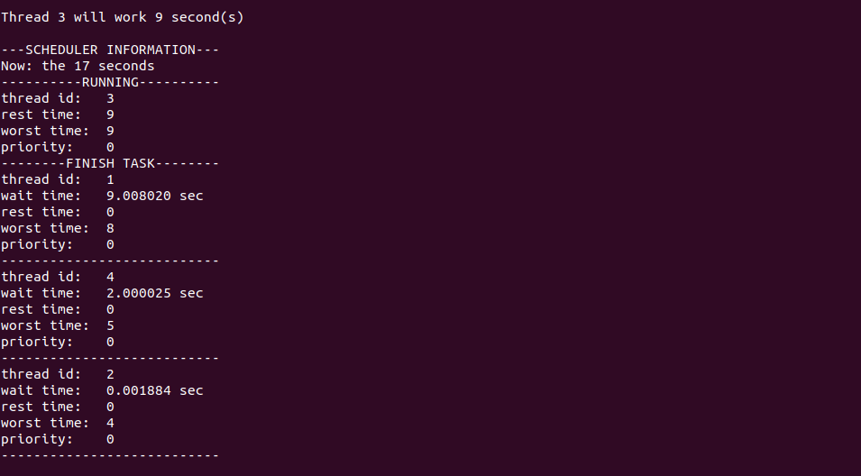

# Lab Week16 - CPU调度

**郑有为 19335286**

如果图片或链接显示异常，请访问 [OSHomework-LabWeek16.md(Gitee)](https:gitee.com/WondrousWisdomcard/oshomework/blob/master/LabWeek16/LabWeek16.md)。我把代码和截图都放在了仓库 [OSHomework(Gitee)](https:gitee.com/WondrousWisdomcard/oshomework)。

## 目录

* 基本问题：讨论课件 Lecture19-20 中 CPU 调度算法的例子，尝试基于 POSIX API设计一个简单调度器（不考虑资源竞争问题）：
    * 创建一些 Pthread 线程任务，建立一个管理链队列，结点内容起码包括到达时间、WCT、优先级、调度状态（运行、就绪、阻塞）等调度参数；
    * 每个任务有一个调度信号量，任务启动后在其调度信号量上执行 wait；
    * 调度器按照调度策略对处于运行态的任务（如果有的话）的调度信号量执行 wait，并选取适当任务的调度信号量执行 signal；
    * 实现简单调度策略：FCFS、SJB、Priority。分别计算任务平均等待时间。
* 拓展问题1：设计若干资源信号量模拟资源竞争情况；增加时间片参数实现RR调度；验证优先级反转；建立多个链队列实现多级反馈调度。
* 拓展问题2：设计一个抢占式优先策略实时调度器，测试在一个给定的工作负载下优先级反转的情况。

[toc]

## 程序实现

**完成情况**：

* 本次实验的代码实现了一个调度器，并封装了对应的所有操作函数，低耦合地将调度器代码与测试代码分开，可参考[Gitee仓库的版本](https://gitee.com/WondrousWisdomcard/oshomework/tree/master/LabWeek16/code/low_coupling_version)，而Matrix上提交的程序将所有代码拼接在了一起，降低了代码可读性。
* 实验完成了基本要求：创建一些 Pthread 线程任务，并建立一个管理链队列和调度器，在设计上，每个任务有两个调度信号量，调度器可以按照调度策略对处于运行态的任务进行调度，实现了简单调度策略：FCFS、SJF、Priority，并提供计算任务平均等待时间的函数。
* 在扩展上，通过`sigaction`和`pthread_kill`实现了扩展问题2的抢占式优先策略实时调度器，程序可以选定是使用抢占式调度还是非抢占式调度，但只是做了抢占测试，没有做优先级反转测试。 

**实现亮点**:

* 封装了调度器结构及其相关操作，可满足不同调度模式； 
* 不同模式下，测试调用的函数都是一样的，一个程序即可测试FCFS、SJF、PRIO三种调度策略，包括抢占和非抢占；
* 实现上我们分层实现，代码有很好的可扩展性；
* 注重多个信号量的使用以解决临界区问题；
* 调度器实现与测试代码分离，避免全局变量。

### 实验原理

1. FCFS/SJF/PRIO调度原理
	1. FCFS: 先到达的线程优先工作
	2. SJF 非抢占: 最坏完成时间少的线程先工作
	3. SJF 抢占: 每次插入和线程结束检查此时的所有就绪线程的剩余完成时间，少的先工作
	4. PRIO 非抢占： 优先级高的线程先工作
	5. PRIO 抢占：每次插入和线程结束检查此时的所有就绪线程的优先级，优先级最高的先工作

2. Sigaction/pthread_kill使用方法

* 使用`sigaction`结构体来检测中断，每个测试线程都需要创建一个，我们指定中断号为`SIG`。
* 创建方法，其中`interrupt_func`为中断函数。
	``` c 
	struct sigaction act;
	memset (&act, '\0', sizeof(sigaction));
	act.sa_handler = interrupt_func; 
	act.sa_flags = 0; 
	int ret = sigaction(SIG, &act, NULL);
	``` 
* 使用`pthread_kill()`对指定线程来发送信号。
	我们在`enqueue`检查，满足条件则调用`pthread_kill(run_cn->ptid, SIG);`向正在运行的线程发送中断信号，对应线程收到中断后，停止当前操作，进而执行中断函数`interrupt_func`，中断函数调整信号量使得该线程堵塞，直到退出后继续执行未执行的代码。

### 结构体和封装函数

* **调度节点控制结构**: 以下是一个线程的调度节点控制结构，这个结构作为调度器队列中的基本元素，组成该结构的数据和相应的操作函数注释如下：

	``` c
	typedef struct ctl_node{
		int id; 		// 线程ID号，从1开始
		pthread_t ptid; // 线程tid，类型为pthread_t，用于调度器调用pthread_kill
		struct timeval arrive_time; // 线程任务的到达时间，未必开始运行
		struct timeval finish_time; // 线程任务的完成时间，类型都为timeval
		int worst_time; // 最坏完成时间：wct
		int rest_time; 	// 剩余完成时间：抢占式调度时，该时间随调度而更新
		int re_sleep; 	// 这是一个信号，用于标识线程函数是否还需执行，被抢占后需置为1
		int priority; 	// 线程优先级，规定优先级为非负整数，数字越小优先级越高
		int state; 		// 线程当前的状态，有RUNNING、READY、BLOCK、END
		struct ctl_node* next; 		// 用于连接队列
		sem_t start_sem; 			// 开始工作信号
		sem_t finish_sem; 			// 完成工作信号
	}ctl_node; 

	// 三个封装好的函数，用于操作线程调度节点

	// 创建一个节点，通常在线程创建之前，参数包括ID，最坏时间wct和优先级prio
	struct ctl_node* ctl_node_create(int id, int wct, int prio);

	// 输出一个节点的关键内容，包括：ID、剩余时间、最坏时间、优先级和完成时间
	void ctl_node_show(struct ctl_node* cn);

	// 释放一个节点所申请的空间
	void ctl_node_release(struct ctl_node* cn);
	```

* **调度器结构**: 以下是一个调度器控制结构，组成该结构的数据和相应的操作函数注释如下：

	``` c
	typedef struct scheduler{
		int mode; 			// 抢占或非抢占 np or p
		int mode_2; 		// 三种模式：fcfs or sjf or prio
		struct ctl_node* running_node; 	// 记录当前正在运行的线程节点
		struct ctl_node* ready_head; 	// 就绪队列头结点
		struct ctl_node* ready_tail; 	// 就绪队列尾结点
		struct ctl_node* finish_list; 	// 完成的任务的链表，用于最后计算平均等待时间
		struct timeval init_time; 		// 调度器生成时间，作为后续线程执行时间的基准
		long time_quantum; 	// 保留数据：时间片长度
		sem_t enqueue_sem; 	// 入队信号量：用于互斥
	}scheduler;

	// 调度器的初始化，mode指抢占或非抢占
	void scheduler_init(struct scheduler* sche, int mode);
	
	// 输出调度器信息，包括此时的相对时间，运行节点信息、就绪队列信息、完成队列信息
	void scheduler_show(struct scheduler* sche);
	
	// 释放调度其申请的空间
	void scheduler_free(struct scheduler* sche);
	
	// 删除调度器，输出等待时间和完成队列所有信息
	void scheduler_delete(struct scheduler* sche);

	// 加入就绪队列，加入方式由mode决定，可以是FCFS、SJF和PRIO
	void enqueue(struct scheduler* sche, struct ctl_node* cn, int mode);
	
	// 从就绪队列中取出队首元素，mode是为与enqueue对齐的冗余参数
	struct ctl_node* dequeue(struct scheduler* sche, int mode);

	// 两个调度器线程函数，分别用于非抢占式调度和抢占式调度
	void *scheduler_np(void *sche);
	void *scheduler_p(void *sche);
	```

* **其他函数**: 

	``` c
	// 获取两个时刻的时间间隔，单位为us
	long gettime(struct timeval ts, struct timeval te);
	
	// 计算平均等待时间
	void compute_average_wait_time(struct scheduler* sche);
	```

### 测试线程函数与中断函数

* 下面是测试程序的三个关键函数，下一部分会详细解释：
	``` c
	// 中断函数
	void interrupt_func(int signo);

	// 抢占下用户线程函数
	static void *runner_p(void *par);
	// 非抢占下用户线程函数
	static void *runner_np(void *par);
	```

### 部分细节

1. `enqueue`函数的分层实现

	1. 第一层：`enqueue(struct scheduler* sche, struct ctl_node* cn, int mode)`
	2. 第二层：`enqueue_np(struct scheduler* sche, struct ctl_node* cn, int mode)`和`enqueue_p(struct scheduler* sche, struct ctl_node* cn, int mode)`
		* 对于抢占式入队，会比较当前运行线程和新加入线程的优先级/剩余时间，一旦当前线程的优先级低或剩余时间长，调用`pthread_kill`触发中断
	3. 第三层：`void enqueue_fcfs(struct scheduler* sche, struct ctl_node* cn)`、`void enqueue_prio(struct scheduler* sche, struct ctl_node* cn)`和`void enqueue_sjf(struct scheduler* sche, struct ctl_node* cn)`，三个函数根据调度策略而调整优先队列，具体的实现即是链表的维护。另外，加入信号量实现的互斥锁`sem_wait(&(sche->enqueue_sem));`,`sem_wait(&(sche->enqueue_sem));`，保证一次只有一个元素进行插入，dequeue同理。
	
2. `scheduler_np(void *sche)`和`scheduler_p(void *sche)`比较

	
	

	* 这两个函数是调度器线程调用的线程函数，差别在于前者实现的是非抢占调度器，后者实现的是抢占式调度器。
	* 两种调度实现的共同点：
		1. 首先，他们都要启动计时器，此计时器用于超时处理，我们规定就绪丢列和运行节点为空，且调度器空等待时间超过TIME_LIMIT秒时，调度器退出，并调用`scheduler_delete(sche)`。
		2. 循环检测，若就绪丢列不为空则取出该线程，调用`sem_post(&(cn->start_sem))`启动该线程，让该线程控制节点出队（出队函数`dequeue`已经默认选出该策略下应被调度的线程），更新该线程的状态为`RUNNING`，并更新调度器的等待节点。
		3. 等待线程退出，调用`sem_wait(&(cn->finish_sem))`，一旦线程结束后更新线程节点的数据和调度器队列信息，包括置线程状态为	END，记录此时时间作为该线程的完成时间，更新剩余时间并将任务移动到完成队列里。
	* 两种调度实现的不同点：
		* 在第三步骤，等待线程退出时，在抢占调度下，推出的原因不一定是线程完成了，而有可能是线程被抢占了，我们通过判断线程此时的状态来判断，（中断函数会修改状态），若不为RUNNING而是READY，即需要重新将该线程入队，入队后应该置此时的运行节点为空。
		
3. 抢占式调度的中断函数：`interrupt_func(int signo)`
   
   * 中断过后，上一个运行的线程被加入到就绪队列，重新等待start_sem信号。
   * 函数步骤：
	   1. 获取此时正在运行的节点
	   2. 使用re_sleep备注该节点还会之后重新运行，需配合 runner_p 函数理解
	   3. 打印线程被抢占信息
	   4. 获取此时的时间，以更新节点的剩余时间 rest_time
	   5. 改变该线程状态，以便调度器识别
	   6. 释放线程完成信号，是调度器工作（释放之前调度器处于堵塞状态）
   
	``` c
   	void interrupt_func(int signo){
		struct ctl_node* cn = sche.running_node;
		if(cn == NULL){
			return;
		}
		cn->re_sleep = 1; // 备注该节点还会之后重新运行
		
		printf("Thread %d stop, turn to ready\n",cn->id); 
		struct timeval t_now;
		gettimeofday(&t_now, 0);
		long run_time = gettime(cn->arrive_time, t_now); 
		cn->rest_time = cn->worst_time - run_time/1000000; 
		if(cn->rest_time <= 0){
			cn->rest_time = 0;
		}
		cn->state = READY; // 改变该线程状态
		sem_post(&(cn->finish_sem)); // 释放线程完成信号
	}
	```
   
4. `runner_p(void *par)`和`runner_np(void *par)`比较

	* 非抢占线程函数`runner_np(void *par)`的实现很简单：等待信号`start_sem`，获得信号量后输出工作信息并sleep相应的时间，最后post信号`finish_sem`，函数推出。
	* 抢占线程函数`runner_p(void *par)`的实现包括一下几个部分：
		1. 为节点变量tid赋值：`cn->ptid = pthread_self();`
		2. 创建sigaction，并调用函数`sigaction(SIG, &act, NULL);`开启中断信号接收。
		3. 循环：当re_sleep为1循环，也就是上一次被抢占了，因此需要`sleep(cn->rest_time);`，代码如下：
			``` c
			do{
				sem_wait(&(cn->start_sem));
				
				printf("Thread %d will work %d second(s)\n",cn->id, cn->rest_time);
				scheduler_show(&sche);
				sleep(cn->rest_time);
				
			}while(cn->re_sleep);
			```
   
### 输出说明 

第一张是程序开始测试的截图：

* 右上角红色方框：首先需要输入两个运行时参数，用来决定使用哪种调度策略，使用抢占还是非抢占，若不输入则会报错退出程序；
* 第一个黄色方框就是线程信息的录入，包括线程数、线程到达时间、WCT和优先级（只有在PRIO策略下才显示需要输入优先级）；
* 第一个蓝色方框的内容是线程函数执行输出的内容，“将工作5秒”，并输出此时的调度器信息（调度器信息打印函数为`scheduler_show()`），包括此时的相对时间（这里是0秒，和当前运行、等待、完成的线程信息）；
* 第二个蓝色方框：显示1号线程被2号抢占了（因为后者优先级高），1号线程挂起而2号线程开始执行，从调度器信息（第二个黄色方框）输出也可以看到现在各线程状态：第1秒，2号线程运行中，1号被加入就绪队列，剩余时间减为4。
  


第二张图是程序退出前的截图：

* 红框显示了完成的所有任务：他们的等待时间和其他信息；
* 蓝框显示了平均等待时间为5秒，精确到6为小数是5.005151秒。
  


## 程序测试

### 测试1：FCFS测试

本测试的数据来源是老师的课件Lecture19 P22,然后这页课件有误，P3的等待时间是5秒，平均等待时间是4.6秒。


测试结果：可以看到开始阶段随时间增加，调度器管理的线程也在增加，到20秒时所有调度完成，考虑调度延时，平均等待时间是4.605227秒，各个任务的完成时间也如第六张所示，与预期结果一致。


### 测试2：非抢占SJF测试

本测试的数据也来自与老师的课件，和测试三一样的数据，分别为抢占SJF和非抢占SJF。


可以看到实验结果与课件上的图片一致，平均等待时间是7.753335秒，调度顺序是1->2->4->3，以下是实验截图：


### 测试3：抢占SJF测试


可以看到实验结果与课件上的图片一致，平均等待时间是6.50421秒，调度顺序是1->2->4->1->3，相比非抢占是调度，平均等待时间减少1.25秒，以下是实验截图：





### 测试4：非抢占PRIO测试

本测试数据为3个线程，分别在第0、1、2秒到达，执行时间都为5秒，优先级分别是3、2、1，在非抢占下，调度顺序为1->3->2，于第15秒完成所有线程，平均等待时间为4.002470秒，以下是原理图（上为时间轴，涂色表示此时时间哪个线程在运行）和实验截图：


### 测试5：抢占PRIO测试

本测试数据与测试4相同：3个线程，分别在第0、1、2秒到达，执行时间都为5秒，优先级分别是3、2、1，在抢占下，调度顺序为1->2->3->2->1，于第15秒完成所有线程，平均等待时间为5.005151秒，由于频繁切换（3次），相比非抢占调度，平均等待时间增加了1秒，以下是原理图和实验截图：


## 总结

本次实验通过POSIX pthread实现了CPU调度的模拟程序，深入理解了CPU调度基本策略的原理和实现思路，掌握了sigaction和pthread_kill实现中断的方法，并对COU调度里的重要概念如抢占与非抢占、平均等待时间、时间片、优先级反转有了更深的理解。
