# 《数字媒体技术基础》第二次作业

学号：19335286  姓名：郑有为

[toc]

## 软件说明

本软件使用 Python 语言编写，用于计算两张图片的相似程度，并给出两张图片的三通道颜色对比图。

* 图片的相似程度：基于图像颜色分区的思想，通过向量化得到两个图片颜色向量，最后通过计算Pearson相关系数得到两张图片的相似程度。

* 软件界面：使用极简的风格，强调软件的功能性。

  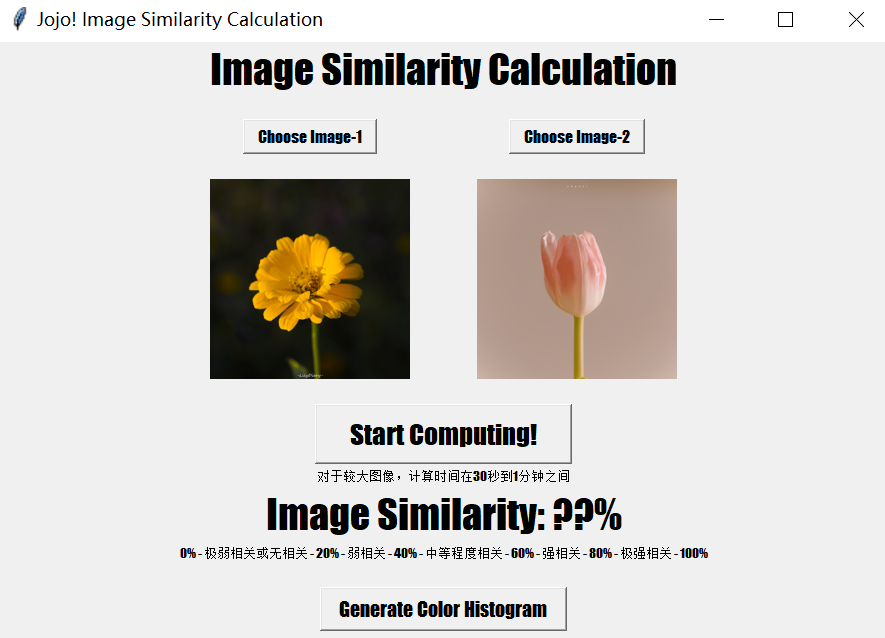

### 使用说明

通过点击```Choose Image-1```和```Choose Image-2```来更换待比较的两张图片，点击```Start Computing!```来开始计算，计算时间随图片像素点的增加而增大，如2000*2000的两张图片大致需要一分钟的时间，最后的计算结果会显示在```Image Similarity```一行，0%表示完全不相关，100%表示完全相关，最后通过点击```Generate Color Histogram```可以获取两张图片的三通道颜色对比折线图。

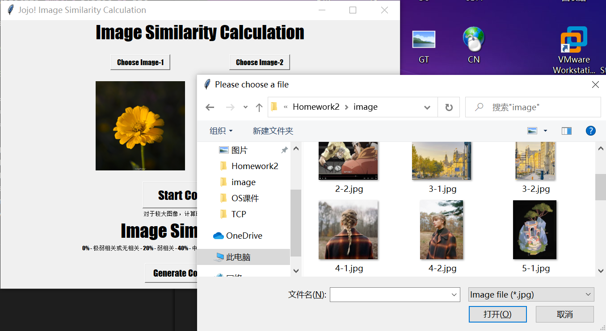

### 技术原理

* 软件统计图像的每个像素的RGB值作为衡量两张图片是否相似的标准，但如何数学化像素RGB统计，使之较为容易计算又不失效果，软件借鉴了博客：[相似图片搜索的原理（二）](http://www.ruanyifeng.com/blog/2013/03/similar_image_search_part_ii.html)中的思路：

  > 如果每种原色都可以取256个值，那么整个颜色空间共有1600万种颜色（256的三次方）。针对这1600万种颜色比较直方图，计算量实在太大了，因此需要采用简化方法。可以将0～255分成四个区：0～63为第0区，64～127为第1区，128～191为第2区，192～255为第3区。这意味着红绿蓝分别有4个区，总共可以构成64种组合（4的3次方）。
  >
  > 任何一种颜色必然属于这64种组合中的一种，这样就可以统计每一种组合包含的像素数量。[5]

* 因此该软件采用这种简化方法，将每个通道分成四个的颜色区：```[0:63], [64:127], [128:191], [192:255]```。这意味着红绿蓝三个通道分别有4个区，构成64种组合，在计算规模上是可观的。

* 统计每一个颜色区的像素点的总数，以此得到一个64元素的向量，然后通过计算两张图片的向量的皮尔逊相关系数，作为它们的相似度指标，经绝对值和百分比处理，得到两张图的相似度度量。

* 需要注意的是，皮尔逊相关系数用于判断数据是否线性相关，我们对相似性问题进行简化，不考虑不同颜色，如相近颜色之间的影响，直接使用皮尔逊相关系数作为判断指标是合理的。

* 简单的相关系数分类标准：
    | 范围 | 相关程度 |
    | ------ | -------- |
    | 0.8-1.0 | 极强相关 |
    | 0.6-0.8 | 强相关 |
    | 0.4-0.6 | 中等程度相关 |
    | 0.2-0.4 | 弱相关 |
    | 0.0-0.2 | 极弱相关或无相关 |

### 核心代码分析

1. 遍历图像的像素获得图像颜色块向量

   ```python
   def getVector(img_file):  
       img = cv2.imread(img_file)
       img_rgb = cv2.cvtColor(img, cv2.COLOR_BGR2RGB) # cv2默认为bgr顺序
       h, w, n = img_rgb.shape #返回height，width，以及通道数，不用所以省略掉
       
       print('getVector：图片信息 ',img_file,' 行数：%d，列数：%d，通道数：%d' % (h, w, n))
   
       arr = np.zeros((4,4,4))
       farr = np.zeros(64)
       
   	# 使用 // 64的方法将像素划分到指定颜色块中
       for img_line in img_rgb: 
           for img_cell in img_line:
               a = img_cell[0] // 64
               b = img_cell[1] // 64
               c = img_cell[2] // 64
               arr[a][b][c] = arr[a][b][c] + 1
    
   	# 导出到向量中方便后续计算
       for i in range(4):
           for j in range(4):
               for k in range(4):
                   farr[i*16+j*4+k] = arr[i][j][k]
       
       return farr
   ```

2. 计算Pearson相关系数

   ```python
   def getPearson():
       print('getPearson: 图片-1 ', filename_1)
       print('getPearson: 图片-2 ', filename_2)
       
       # 64个元素的向量
       farr_1 = getVector(filename_1)
       farr_2 = getVector(filename_2)
   
       # 计算相关系数并输出、返回       
       pearson_val = stats.pearsonr(farr_1, farr_2)
       res = abs(pearson_val[0]*100)
       strin = (" Image Similarity: %.02f" % (res) + "% ")
       print("getPearson:" +strin)
       return strin
   ```

3. 三通道颜色对比折线图生成

   ```python
   from matplotlib import pyplot as plt
   import cv2
   def getHistogram(image, v, c): # 参数依次是：文件名、标线的形状、图片编号（0或1）
       color = ('blue', 'green', 'red')      
       for i , color in enumerate(color):
           hist = cv2.calcHist([image], [i], None, [256], [0, 256]) # calcHist获取指定通道[i]的向量数据
           plt.plot(hist, color, linestyle = v, label = 'Image' + str(c+1) + '-' + color)
           plt.xlim([0, 256])
           plt.legend()
   
   def checkColorgram(): # 对每张图片调用 getHistogram，将两张图的三通道折线图反应在一张图表中
       src1 = cv2.imread(filename_1)
       src2 = cv2.imread(filename_2)
       getHistogram(src1, ':', 0)
       getHistogram(src2, '-', 1)
       plt.show()
   ```

4. GUI：采用 Tkinter，布局使用Cell的结构，由于功能简单没有加过多的组件。

## 实验结果分析

程序测试过程对十组不同的图片进行了相似度分析，并选出了几组对应的颜色直方图以供参考。其中第一组到第五组是“主观判定”的较为相似的图片，后五组是“主观判定”的差异较大的图片。

* 以下是前五组的图片的相似度分析结果：**可以看到都大于80%，即每组图片都被认为是极相似的。**

    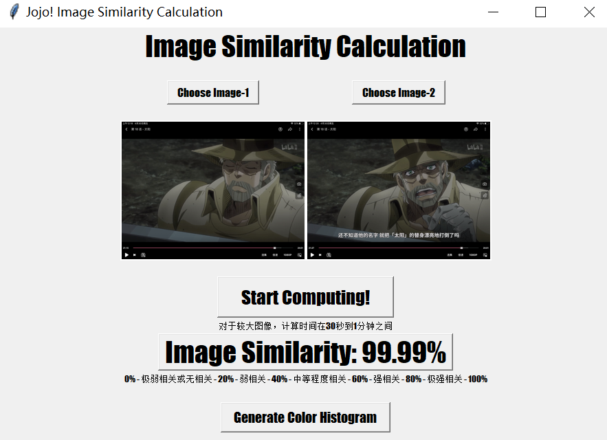

    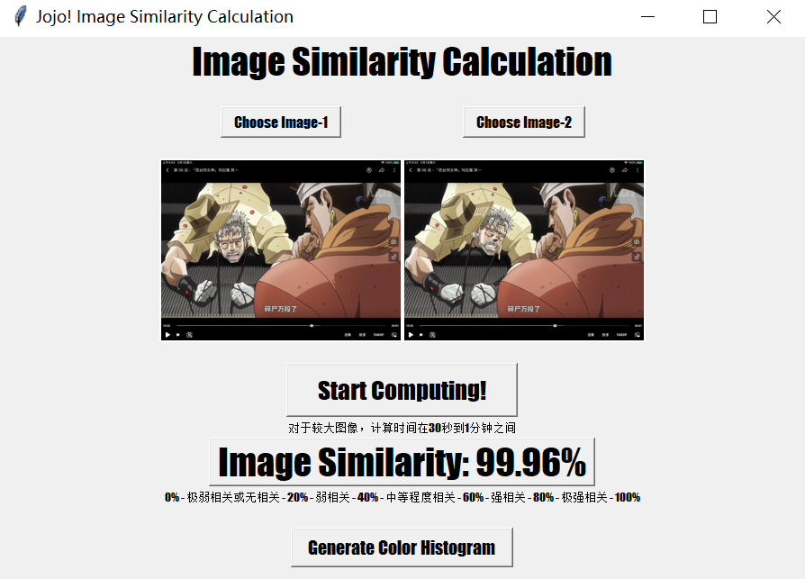

    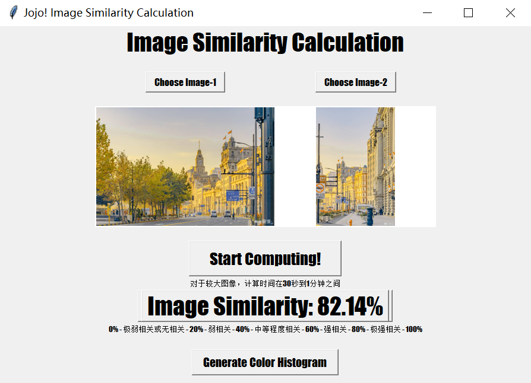

    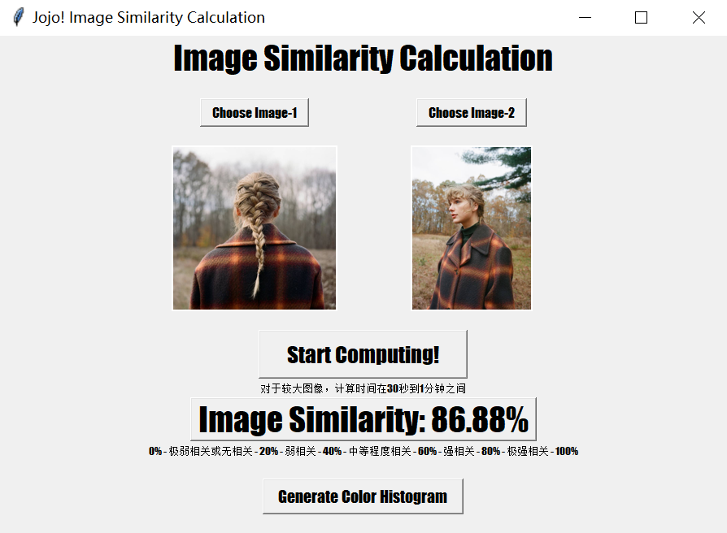

    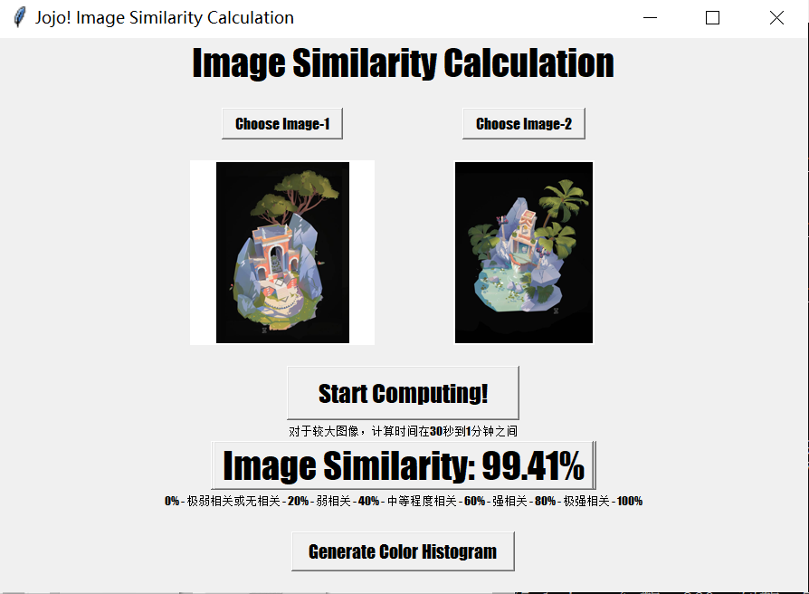

* 以下是后五组，它们在颜色上是不相似的，由软件测试得到的图片相似程度较低：**前两组分别是 7.65% 和 2.26%，可被认为是极其不相似的，第八到第十组的相似度在 40% 到 60% 期间，可被认为是是一般相似的**。

    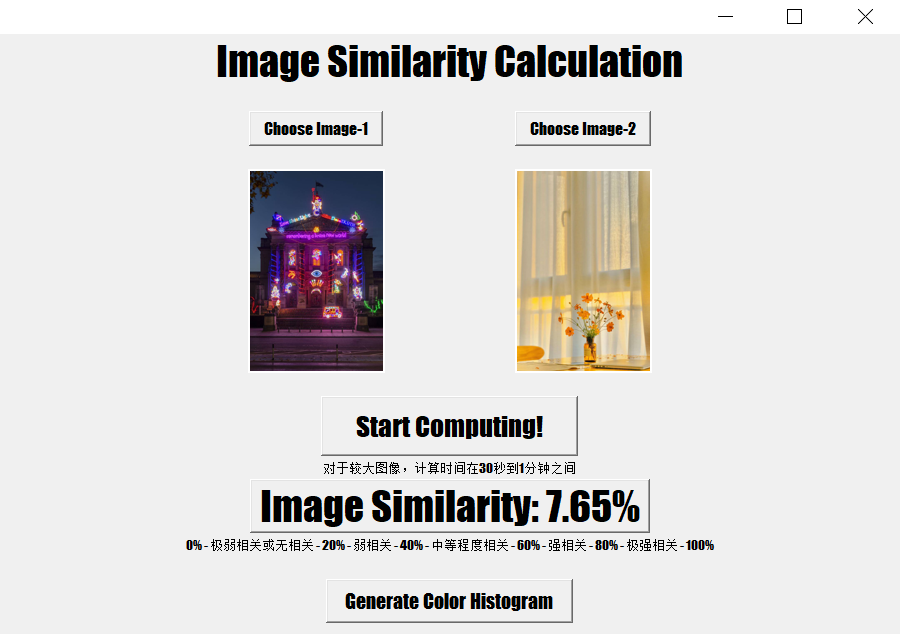

    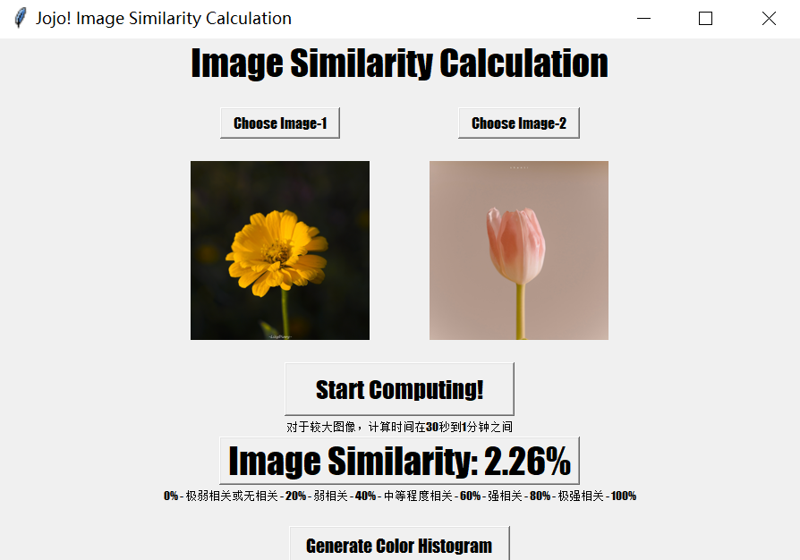

    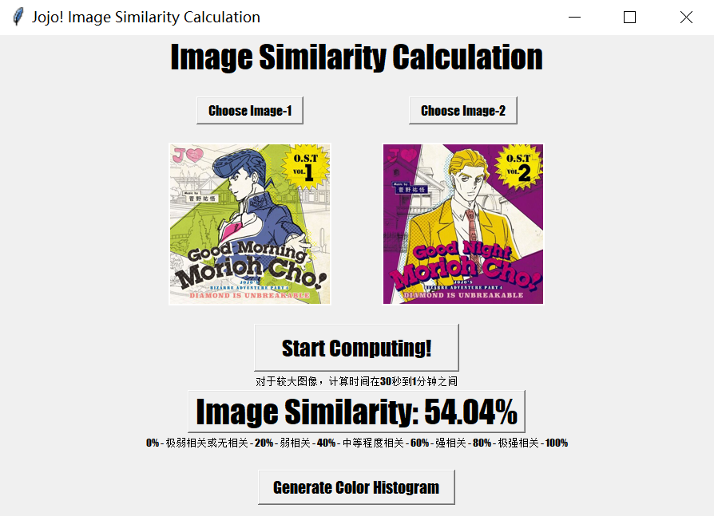

    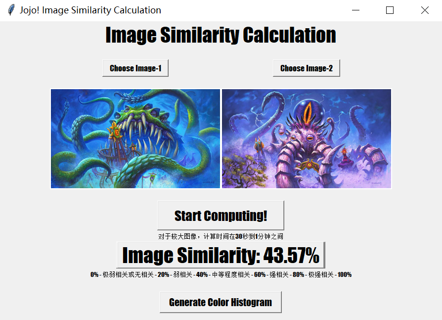

    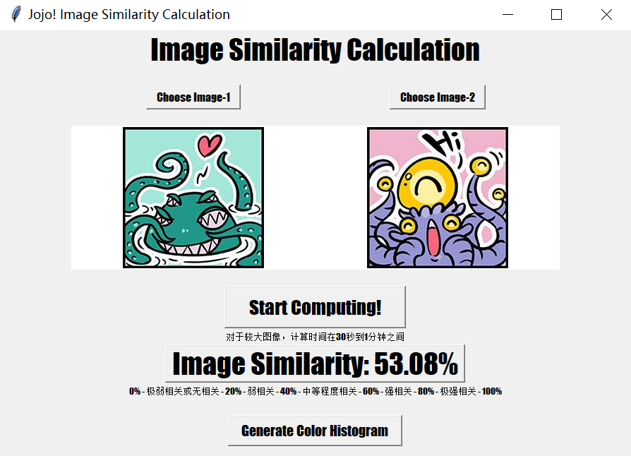

* 下面是，程序得到的颜色直方图：分别是第二、三、六、七、九组的颜色直方图，每组图片的两张分别用虚线和直线表示，每个通道分别用不同的颜色区分，对于第二组（相似度99.96%），虚直线条几乎重合，对于第六、七组（相似度7.65%，2.26%），虚直线条差异大。

    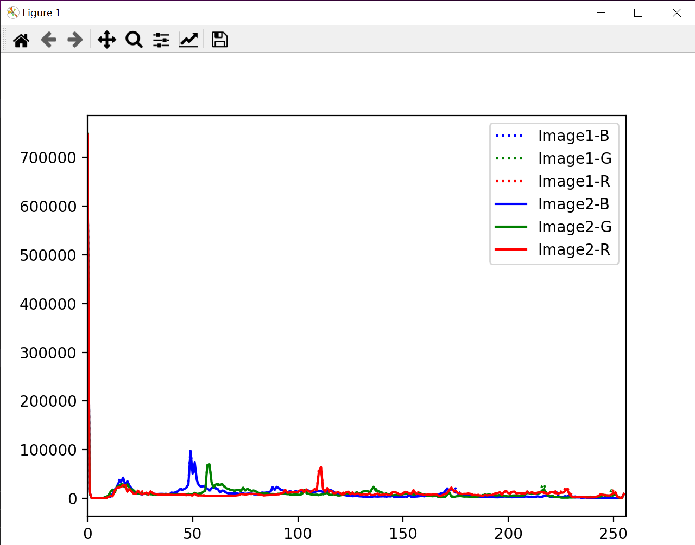
    
    ^ 第二组：相似度为99.96%
    
    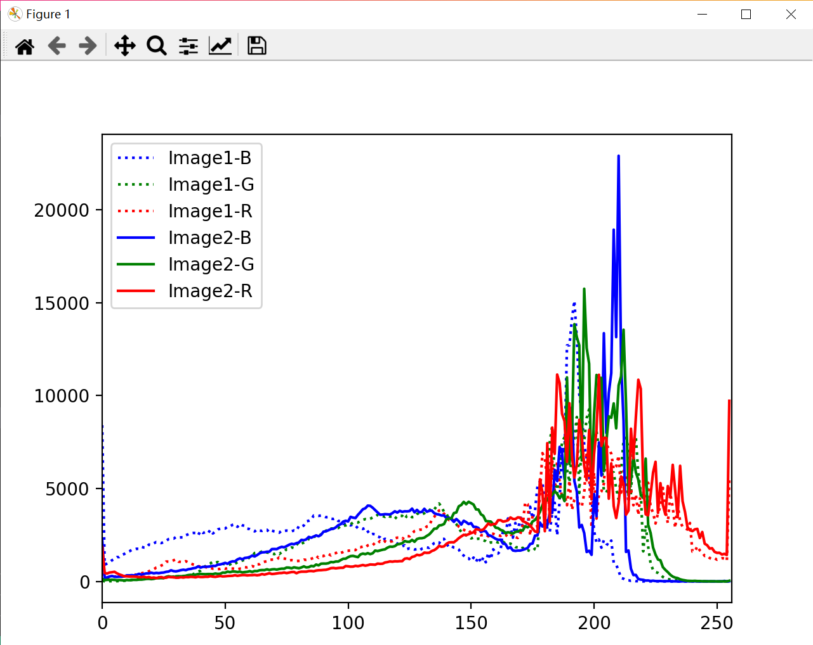

    ^ 第三组：相似度为82.41%
    
    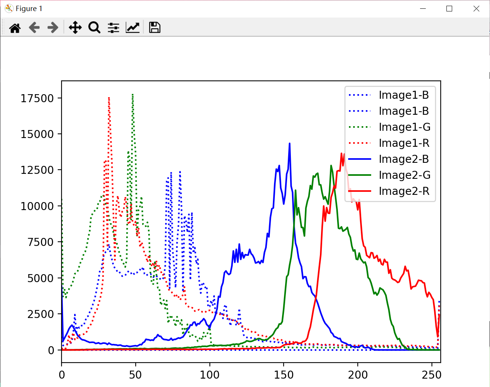
    
    ^ 第六组：相似度为7.65%

    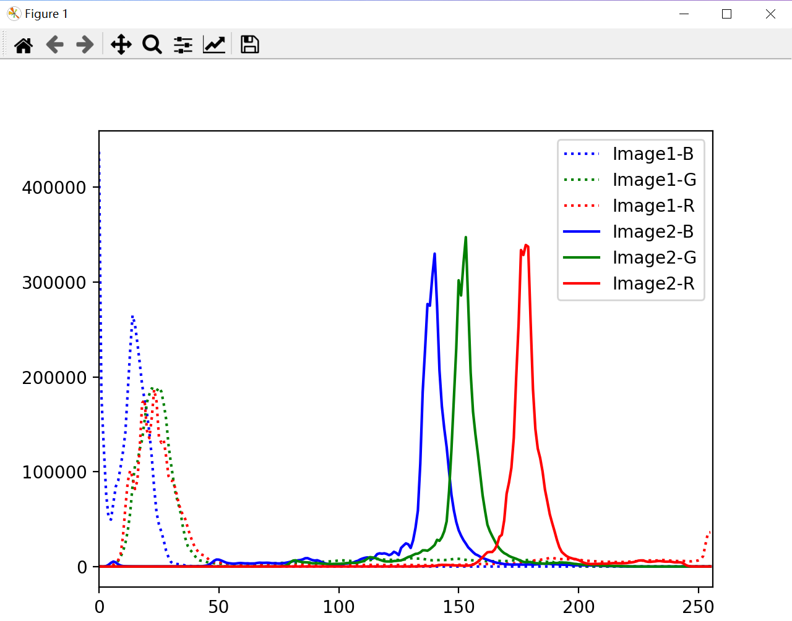
    
    ^ 第七组：相似度为2.26%
    
    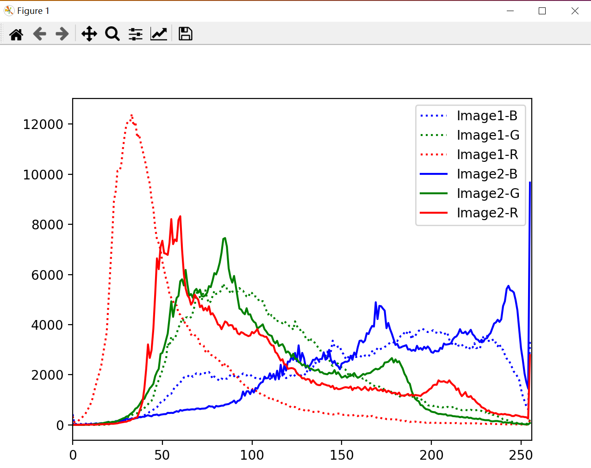
    
    ^ 第九组：相似度为43.57%

综上，程序对图片相似程度的计算与人的主观感受是较为符合的。

## 优缺点和改良思路

* 优点：
  * 基于图片各个像素的颜色统计作为相似度衡量标准，原理易于理解和实现
* 缺点：
  * 对于比较大的图片，像素点的遍历和统计较为耗时
    * 改良思路：考虑等比例选取像素点而不是遍历所有像素点，如：对每3*3的像素点矩阵只统计最中间一个。
  * 以颜色作为判准忽略了图片轮廓对图片相似性的影响，例如软件打开时显示的两幅花，摆放的位置和大小是相同的，尽管背景颜色和花的颜色不同，但认为它们完全不相似是有待考量的。
    * 改良思路：考虑增加轮廓相似参数，并与颜色相似参数加权求和得到最后的相似度值，但面临着算法复杂过于耗时的问题。
  * 基于颜色统计的思路，对于背景比较多的图片，背景的颜色对统计多，会淡化关键部分的颜色统计，对图片相似度评判影响较大。
    * 改良思路：识别轮廓，对边界内外的像素点统计赋予不同的比重，再对此进行灵敏度分析。

## 参考资料

1. 颜色直方图处理：https://blog.csdn.net/wsp_1138886114/article/details/80660014
2. 获取各像素颜色：https://blog.csdn.net/bjbz_cxy/article/details/79712074
3. 色彩向量化：http://www.ruanyifeng.com/blog/2013/03/similar_image_search_part_ii.html
4. 皮尔逊相关系数：https://segmentfault.com/q/1010000000094674/a-1020000000096510
5. Python Tkinter：https://docs.python.org/zh-cn/3.9/library/tk.html

