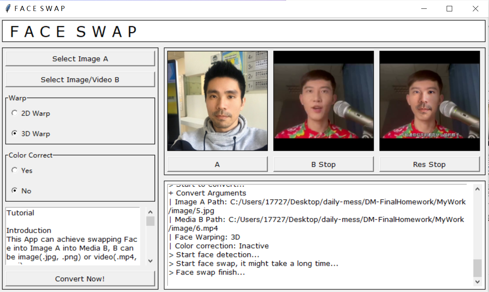

# F A C E  S W A P

这是一个使用Python编写的换脸软件，所提供的换脸功能包含以下两个场景：

* 将图像B上的人脸换成图像A上的人脸，生成换脸图片。
* 将视频B上的人脸换成图像A上的人脸，生成换脸视频。

整体上，程序由两个过程组成：人脸检测和提取、人脸转换，分别实现于文件`detect.py`和`convert.py`，两个阶段分别提供可选选项：包括图像变换的方法（2D变换和3D变换）和是否进行色彩调和。

在图形界面上（实现文件：`gui.py`），提供生成的图片、视频预览功能，生成的图像视频会自动保存到`out`文件夹。

## 使用指南

### 准备

1. 安装 Ananconda 或 Pycharm 以编译运行文件。

   推荐 Python版本：3.8.3

2. 检查是否安装如下库，以及版本是否满足要求：

   | 库            | 推荐版本    |
   | ------------- | ----------- |
   | numpy         | >= 1.20.3   |
   | scipy         | >= 1.6.2    |
   | opencv-python | >= 4.5.1.48 |
   | dlib          | >= 19.22.0  |

   你可以通过 pip 或者 conda 进行安装或更新，例如在 Anaconda Prompt 界面下输入：

   ```
   pip install numpy==1.20.3
   pip install scipy==1.6.2
   pip install opencv-python==4.5.1.48
   pip install dlib==19.22.0
   ```

### 运行

* 在 Anaconda Prompt 进入对应文件夹后，输入

  ```
  python main.py
  ```

  即可开启界面，也可以直接在 Pycharm 中右键运行，开启后界面如下：

  

## 运行效果

相对而言，3D Warp面部变化的效果由于2D Warp， 2D在边缘区域处理得不是很好；使用肤色调和（Color Correction）的效果也往往优于不使用肤色调和。

1. **不同选项的换脸效果 - I (3D Warp + Color Correction)**

   |                          | Result Image                 |
   | ------------------------ | ---------------------------- |
   |  |  |

2. **不同选项的换脸效果 - I (3D Warp + Without Color Correction)**

   

   | 2D Warp + Without Color Correct  | 2D Warp + Color Correct          |
   | -------------------------------- | -------------------------------- |
   |  |  |

   | 3D Warp + Without Color Correct  | 3D Warp + Color Correct          |
   | -------------------------------- | -------------------------------- |
   |  |  |

3. **不同选项的换脸效果 - II (2D Warp + Color Correction)**

   

   下面可以明显看出2D Warp和3D Warp的不同效果：

   | 2D Warp                           | 2D Warp + Color Correction        | 3D Warp                           | 3D Warp + Color Correction        |
   | ------------------------------- | ---------------------------- | ---------------------------- | ---------------------------- |
   |  |  |  |  |

4. **视频换脸效果：视频换脸是按帧一一处理的，比较耗时。**

   

## 关键算法

* 人脸检测与提取
  * `keypoints_detection` - 通过人脸五官68个关键点识别人脸集合，基于`dlib.shape_predictor`函数和数据集`shape_predictor_68_face_landmarks.dat`
  * `face_selection` - 选取指定人脸
* 人脸变换
  * `face_swap` - 人脸变换核心函数，步骤为：
    * **仿射变换**（2D/3D）
    * **生成掩膜**
    * **颜色校正**（选）
    * **无缝接合**
  * `image_warping_2d` - **2D仿射变换**，通过调用cv2的`warpAffine`函数计算脸部映射后的人脸图像
    * `points_transformation` - 生成两份人脸关键点集的三角仿射变换矩阵M，作为2D Warping的关键参数。
  * `image_warping_3d` - **3D仿射变换**，通过将图像变换为三角性构成的集合（借助`spatial.Delaunay`），对每个三角形区域进行运算和插值最后得到脸部映射后的人脸图像
    * `grid_coordination` - 获取点集对应的背景网格
    * `bilinear_interpolation` - 对人脸关键点坐标进行**双线性插值**处理，通过这个函数可以实现在改变图像大小的同时尽可能保证清晰度，用于人脸部分的缩放。
    * `triangular_affine_matrices` - 生成源点集到目标点集的**三角仿射矩阵**
  * `mask_generation` - **生成掩膜**：借助`cv2.fillConvexPoly`填充凸多边形遮挡
  * `color_correction` - 通过**高斯滤波**进行人脸肤色调和

## 实现参考

**该软件主要参考开源代码：https://github.com/wuhuikai/FaceSwap ，并复现其核心算法部分。**

