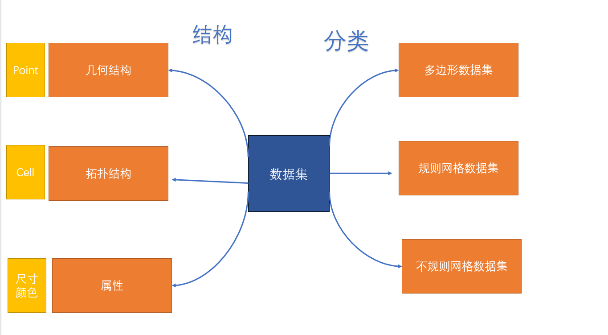

# 设想

## 简介

我们希望开发一个面向对象的类库，我们称之为网格应用程序开发系统，该类库能提供网格应用程序编辑、存储、执行、计算、可视化等基本功能。

## 用户概要

该产品面向的用户为使用c++创建类的开发人员、使用c++类库来建立完整应用程序的开发人员、需要应用网格图进行2D、3D建模的工程师和研究人员。

## 用户目标

* 医学工作者：研究某种疾病传播网络模型
* 机械工程师：研究热量在某物理设备中的传播
* 建筑师：建立一个建筑模型，测定其受力情况
* 网络管理：控制流量，确定数据流方向
## 产品概览

在网格应用程序系统中，我们提供文件输入接口和文件数据解析功能，用户可以将网格数据文件导入到程序中，并将这些数据以一定的数据结构存放在内存中。用户可以用一些系统内核功能定义一些函数以便处理数据和对网格进行计算，除此之外用户还可以利用一些算法来对数据结构进行处理。在系统设计中提供用户算法的循环、分支机制，使用户能够灵活定义和处理网格结构。

我们的系统以用户预定义的格式将模拟结果输出到一些处理工具。这些工具可以将模拟结果可视化并展示。

我们的系统提供基本的存储、IO等功能，支持某些平台和系统（windows/Linux、c/c++/python)下的网格应用程序的编程和执行。我们设计的系统允许用户用C/ c++之类的编程语言创建网格应用程序。并为用户程序提供一个执行环境。实现这个环境的工作主要是为网格程序实现一个运行时类库。

我们的系统可以应用于计算机图形学、图像处理和三维可视化等领域，独立于系统的图形界面接口，可嵌入到其它相关软件中。同时开发人员可以基于系统的独立类库开发自己的库函数，拓展应用范围。

## 系统特性概要

* 在windows/Linux下运行
* 允许使用c/c++/python进行编程
* 用户将文本文件、二进制文件作为输入，得到网格数据
* 以一种高效的数据结构在内存中存储网格结构
* 用户可以在代码中定义函数、算法，对网格做运算处理
* 系统提供内核循环、分支操作
* 系统由c/c++实现，可以在多核CPU上运行
* 系统允许用户跟踪进程性能

## 数据结构概况

