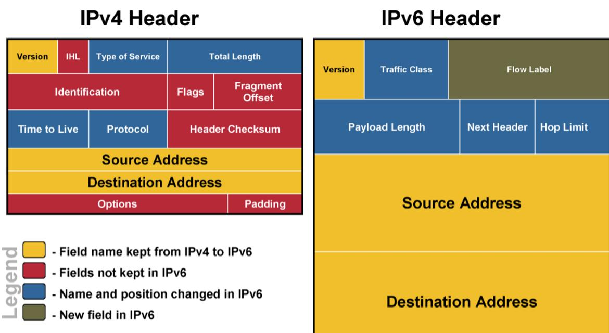

## 第四次计算机网络原理作业

姓名：郑有为  学号：19335286

**1、 ATM 和 IP 分属有连接和无连接的网络层协议，从数据包路由和转发的角度，简述两者的区别。**

提供连接服务的计算机网络称为虚电路VC，不提供连接服务的计算机网络称为数据报网络，因而因特网是数据报网络，ATM是虚电路网络。从数据包路由和转发的角度，他们的区别在：

**转发表和转发规则不同：**

* 对于ACM协议，路由器的转发表维护的是路由器入接口、出接口及其对应的入VC号、出VC号与每一条链路的对应关系。VC号是沿给定路径的每一段链路的一个号码。

  ATM通过VC号转发，ATM分组首部也携带VC号。一个分组沿着路由在每条链路上不保持相同的VC号，当跨越一台路由器创建一条新的虚电路时，转发表就增加一个新项。

* 对于IP协议，IP转发的内容是IP地址与转发出口的对应关系，转发过程遵循最长前缀匹配原则，即在该表中寻找与目的IP地址最长的匹配项，然后向最长前缀匹配的链路接口转发该分组。

* 在ATM协议中，**建立新连接和拆除现有的连接就更新路由器转发表**。而一般情况下，IP协议的转发表由选路算法维护，每隔一定**周期自动更新转发表**。

**报文传输过程和路由不同：**

* 在ATM协议中，报文通过虚电路传输，一条虚电路由源与目的主机之间的路径、VC号（沿着该路径的每段链路的一个号码）、沿路径每台路由器的转发表组成。

  ATM协议传送报文的三个阶段为：虚电路建立（网络层决定路径并沿着路径的每一条链路确定一个VC号，更新沿途路由器转发表）；数据传输和虚电路拆除。同时，在ATM传输过程中，路由器必须为进行中的连接维持链接状态信息。

* 对于IP协议，发送分组无需建立虚电路，路由器也不会维护任何有关虚电路的状态信息。

  IP数据报网络的传输过程：分组向目的地传输时，它通过一系列路由器，路由器根据目的IP地址，将其映射到链路接口的转发表以转发分组。

* 由于IP数据报网络的转发表可以在任意时刻修改，**因此同源IP、目的IP的分组再通过网络时可能走不同的路径**，而ATM网络则不会出现这种状况。

* A：

  * **ATM实现建立，IP边传边找路**
  * **ATM路由表周期性更新**

**2、 NAT 是当前缓解 IPv4 地址不足的主要技术，简述它的技术原理并分析优缺点。** 

* **NAT技术原理：**NAT全称“网络地址转换”，是一种简单的地址分配方法。NAT路由器连接外网和专用网络，对外界的行为就如一个具有单一IP的单一设备，对外界隐藏了内部网络的细节。

  NAT转化表的表项中包含了端口号和IP地址，对应的路由器会改写数据报的目的/源IP地址和目的/源端口号，根据修改前后的地址和端口建立NAT转换表。

  对于发送过程，NAT会修改数据报的IP和端口号，并将其与源IP和端口号建立映射，加入NAT转化表。

  对于接收过程，接收到的数据报的IP和端口都是NAT修改后的值，根据这些再从子网中找出实际对应的PC和端口，并向重新改写数据报目的IP和端口，向该端口转发数据报。

* **NAT优点：**

  1. **缓解IP地址不足**：通过使用少量的公网IP地址代表较多的私有IP地址的方式，有利于减缓可用的IP地址空间的枯竭。
  2. **安全**：避免来自网络外部的攻击，隐藏并保护网络内部的计算机。

* **NAT缺点：**
  1. 违反分层设计原则：NAT修改的端口号实际上用于编址主机，实际上端口号应用于编址进程；路由器不应该查看并处理第三层分组以上的内容
  2. 违反端到端原则：主机之间应相互直接对话，中间结点不应该介入修改IP地址和端口号。
  3. NAT妨碍了P2P应用程序的应用。

**3、 对 IPv4 和 IPv6 数据包结构进行对比分析，解释 IPv6 数据包结构简化的原因。** 

> 
>
> 图片源于网络

**对比分析IPv4和IPv6数据包首部结构：**

* **IPv4和IPv6共同的部分：**
  * **Version版本号**：4比特位，为4时指明为IPv4，为6时指明为IPv6。
  * **源IP地址和目的IP地址**: IPv4为32比特位，而IPv6位128比特位。

* **IPv4与IPv6相同但名称不同的部分：**
  * **TOS**(IPv4)和**Traffic Class**(IPv6)，指明流量类型
  * **Total Length**(IPv4)和**Payload Length**(IPv6)，二者名称不同但含义是相同的：指数据包首部之后的数据的总长度。
  * **Protocol**(IPv4)和**Next Header**(IPv6)，二者名称不同但含义是相同的：该字段标识该数据包中的内容需要交付给那个协议（TCP/UDP）
  * **TTL**(IPv4)和**Hop Limit**(IPv6)，都是用来约束报文寿命的标签，用路由器跳数标识，每通过一个路由器减一，为零时数据包被丢弃。

* **被IPv6舍弃的部分：**
  * **IHL(Internet Header Length)**：IPv4首部长度，不同于IPv6首部，IPv4首部是可变长的，一般为20字节。
  * **Identification数据包标识、Flags标志、Fragment Offset片偏移**，与IP分片有关。
  * **Header Checksum首部检验和**：用于计算数据报的比特错误。
  * **Options选项和Padding**：允许IPv4首部扩展

* **IPv6新增的部分：**
  * **FlowLabel流标签**：指明是发送方要求进行特殊处理的流

**IPv6对IP数据包首部进行简化的原因如下：**

1. 分片/重新组装：IPv6不允许在中间路由器上进行分片和重新组装，这种操作只能由源主机与目的主机完成，若一台路由器收到的数据报太大，则丢掉该数据包，并发送一个”分组太大“的ICMP差错报文，让发送方使用较小的ICMP包重发数据，从而来减少数据包在沿途过程中分片与组装较大的耗时，依次加快IP转发速度。

2. 首部检验和：运输层和数据链路层也会执行检验操作，在网络层也是先过于冗余。减少了校验所消耗的时间，加快了IP转发速度。

3. 选项：选项不再作为标准首部，但可以出现在首部之后，即Next Header指向的位置处，删除选项以产生一个固定的首部长度（40字节）。

4. 首部长：因为IPv6的首部是固定长度的，所以不再需要记录首部长度。

   

**4、 在路由器中采用的排队结构大致分为输入排队、输出排队、中央共享排队，对这些结构的优缺点进行对比分析。** 

三种排队结构基本含义：

* 输入排队：在路由器的每一条输入端口上配置一个队列缓冲器用来存储数据包。到达入输入端口的数据包首先进入到其各自对应的输入队列中进行排队。

* 输出排队：将队列缓冲器设置在路由器的输出端口中来缓存数据包；

* 中央共享排队：将队列设置在传输路由器的交换结构上。中央排队缓冲器被所有的入线和出线所共享，而不是由某条入线或出线专用。从到达数据包都通过交换结构直接存入到中央队列缓冲器。

**三种排队结构优缺点比较：**

* **输入排队：缺点 - 需要总线仲裁、会发生队头阻塞、存储器的利用率不高**。

  ​		由于信元流是统计复用的，在一个信元周期内可能会有多个队列的队头信元选择相同的目的出线。在出现这种情况时，交换单元中需要总线仲裁来决定哪一个队列中信元能够在当前信元时隙内得到服务，而其他信元将在各自的队列中继续等待，直到在以后的信元时隙中仲裁逻辑允许其传输。

  ​		输入排队最主要的缺点是存在队头阻塞现象。如果队头的信元因为竞争失败而暂时无法得到服务，那么队头数据包的等待将使整个队列中所有数据包被迫等待。在使用输入队列的交换单元中，一个传送周期内实际通过交换结构的数据包数量往往小于交换单元的输入端口数，这是因为有可能存在某些输入端口，因队头阻塞而导致在该传送周期中不能传递数据包。

* **输出排队：缺点 - 需要交换结构速度尽可能快，存储器的利用率低；优点 - 能解决数据包相邻到达的竞争、无需总线仲裁、无队头阻塞，比输入排队具有更高的性能。**

  ​		在输出端口提供排队缓存，以解决数据包相邻到达的竞争。在一个传送周期中，到达各个入线的所有均可以在该传送周期内通过交换结构，被分别传输到各目的输出端口上。有可能出现多个数据包去往同一输出端口，而这时只能有一个数据包在出端口上得到服务而被传输，从而产生了出线竞争。

  ​		为保证在交换过程中没有数据包丢失，交换结构的传输速度应该高于N倍输入端口的入线速率（N为输入端口数），以保证在一个传送周期内能够将N个数据包传输到对应的目的输出端口上，否则会产生不断加重的拥塞。同时，输出排队的缓冲存储器的存取速度也必须足够高。

  ​		与输入排队相比，输出排队的方案不需要总线仲裁，只要交换传输媒体的速率足够高，所有的信元都可以分别无阻塞地去往各自的目的输出队列。输出排队也不存在对头阻塞现象，一般情况下，每一个输出队列中的数据包具有相同目的地址，其传送都不会因为不同目的地址而被阻塞。

* **中央共享排队：优点 - 共享存储器利用率高，成本和功耗低。**

  ​		中央共享排队优化了交换单元中队列存储器的使用。在输出排队方案中们必须为每一条出现配置一个独立的队列。为了保证队列溢出引起的信元丢失足够小，每一条队列都必须有足够的容量。这样，在一个交换结构中所需的队列存储器的总容量需大于N个队列的容量，但在实际工作过程中，通常并非所有的队列都同时具有较高的占用率，造成浪费。

  ​		中央共享排队考虑让各个队列采用共享的方式来使用队列存储器，以便得到较高的存储器的利用率，减少交换单元中所需要的队列存储器的总容量，以降低系统成本和功耗。

**5、 在网络层和传输层都存在有连接服务，比如 ATM 和 TCP，从数据传输过程来分析它们的异同。**

ATM与TCP相同，传递数据之前要建立连接，但也存在如下差异：

1. 服务的层次：网络层ATM是从网络层到运输层提供的主机到主机的服务，而运输层TCP是从运输层向应用层提供的进程到进程的服务。

2. 传输设备不同：TCP是在端系统上实现的，而ATM是在端系统和路由器上实现的。

3. 建立连接不同：

   * TCP：运输层连接建立仅涉及两个端系统，两个端系统独自决定运输层链接的参数。虽然这两个端系统已经知道该运输层连接，但网络中的路由器对此完全不知情。

     数据包从发送方流向接收方之前需要三次握手，使得发送方和接受方建立所需的状态信息（例如，序号和初始流控制窗口长度）

   * ATM：网络层建立连接，沿两个端系统之间的路径上的路由器都要参与虚电路的建立，且每台路由器都完全知道经过它的所有虚电路。

     连接通过信令协议建立，路由器间交换信令报文，使用VC号进行路由选路，建立过程中，每跨越一台路由器创建一条新的虚电路，转发表就增加一个新项。

