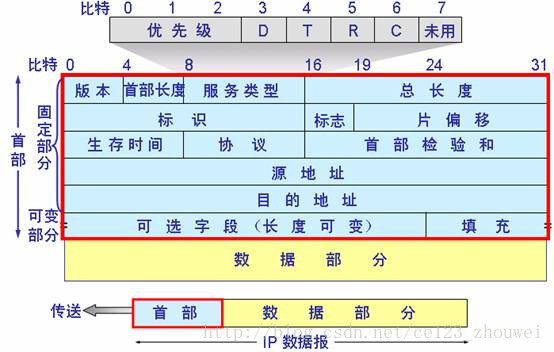
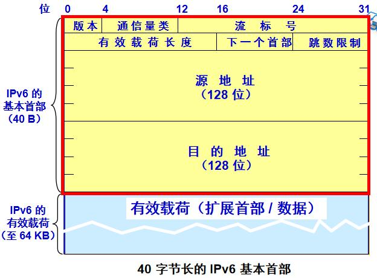

# 网络层

[toc]

## 4.1 概述

1. **网络层**：实现主机到主机的通信服务。
2. **数据报**：网络层分组的称呼。

### 4.1.1 转发与选路

3. **转发**：当一个分组到达某路由器的一条输入链路时，该路由器必须将该分组移动到适当的输出链路。

4. **选路**：当分组从发送方流向接收方时，网络层必须决定这些分组所采用的路由或路径，计算这些路径的算法称为选路算法。
5. **转发表**，一台路由器有一个转发表。路由器通过检查分组信息来作为转发表的索引查出报文对应的输出链路。
6. 连接建立：网络层的第三种功能，某些网络体系结构（非因特网）要求建立连接。

### 4.1.2 网络服务模型

7. 网络服务模型：定义网络的一侧边缘到另一侧边缘之间分组的端到端运输特性。

8. 能由网络层提供的服务：

   * **确保交付、具有时延上界的确保交付、有序分组交付、安全性服务、完整性、源鉴别服务**；
   * 确保最小宽带：只要发送速率低于特定比特率速率，分组就不会丢失，且在时间期限前到达；
   * 确保最大时延抖动：确保发送方发送的两个相继分组的时间间隔等于它们分别被接收端接受的时间间隔。

9. IP：**尽力而为服务 定时、顺序、最终交付不保证**。

10. ATM网络体系结构（网络层）提供的多重服务：

    * CBR恒定比特率ATM网络服务
    * ABR可用比特率ATM网络服务

    

## 4.2 虚电路和数据报网络

11. **网络层能提供面向连接、面向无连接的服务，与运输层连接、无连接的重要差异**有以下几点：
    1. 服务的层次：网络层提供的是由网络层到运输层的主机到主机的服务，而运输层提供的是从运输层向应用层提供的进程到进程的服务。
    2. 主要的计算机网络体系结构中的网络层不同时提供两张类型的服务，**提供连接服务的计算机网络称为虚电路VC，不提供连接服务的计算机网络称为数据报网络**。
    3. 连接服务的实现设备不同：运输层-端系统，网络层-端系统和路由器。

### 4.2.1 虚电路网路

12. 因特网是数据报网络，ATM、帧中继是虚电路网络。
13. **一条虚电路的组成**：源与目的主机之间的路径、VC号（沿着该路径的每段链路的一个号码）、沿路径每台路由器的转发表。当跨越一台路由器创建一条新的虚电路时，转发表就增加一个新项。
14. **一个分组沿着路由在每条链路上不保持相同的VC号**，原因是(1). 减少分组VC字段长度；(2). 简化虚电路的建立，具有多个VC号，每条链路的VC号与路径其他链路的相互独立，否则路由器需要处理大量报文一约定同一VC号。
15. 虚电路三个阶段：**虚电路建立**（网络层决定路径并沿着路径的每一条链路确定一个VC号，更新沿途路由器转发表）；数据传输；虚电路拆除。相关报文称为信令报文，由信令协议管理。

### 4.2.2 数据报网络

16. 数据报网络传输过程：随着分组向目的地传输，它通过一系列路由器，路由器根据目的地址，将其映射到链路接口的转发表转发分组。一般转发表由选路算法维护
17. **最长前缀匹配原则**：在该表中寻找最长的匹配项，并向与最长前缀匹配的链路接口转发该分组。

## 4.3 路由器工作原理

18. 路由器的四个组成部分：输入端口、交换结构、输出结构、选路处理器

### 4.3.1 输入端口

19. 输入端口（端接 -> 数据链路处理（协议、拆封）-> 查找、转发、排队）。分散式的转发结构：输入端口保存转发表的一份本地拷贝
20. 输入端口的期望处理速度：线路速度，即执行一次查找的时间应少于输入端口接受一个分组的时间。转发表实际上可以是树形结构，可使用二分查找）。内容可寻址内存CAM或者高速缓存也用于提高查找速度。

### 4.3.2 交换结构

21. 三种交换技术：**经内存交换**、**经一根总线交换**（无需处理器干预，每次只能通过一个分组、受总线速率控制）、**经（纵横制）互联网络交换**（2n条总线组成的互联网络，交换结构一次只能传送一个分组到某个特定端口上)

### 4.3.3 输出端口

22. 输出端口（排队缓存管理 -> 数据链路处理（协议、封装）-> 线路端接）

### 4.3.4 何时出现排队

23. 输入输出端口都会形成分组队列，随着队列的增长超出缓存空间就会丢包。分组丢失的实际位置取决于流量负载、交换结构的相对速率和线路速率等。
24. **交换结构速率**：交换结构能从输入端口到输出端口移动的速率。设有n输入端口，n输出端口，输入输出端口速率相同。当交换结构速率至少是输入线路速率的n倍时，输入端口不会排队。在最坏情况下，所有n个输入端口的分组被发往一个输出端口，会导致输出端口排队和丢包的方生。
25. 分析相对少量TCP流的排队动态性，链路缓存量B = 往返时间RTT * 链路容量C；分析相对大量TCP流的排队动态性，链路缓存量B = 往返时间RTT * 链路容量B / sqrt(N)。
26. 主动队列管理：如弃尾（删除一个或多个已排队的分组来腾出空间）、随机早期检测等。

## 4.4 网际协议：因特网中的转发和编址

27. 因特玩的网络层三个主要的组件：
    * IP协议（编址规则、数据报格式、分组处理规则）
    * 选路协议（路径选择、RIP/OSPF/BGP）
    * ICMP协议（差错报告、路由器指令）

### 4.4.1 数据报格式

28. IPv4数据报格式，一般是20字节的首部。

​	

29. IP数据报分片：一个链路层能承载的最大数据量称为最大传输单元（MTU），不同链路可能具有不同的MTU，对于过大的IP数据报，需要分片成两个或多个数据报，这些小数据报称为片。片在到达目的运输层时需要重新组装，网络路由器不进行组装。（IPv6已经废止分片）
30. 片的接收：通过比对。IP数据报中的标识、标志和片偏移量，最后一片的标志比特位为0。

### 4.4.2 IPv4编址

31. **一个IP地址在技术上时与一个接口相关联的**，而不是与主机或路由器相关联。一个IP地址的组成部分需要由其连接的子网来决定。一个例子：223.1.1.0/24 子网IP，/24指子网掩码，任何其他要连到该网段的主机都要求IP地址为223.1.1.xxx
32. 为了确定子网，分开主机和路由器的每个接口，从而产生几个分离的网络岛，接口段接了独立的网络端点，这些每一个独立的网络称作子网。
33. 无类别域间选路 CIDR： IP地址被划分为两部分，并具有个数a.b.c.d/x，其中x指示地址在第一部分中的比特数，第一部分构成**IP地址的网络部分**，又被称为该地址的前缀，而剩下的**第二部分用于区分组织内部设备**的。
34. 分类编址：**限制IP网络长度为8、16、24，分别称为A、B、C**类网络。
35. IP广播地址:255.255.255.255，向他发送数据报时，该报文会被**交付给同一个子网中的所有主机**。
36. 获取IP地址的三种方法：从ISP那取、DHCP获取、NAT获取
37. 从ISP获取主机地址：ISP从他持有的地址块中提供一块地址。ICANN最终负责管理IP地址空间并向ISP分配IP地址。
38. 通过DHCP获取主机地址：
    * **DHCP 动态主机配置协议**，利用DHCP，主机可以自动获取IP地址，或者被分配一个临时的IP、通常还允许主机获取它的子网掩码、第一跳路由器地址（默认网关）、本地DNS服务器地址。
    * DHCP又被称为**即插即用协议**`plug-and-play`。DHCP服务器维护一个地址池，给需要的PC分配临时IP地址。
    * DHCP协议是C/S协议，给新到达的客户机分配地址的4个步骤：（端口号好像是服务器67、客户机68）
      * **DHCP服务器发现**：主机区通过DHCP发现报文发现一个与其交互的DHCP服务器（通常UDP发送：目的地址255.255.255.255，源地址0.0.0.0）
      * **DHCP服务器提供**：服务器响应，依然使用广播地址发送，发送的DHCP提供报文包含发现报文的事务ID、向客户机推荐的IP地址、网络掩码以及IP地址租用期限。
      * **DHCP请求**：新到达的客户机从（可能是多个）服务器里选择一个，并使用DHCP请求报文对选中的服务器进行响应，回显配置参数（广播发送）。
      * **DHCP确认**：服务器用DHCP ACK报文对请求进行响应，交互完成。
    * DHCP不足：一个移动节点在子网间移动时，不能维持与远程应用的连接。（因为IP改了）
39. 通过NAT获取主机地址
    * **NAT 网络地址转换**：**NAT路由器对外界的行为就如一个具有单一IP的单一设备，对外界隐藏了内部网络的细节。**
    * NAT转化表：**表项中包含了端口号和IP地址**，对应的路由器**会改写数据报的目的/源IP地址和目的/源端口号，根据修改前后的地址和端口建立NAT转换表**。
    * 发送过程，NAT会修改数据报的IP和端口号，并将其与源IP和端口号建立映射，加入NAT转化表。
    * 接收过程，接收到的数据报的IP和端口都是NAT修改后的值，根据这些再从子网中找出实际对应的PC和端口，并向重新改写数据报目的IP和端口，向该端口转发数据报。
    * NAT得到广泛应用，一些人反对NAT的原因：(1). **NAT修改的端口号实际上用于编址主机，实际上端口号应用于编址进程** (2). **路由器不应该处理第三层分组以上的内容**（取改上层协议内容）(3). **违反端到端原则** (4). **该用IPv6而不是NAT解决IP地址短缺问题**。NAT还**妨碍了P2P应用程序的应用。**
40. 通过UPnP获取IP：UPnP即插即用实现NAT穿越，允许主机发现并配置临近NAT的协议。

### 4.4.3 ICMP协议（互联网控制报文协议）

41. **ICMP用于主机和路由器彼此交互网络信息**，典型用于差错报告，例如返回“目的网络不可达”等错误报文。**ICMP报文是承载在IP分组中的，本质上是一个上层协议。**
42. ICMP报文组成：ICMP报文有一个类型字段和编码字段，并包含引起该ICMP报文首次生成的IP数据报的首部和前八字节内容，以便于发送方能确定引起该差错的数据报。ICMP报文类型参考课本231页。
43. **ping程序：发送一个ICMP类型8编码0的报文到指定主机，看到该回显请求的目的主机返回一个类型0，编码0的ICMP回显回答。**
44. 源抑制报文：ICMP报文是源抑制报文，目的是执行拥塞控制，**允许拥塞的路由器向一台主机发送一个ICMP源抑制报文，以强制主机减少传输速率**。但实际上，TCP不需要利用网络层的反馈信息（ICMP源抑制报文）。

### 4.4.4 IPv6

45. IPv6数据报格式

​	

46. IPv6引入的变化 ：
    1. 扩大的地址容量：从32位加到**128位**，同时引入**任播机制**（随便交付给一个主机）。
    2. 简单高效40字节首部，舍弃许多IPv4字段：如分片/重新组装（**对此IPv6的策略是数据报太大的话直接报错，返回ICMP差错报文，以加快IP转发速度**）、首部检验和（别的层有了）、选项。
    3. 流标签与优先级：给特殊流的分组机上标签，表示这些是发送方要求进行特殊处理的流，如非默认服务质量或实时服务
    4. 跳限制：经过每台路由器时该字段内容减一，到达零时丢弃该数据报。
47. IPv4向IPv6迁移的几种方法：宣布一个标志日（不可行）、双栈：IPv6结点也有完整的IPv4实现，建隧道也是一种双栈实现。
48. **建隧道**的基本思想：假定两个IPv6节点要使用IPv6进行交互，但他们时有中间IPv4路由器互联的。我们经两台IPv6之间的IPv4路由器集合称为隧道，借助隧道，IPv6的数据报可以放入到IPv4数据报的数据总段中，并进行标记，隧道中有IPv4路由器选路，最后接受端IPv6节点取出IPv6数据包选路。

### 4.4.5 IP安全

49. IPsec：提供安全性服务的新型网络层协议，IPsec也是VPN所采用的协议，向后兼容IPv4、IPv6。只要两台主机中使用IPsec就可以提供安全通信，不需要替换路由器和主机中的协议栈。
50. IPsec的传输模式：面向连接的，先建立一个IPsec会话，通过适当的会话，所有的TCP、UDP报文段享受安全性服务。IPsec负责加密报文段，添加安全性字段，并封装在一个普通IP数据报中，接收端再通过IPsec进行解密。
51. IPsec会话提供的服务：密码技术协约，数据段有效载荷的加密，保证数据完整性、初始鉴别（确认源IP是数据报的实际源。

## 4.5 选路算法

52. **默认路由器：与一台主机直接相连的路由器**，也称为第一跳路由器，源路由器和目的路由器分别指的是源主机和目的主机的默认路由器。
53. 选路算法分类：
    * 全局和分布：
      * **全局选路算法**（通过网络全貌计算最低费用路径，以所有节点之间的连通性和链路费用为输入，如LS算法）
      * **分布式选路算法**（以迭代、分布式的方式计算最优路径，没有节点拥有网络链路费用的完整信息，而**每个节点仅有与其直接连接的链路费用即开始计算**，在计算过程中节点交换信息，逐渐所处最优路径，如DV算法）
    * 静态和动态：前者随时间变化缓慢，后者能根据网络流量负载和拓扑结构变化及时或周期性改变选路路径。
    * 负载敏感和负载迟钝：前者的链路费用会动态变化以反映链路拥塞水平，算法趋于绕开拥塞链路；而如今的因特网选路算法是负载迟钝的，链路费用不会明显第反应当前拥塞水平。

### 4.5.1 链路状态选择算法 LS

54. 链路状态选择算法LS：网络拓扑中所有的链路费用都是已知的，可用作算法的输入，其中每个链路状态分组包含他所连接的链路的特征和费用。
55. Dijkstra：全局选路算法，算出从源节点到网络每一个节点的最短路径，复杂度$O(n^2)$。
56. Dijkstra的震荡（首先链路费用未必是对称的（例如链路负载）），在LS算法本身运行时，链路状况就在发生变化，导致在选路算法运行过程中算法不断来回更新。

### 4.5.2 距离量选路算法 DV

57. 距离向量算法是一种迭代的异步的分布式的算法

    * 分布式：每个节点都要从一个或者多个直接相连的邻居接受某些信息，执行计算再将计算结果返回给邻居。
    * 迭代：此过程需要一直持续到邻居之间没有更多信息可以交换为止
    * **异步：它不要求所有节点之间步伐一致地操作**

58. DV算法基本思想：每个节点$x$以$D_x(y)$开始，对N中的所有节点估计他自己到节点y的最低费用路径，令$D_x = [D_x(y): y \in N]$是节点$x$的距离向量，该向量是从$x$到N中的所有其他节点的**费用估计向量**，采用DV算法，每个节点维护一下选路数据：

    * 对于每个邻居$v$，从$x$到直接相连的邻居$v$费用为$c(x,v)$
    * 节点的距离向量$D_x$
    * 它的每个邻居的距离向量

    每个节点时不时地向他每个邻居发送他的距离向量拷贝。每个邻居$D_x(y) = min_v\{c(x,y) + D_v(y)\}:y \in N$更新自己的距离向量，**如果发生改变，则向每个邻居发送他更新了的距离向量**。这个过程会不断地收敛。

59. DV算法的问题：

    * **选路环路**
    * **坏消息传播慢**

    解决方案 - **增加毒性逆转**（可解决两个结点的环路，在$x$，$y$，$z$三者组成环中，链路$<x,y>$发生了变化，如果$z$通过$y$选路到达$x$，则$z$将通告$y$，$z$到$x$的距离是无穷大。

60. DV和LS比较：（N为顶点集合、E为边集合）
    * **保文复杂性**：
      * 对于LS算法，一次总共需要$O(|N||E|)$个报文。对于任何一条链路变化，都必须向所有结点发送新的链路费用。
      * 对于DV算法：每次迭代时在两个邻居之间直接交换报文，链路改变时，仅在新的链路导致相邻节点的最低费用发生改变时，才会传播以改变的链路费用。
    * **收敛速度**：DV收敛慢，还会遇到选路环路，计数到无穷等问题。
    * **健壮性**：LS各个节点计算分离，健壮性高，DV算法会将错误选路信息扩散到整个网络，健壮性低。

### 4.5.3 层次选路

61. 层次选路的背景：网络规模和对管理自治的需求。

62. 自治系统 AS：每个AS由相同管理下的路由器组成，在一个AS内运行相同的选录算法，并且拥有彼此的信息，将内部选路协议也称为**自治系统内部选路协议**，然后通过**网关路由器**将不同AS互联在一起。

    每个AS通常又包含多个子网。

63. **自治系统间选路协议**：**热土豆选路**，AS选择具有最小的最低费用的网关（AS间协议可获得全部目的可达子网的网关），最后加入子网和网关接口的关系加入到转发表中。

## 4.6 因特网中的选路

### 4.6.1 因特网中的AS内部选路：RIP

64. 选路信息协议 RIP：是一种**距离向量协议**，并定义了**跳数**作为费用测度，每天链路费用为1，最大跳数被限制在15。RIP通过RIP响应报文（RIP通告）进行邻居间的选路信息交换，交换周期为30秒。**RIP是一个运行在UDP之上的应用层协议。**

### 4.6.2 因特网中AS内部选路：OSPF

65. 开放最短路径优先协议 OSPF：核心是一个使用洪泛链路状态信息的链路状态协议和一个Dijkstra最低费用路径算法。每个使用OSPF的路由器本地运行Dijkstra，以确定网络的最短路径树，链路费用由管理员设置

    使用OSPF，路由器每当一条链路发生变化、周期性（30分钟以上），向AS内所有其他路由器广播选路信息，OSPF报文直接承载在IP分组中，必须自己实现可靠数据传输和链路状态广播功能。

66. OSPF的优点：安全（交换是经过鉴别的）、允许多条相同费用的路径，综合支持单播选路的多播选路、支持在单个选路域内的层次结构（具有按层次构造一个自治系统的能力，将一个AS配置成多个区域）

### 4.6.3 自治系统间的选路：BGP

67. **BGP 边界网关协议**，BGP为AS提供一种手段，以处理：
    * 从相邻AS处获得子网可达性信息
    * 向AS内部的所有路由器传播这些可达性信息
    * 根据可达性信息和AS策略，决定到达子网的路由

68. AS内部选路和AS间选路的差别本质：
    * **策略、规模、性能**

## 4.7 广播和多播选路

69. 广播选路和多播选路：
    * Broadcast 广播选路：网络层提供从一个源节点到网络中所有其他节点交付分组的任务
    * Multicast 多播选路：网络层提供从一个源节点到网络中所有其他网络节点的一个子集交付分组的任务

### 4.7.1 广播选路算法

70. N次单播：直接向每一个目的地发送一份该分组的拷贝，简单但效率低
71. 无控制**洪泛**：要求源节点向它的所有邻居发送该分组的拷贝，当某个节点接收到一个广播分组时，复制该份发往该节点的其他邻居。缺点是若该网络有环路，会导致分组拷贝无休止地循环（**广播风暴**）
72. 受控洪泛：
    * **序号控制洪泛**：将源地址和广播序号放入广播分组中，每个节点维护他已经收到的、复制的和转发的**源地址和广播分组序号**，一旦检查到已接收则丢弃该分组
    * **反向路径转发**RPF：当一台路由器接收到具有给定源地址的广播分组时，仅当**该分组到达的链路正好是位于它自己到其源的最短单播路径上时，他才广播出去**。
    * **生成树广播**：能够完全避免用于广播分组的传输。首先对网络节点构造一棵生成树。接收广播分组的节点向生成树内的所有邻居转发分组。
73. 实践中的广播算法：被用在应用层和网络层

### 4.7.2 多播

74. 间接地址：多播使用间接地址来进行编址，用一个标识来表示一组接收方。在因特网中，表示一组接收方的单一标识就是D类多播地址，与D类地址相关联的接收方称为一个多播组
75. 互联网组管理协议IGMP：运行于一台主机与其相连的路由器之间
76. 多播选路协议：目标是发现一颗链路树该树连接了所有与属于该多播组的主机相连的路由器，两种实现策略：
    * 用单一的组共享树来为组中的所有发送方分发流量
    * 为每一个独立的发送方构建一个特定源的选路树
77. 因特网中的多播选路：
    * 距离向量多播选路协议DVMRP：实现了具有反向路径转发和剪枝算法的基于源的树
    * 协议无关的多播PIM：分稠密模式、稀疏模式

> Done!

